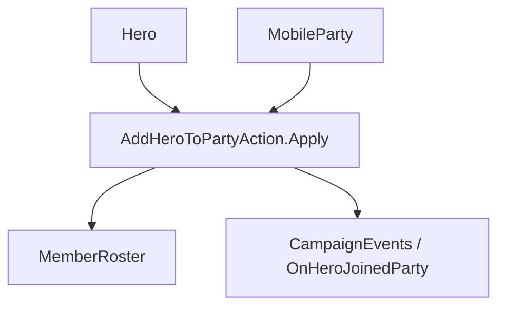

# AddHeroToPartyAction

**Namespace:** `TaleWorlds.CampaignSystem.Actions`  
**Module:** `TaleWorlds.CampaignSystem`  
**Type:** `public static class AddHeroToPartyAction`  
**Source:** `TaleWorlds.CampaignSystem/Actions/AddHeroToPartyAction.cs`

## Overview

`AddHeroToPartyAction` is the single campaign transition for putting a `Hero` in a `MobileParty`. It removes the hero from the old roster, clears settlement residence, removes governor duty, adds the character to the destination roster, and raises `OnHeroJoinedParty`.

## Mental Model

Treat this as a roster and lifecycle transition, not as `party.MemberRoster.AddToCounts` alone. The private `ApplyInternal` cleans the old party, clears `StayingInSettlement`, removes a governor assignment when needed, inserts the character in the new roster, and then publishes the campaign event. The optional notification only applies to a companion joining the main party.

## When to use

- Use it when a campaign flow has already decided that a hero joins a specific mobile party.
- Do not use it to move an ordinary troop, change clan membership, or merely change a hero's location.
- Do not call it repeatedly from an `OnHeroJoinedParty` observer; the observer is downstream of the transition.

## Dependencies



- Upstream: [Hero](../../campaign/Hero) and [MobileParty](../../campaign/MobileParty) are the source and destination state.
- Downstream: the destination roster, governor state, party membership, and [CampaignEvents](../CampaignEvents) listeners observe the change.

## Risks

1. Adding a hero directly to a roster leaves the old party, settlement residence, and governor assignment stale.
2. A null or inactive destination party makes the transition invalid; validate the campaign phase and objects first.
3. Event handlers may immediately change quests or UI; do not assume the method is side-effect free after it returns.

## Key entry point

| Method | Use |
| --- | --- |
| `Apply(Hero hero, MobileParty party, bool showNotification = true)` | Transfer the hero and optionally show the companion notification |

## Real example

```csharp
using TaleWorlds.CampaignSystem;
using TaleWorlds.CampaignSystem.Actions;

public static void RecruitCompanion(Hero hero, MobileParty party)
{
    if (Campaign.Current == null || hero == null || party == null || !hero.IsAlive)
        return;

    AddHeroToPartyAction.Apply(hero, party, showNotification: party == MobileParty.MainParty);
}
```

The caller chooses the destination and notification policy; roster cleanup and the joined-party event remain owned by the Action.

## Navigation

- Parent: [Campaign action index](../actions/)
- Siblings: [GiveGoldAction](../GiveGoldAction) · [TakePrisonerAction](../TakePrisonerAction) · [DestroyPartyAction](../DestroyPartyAction)
- Related: [Hero](../../campaign/Hero) · [MobileParty](../../campaign/MobileParty) · [CampaignEvents](../CampaignEvents)
