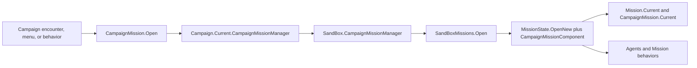

# CampaignMission

**Namespace:** `TaleWorlds.CampaignSystem`  
**Module:** `TaleWorlds.CampaignSystem`  
**Type:** `public static class CampaignMission`  
**Base:** none  
**1.3.15 source:** `R:\Bannerlord\bannerlord-1.3.15\TaleWorlds.CampaignSystem\CampaignMission.cs`  
**1.4.5 comparison:** `R:\Bannerlord\bannerlord-1.4.5\Bannerlord.Source\bin\TaleWorlds.CampaignSystem\TaleWorlds.CampaignSystem\CampaignMission.cs`

## Responsibility in one line

It passes encounter, location, and battle inputs to the current `Campaign` Mission manager to open the appropriate scene Mission, while exposing the campaign adapter state for the active scene through `Current`.

## Mental Model

`CampaignMission` is not a `Mission` constructor and it is not a container for saveable campaign data. It contains two different API directions:

- `CampaignMission.Open...` is the **Campaign -> Mission creation request**. In 1.3.15 every public `Open...` method calls the matching method on `Campaign.Current.CampaignMissionManager` and returns an `IMission`; this static class does not directly create the scene, agents, or behaviors.
- `CampaignMission.Current` is the **Mission -> Campaign adapter state**, typed as `ICampaignMission`. The 1.4.5 `CampaignMissionComponent` implements that interface, sets it from `OnCreated`, and clears it when the Mission ends. It is not an alias for `Mission.Current`.

The three global entries have different boundaries:

| Entry | Layer | Actual meaning | Valid timing |
|---|---|---|---|
| `Campaign.Current` | Campaign | The active campaign instance; it exposes `CampaignMissionManager` | After the campaign exists and before it is destroyed |
| `CampaignMission.Current` | Campaign/Mission adapter | The active scene's `State`, `Location`, `Mode`, conversation, and following contract | After `CampaignMissionComponent` is created and before Mission teardown |
| `Mission.Current` | `TaleWorlds.MountAndBlade` | The native scene runtime, agents, teams, behaviors, and cleanup state | From Mission initialization through teardown; check `CurrentState` |

Use `CampaignMission.Open...` when the campaign wants to open a town, battle, hideout, conversation, or other standard campaign Mission. Use [Mission](../../mission/Mission) for scene agents, teams, scenes, or Mission behaviors. Use `CampaignMission.Current` only for the campaign-facing location, mode, conversation, and following adapter. Confusing these `Current` properties crosses the Campaign/Mission phase boundary.

## Lifecycle, creator, and phase boundary

### 1. Campaign prepares the inputs

`Campaign` publicly holds `CampaignMission.ICampaignMissionManager CampaignMissionManager`. Real callers are encounters, menus, and campaign behaviors:

- `VillageEncounter.CreateAndOpenMissionController` obtains a scene name from a `Location` and calls `CampaignMission.OpenVillageMission` (1.3.15 `VillageEncounter.cs:18-24`).
- `TownEncounter.CreateAndOpenMissionController` selects `OpenTownCenterMission`, `OpenArenaStartMission`, or `OpenIndoorMission` for center, arena, and indoor locations (`TownEncounter.cs:18-43`).
- `PlayerEncounter` prepares wall level, siege weapons, location, and conversation data before calling `OpenSiegeMissionWithDeployment`, `OpenBattleMission`, or `OpenCombatMissionWithDialogue` (`PlayerEncounter.cs:2060-2093`).

Those callers own the campaign meaning: why the encounter exists, which `Location` is involved, and which rosters or `CharacterObject` values enter the scene. `CampaignMission` does not derive those business inputs for them.

### 2. The manager becomes a concrete Mission

Every 1.3.15 `CampaignMission.Open...` wrapper forwards directly and has no null guard around `Campaign.Current`. Calling it before a campaign is active therefore fails while dereferencing `Campaign.Current`.

The 1.4.5 comparison makes the module boundary explicit: `SandBox.CampaignMissionManager` implements the nested `ICampaignMissionManager` interface and forwards each entry to `SandBoxMissions.Open...`. The 1.4.5 `SandBoxMissions.OpenTownCenterMission`, `OpenVillageMission`, conversation, siege, and battle paths use `MissionState.OpenNew`; their `InitializeMissionBehaviorsDelegate` includes `CampaignMissionComponent` in the new Mission's behavior collection.

`CampaignMission` is the standard creation surface, `CampaignMissionManager` is the implementation seam, and `SandBoxMissions` composes the concrete scene and behavior set. A mod should not treat all three as one long-lived service.

### 3. Mission initialization creates the campaign adapter

`Mission.AddMissionBehavior` assigns the behavior's `Mission` and calls `OnCreated`; `InitializeStartingBehaviors` adds the collection returned by the creation factory. In the 1.4.5 comparison, `CampaignMissionComponent.OnCreated` performs `CampaignMission.Current = this` at this point.

Then `Mission.AfterStart` runs behavior `OnBehaviorInitialize`, `EarlyStart`, and `AfterStart`, and finally sets `CurrentState` to `Continuing`. `CampaignMissionComponent` sends `OnMissionStarted` from `OnBehaviorInitialize` and `OnAfterMissionStarted` from `AfterStart`. Code that needs a started scene must use the appropriate Mission or Campaign event phase rather than assuming agents already exist immediately after `Open...` returns.

### 4. Running and ending

While the scene runs, `CampaignMissionComponent.OnMissionTick` forwards Mission ticks to `CampaignEventDispatcher.MissionTick` when `Campaign.Current` exists. It also routes location changes, conversation, following, mode changes, and campaign end coordination through `ICampaignMission`. Real 1.3.15 consumers include:

- `LocationEncounter.OnCharacterLocationChanged` calls `CampaignMission.Current.OnCharacterLocationChanged` when the changed character crosses the active location (`LocationEncounter.cs:85-90`).
- `ConversationManager` calls the adapter during conversation start, sentence processing, playback, continuation, and ending (`ConversationManager.cs:114-176`, `:853-1034`).
- `BarterManager.BeginPlayerBarter` and `Close` call `SetMissionMode` when an adapter exists to switch between barter and conversation modes (`BarterManager.cs:39-50`, `:146-155`).

Ending is not immediate destruction. `Mission.EndMission` advances the Mission into its ending flow; the 1.4.5 `CampaignMissionComponent.OnEndMission` sends `OnMissionEnded` to Campaign receivers and then performs `CampaignMission.Current = null`. The Mission then cleans agents, teams, mission objects, and native resources. Do not keep using the old adapter, Mission, or agents from an ending callback.

## When to use it, and when not to

### Appropriate uses

- When a campaign encounter has selected the scene, location, upgrade level, conversation character, or troop input and wants the standard SandBox Mission behaviors, call the matching `CampaignMission.Open...` method.
- Inside a confirmed campaign Mission, read `CampaignMission.Current.Location`, `Mode`, or `State` after a null check when campaign-specific location or conversation behavior is needed.
- Inside a confirmed Mission, read `Mission.Current` for `Agent`, `Team`, `Scene`, `MissionBehavior`, or runtime state, and require `CurrentState == Mission.State.Continuing` for active-scene work.
- For a custom Mission behavior, register it in the formal `MissionState.OpenNew` behavior factory. Use `Mission.AddMissionBehavior` at runtime only when insertion after start is actually required.

### Inappropriate uses

- Do not assign `CampaignMission.Current = myObject`. The setter is public in 1.3.15, but the original component owns creation and cleanup; overriding it can make location, conversation, and end callbacks target the wrong Mission.
- Do not use `CampaignMission.Current` to obtain agents, teams, or scenes, and do not substitute it for `Mission.Current`; it exposes only the `ICampaignMission` campaign adapter contract.
- Do not call `Open...` during module loading, while `Campaign.Current` is null, while a Mission is ending, or before scene initialization. The returned `IMission` is not proof that the Mission has started or that agents exist.
- Do not treat `CampaignMission` as an `Action` or a `Model`. It does not apply settlement, relation, or gold state changes and it does not calculate model results; use the relevant campaign Action/Model contract and event chain instead.
- Do not cache `Mission`, `Agent`, `Scene`, `CampaignMission.Current`, or an `IMission` in campaign tick or save objects. Cross-scene business state must be represented by reconstructible campaign IDs, strings, or values.

## Public contract and key members

### `Current`

```csharp
public static ICampaignMission Current { get; set; }
```

Reading it answers only whether a campaign Mission adapter currently exists. Its write belongs to the original `CampaignMissionComponent` lifecycle, not to mod initialization. The 1.3.15 source does not validate active Mission state in this getter or setter, so callers must enforce the phase boundary.

### `ICampaignMission` state contract

| Member | Purpose and timing | Side effect or boundary |
|---|---|---|
| `State` | Gets the `GameState` corresponding to the active `MissionState` | Read-only snapshot; it does not open or end a Mission |
| `AgentSupplier` | Supplies the `IMissionTroopSupplier` used by the campaign Mission | Assigned by creation logic; do not use it after scene teardown |
| `Location` | Identifies the active campaign location, such as a town center, tavern, or alley | Read/write; changing it affects location behavior and belongs in the location transition flow |
| `LastVisitedAlley` | Carries the previous alley needed for alley transitions | Read/write; state belongs only to the current scene adapter |
| `Mode` | Gets the current `MissionMode`, such as conversation, barter, or stealth | Read-only; use `SetMissionMode` to delegate a mode change to Mission |
| `SetMissionMode` | Switches an existing Mission into conversation, barter, or another mode | Calls the underlying `Mission.SetMissionMode`; requires a live Mission |
| `OnCharacterLocationChanged` | Synchronizes campaign logic when a character enters or leaves the active location | Requires a valid location and current Mission |
| `OnConversationStart/End/Continue`, `OnProcessSentence`, `OnConversationPlay` | Called by `ConversationManager` at the matching conversation phases | Can change agent actions, camera, or conversation state; do not replay after conversation end |
| `CheckIfAgentCanFollow`, `AddAgentFollowing`, `CheckIfAgentCanUnFollow`, `RemoveAgentFollowing` | Manages following relationships between agents in the current scene | Agents must still belong to this Mission; never save a following Agent reference across scenes |
| `AgentLookingAtAgent` | Tests the view relationship between two Mission agents | Parameters are runtime `IAgent` values and are valid only for the scene lifetime |
| `OnCloseEncounterMenu`, `OnGameStateChanged` | Lets the adapter respond to menu and game-state transitions | Timing belongs to the game state machine; do not fabricate the ending order |
| `EndMission`, `FadeOutCharacter` | Ends a Mission from campaign semantics or fades a character | Enters the ending/resource cleanup chain; these are not ordinary state setters |

### Choosing an `Open...` creation entry

Each entry returns `IMission` and gives creation to `Campaign.Current.CampaignMissionManager`. Its arguments represent scene and campaign state already prepared by the caller; they are not placeholder values.

| Scene purpose | 1.3.15 entries | Important inputs |
|---|---|---|
| Ordinary battle, settlement entry battle, combat dialogue | `OpenBattleMission(string, bool)`, `OpenBattleMissionWhileEnteringSettlement(...)`, `OpenCombatMissionWithDialogue(...)` | Scene, town decal, upgrade level, conversation character, and troop limits |
| Town/castle/village/indoor | `OpenTownCenterMission(...)`, `OpenCastleCourtyardMission(...)`, `OpenVillageMission(...)`, `OpenIndoorMission(...)` | `Location`, scene, upgrade level, character, and spawn tag |
| Arena | `OpenArenaStartMission(...)`, `OpenArenaDuelMission(...)` | `Location`, character, equipment/horse flags, end callback, and health |
| Alley and hideout | `OpenAlleyFightMission(...)`, `OpenHideoutBattleMission(...)`, `OpenHideoutAmbushMission(...)` | Rosters, location, scene, and tutorial/upgrade options |
| Siege | `OpenSiegeMissionWithDeployment(...)`, `OpenSiegeMissionNoDeployment(...)`, `OpenSiegeLordsHallFightMission(...)` | Wall hit points, siege weapons, sides, and priority troops |
| Initializer-record battle | `OpenBattleMission(MissionInitializerRecord)`, `OpenCaravanBattleMission(...)`, `OpenNavalBattleMission(...)`, `OpenNavalSetPieceBattleMission(...)` | `MissionInitializerRecord`, caravan/ship sources, and fleet lists |
| Conversation, retirement, disguise | `OpenConversationMission(...)`, `OpenRetirementMission(...)`, `OpenDisguiseMission(...)` | `ConversationCharacterData`, scene, location, scene levels, and end-menu data |

In 1.3.15, naval methods such as `OpenNavalBattleMission` and `OpenNavalSetPieceBattleMission` are Campaign-layer contract entries; the installed Mission manager still determines their implementation. Check the returned value before using it, and use it only during a valid `Mission.Current` phase.

## Real acquisition examples

### Open a Mission from a location encounter

This keeps the real acquisition path used by 1.3.15 `TownEncounter.CreateAndOpenMissionController`: `LocationEncounter` supplies `nextLocation`, the previous location, the conversation character, and the player spawn tag, while the town level comes from `Settlement.Town`.

```csharp
using TaleWorlds.CampaignSystem.Encounters;
using TaleWorlds.CampaignSystem.Settlements;
using TaleWorlds.CampaignSystem.Settlements.Locations;
using TaleWorlds.Core;
using TaleWorlds.MountAndBlade;

public sealed class MyTownEncounter : LocationEncounter
{
    public MyTownEncounter(Settlement settlement) : base(settlement)
    {
    }

    public override IMission CreateAndOpenMissionController(
        Location nextLocation,
        Location previousLocation = null,
        CharacterObject talkToChar = null,
        string playerSpecialSpawnTag = null)
    {
        int wallLevel = base.Settlement.Town.GetWallLevel();
        string sceneName = nextLocation.GetSceneName(wallLevel);

        if (nextLocation.StringId == "center")
        {
            return CampaignMission.OpenTownCenterMission(
                sceneName,
                nextLocation,
                talkToChar,
                wallLevel,
                playerSpecialSpawnTag);
        }

        return null;
    }
}
```

Here `CampaignMission.OpenTownCenterMission` only issues the creation request. Its `IMission` return does not mean that `CampaignMission.Current` or agents are already usable. The original `TownEncounter` makes this call after `Campaign.Current` exists and after the encounter has prepared its location and character inputs.

### Read Campaign and Mission state in a valid scene

```csharp
using TaleWorlds.CampaignSystem;
using TaleWorlds.CampaignSystem.Settlements.Locations;
using TaleWorlds.Core;
using TaleWorlds.MountAndBlade;

Campaign campaign = Campaign.Current;
ICampaignMission campaignMission = CampaignMission.Current;
Mission mission = Mission.Current;

if (campaign == null || campaign.CampaignMissionManager == null ||
    campaignMission == null || mission == null ||
    mission.CurrentState != Mission.State.Continuing)
{
    return;
}

Location location = campaignMission.Location;
MissionMode mode = campaignMission.Mode;
Agent mainAgent = mission.MainAgent;
if (location == null || mainAgent == null || !mainAgent.IsActive())
{
    return;
}

MissionLogic behavior = mission.GetMissionBehavior<MissionLogic>();
```

This obtains campaign location/mode separately from the Mission agent/behavior. `Mission.Current` and its Agent references can become invalid at the next scene transition, so use these locals only within one Mission callback or another confirmed Mission phase.

## Dependencies

### Actual dependency chain



- Campaign callers supply `Location`, `CharacterObject`, `TroopRoster`, `MissionInitializerRecord`, and encounter results. Do not infer persistent campaign facts from temporary Mission state and write them back.
- [CampaignEvents](../CampaignEvents) and [CampaignEventReceiver](../CampaignEventReceiver) receive bridge events such as `OnMissionStarted`, `OnAfterMissionStarted`, `MissionTick`, and `OnMissionEnded`; [CampaignEventDispatcher](../CampaignEventDispatcher) forwards them in receiver order.
- [Mission](../../mission/Mission) owns `MissionBehavior`, agents, teams, and the scene. [MissionBehavior](../../mission/MissionBehavior) is the callback boundary for custom Mission logic, and the Agent page covers one runtime unit's lifetime.
- [CampaignBehaviorBase](../CampaignBehaviorBase) is the normal owner for saveable campaign state; [Campaign](../../campaign/Campaign) is the Campaign-layer owner above this bridge.

### Agent, Mission, and save risks

1. **Invalid phase:** `CampaignMission.Open...` dereferences `Campaign.Current`; `CampaignMission.Current` can be null outside a campaign Mission; `Mission.Current` can be null or not `Continuing` during menus, loading, and ending. Check the phase and the returned value before use.
2. **Stale references:** Mission teardown removes or clears agents, teams, mission objects, and native scene resources. Read required Agent identity or battle results early in the ending callback, then discard Agent, Scene, Mission, and adapter references.
3. **Behavior timing:** Runtime `AddMissionBehavior` immediately calls `OnCreated`, but it does not replay all earlier initialization phases. A behavior that depends on `OnBehaviorInitialize`, `EarlyStart`, or `AfterStart` belongs in the `MissionState.OpenNew` factory.
4. **Save boundary:** `CampaignMission.Current`, `ICampaignMission`, `Mission`, `Agent`, `Scene`, and Mission behaviors are runtime objects, not Campaign `SyncData` values. Writing them into a Campaign save creates an object graph that cannot be restored safely or leaves references hanging after load.
5. **Reconstructible state:** Persist stable Hero/Settlement/Party identifiers, location strings, values, and phase flags. Reacquire `Campaign.Current` and `Mission.Current` from `OnSessionLaunchedEvent`, a new Mission creation callback, or the appropriate Campaign lifecycle phase.
6. **Module version:** `CampaignMissionManager` is a module implementation of the nested interface, not a Core guarantee that every version has identical behavior. In particular, several Naval manager methods in the inspected 1.4.5 implementation return `null`; method existence alone does not prove a Mission was created.

## Version differences (1.3.15 -> 1.4.5)

- 1.3.15 `OpenBattleMission(string scene, bool usesTownDecalAtlas)` has two parameters; 1.4.5 adds optional `sceneLevels`. Do not copy the newer signature into a 1.3.15 module.
- 1.4.5 adds `OpenNavalRaidMission` to `CampaignMission` / `ICampaignMissionManager` and expands the manager contract with entries such as `OpenMeetingMission`; these are not available as 1.3.15 `CampaignMission.cs` static entries.
- Both versions retain `Current` and the core “static wrapper -> CampaignMissionManager -> concrete Mission creator” structure. The 1.4.5 `CampaignMissionComponent` source makes the `OnCreated`, `OnBehaviorInitialize`, `AfterStart`, `OnMissionTick`, and `OnEndMission` bridge timing explicit; treating 1.3.15 references as short-lived runtime objects remains the compatible rule.
- 1.4.5 `SandBox.CampaignMissionManager` lives in the SandBox module. Do not treat its implementation type or added methods as Core `TaleWorlds.CampaignSystem` API.

## Navigation (bidirectional)

### ↑ Parent

- [Campaign-Ext API index](../)
- [Campaign](../../campaign/Campaign)

### ↔ Sibling

- [CampaignEventDispatcher](../CampaignEventDispatcher): fans Mission and Campaign callbacks out to Campaign receivers
- [CampaignEvents](../CampaignEvents): the event surface mods normally subscribe to
- [CampaignBehaviorBase](../CampaignBehaviorBase): owns Campaign state and registers events
- [CampaignPeriodicEventManager](../CampaignPeriodicEventManager): Campaign tick scheduler, not a Mission creator

### Related

- [Mission](../../mission/Mission) · [Agent](../../mission/Agent) · [MissionBehavior](../../mission/MissionBehavior)
- [MissionLogic](../../mission-ext/MissionLogic) · [IMission](../../core-extra/IMission)
- [CampaignEventReceiver](../CampaignEventReceiver) · [CampaignGameStarter](../CampaignGameStarter)
- [Campaign](../../campaign/Campaign) · [CampaignEvents](../CampaignEvents)
