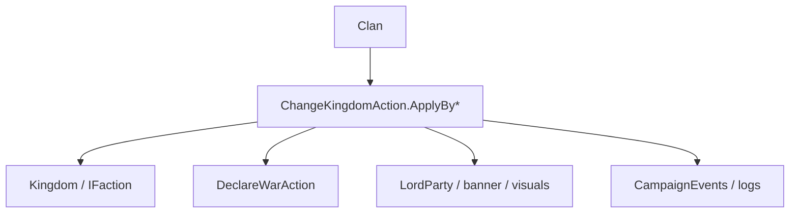

# ChangeKingdomAction

**Namespace:** `TaleWorlds.CampaignSystem.Actions`  
**Module:** `TaleWorlds.CampaignSystem`  
**Type:** `public static class ChangeKingdomAction`  
**Base:** none  
**Source:** `TaleWorlds.CampaignSystem/Actions/ChangeKingdomAction.cs`

## Overview

`ChangeKingdomAction` moves a `Clan` into, out of, or against a `Kingdom`. Public methods encode `ChangeKingdomActionDetail`; private `ApplyInternal` then coordinates diplomacy, fiefs/mercenary state, party visuals, and events.

## Mental Model

This is not `clan.Kingdom = newKingdom`. Select the cause first: ordinary join, defection join, kingdom creation, mercenary join/leave, kingdom destruction, or rebellion. The Action selects the correct diplomacy and cleanup branch. `ApplyByLeaveWithRebellionAgainstKingdom` can chain into [DeclareWarAction](../DeclareWarAction), so callers must not declare the same war again.

## When to use

- Use it at the execution point of a Kingdom decision, rebellion, mercenary contract, or kingdom-destruction flow.
- Use [ChangeRelationAction](../ChangeRelationAction) for a hero relation and [ChangeOwnerOfSettlementAction](../ChangeOwnerOfSettlementAction) for a settlement owner.
- Do not call another transition from an event observer that is already reacting to this Clan.

## Dependencies



- Upstream: [Clan](../../campaign/Clan), [Kingdom](../../campaign/Kingdom), and Kingdom decisions provide cause and target.
- Downstream: war stance, mercenary state, party banners, events, and logs change with the branch.
- Related: [Campaign](../../campaign/Campaign), [DeclareWarAction](../DeclareWarAction), and [MakePeaceAction](../MakePeaceAction).

## Risks

1. New-kingdom and rebellion paths can declare war automatically; a second war call duplicates events and logs.
2. A Clan with a war party in a MapEvent may be delayed or rejected by the source; do not force migration during combat.
3. Leaving a kingdom recomputes fiefs, contracts, and party banners. Clearing fields directly breaks save references.
4. `shouldStayInKingdomUntil` and mercenary awards affect later AI; do not replace an existing contract with a default casually.

## Key entry points

| Method | Cause |
| --- | --- |
| `ApplyByJoinToKingdom(Clan, Kingdom, CampaignTime, bool)` | Ordinary join |
| `ApplyByJoinToKingdomByDefection(Clan, Kingdom, Kingdom, CampaignTime, bool)` | Defection join |
| `ApplyByCreateKingdom(Clan, Kingdom, bool)` | New kingdom |
| `ApplyByLeaveKingdom(Clan, bool)` | Normal leave |
| `ApplyByLeaveWithRebellionAgainstKingdom(Clan, bool)` | Leave and rebel |
| `ApplyByJoinFactionAsMercenary` / `ApplyByLeaveKingdomAsMercenary` | Mercenary contract |
| `ApplyByLeaveByKingdomDestruction` / `ApplyByLeaveKingdomByClanDestruction` | Destructive cleanup |

## Real example

```csharp
using TaleWorlds.CampaignSystem;
using TaleWorlds.CampaignSystem.Actions;

public static class RebellionScript
{
    public static bool StartRebellion(Clan clan)
    {
        if (Campaign.Current == null || clan == null || clan.Kingdom == null)
            return false;
        if (clan.IsEliminated || clan.IsUnderMercenaryService)
            return false;

        ChangeKingdomAction.ApplyByLeaveWithRebellionAgainstKingdom(clan, showNotification: true);
        return clan.Kingdom == null;
    }
}
```

The Action owns the diplomatic consequences; the caller only chooses the entry point during a safe decision or map phase.

## Navigation

- Parent: [Actions index](./)
- Siblings: [DeclareWarAction](../DeclareWarAction) · [MakePeaceAction](../MakePeaceAction) · [ChangeRelationAction](../ChangeRelationAction)
- Related: [Clan](../../campaign/Clan) · [Kingdom](../../campaign/Kingdom) · [Campaign](../../campaign/Campaign)
