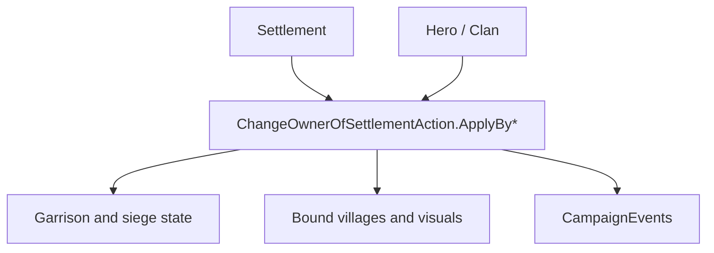

# ChangeOwnerOfSettlementAction

**Namespace:** `TaleWorlds.CampaignSystem.Actions`  
**Module:** `TaleWorlds.CampaignSystem`  
**Type:** `public static class ChangeOwnerOfSettlementAction`  
**Source:** `TaleWorlds.CampaignSystem/Actions/ChangeOwnerOfSettlementAction.cs`

## Overview

`ChangeOwnerOfSettlementAction` transfers a settlement to a new hero while preserving the reason for the transfer. Its detail enum drives garrison handling, claim availability, map-event completion, bound-village visuals, and the `OnSettlementOwnerChanged` event.

## Mental Model

The owner is not just `settlement.OwnerClan`. Choose an `ApplyBy*` entry point so `ApplyInternal` can apply the correct `ChangeOwnerOfSettlementDetail`. Siege transfers record the capturer and may destroy the old garrison; rebellion, clan destruction, leave, barter, gift, and kingdom decisions have different claim and cleanup semantics. The Action also refreshes settlement and village visuals and stops incompatible siege/raid objectives.

## When to use

- Use the overload that matches the campaign cause: siege, rebellion, barter, gift, decision, leave, or destruction.
- Do not write `Town.OwnerClan` or `Settlement.OwnerClan` directly.
- Do not use this action to change a hero's clan; use [ChangeKingdomAction](../ChangeKingdomAction) or the relevant clan action.

## Dependencies



- Upstream: [Settlement](../../campaign/Settlement), [Hero](../../campaign/Hero), and the campaign cause select the new owner and detail.
- Downstream: town/garrison state, village parties, map events, claims, and [CampaignEvents](../CampaignEvents) consume the transfer.

## Risks

1. Passing the wrong overload changes claim availability and can leave a siege or rebellion flow semantically wrong.
2. `ApplyBySiege` expects a capturer hero with a party when an old garrison must be destroyed.
3. Settlement ownership changes update many map objects; do not cache old owner or garrison state across the call.

## Key entry points

| Method | Cause |
| --- | --- |
| `ApplyByDefault(Hero, Settlement)` | Generic transfer |
| `ApplyByKingDecision(Hero, Settlement)` | Kingdom decision |
| `ApplyBySiege(Hero, Hero, Settlement)` | Siege capture with capturer |
| `ApplyByLeaveFaction` / `ApplyByBarter` / `ApplyByRebellion` | Faction, barter, or rebellion flow |
| `ApplyByDestroyClan` / `ApplyByGift` | Destruction or gift flow |

## Real example

```csharp
using TaleWorlds.CampaignSystem;
using TaleWorlds.CampaignSystem.Actions;

public static void GrantSettlement(Hero newOwner, Settlement settlement)
{
    if (Campaign.Current == null || newOwner == null || settlement == null || newOwner.Clan == null)
        return;

    ChangeOwnerOfSettlementAction.ApplyByGift(settlement, newOwner);
}
```

Use the gift overload only when the campaign rule really is a gift; the reason controls downstream behavior.

## Navigation

- Parent: [Campaign action index](./)
- Siblings: [ChangeKingdomAction](../ChangeKingdomAction) · [StartBattleAction](../StartBattleAction) · [ChangeRelationAction](../ChangeRelationAction)
- Related: [Settlement](../../campaign/Settlement) · [Hero](../../campaign/Hero) · [CampaignEvents](../CampaignEvents)
