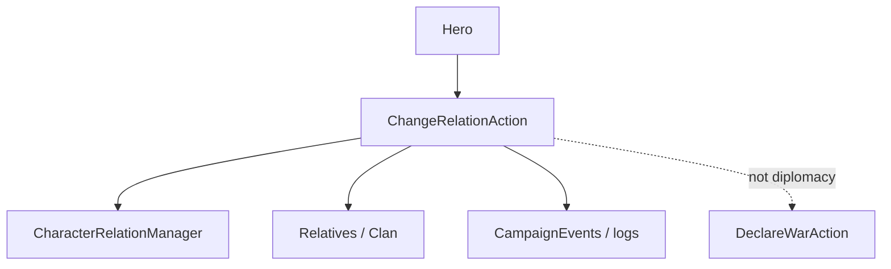

# ChangeRelationAction

**Namespace:** `TaleWorlds.CampaignSystem.Actions`  
**Module:** `TaleWorlds.CampaignSystem`  
**Type:** `public static class ChangeRelationAction`  
**Base:** none  
**Source:** `TaleWorlds.CampaignSystem/Actions/ChangeRelationAction.cs`

## Overview

`ChangeRelationAction` writes a relation delta through Campaign's relation manager and preserves the source detail, notifications, and relative-impact behavior. It is not an integer assignment to a Hero field.

## Mental Model

Choose the endpoint and cause first: `ApplyPlayerRelation` changes the player's relation with one hero, `ApplyRelationChangeBetweenHeroes` changes two NPCs, and `ApplyEmissaryRelation` represents an emissary negotiation. Each public method funnels into private `ApplyInternal`, which records the change and dispatches the expected side effects.

## When to use

- Use it after dialogue, quest, battle aftermath, or diplomacy has decided a relation delta.
- Use [DeclareWarAction](../DeclareWarAction) or [MakePeaceAction](../MakePeaceAction) for faction war/peace, not a large relation delta.
- Do not edit relation caches or add the same delta every tick; duplicate events distort AI and saves.

## Dependencies



- Upstream: [Hero](../../campaign/Hero) and quest/dialogue code provide both endpoints; [Campaign](../../campaign/Campaign) owns the relation manager.
- Downstream: relative relations, faction attitudes, logs, and listeners consume the change.
- Related: [CampaignEvents](../CampaignEvents), [DeclareWarAction](../DeclareWarAction), and [ChangeKingdomAction](../ChangeKingdomAction).

## Risks

1. Combining a relation change and a war action in one callback can emit duplicate relation events; leave faction stance to the diplomacy action.
2. Null, dead, or out-of-campaign heroes can make the relation manager reject the change or retain invalid references.
3. `affectRelatives` propagates to relatives; pass `false` when the task intends a two-hero-only change.
4. Calling during save loading bypasses the relation manager's reconstruction order.

## Key entry points

| Method | Use |
| --- | --- |
| `ApplyPlayerRelation(Hero, int, bool, bool)` | Player-to-hero relation |
| `ApplyRelationChangeBetweenHeroes(Hero, Hero, int, bool)` | Two NPC heroes |
| `ApplyEmissaryRelation(Hero, Hero, int, bool)` | Emissary/negotiation cause |

## Real example

```csharp
using TaleWorlds.CampaignSystem;
using TaleWorlds.CampaignSystem.Actions;

public static class RelationReward
{
    public static void RewardConversation(Hero target)
    {
        if (Campaign.Current == null || Hero.MainHero == null || target == null || !target.IsAlive)
            return;

        ChangeRelationAction.ApplyPlayerRelation(target, 5, affectRelatives: true);
    }
}
```

For an NPC negotiation reward, use `ApplyEmissaryRelation` instead of pretending the player caused it.

## Navigation

- Parent: [Actions index](../actions/)
- Siblings: [DeclareWarAction](../DeclareWarAction) · [MakePeaceAction](../MakePeaceAction) · [KillCharacterAction](../KillCharacterAction)
- Related: [Hero](../../campaign/Hero) · [Campaign](../../campaign/Campaign) · [CampaignEvents](../CampaignEvents) · [ChangeRelationDetail](../ChangeRelationDetail)
