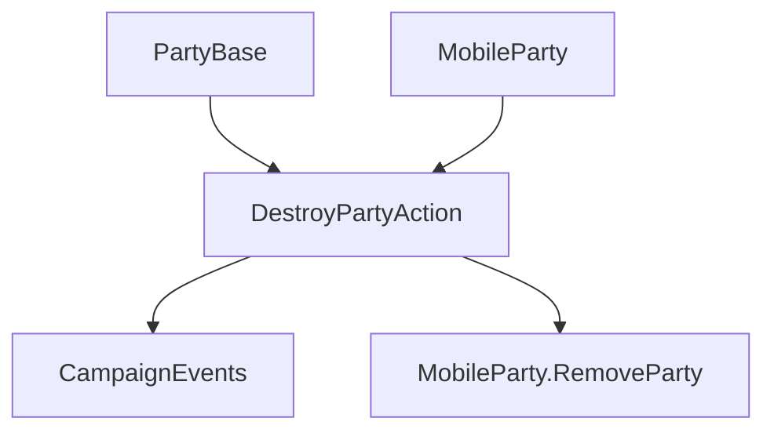

# DestroyPartyAction

**Namespace:** `TaleWorlds.CampaignSystem.Actions`  
**Module:** `TaleWorlds.CampaignSystem`  
**Type:** `public static class DestroyPartyAction`  
**Source:** `TaleWorlds.CampaignSystem/Actions/DestroyPartyAction.cs`

## Overview

`DestroyPartyAction` removes a `MobileParty` from the campaign after notifying systems that the party or its map interactable disappeared. It has a combat/destruction entry point and a disbanding entry point that first leaves a settlement and emits `OnPartyDisbanded`.

## Mental Model

The Action owns the terminal transition: it checks the main-party guard, reports `OnMobilePartyDestroyed` and `OnMapInteractableDestroyed`, then calls `RemoveParty`. `ApplyForDisbanding` is the safe path for an intentional disband because it leaves the current settlement and publishes `OnPartyDisbanded` before removal. It is not a roster-clearing helper.

## When to use

- Use `Apply` when a party is destroyed by a battle or another campaign rule that already has a destroyer.
- Use `ApplyForDisbanding` when the party is intentionally disbanding and may still be inside a settlement.
- Never use either overload for `MobileParty.MainParty`, and do not call `RemoveParty` directly from normal campaign code.

## Dependencies



- Upstream: [MobileParty](../../campaign/MobileParty) and an optional destroyer [PartyBase](../../campaign/PartyBase) describe the transition.
- Downstream: `OnMobilePartyDestroyed`, `OnMapInteractableDestroyed`, and disband events reach [CampaignEvents](../CampaignEvents); insurance may also pay a caravan owner.

## Risks

1. Destroying an inactive party triggers an assertion and indicates an earlier lifecycle bug.
2. Calling `Apply` for a party still in a settlement skips the explicit leave/disband event sequence.
3. Observers may remove quests, map markers, or caravans immediately; keep no references after the action.

## Key entry points

| Method | Use |
| --- | --- |
| `Apply(PartyBase destroyerParty, MobileParty destroyedParty)` | Terminal destruction after an encounter |
| `ApplyForDisbanding(MobileParty disbandedParty, Settlement relatedSettlement)` | Intentional disband with settlement cleanup |

## Real example

```csharp
using TaleWorlds.CampaignSystem;
using TaleWorlds.CampaignSystem.Actions;

public static void RemoveCaravan(MobileParty caravan)
{
    if (Campaign.Current == null || caravan == null || caravan == MobileParty.MainParty || !caravan.IsActive)
        return;

    DestroyPartyAction.Apply(null, caravan);
}
```

For a planned disband, call `ApplyForDisbanding` with the related settlement so the settlement and campaign event boundaries stay aligned.

## Navigation

- Parent: [Campaign action index](../actions/)
- Siblings: [AddHeroToPartyAction](../AddHeroToPartyAction) · [EnterSettlementAction](../EnterSettlementAction) · [KillCharacterAction](../KillCharacterAction)
- Related: [MobileParty](../../campaign/MobileParty) · [PartyBase](../../campaign/PartyBase) · [CampaignEvents](../CampaignEvents)
