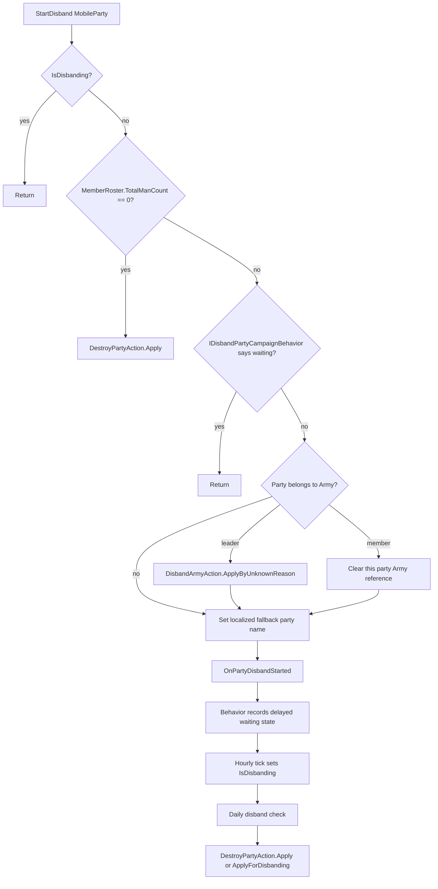

# DisbandPartyAction

**Namespace:** `TaleWorlds.CampaignSystem.Actions`  
**Module:** `TaleWorlds.CampaignSystem`  
**Type:** `public static class DisbandPartyAction`  
**Source:** `TaleWorlds.CampaignSystem/Actions/DisbandPartyAction.cs`

## One-line job

Request the campaign's controlled removal of a `MobileParty`: an ordinary party enters a behavior-owned waiting flow, while an empty party is destroyed immediately.

## Mental model

This is a **transition request**, not a troop-roster utility and not the terminal delete operation. `StartDisband` performs a small amount of synchronous cleanup, then publishes `OnPartyDisbandStarted`. The built-in [`DisbandPartyCampaignBehavior`](../DisbandPartyCampaignBehavior/) receives that event, records the party in its save-synchronized waiting dictionary, and later turns the request into `IsDisbanding` and a daily destruction check.

Use it when a party is still a valid campaign object but should leave the map through the normal disband lifecycle. Do not use it to remove one hero, clear troops, disperse an entire army for an army-specific reason, or destroy a party already made inactive. Use the corresponding roster, [`DisbandArmyAction`](../DisbandArmyAction/), or [`DestroyPartyAction`](../DestroyPartyAction/) path instead.

The important distinction is:

- **Start:** schedules/marks a disband flow and may detach the party from an army; it usually does not remove the `MobileParty` in the same call.
- **Destroy:** is normally performed later by `DisbandPartyCampaignBehavior`; it raises destruction/disbanding events and calls `MobileParty.RemoveParty`.
- **Cancel:** restores only the local disbanding presentation and movement state. It is not a transaction rollback.

## Source-backed control flow

`StartDisband` checks these branches in this order:

1. If `disbandParty.IsDisbanding` is already true, return. This prevents a second start after the behavior has moved the party into its terminal phase.
2. If `disbandParty.MemberRoster.TotalManCount == 0`, call `DestroyPartyAction.Apply(null, disbandParty)` and return. This branch skips the waiting behavior, army handling, custom-name assignment, and `OnPartyDisbandStarted`.
3. Ask `Campaign.Current` for [`IDisbandPartyCampaignBehavior`](../IDisbandPartyCampaignBehavior/). If an implementation exists and `IsPartyWaitingForDisband(disbandParty)` is true, return. The action does not enqueue a duplicate request.
4. If the party belongs to an army, the army leader party calls `DisbandArmyAction.ApplyByUnknownReason`. A non-leader party is detached by assigning `disbandParty.Army = null`; that does not disperse the whole army.
5. Set the party's custom name to the localized `"{CLAN_NAME} Party"` form, using `ActualClan.Name` or `CampaignData.NeutralFactionName`.
6. Dispatch `CampaignEventDispatcher.Instance.OnPartyDisbandStarted(disbandParty)`.

The action itself does **not** set `IsDisbanding = true`. The stock behavior stores the event in `_partiesThatWaitingToDisband`, usually for one campaign day, and its hourly tick later sets `IsDisbanding`. A party at sea can wait with `CampaignTime.Never` until it is no longer at sea or reaches a settlement.



## Public methods and side effects

### `StartDisband(MobileParty disbandParty)`

Call this at the moment your campaign rule has decided that the party should leave normally. It is idempotent only for the states checked above: an already-disbanding party and a party already waiting in the registered behavior are ignored. It does not validate every unsafe caller condition for you, and it does not make a destroyed or inactive party valid again.

Army behavior is deliberately asymmetric. Starting on the leader party disperses the whole army through `DisbandArmyAction`; starting on an attached member removes only that member's army link. Do not assume that `StartDisband` preserves army membership until the event callback.

### `CancelDisband(MobileParty disbandParty)`

The implementation performs four operations:

1. Dispatch `OnPartyDisbandCanceled`.
2. Set `disbandParty.IsDisbanding = false`.
3. Clear the custom name with `TextObject.GetEmpty()`.
4. Put the party into hold mode with `SetMoveModeHold()`.

The event lets [`DisbandPartyCampaignBehavior`](../DisbandPartyCampaignBehavior/) remove a pending waiting entry. It does not restore a party roster, leader, settlement position, army membership, or a prior AI order. It cannot undo an army already dispersed by the leader-party branch, and it cannot resurrect a party already passed to `DestroyPartyAction`.

## Behavior dispatch, events, and terminal removal

The interface [`IDisbandPartyCampaignBehavior`](../IDisbandPartyCampaignBehavior/) exposes only `IsPartyWaitingForDisband`. The built-in implementation is the owner of the delayed state and syncs `_partiesThatWaitingToDisband` through save data. AI behaviors use the same query to avoid making normal decisions for a party that is waiting to disband.

The built-in `OnPartyDisbandStarted` handler has several meaningful branches:

- A non-player-clan party with at least ten roster entries tries to find an active, unassigned clan hero in a settlement and schedules delayed teleportation as party leader. If none is available, it waits one day instead.
- A player caravan is held from new AI decisions and directed toward a suitable settlement.
- A player-clan party with a leader removes that leader and asserts because the stock flow expects a party entering this state to be leaderless.
- Other parties are placed in the waiting dictionary for one day; at-sea parties use the deferred `Never` time until they can leave the sea.

After `IsDisbanding` becomes true, `DailyTickParty` calls the behavior's daily check. If the member roster is empty, it calls `DestroyPartyAction.Apply`. If a party has remained stationary long enough, or is already at the relevant settlement, it calls `DestroyPartyAction.ApplyForDisbanding`, which leaves the settlement and dispatches `OnPartyDisbanded` before removal. Therefore an empty-party fast path can produce `OnMobilePartyDestroyed` without the normal `OnPartyDisbandStarted`/`OnPartyDisbanded` sequence.

`DestroyPartyAction.Apply` also dispatches `OnMapInteractableDestroyed` and removes the party. Observers should treat both `OnMobilePartyDestroyed` and `OnPartyDisbanded` as terminal boundaries and reacquire current campaign objects afterward.

## When to call and when not to

| Situation | Correct choice |
| --- | --- |
| A living party has lost its leader or is intentionally being retired | `DisbandPartyAction.StartDisband(party)` |
| Removing a companion leaves a non-empty companion party | The real `RemoveCompanionAction` caller uses `StartDisband` after the roster update. |
| A party's roster is already empty and it must disappear now | The source fast path uses `DestroyPartyAction.Apply(null, party)`. Do not expect disband-start events. |
| A whole army must end because of cohesion, food, inactivity, objective, or a specific army reason | Use the matching `DisbandArmyAction.ApplyBy*` entry point. |
| A battle or campaign rule has destroyed a party | Use `DestroyPartyAction.Apply(destroyerParty, party)`. |
| An intentional disband must finish at a settlement | Let the behavior call `DestroyPartyAction.ApplyForDisbanding`. |
| A replacement hero has just become the party leader before final removal | The real immediate-teleport path calls `CancelDisband` after `ChangePartyLeader`. |
| A party is in a map event, is inactive, or is the main party | Do not force this action; let the owning campaign action enforce its lifecycle. |

## Real callsite examples

`RemoveCompanionAction` is a direct 1.4.5 caller. After changing the party roster, it destroys a party with `Count == 0`; otherwise it starts the normal disband lifecycle:

```csharp
if (partyBase.MemberRoster.Count == 0)
{
    DestroyPartyAction.Apply(null, partyBase.MobileParty);
}
else
{
    DisbandPartyAction.StartDisband(partyBase.MobileParty);
}
```

The recovery boundary is also a real direct callsite. `TeleportHeroAction.ApplyImmediateTeleportToPartyAsPartyLeader` adds the hero and changes the party leader; if the target is already in its final disbanding phase, it then calls `CancelDisband(targetParty)`. `CancelDisband` clears the hold/name state, but the caller is responsible for the new leader and party roster because those are outside this Action.

For a mod that is responding to a replacement-leader decision, prefer the owning action so the acquisition and ordering stay valid:

```csharp
TeleportHeroAction.ApplyImmediateTeleportToPartyAsPartyLeader(
    replacementHero,
    targetParty);
```

Do not imitate this by setting `IsDisbanding = false` or clearing `Party.SetCustomName` alone; that bypasses the cancellation event and leaves the behavior's waiting state inconsistent.

## Dependencies

| Dependency | Role in this transition |
| --- | --- |
| [`MobileParty`](../../campaign/MobileParty/) | Supplies `MemberRoster`, `Army`, `IsDisbanding`, movement, ownership, and the terminal party identity. |
| [`IDisbandPartyCampaignBehavior`](../IDisbandPartyCampaignBehavior/) | Prevents duplicate starts through `IsPartyWaitingForDisband`. |
| [`DisbandPartyCampaignBehavior`](../DisbandPartyCampaignBehavior/) | Owns delayed waiting, save synchronization, leader replacement, settlement routing, and daily destruction. |
| [`DisbandArmyAction`](../DisbandArmyAction/) | Disperses an army when the target is its leader party. |
| [`DestroyPartyAction`](../DestroyPartyAction/) | Performs immediate empty-party removal or later terminal disband removal. |
| [`CampaignEvents`](../CampaignEvents/) | Receives party-disband-started, canceled, disbanded, and mobile-party-destroyed notifications. |
| [`CampaignBehaviorBase`](../CampaignBehaviorBase/) | Typical lifecycle base for listeners that consume these events. |

## Risk boundaries

- Do not call `StartDisband` twice as a substitute for checking whether your own campaign rule has already run. The built-in guards suppress duplicates but do not fix duplicate mod-side bookkeeping.
- Do not rely on `OnPartyDisbandStarted` for an empty roster. `TotalManCount == 0` returns through `DestroyPartyAction.Apply` before the event.
- Do not treat `CancelDisband` as a rollback. Army dispersion, roster edits, leader removal, hero teleportation, and terminal destruction are outside its recovery boundary.
- Do not retain the party as if it were stable after `DestroyPartyAction` events. Listeners can remove map objects, quests, caravan state, or other references during dispatch.
- Do not manually write `party.Army = null` for a leader party or call `DisbandArmyAction` from a party-level rule unless the whole army is intended to disperse. The source intentionally distinguishes leader and member cases.
- Do not invoke campaign actions from a constructor, module-load phase, or a non-campaign thread. `Campaign.Current`, the behavior registry, event dispatcher, rosters, and map state must already be live.

## Version note

The `DisbandPartyAction` control flow and the `IDisbandPartyCampaignBehavior` contract in the 1.3.15 source match the 1.4.5 source used for this page: both expose only `StartDisband` and `CancelDisband`, use the same empty-roster fast path, query the same behavior interface, distinguish army leader/member handling, assign the same localized fallback name, and dispatch the same start/cancel events. The 1.4.5 behavior source also carries the expanded naval context: an at-sea party can wait with `CampaignTime.Never` until it reaches a valid point for the delayed flow. Treat that behavior-owned timing, rather than a hard-coded one-day assumption, as the compatibility boundary for 1.4.5 campaign code.

## Navigation

- ↑ [Campaign action index](../actions/) · [API index](../../)
- ↔ [DisbandArmyAction](../DisbandArmyAction/) · [DestroyPartyAction](../DestroyPartyAction/) · [IDisbandPartyCampaignBehavior](../IDisbandPartyCampaignBehavior/)
- Related: [DisbandPartyCampaignBehavior](../DisbandPartyCampaignBehavior/) · [CampaignEvents](../CampaignEvents/) · [MobileParty](../../campaign/MobileParty/) · [CampaignBehaviorBase](../CampaignBehaviorBase/)
- Language: [中文页面](../../../../zh/api/campaign-ext/DisbandPartyAction/)
