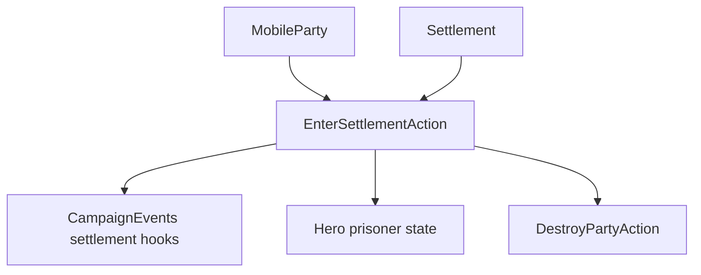

# EnterSettlementAction

**Namespace:** `TaleWorlds.CampaignSystem.Actions`  
**Module:** `TaleWorlds.CampaignSystem`  
**Type:** `public static class EnterSettlementAction`  
**Source:** `TaleWorlds.CampaignSystem/Actions/EnterSettlementAction.cs`

## Overview

`EnterSettlementAction` is the campaign boundary for entering a `Settlement`. Its overloads distinguish a war party, an alley visit, a character who has no party, and a prisoner; the internal path publishes the ordered settlement events and updates party, prisoner, owner-visit, and fleeing-party state.

## Mental Model

Choose the overload from the subject that is entering. `ApplyForParty` updates `CurrentSettlement`, ports and army attachment before the event chain. `ApplyForCharacterOnly` sets `StayingInSettlement`; `ApplyForPrisoner` changes the hero state first; an entering disbanding party is redirected to `DestroyPartyAction.ApplyForDisbanding`. All variants converge on `OnBeforeSettlementEntered`, `OnSettlementEntered`, and `OnAfterSettlementEntered`.

## When to use

- Use it when a map or encounter flow has already established that the subject crosses the settlement boundary.
- Do not use it as a teleport helper or to bypass settlement access rules.
- Do not manually publish the three settlement events after calling an overload.

## Dependencies



- Upstream: [MobileParty](../../campaign/MobileParty), [Hero](../../campaign/Hero), and [Settlement](../../campaign/Settlement) provide the entering subject.
- Downstream: [CampaignEvents](../CampaignEvents), prisoner rosters, owner-visit timestamps, and settlement components consume the transition.

## Risks

1. Calling the wrong overload loses party location, prisoner, or character-only semantics.
2. A disbanding party targeting the settlement is destroyed through the disband path; do not continue using it afterward.
3. Event subscribers can open menus or change campaign state during the call, so avoid re-entering from their callbacks.

## Key entry points

| Method | Use |
| --- | --- |
| `ApplyForParty(MobileParty, Settlement)` | War-party/map entry |
| `ApplyForPartyEntersAlley(MobileParty, Settlement, Alley, bool)` | Alley subject entry |
| `ApplyForCharacterOnly(Hero, Settlement)` | Hero without a party |
| `ApplyForPrisoner(Hero, Settlement)` | Prisoner entering a settlement |

## Real example

```csharp
using TaleWorlds.CampaignSystem;
using TaleWorlds.CampaignSystem.Actions;

public static void RecordArrival(MobileParty party, Settlement settlement)
{
    if (Campaign.Current == null || party == null || settlement == null || !party.IsActive)
        return;

    EnterSettlementAction.ApplyForParty(party, settlement);
}
```

The action updates the map and emits the event sequence; callers should not duplicate those writes.

## Navigation

- Parent: [Campaign action index](./)
- Siblings: [StartBattleAction](../StartBattleAction) · [DestroyPartyAction](../DestroyPartyAction) · [TakePrisonerAction](../TakePrisonerAction)
- Related: [Settlement](../../campaign/Settlement) · [MobileParty](../../campaign/MobileParty) · [CampaignEvents](../CampaignEvents)
