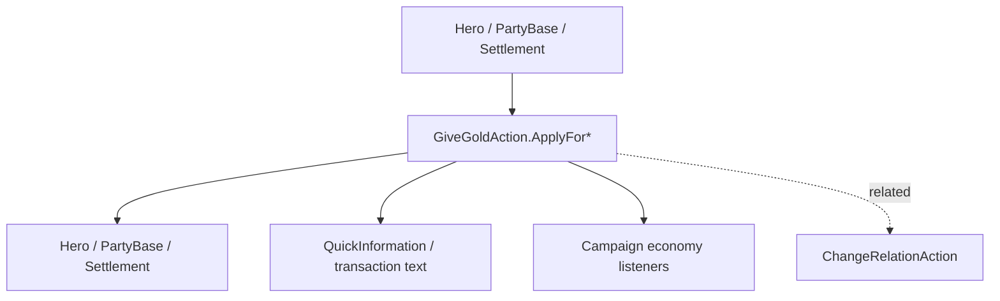

# GiveGoldAction

**Namespace:** `TaleWorlds.CampaignSystem.Actions`  
**Module:** `TaleWorlds.CampaignSystem`  
**Type:** `public static class GiveGoldAction`  
**Base:** none  
**Source:** `TaleWorlds.CampaignSystem/Actions/GiveGoldAction.cs`

## Overview

`GiveGoldAction` handles every supported Hero/PartyBase/Settlement transfer. Its private path updates the correct balance endpoints and controls QuickInformation/transaction text; callers should never assign a gold field directly.

## Mental Model

Choose the two account types first, then use the matching `ApplyFor...` method: character-to-character, character-to-settlement, settlement-to-party, or one of the other explicit directions. `amount` is a transfer, not a balance setter. The notification flag only affects UI feedback and does not remove the economic side effect.

## When to use

- Use it for rewards, taxes, trade settlement, settlement funding, and party upkeep transfers.
- Do not use it to simulate relation or influence; those belong to their own systems.
- Never edit Hero/Party/Settlement gold fields or award money every frame.

## Dependencies



- Upstream: [Hero](../../campaign/Hero), [PartyBase](../../campaign/PartyBase), and [Settlement](../../campaign/Settlement) provide real accounts.
- Downstream: trade UI, economy behaviors, logs, and saved balances.
- Related: [Campaign](../../campaign/Campaign), [ChangeRelationAction](../ChangeRelationAction), and [ItemRoster](../ItemRoster).

## Risks

1. Paying from a Party or Settlement with insufficient funds makes rewards and upkeep inconsistent; validate the payer first.
2. Calling during save loading bypasses the economy objects' construction order.
3. `disableNotification` only hides the quick prompt; it is not a no-side-effect switch.
4. Two calls in one tick create two real transfers; the action does not deduplicate them.

## Key entry points

`ApplyBetweenCharacters(Hero, Hero, int, bool)`, `ApplyForCharacterToSettlement`, `ApplyForSettlementToCharacter`, `ApplyForSettlementToParty`, `ApplyForPartyToSettlement`, `ApplyForPartyToCharacter`, `ApplyForCharacterToParty`, and `ApplyForPartyToParty` cover the eight account directions.

## Real example

```csharp
using TaleWorlds.CampaignSystem;
using TaleWorlds.CampaignSystem.Actions;

public static class QuestReward
{
    public static bool PayHero(Hero receiver, int amount)
    {
        if (Campaign.Current == null || Hero.MainHero == null || receiver == null || amount <= 0)
            return false;
        if (Hero.MainHero.Gold < amount)
            return false;

        GiveGoldAction.ApplyBetweenCharacters(Hero.MainHero, receiver, amount);
        return receiver.Gold >= amount;
    }
}
```

For settlement tax or party funding, choose the explicit direction instead of swapping two transfers to simulate a balance assignment.

## Navigation

- Parent: [Actions index](../actions/)
- Siblings: [ChangeRelationAction](../ChangeRelationAction) · [AddHeroToPartyAction](../AddHeroToPartyAction) · [MakePeaceAction](../MakePeaceAction)
- Related: [Hero](../../campaign/Hero) · [PartyBase](../../campaign/PartyBase) · [Settlement](../../campaign/Settlement) · [Campaign](../../campaign/Campaign)
