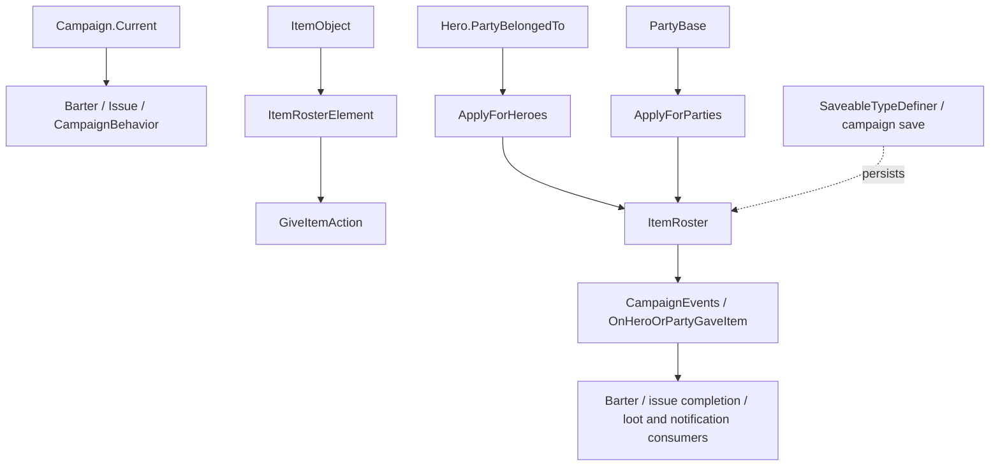

# GiveItemAction

**Namespace:** `TaleWorlds.CampaignSystem.Actions`  
**Module:** `TaleWorlds.CampaignSystem`  
**Type:** `public static class GiveItemAction`  
**Base:** none (static class)  
**Source:** `TaleWorlds.CampaignSystem/TaleWorlds.CampaignSystem.Actions/GiveItemAction.cs`

## One-line job

Commits an item handoff as a campaign state change: it mutates the participants' `ItemRoster` objects and then notifies systems that depend on `OnHeroOrPartyGaveItem`.

## Mental model

This is a stateless Campaign-layer Action that executes immediately. The caller prepares an [`ItemRosterElement`](../../core-extra/ItemRosterElement) describing the transfer and chooses the public entry point based on whether both ends are heroes or both ends are parties. `ItemRosterElement.Amount` is the quantity to process, not the final total. The Action does not create items, find participants, or validate ownership and available counts for the caller.

The hero entry point still works through `Hero.PartyBelongedTo.Party.ItemRoster`, so “give an item to a hero” does not mean that the hero has a separate item roster. The party entry point edits the [`PartyBase`](../../campaign/PartyBase) objects supplied to it. The successful path writes the rosters and dispatches its event synchronously; this is not a request queued for the next campaign tick.

## When to use / when not to

- Use it for a confirmed item handoff in barter, issue rewards, village exchanges, and loot or surrender flows.
- Use `ApplyForHeroes` only when both heroes have valid `PartyBelongedTo` values. Use `ApplyForParties` when both ends are explicit parties. Do not mix a hero and a party in one entry point.
- Do not replace the official Action with two direct roster arithmetic operations. Validate the giver's available count first, then let listeners observe the same handoff event.
- Do not use it to change an [`ItemObject`](../../core/ItemObject)'s definition, price, or template. That belongs to item registration/configuration, not roster transfer.
- Do not call it blindly while save loading, a Party Screen is mutating the same roster, or an event callback is re-entering the transaction. There is no idempotency key; a repeated call is another decrement/increment.

## Public entries, timing, and effects

| Entry point | Participants and side effects | Correct timing |
|---|---|---|
| `ApplyForHeroes(Hero giver, Hero receiver, in ItemRosterElement itemRosterElement)` | Requires both heroes to belong to parties and obtains rosters through them. The 1.3.0, 1.3.15, and authoritative 1.4.5 sources all subtract `Amount` from the giver party and then call `AddToCounts(..., -Amount)` on the receiver hero's party as well. Therefore it must not be assumed to be a safe receiver increment without testing the target game version. On success it dispatches `OnHeroOrPartyGaveItem`. | Hero-to-hero barter or another equivalent flow after validating both party memberships, the item, and the quantity; test the resulting rosters against the shipped target version before release. |
| `ApplyForParties(PartyBase giverParty, PartyBase receiverParty, in ItemRosterElement itemRosterElement)` | Subtracts `Amount` from the giver [`ItemRoster`](../ItemRoster), adds `Amount` to the receiver roster, and dispatches `CampaignEventDispatcher.Instance.OnHeroOrPartyGaveItem`. The source does not validate nulls, ownership, or the giver's available count. | A quest, exchange, or campaign behavior has both parties and has confirmed that the giver has enough of the item. |

Both entries encode the reason in the event's giver/receiver tuples: the party entry passes null heroes, while the hero entry passes null parties. Listeners must handle the actual non-null object instead of assuming every event contains both a hero and a party.

## Dependencies and event flow



- **Upstream state:** after [`Campaign`](../../campaign/Campaign) has started, callers obtain participants through the real [`Hero`](../../campaign/Hero), [`MobileParty`](../../campaign/MobileParty), or [`Settlement`](../../campaign/Settlement) Party paths. The item is described by [`ItemObject`](../../core/ItemObject) and [`ItemRosterElement`](../../core-extra/ItemRosterElement).
- **State changed:** [`PartyBase`](../../campaign/PartyBase) owns the modified [`ItemRoster`](../ItemRoster). The hero entry only resolves that party through `PartyBelongedTo`.
- **Downstream event:** `CampaignEventDispatcher.Instance.OnHeroOrPartyGaveItem` synchronously reaches `CampaignEvents` listeners; barter, issue/quest behaviors, and notification logic may continue their settlement from it.
- **Save relationship:** rosters are campaign state and are eventually persisted by the save system. The Action has no `SyncData` and is not replayed after loading. If a mod must save why an item was given, store its own data through [`SaveableTypeDefiner`](../../save-system/SaveableTypeDefiner) instead of saving an old `ItemRosterElement` for a later Apply.

## Risk boundaries

1. **The receiver decrement is a hard risk.** The authoritative 1.4.5 `GiveItemAction.cs` explicitly executes `giver.PartyBelongedTo.Party.ItemRoster.AddToCounts(..., -itemRosterElement.Amount)` and then executes the same negative update on `receiver.PartyBelongedTo.Party.ItemRoster` in the hero branch. The 1.3.15 and 1.3.0 decompiled sources match it. If this reflects the shipped behavior rather than a decompilation error, the call reduces the receiver roster; test both rosters with a controlled item count on the target version instead of inferring transfer semantics from the method name.
2. The party branch performs the positive receiver add, but the implementation does not check nulls, same-party usage, positive `Amount`, or sufficient giver inventory. Negative or overlarge quantities can reverse the intended direction, create negative inventory, or corrupt later economy logic.
3. If either hero is null or lacks `PartyBelongedTo`, `ApplyForHeroes` does not enter a safe party branch; it still dereferences the heroes. Confirm both heroes and their parties exist and are in a live campaign state before calling.
4. The event is dispatched synchronously after the roster writes. A listener must not call GiveItemAction again for the same manifest or assume the participants still have their pre-call rosters; otherwise it can duplicate the transfer or recurse through the event chain.
5. This Action does not save a transaction reason, price, quest progress, or skill XP. Using it as a substitute for official barter or issue settlement may change rosters while omitting the related gold, relation, and quest consequences.

## Real acquisition path

The following preserves the key order from `VillageNeedsToolsIssueBehavior.GiveTradeOrExchangeRewardToMainParty`: the Issue gets the village from `questGiver.CurrentSettlement`, places the exchange item in that settlement's roster, and then hands it from the settlement party to the main party. That `AddToCounts` is the game's preparation step before the Action; it is not validation performed by the Action.

```csharp
using TaleWorlds.CampaignSystem;
using TaleWorlds.CampaignSystem.Actions;
using TaleWorlds.CampaignSystem.Party;
using TaleWorlds.Core;

public static void GiveTradeOrExchangeRewardToMainParty(
    Hero questGiver, int gold, ItemObject exchangeItem, int exchangeItemCount)
{
    if (exchangeItem != null)
    {
        questGiver.CurrentSettlement.ItemRoster.AddToCounts(exchangeItem, exchangeItemCount);
        ItemRosterElement element = new ItemRosterElement(exchangeItem, exchangeItemCount);
        GiveItemAction.ApplyForParties(questGiver.CurrentSettlement.Party, PartyBase.MainParty, in element);
    }
    else
    {
        GiveGoldAction.ApplyBetweenCharacters(null, Hero.MainHero, gold);
    }
}
```

This matches the real `VillageNeedsToolsIssueBehavior` shape: `Settlement.Party` is the giver and `PartyBase.MainParty` is the receiver. The caller must ensure that `CurrentSettlement`, the item, and the count come from a valid Issue-settlement state; the Action itself has no null, quantity, or inventory validation.

The other specified real call sites form four reusable paths: `ItemBarterable.Apply` constructs an `ItemRosterElement` and calls `ApplyForHeroes` when `_otherParty` is absent and the trade target is another Hero; `VillageNeedsCraftingMaterialsIssueBehavior.Success` gives quest materials from `PartyBase.MainParty` to `Settlement.CurrentSettlement.Party`; and `VillagerCampaignBehavior` plus `CaravansCampaignBehavior` give each item element from `MobileParty.ConversationParty.Party` to `Hero.MainHero.PartyBelongedTo.Party` while resolving the leave-after-loot or surrender conversation. These are settlement actions after a Campaign interaction context exists, not per-frame update APIs.

## Version notes

This page lives in the v1.3.15 tree, but its semantic authority is the v1.4.5 `TaleWorlds.CampaignSystem.Actions.GiveItemAction.cs` source. The 1.3.0 and 1.3.15 sources retain the same two public entries and the same internal hero/party branches, including the negative receiver `AddToCounts`; v1.3.15 must not be described as a corrected version. This page records the observable decompiled contract, and a mod should still run a minimal inventory test against the exact target binary before release.

## Navigation

- **Parent:** [Campaign extension API](../)
- **Siblings:** [GiveGoldAction](../GiveGoldAction) · [ItemBarterable](../ItemBarterable) · [ChangeRelationAction](../ChangeRelationAction)
- **Children:** none; both public entries are covered above
- **Related:** [Hero](../../campaign/Hero) · [MobileParty](../../campaign/MobileParty) · [PartyBase](../../campaign/PartyBase) · [Settlement](../../campaign/Settlement) · [ItemRoster](../ItemRoster) · [CampaignEvents](../CampaignEvents) · [SaveableTypeDefiner](../../save-system/SaveableTypeDefiner)
