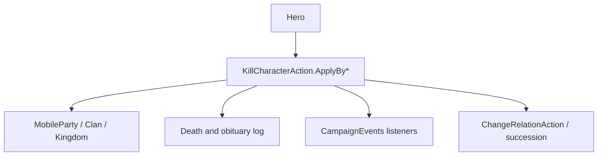

# KillCharacterAction

**Namespace:** `TaleWorlds.CampaignSystem.Actions`  
**Module:** `TaleWorlds.CampaignSystem`  
**Type:** `public static class KillCharacterAction`  
**Base:** none  
**Source:** `TaleWorlds.CampaignSystem/Actions/KillCharacterAction.cs`

## Responsibility

This action moves a `Hero` to a terminal state for an explicit cause (old age, battle, murder, execution, childbirth, or system removal) and coordinates party, clan, succession, log, and `CampaignEvents` side effects.

## Mental Model

Death is not `hero.IsAlive = false`. Each `ApplyBy*` maps the cause to `KillCharacterActionDetail` and enters private `ApplyInternal`, which handles death marks, optional party disbanding, heirs, relations, and events. `ApplyByRemove` is cleanup without a death narrative; it must not be used to fake a battle death.

## When to use

- Use `ApplyByOldAge` from aging, `ApplyByBattle` from battle resolution, and `ApplyByExecution` or `ApplyByExecutionAfterMapEvent` from the matching prisoner flow.
- Use `ApplyByRemove` only for a temporary or invalid hero that should leave the world without a death story.
- Never hand-edit hero death or party fields, and never kill the same hero again from a death-event listener.

## Dependencies



- Upstream: [Hero](../../campaign/Hero) and [Campaign](../../campaign/Campaign) provide the live world context.
- Downstream: Party and Clan may recompute leaders/heirs; logs and event listeners consume the explicit cause.
- Related: [DestroyPartyAction](../DestroyPartyAction), [ChangeRelationAction](../ChangeRelationAction), and [CampaignEvents](../CampaignEvents).

## Risks

1. Killing during an unfinished Mission or MapEvent can leave sides, prisoner rosters, and death logs half-resolved; call after the official resolution callback.
2. Calling two `ApplyBy*` variants for one hero can repeat succession and events; check liveness/death marks first.
3. Direct party removal bypasses captivity, clan leadership, and save-reference updates.
4. `Hero.MainHero` is the player character. Do not kill it unconditionally from a mod tick outside a supported story path.
5. `ApplyByExecutionAfterMapEvent` is for the post-MapEvent execution path; ordinary execution uses `ApplyByExecution`.

## Key entry points

| Method | Cause |
| --- | --- |
| `ApplyByOldAge(Hero, bool)` | Aging reaches the configured lifespan |
| `ApplyByWounds(Hero, bool)` / `ApplyByBattle(Hero, Hero, bool)` | Wounds or battle |
| `ApplyByMurder(Hero, Hero, bool)` | Murder; killer may be null |
| `ApplyByExecution(Hero, Hero, bool, bool)` | Prisoner execution |
| `ApplyByExecutionAfterMapEvent(Hero, Hero, bool, bool)` | Execution after a MapEvent |
| `ApplyInLabor(Hero, bool)` | Mother lost during labor |
| `ApplyByRemove(Hero, bool, bool)` | Non-narrative system removal |
| `ApplyByDeathMark(Hero, bool)` / `ApplyByDeathMarkForced` | Existing death mark |

## Real example

```csharp
using TaleWorlds.CampaignSystem;
using TaleWorlds.CampaignSystem.Actions;

public static class ModExecution
{
    public static bool ExecuteCapturedHero(Hero victim, Hero executer)
    {
        if (Campaign.Current == null || victim == null || executer == null)
            return false;
        if (!victim.IsAlive || victim == Hero.MainHero)
            return false;

        KillCharacterAction.ApplyByExecution(victim, executer, showNotification: true);
        return !victim.IsAlive;
    }
}
```

This mirrors the native party-screen execution entry. For a battle cause, use `ApplyByBattle` instead of patching relations or party fields afterwards.

## Navigation

- Parent: [Actions index](../actions/)
- Siblings: [TakePrisonerAction](../TakePrisonerAction) · [DestroyPartyAction](../DestroyPartyAction) · [MarriageAction](../MarriageAction)
- Related: [Hero](../../campaign/Hero) · [Campaign](../../campaign/Campaign) · [CampaignEvents](../CampaignEvents) · [ChangeRelationAction](../ChangeRelationAction)
