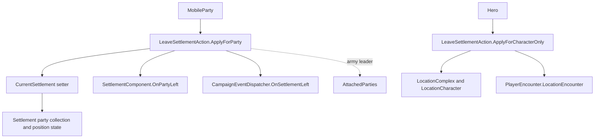

# LeaveSettlementAction

**Namespace:** `TaleWorlds.CampaignSystem.Actions`  
**Module:** `TaleWorlds.CampaignSystem`  
**Type:** `public static class LeaveSettlementAction`  
**Base:** none  
**Source:** `TaleWorlds.CampaignSystem/Actions/LeaveSettlementAction.cs`

## Responsibility

This action closes a settlement affiliation that was already established: it removes a `MobileParty` from the settlement boundary, or removes a character-only `Hero` from the settlement's stay/location state. It is a state transition with synchronous callbacks, not a movement, teleport, or party-destruction API.

## Mental model

The two public entries operate on different owners:

- `ApplyForParty` changes the party's campaign settlement membership. `MobileParty.CurrentSettlement = null` updates the settlement party list, position-related state, visuals, and attached parties; the action then resets a naval anchor when needed, calls the settlement component, and dispatches `OnSettlementLeft`.
- `ApplyForCharacterOnly` is for a Hero whose settlement presence is not represented by a mobile-party departure. It clears `StayingInSettlement`, then removes the Hero's `LocationCharacter` and any `PlayerEncounter.LocationEncounter` accompanying-character record when both records exist.

Use these entries only after the campaign flow has decided that the subject is leaving. Do not write `CurrentSettlement` or `StayingInSettlement` directly to imitate the action, and do not use this action to move a party to another settlement. Use [EnterSettlementAction](../EnterSettlementAction) for the destination transition, [TeleportHeroAction](../TeleportHeroAction) for an intentional Hero affiliation change, and [DestroyPartyAction](../DestroyPartyAction) when the party itself must be removed.

Both methods require a real current settlement. The source captures `mobileParty.CurrentSettlement` or `hero.CurrentSettlement` and later dereferences that settlement; passing a party or Hero with no current settlement can fail before cleanup completes.

## Dependencies and ordering



`ApplyForParty` runs its army-leader branch before clearing the leader. For each attached party at the same captured settlement, it recursively performs the party cleanup. If that attached party is `MobileParty.MainParty` and `PlayerEncounter.Current` exists, the special path calls `PlayerEncounter.Finish()` instead of recursively calling `ApplyForParty`. `Finish()` may leave the player out of the settlement as part of encounter finalization, but it does not mean that every attached party receives an `OnSettlementLeft` callback from this method.

After the recursion, the leader's `CurrentSettlement` setter removes the leader from the old settlement and propagates `null` to its attached parties. Only then does this action reset `Anchor` when `IsCurrentlyAtSea`, invoke `currentSettlement.SettlementComponent.OnPartyLeft(mobileParty)`, and synchronously dispatch `CampaignEvents` listeners through `CampaignEventDispatcher.OnSettlementLeft`. Event handlers therefore observe the party after its `CurrentSettlement` has been cleared, while the callback still receives the captured settlement.

The character-only path is separate: `hero.CurrentSettlement` is derived from party, prisoner, or `StayingInSettlement` state. The method clears `StayingInSettlement` first. It then asks `LocationComplex` for the Hero's location; only if a matching `LocationCharacter` is present does it remove that character and call `PlayerEncounter.LocationEncounter.RemoveAccompanyingCharacter(hero)`. It does not publish `OnSettlementLeft`.

## Public entries

These are the complete public methods in the 1.4.5 source file.

### `ApplyForParty`

```csharp
public static void ApplyForParty(MobileParty mobileParty)
```

Use for a party leaving its current settlement. Besides the party's `CurrentSettlement` transition, it can affect same-settlement attached army parties, player encounter state, naval anchor position, settlement component callbacks, campaign listeners, and the serialized party state. It does not destroy the `MobileParty`.

In the v1.3.15 source, the method also calls `SetMoveModeHold()` for `MobileParty.MainParty` when the main party is not attached to an army, before clearing its settlement. The supplied 1.4.5 authority source does not contain that call; do not assume the newer source reproduces this 1.3.15 movement-mode side effect.

### `ApplyForCharacterOnly`

```csharp
public static void ApplyForCharacterOnly(Hero hero)
```

Use for a character-only departure, such as a Hero leaving a settlement stay or a location encounter. It clears the stay marker and conditionally removes location records. It does not remove a Hero from a party roster, change the Hero's `CharacterStates`, publish `OnSettlementLeft`, or teleport the Hero.

## Call timing and real acquisition path

The campaign source uses `Campaign.OnPlayerCharacterChanged` as a real dispatch path. It obtains the current Hero from `Hero.MainHero`, checks `CurrentSettlement` and prisoner state, then chooses the party entry from `Hero.MainHero.PartyBelongedTo` or the character-only entry when no party exists:

```csharp
public void OnPlayerCharacterChanged(out bool isMainPartyChanged)
{
    isMainPartyChanged = false;
    MainParty = Hero.MainHero.PartyBelongedTo;

    if (Hero.MainHero.CurrentSettlement != null && !Hero.MainHero.IsPrisoner)
    {
        if (MainParty == null)
            LeaveSettlementAction.ApplyForCharacterOnly(Hero.MainHero);
        else
            LeaveSettlementAction.ApplyForParty(MainParty);
    }
}
```

This is an acquisition path, not a recommendation to invoke the action every time a player character changes. A mod should enter this boundary from its own campaign transition and keep the same preconditions. Another real caller, `DestroyPartyAction.ApplyForDisbanding`, invokes `ApplyForParty` before publishing disbanding and removing the party.

## Risks and lifecycle boundaries

1. **`CurrentSettlement` is a hard precondition.** Neither public method is a no-op for an already-departed subject. `ApplyForParty` later uses `currentSettlement.SettlementComponent`; `ApplyForCharacterOnly` accesses `currentSettlement.LocationComplex`. Guard the current settlement before calling, and do not call from a callback after another action has already cleared it.
2. **Army and main-party semantics are asymmetric.** Only an army leader walks its `AttachedParties`. Same-settlement non-main attached parties are recursively notified; an attached `MobileParty.MainParty` takes the `PlayerEncounter.Finish()` branch when an encounter exists. Do not infer one `OnSettlementLeft` callback per party from a leader call.
3. **Settlement callbacks are synchronous and re-entrant.** `OnPartyLeft` and `OnSettlementLeft` run in the same call after the party settlement reference is cleared. A listener can change campaign state, open a menu, or call another action. Re-read `CurrentSettlement` and avoid recursively leaving the same party from the callback.
4. **Sea state is not disembark state.** When `IsCurrentlyAtSea` is true, the action calls `mobileParty.Anchor.ResetPosition()`. It does not set `IsCurrentlyAtSea` to false or replace a naval transition with a land move. Treat anchor data as campaign state and let the normal naval action handle disembarkation.
5. **Location cleanup is conditional.** Character-only departure always clears `StayingInSettlement`, but it removes the location character and accompanying record only when the Hero is found in a location. A mod must not assume that a missing location entry means all encounter teardown has happened; coordinate with `PlayerEncounter` when ending an encounter.
6. **Object lifecycle and saves.** The action does not create or destroy `MobileParty`, `Hero`, `Settlement`, or location objects. It mutates campaign references and serialized fields such as `MobileParty._currentSettlement`, `LastVisitedSettlement`, `Anchor`, and Hero stay/affiliation state. Do not retain a stale party, settlement, or location character across `DestroyPartyAction`, save/load, or an event callback; fetch the object again by its current campaign state and keep persistent mod markers in a `CampaignBehaviorBase` save contract, not in a static pending-reference list.
7. **Order matters around TeleportHeroAction.** Immediate Hero-to-settlement teleport calls this character-only action before removing the Hero from its old party roster and entering the target settlement. Delayed teleport can clear the old settlement before a later guard returns. `ApplyForCharacterOnly` is therefore cleanup inside a larger transition, not a complete teleport operation; use [TeleportHeroAction](../TeleportHeroAction) when that larger transition is intended.

## Version note

This v1.3.15 page keeps the v1.3.15 route and exact public entries, while the requested `bannerlord-1.4.5/Bannerlord.Source` `LeaveSettlementAction.cs` is the semantic authority for the main behavior described above. The v1.3.15 source has the same two public signatures and additionally holds `MobileParty.MainParty` when it leaves outside an army. It also passes `true` explicitly to `PlayerEncounter.Finish`; the 1.4.5 source relies on the same method's default argument. Re-check these version-sensitive side effects when targeting a different game build.

## Navigation

- Parent: [campaign-ext index](../)
- Siblings: [EnterSettlementAction](../EnterSettlementAction) · [TeleportHeroAction](../TeleportHeroAction) · [DestroyPartyAction](../DestroyPartyAction)
- Related: [MobileParty](../../campaign/MobileParty) · [Hero](../../campaign/Hero) · [Settlement](../../campaign/Settlement) · [CampaignEvents](../CampaignEvents) · [CampaignBehaviorBase](../CampaignBehaviorBase) · [IDataStore](../IDataStore)
