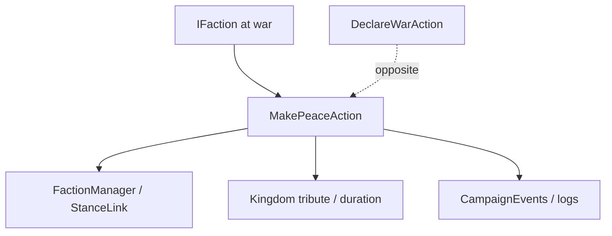

# MakePeaceAction

**Namespace:** `TaleWorlds.CampaignSystem.Actions`  
**Module:** `TaleWorlds.CampaignSystem`  
**Type:** `public static class MakePeaceAction`  
**Base:** none  
**Source:** `TaleWorlds.CampaignSystem/Actions/MakePeaceAction.cs`

## Overview

`MakePeaceAction` moves two `IFaction` instances out of war. The Kingdom-decision overload also accepts daily tribute and duration; the internal path updates diplomacy, logs, events, and related AI state.

## Mental Model

Peace is not an assignment to `IsAtWarWith`. Use `Apply` for a generic end and `ApplyByKingdomDecision` when a council/decision negotiated tribute. This is the symmetric face of [DeclareWarAction](../DeclareWarAction), keeping event and save state consistent.

## When to use

- Use it when a Kingdom decision, barter, or story flow formally ends a war.
- Do not use it to end one MapEvent; the map/Mission lifecycle owns combat cleanup.
- Never clear `StanceLink` or write tribute fields directly. Confirm both factions are in the active Campaign and actually at war.

## Dependencies



- Upstream: [Kingdom](../../campaign/Kingdom), decisions, or barter provide factions and tribute terms.
- Downstream: diplomacy AI, tribute state, logs, and event listeners.
- Related: [DeclareWarAction](../DeclareWarAction), [ChangeKingdomAction](../ChangeKingdomAction), and [Campaign](../../campaign/Campaign).

## Risks

1. Calling it for factions that are not at war has no gameplay value and can still cause redundant listener work.
2. Tribute values are daily campaign amounts; negative or arbitrary long durations corrupt economy expectations and saves.
3. Calling while a decision is still resolving or a save is loading can be overwritten by the active diplomacy pipeline.
4. Peace does not end an active Mission; the battle layer must complete its own teardown.

## Key entry points

- `Apply(IFaction faction1, IFaction faction2)` for generic peace.
- `ApplyByKingdomDecision(IFaction faction1, IFaction faction2, int dailyTributeFrom1To2, int dailyTributeDuration)` for decision peace with tribute.

## Real example

```csharp
using TaleWorlds.CampaignSystem;
using TaleWorlds.CampaignSystem.Actions;

public static class PeaceScript
{
    public static bool EndWar(Kingdom ally, Kingdom opponent)
    {
        if (Campaign.Current == null || ally == null || opponent == null)
            return false;
        if (!ally.IsAtWarWith(opponent))
            return false;

        MakePeaceAction.Apply(ally, opponent);
        return !ally.IsAtWarWith(opponent);
    }
}
```

When the result came from a council agreement, call `ApplyByKingdomDecision` with the already calculated daily tribute and duration.

## Navigation

- Parent: [Actions index](../actions/)
- Siblings: [DeclareWarAction](../DeclareWarAction) · [ChangeKingdomAction](../ChangeKingdomAction) · [ChangeRelationAction](../ChangeRelationAction)
- Related: [Kingdom](../../campaign/Kingdom) · [Campaign](../../campaign/Campaign) · [CampaignEvents](../CampaignEvents) · [MakePeaceDetail](../MakePeaceDetail)
