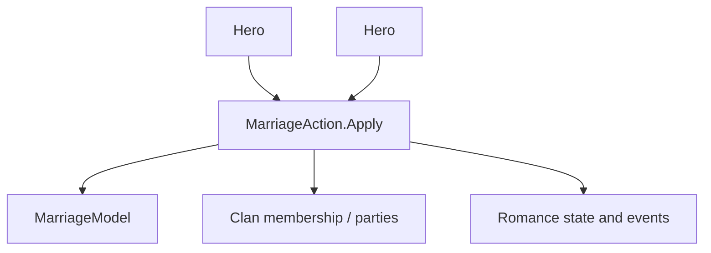

# MarriageAction

**Namespace:** `TaleWorlds.CampaignSystem.Actions`  
**Module:** `TaleWorlds.CampaignSystem`  
**Type:** `public static class MarriageAction`  
**Source:** `TaleWorlds.CampaignSystem/Actions/MarriageAction.cs`

## Overview

`MarriageAction` applies the complete campaign marriage transition after the active `MarriageModel` accepts the couple. It links both spouse references, applies the model's relation increase, moves heroes between clans when required, ends courtships, changes romance state, and publishes the pre-marriage event.

## Mental Model

Marriage is a model-gated state transition, not two assignments to `Hero.Spouse`. `ApplyInternal` first checks suitability, then lets the model choose the relation increase and destination clan. A clan change can remove a governor, detach a hero from an army or lord party, finish hostile actions, and update home settlements before the romance and event steps complete.

## When to use

- Use it at the campaign decision or barter boundary after selecting two heroes.
- Do not call it to bypass `MarriageModel.IsCoupleSuitableForMarriage` or to edit spouse fields directly.
- Do not trigger another marriage from `OnBeforeHeroesMarried`; the Action is already in the middle of the transition.

## Dependencies



- Upstream: [Hero](../../campaign/Hero) objects and the campaign `MarriageModel` decide eligibility and destination clan.
- Downstream: [Clan](../../campaign/Clan), party membership, [ChangeRelationAction](../ChangeRelationAction), romance, and [CampaignEvents](../CampaignEvents) receive the effects.

## Risks

1. An unsuitable pair is rejected; callers must not assume spouse fields changed.
2. Cross-kingdom clan changes can detach an army, make a hero fugitive, or finish hostile actions.
3. Event callbacks run after several writes; do not repeat relation, romance, or spouse updates in observers.

## Key entry point

| Method | Use |
| --- | --- |
| `Apply(Hero firstHero, Hero secondHero, bool showNotification = true)` | Apply the model-approved marriage |

## Real example

```csharp
using TaleWorlds.CampaignSystem;
using TaleWorlds.CampaignSystem.Actions;

public static void Marry(Hero first, Hero second)
{
    if (Campaign.Current == null || first == null || second == null || first == second)
        return;

    MarriageAction.Apply(first, second, showNotification: true);
}
```

The model remains the authority for suitability and clan placement; the caller only chooses the two heroes and notification policy.

## Navigation

- Parent: [Campaign action index](../actions/)
- Siblings: [ChangeRelationAction](../ChangeRelationAction) · [ChangeKingdomAction](../ChangeKingdomAction) · [KillCharacterAction](../KillCharacterAction)
- Related: [Hero](../../campaign/Hero) · [Clan](../../campaign/Clan) · [CampaignEvents](../CampaignEvents)
