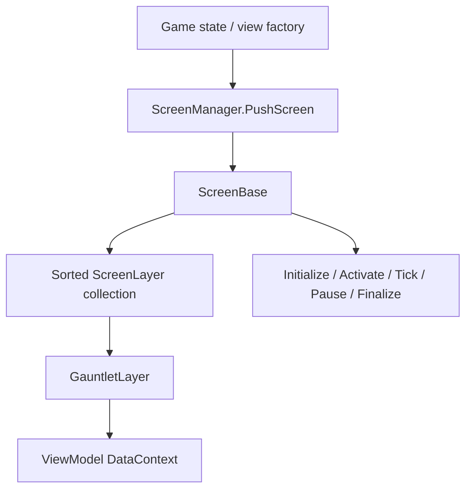

# ScreenBase

**Namespace:** `TaleWorlds.ScreenSystem`  
**Module:** `TaleWorlds.ScreenSystem`  
**Type:** `public abstract class ScreenBase`  
**Base:** `System.Object`  
**Source:** `TaleWorlds.ScreenSystem/ScreenBase.cs`

## Responsibility

It is the lifecycle container for a complete interface state: it owns a sorted set of `ScreenLayer` instances and forwards activation, input-related frame work, and finalization to them.

## Mental model

Treat `ScreenBase` as **screen state plus a layer host**, not as a widget. A game state or view factory creates it and [ScreenManager](../../gui/ScreenManager) pushes it onto the stack. Gauntlet UI is normally a [GauntletLayer](../../engine/GauntletLayer) inside that screen, with a [ViewModel](../../core-extra/ViewModel) as its DataContext.

### Lifetime

```text
HandleInitialize -> OnInitialize
HandleActivate  -> activate layers -> OnActivate
FrameTick(dt)   -> OnFrameTick(dt) (only while IsActive)
PostFrameTick   -> OnPostFrameTick(dt)
HandlePause     -> deactivate layers -> OnPause
HandleDeactivate-> deactivate layers -> OnDeactivate
HandleFinalize  -> OnFinalize -> finalize remaining layers in reverse order
```

The `Handle*` wrappers are engine-internal. A mod normally overrides the protected hooks. `OnInitialize` runs once per instance, and `OnFrameTick` only runs while `IsActive`.

## When to use it

- **Use a subclass** for an exclusive fullscreen state such as a standalone tool or editor, letting the game-state system/`ScreenManager` own transitions.
- **Do not create a new screen** merely to overlay a panel, HUD, or popup on an existing map, mission, or menu. Get `ScreenManager.TopScreen`, create a `GauntletLayer`, and mount it with `AddLayer`.
- **Do not put domain rules in screen hooks.** Let Campaign/Actions own state changes; the screen observes and presents the result.
- Perform screen-stack and layer operations on the game/UI main thread, never directly from a background callback.

## Dependencies



- Stack owner: [ScreenManager](../../gui/ScreenManager); the current instance is exposed as `TopScreen`.
- Layer downstream: [GauntletLayer](../../engine/GauntletLayer); it is a layer, not an independent screen.
- Data downstream: [ViewModel](../../core-extra/ViewModel) and movie XML.
- State upstream: the game-state manager and view factory. In 1.4.5, `GameStateScreenManager` chooses push/clean/pop paths for `IGameStateListener` screens.

## Key members and timing

- `OnInitialize()`: create long-lived layers, VMs, and screen resources. The screen is not active yet, so do not assume it receives input.
- `OnActivate()` / `OnDeactivate()`: enter or leave the top of the stack; use them for subscriptions, focus, and temporary layers.
- `OnPause()` / `OnResume()`: run when another screen covers this one and when it becomes usable again. Pause is not destruction.
- `OnFrameTick(float dt)` / `OnPostFrameTick(float dt)`: per-frame work for this screen only.
- `OnFinalize()`: release the VM, subscriptions, and movies owned by the screen. Finish derived cleanup, then call `base.OnFinalize()`.
- `Layers`: read-only `MBReadOnlyList<ScreenLayer>`; use `AddLayer`/`RemoveLayer`, not direct collection edits.
- `AddLayer(ScreenLayer layer)`: rejects `null`, finalized, or duplicate layers. If the screen is active, it activates the new layer immediately and raises `OnAddLayer`.
- `RemoveLayer(ScreenLayer layer)`: deactivates an active layer, immediately calls its `HandleFinalize`, removes it, and raises `OnRemoveLayer`.

## Risks and crash boundaries

1. `RemoveLayer` is finalization, not hiding. Do not reuse the removed layer or its VM/movie identifier.
2. `HandleFinalize` calls the screen's `OnFinalize` and then finalizes layers still in the collection. Explicitly release movies and clear references in your own `OnFinalize` so ownership is deterministic.
3. Forgetting to unsubscribe in `OnDeactivate` lets an inactive screen receive callbacks and can double-subscribe when it is reopened.
4. `OnFrameTick` stops when the screen is inactive. Do not put campaign progression or save logic there; it pauses when another screen covers it.
5. `ScreenManager.TopScreen` can be `null` during startup or shutdown. Guard it before calling `TopScreen.AddLayer`.
6. Treating a Gauntlet overlay as a full screen can steal input and focus. Configure input restrictions and focus for modal versus non-modal UI.

## Real example: Custom Battle screen

The 1.4.5 `Modules.CustomBattle/.../CustomBattleScreen.cs` shows the complete path: `OnInitialize` creates `CustomBattleVM` and `GauntletLayer`, loads `CustomBattleScreen`, and calls `AddLayer`; `OnActivate` reloads the movie and focus; `OnDeactivate` unloads it; `OnFinalize` releases the movie, removes the layer, and clears fields.

```csharp
protected override void OnInitialize()
{
    base.OnInitialize();
    _dataSource = new CustomBattleVM(_customBattleState);
    _gauntletLayer = new GauntletLayer("CustomBattle", 1, true);
    _gauntletMovie = _gauntletLayer.LoadMovie("CustomBattleScreen", _dataSource);
    AddLayer(_gauntletLayer);
}

protected override void OnFinalize()
{
    _dataSource.OnFinalize();
    _gauntletLayer.ReleaseMovie(_gauntletMovie);
    RemoveLayer(_gauntletLayer);
    _dataSource = null;
    _gauntletLayer = null;
    base.OnFinalize();
}
```

The 1.4.5 `ViewSubModule` also opens the options screen through `ScreenManager.PushScreen(ViewCreator.CreateOptionsScreen(...))`. Let the state/view factory decide when a screen is created; do not cache and reuse an instance after it has been finalized.

## Version note

The core `ScreenBase` lifecycle is the same in 1.3.15 and 1.4.5; 1.4.5 adds main-thread assertions to screen transitions. This page remains at the existing `campaign-ext/ScreenBase` URL because that is the current authoritative bucket; do not move it to `gui`.

## Navigation

- Parent: [campaign-ext index](./)
- Siblings: [CampaignBehaviorBase](../CampaignBehaviorBase/) · [CampaignGameStarter](../CampaignGameStarter/)
- Upstream: [ScreenManager](../../gui/ScreenManager)
- Downstream: [GauntletLayer](../../engine/GauntletLayer) · [ViewModel](../../core-extra/ViewModel)
- Related: [crash and save boundaries](../../../architecture/crash-boundaries) · [developer task roadmap](../../../architecture/developer-roadmap)
