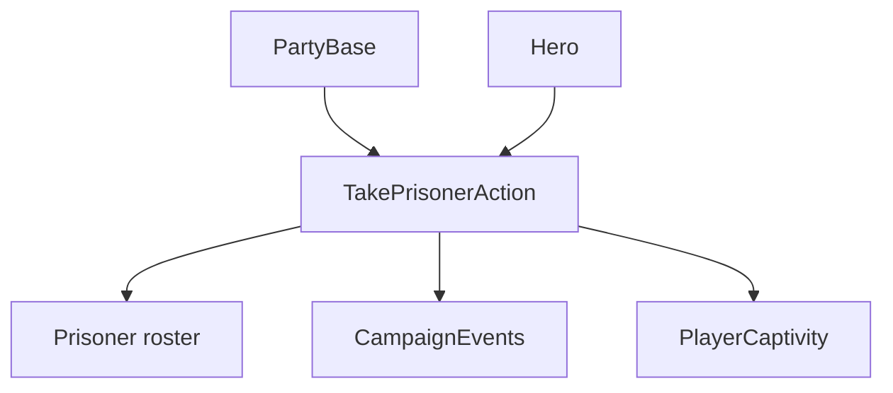

# TakePrisonerAction

**Namespace:** `TaleWorlds.CampaignSystem.Actions`  
**Module:** `TaleWorlds.CampaignSystem`  
**Type:** `public static class TakePrisonerAction`  
**Source:** `TaleWorlds.CampaignSystem/Actions/TakePrisonerAction.cs`

## Overview

`TakePrisonerAction` is the authoritative hero-capture transition. It removes a captured hero from the former party, records `CaptivityStartTime`, changes the hero to `Prisoner`, adds the character to the capturer's prisoner roster, and raises the prisoner event. The party-screen overload applies the same transition to every hero in a flattened roster.

## Mental Model

Capture has two coupled sides: the old party must lose its leader or roster entry, and the capturer must gain a prisoner. When the prisoner is the main hero, the Action also starts player captivity and handles sea-party cleanup. `Apply` is the normal single-hero path; `ApplyByTakenFromPartyScreen` is a batch boundary that emits the roster event after processing all heroes.

## When to use

- Use `Apply` after a campaign encounter has selected a capturer and a hero.
- Use the party-screen overload only with its `FlattenedTroopRoster` result.
- Do not set `Hero.CharacterStates.Prisoner` or edit prisoner rosters directly.

## Dependencies



- Upstream: [PartyBase](../../campaign/PartyBase) and [Hero](../../campaign/Hero) identify the capturer and prisoner.
- Downstream: [CampaignEvents](../CampaignEvents), captivity UI, and map rosters observe the state transition.

## Risks

1. Directly changing the hero state leaves the former party leader and prisoner roster inconsistent.
2. Capturing the main hero starts player captivity and may destroy ships; code after the call must tolerate that state.
3. Do not reuse a `FlattenedTroopRoster` after the batch call; the underlying hero states have changed.

## Key entry points

| Method | Use |
| --- | --- |
| `Apply(PartyBase capturerParty, Hero prisonerCharacter)` | Capture one hero |
| `ApplyByTakenFromPartyScreen(FlattenedTroopRoster roster)` | Capture heroes selected by the party screen |

## Real example

```csharp
using TaleWorlds.CampaignSystem;
using TaleWorlds.CampaignSystem.Actions;

public static void Capture(PartyBase capturer, Hero target)
{
    if (Campaign.Current == null || capturer == null || target == null || !target.IsAlive)
        return;

    TakePrisonerAction.Apply(capturer, target);
}
```

The Action owns party removal, captivity timestamps, roster insertion, and event publication.

## Navigation

- Parent: [Campaign action index](./)
- Siblings: [KillCharacterAction](../KillCharacterAction) · [EnterSettlementAction](../EnterSettlementAction) · [AddHeroToPartyAction](../AddHeroToPartyAction)
- Related: [Hero](../../campaign/Hero) · [PartyBase](../../campaign/PartyBase) · [CampaignEvents](../CampaignEvents)
