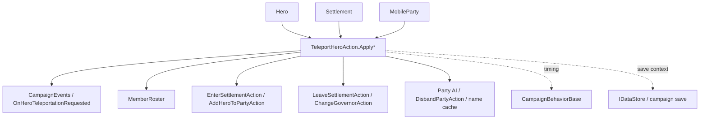

# TeleportHeroAction

**Namespace:** `TaleWorlds.CampaignSystem.Actions`  
**Module:** `TaleWorlds.CampaignSystem`  
**Type:** `public static class TeleportHeroAction`  
**Base:** none  
**Source:** `TaleWorlds.CampaignSystem/Actions/TeleportHeroAction.cs`

## Responsibility

`TeleportHeroAction` is the campaign-level entry point for moving a `Hero` from its current settlement or party state to a target settlement or `MobileParty`. It is not a coordinate setter: the action raises `OnHeroTeleportationRequested`, changes the Hero state, updates membership rosters, and repairs party name, AI, and disbanding state when the Hero becomes a party leader.

## Mental Model

Treat it as a Hero affiliation transition request, not as a teleporting position API. Every public method enters the private `ApplyInternal`, which raises the request event first and then selects one of seven `TeleportationDetail` paths. An `Immediate` path completes placement in the call; a `Delayed` path normally detaches old affiliations, removes the Hero from an old roster, and sets the Hero to `Traveling`, leaving the campaign map flow to complete arrival later.

The event is raised before branch-local null and combat checks. Listeners therefore see that a request was made even when the request later fails because the target is null, the party is inactive, or a map event is in progress. Do not treat this event as a success callback or assume the Hero is already at the destination.

## The Seven Paths

| Entry point | Actual source behavior | Typical timing |
|---|---|---|
| `ApplyImmediateTeleportToSettlement(hero, settlement)` | Activates an inactive Hero; leaves the current settlement; verifies the old `MobileParty`, removes the Hero from its `MemberRoster`, and immediately enters the target settlement. | Story spawning or a state that must be settled by the end of this call. |
| `ApplyImmediateTeleportToParty(hero, party)` | Restores an `Active` state if the Hero is traveling, then delegates membership transfer to `AddHeroToPartyAction.Apply`. | An immediate recall after the destination party is known to be usable. |
| `ApplyImmediateTeleportToPartyAsPartyLeader(hero, party)` | Joins the party, calls `ChangePartyLeader`, clears cached and custom names, marks visuals dirty, cancels disbanding, and re-enables AI decisions. | Rebuilding a party or replacing its leader. |
| `ApplyDelayedTeleportToSettlement(hero, settlement)` | If already in the target settlement, routes into the immediate path; otherwise detaches governance, settlement, and old-party state and sets the Hero to `Traveling`. | Clan-management dispatch where the map flow should finish the move. |
| `ApplyDelayedTeleportToParty(hero, party)` | Detaches old affiliations and sets the Hero to `Traveling`; later campaign processing handles arrival into the target party. | Recalling a clan member or changing party affiliation. |
| `ApplyDelayedTeleportToSettlementAsGovernor(hero, settlement)` | Performs the delayed settlement transition and first calls `ChangeGovernorAction.RemoveGovernorOf` for an existing governorship. | Moving a Hero away from a previous governing duty. |
| `ApplyDelayedTeleportToPartyAsPartyLeader(hero, party)` | Detaches old state, assigns a clan-derived temporary party name, then sets the Hero to `Traveling` before the leader transition completes. | Appointing a new party leader while waiting for stable map state. |

## Immediate and Delayed Side Effects

Immediate settlement travel calls `LeaveSettlementAction.ApplyForCharacterOnly` and `EnterSettlementAction.ApplyForCharacterOnly`; immediate party travel calls `AddHeroToPartyAction.Apply`. Immediate party-leader travel also clears the `PartyComponent` cached name, clears the custom party name, marks visuals dirty, cancels `DisbandPartyAction`, and changes `Ai.DoNotMakeNewDecisions` back to `false`.

The delayed order is easier to misread: it removes an existing governor first; leaves a different current settlement; checks the old party's active and engagement state; for the party-leader path, writes a clan-based custom name; and only then changes the Hero to `Hero.CharacterStates.Traveling`. There is no saved “arrival time” field here. Delayed means that campaign movement/arrival systems finish the transition; it does not enqueue a persistent teleport job.

`ApplyDelayedTeleportToSettlement` enters the immediate path when the Hero is already in the target settlement. That can raise `OnHeroTeleportationRequested` twice in one call: once for the delayed request and once for the recursive immediate request. Event listeners should deduplicate from current state rather than treating every notification as a separate move.

## When to Use and Avoid

- Use it for story spawning, clan-management recall or dispatch, party-leader replacement, and mod behavior that intentionally changes a Hero's campaign affiliation.
- Pass a real `MobileParty` for a party destination and a real `Settlement` for a settlement destination. Do not pass null while expecting the action to resolve the target later.
- Avoid it for combat-position changes, bypassing captivity/death/quest state, or repeated per-tick movement. Validate the Hero, target, old party, and campaign phase before requesting the transition.
- Do not directly edit `Hero.CharacterStates`, `PartyBelongedTo`, `GovernorOf`, `MemberRoster`, or party names to imitate a teleport. The action and its related actions coordinate those coupled fields.

## Dependencies



- Upstream state: [Hero](../../campaign/Hero), [Settlement](../../campaign/Settlement), and [MobileParty](../../campaign/MobileParty) provide current affiliation, destination, `IsActive`, engagement, and MapEvent state.
- Event downstream: [CampaignEvents](../CampaignEvents) exposes `OnHeroTeleportationRequested` at the start of an attempt; [CampaignBehaviorBase](../CampaignBehaviorBase) descendants should handle it as a request event.
- Related actions: [EnterSettlementAction](../EnterSettlementAction), [LeaveSettlementAction](../LeaveSettlementAction), [AddHeroToPartyAction](../AddHeroToPartyAction), [ChangeGovernorAction](../ChangeGovernorAction), and [DisbandPartyAction](../DisbandPartyAction) handle arrival, departure, party membership, governance, and disbanding state.
- Save boundary: Hero state, party rosters, governance, and Traveling state are part of campaign state. A behavior's extra marker should use the [IDataStore](../IDataStore) / [CampaignBehaviorBase](../CampaignBehaviorBase) save contract rather than putting a transient teleport job in a static field.

## Risks and Failure Boundaries

1. Immediate settlement travel lets the Hero leave the current settlement before checking whether the old party is active or safe. If that party is inactive, engaging, or in a `MapEvent`, the method returns and can leave a partially detached state.
2. Delayed travel removes governance and may leave the old settlement before checking the old party. A call during engagement or against an inactive party can therefore perform partial cleanup and return. Pre-check `hero.PartyBelongedTo?.IsActive`, `IsCurrentlyEngagingParty`, `MapEvent`, and settlement state.
3. Removing the Hero from `MemberRoster` changes party membership counts. Do not keep using an old roster index or cached `PartyBelongedTo` in the same tick, and do not retain a destroyed party reference across events.
4. Becoming leader rebuilds party naming and visual caches, cancels disbanding, and re-enables AI decisions. Writing an old name or `DoNotMakeNewDecisions` value after the action can undo the repair needed for the party to run.
5. `OnHeroTeleportationRequested` is not a success event and can be raised for a null target. Listeners must re-read the Hero's state and must not assume `CurrentSettlement`, `PartyBelongedTo`, or the destination is non-null.
6. Do not request transitions before Campaign construction, while save objects are being restored, during Mission/MapEvent teardown, or from a save callback. If a mod needs a persistent “send later” rule, save stable IDs/state and resume it from an appropriate campaign tick instead of saving object references or a static pending list.

## Key Entries and Real Call Paths

All seven public entries only pass their target and enum value to the same `ApplyInternal`; the state machine contains the actual side effects. The game source uses these paths as follows:

- `ClanMembersVM.OnConfirmRecall` calls `ApplyDelayedTeleportToParty(CurrentSelectedMember.GetHero(), MobileParty.MainParty)` to recall a member.
- `ClanFiefsVM` calls `ApplyDelayedTeleportToSettlement(heroToBeMoved, CurrentSelectedFief.Settlement)` for each selected Hero when the dispatch is confirmed.
- When changing a leader, `ClanPartiesVM` first sends the old leader to `MobileParty.MainParty`, then calls `ApplyDelayedTeleportToPartyAsPartyLeader(newLeader, CurrentSelectedParty.Party.MobileParty)` for the original party.
- `TutorialPhaseCampaignBehavior` uses `SettlementHelper.FindNearestSettlementToSettlement(...)` and immediate settlement travel when no suitable party exists during the tutorial.
- `MainStorylineCampaignBehavior` calculates a relative birth settlement for an unspawned or disabled Hero and calls `ApplyImmediateTeleportToSettlement`.

```csharp
using TaleWorlds.CampaignSystem;
using TaleWorlds.CampaignSystem.Actions;

public static void RecallSelectedHero(Hero hero)
{
    MobileParty mainParty = MobileParty.MainParty;
    if (Campaign.Current == null || hero == null || mainParty == null || !mainParty.IsActive)
        return;

    // Mirrors ClanMembersVM.OnConfirmRecall: request delayed return and let campaign flow finish arrival.
    TeleportHeroAction.ApplyDelayedTeleportToParty(hero, mainParty);
}
```

For settlement dispatch, obtain a real `Settlement` from the owning UI or behavior and use the delayed entry; for story spawning that must be visible immediately, use the immediate entry. The action does not validate the scenario's quest, captivity, or destination policy for you.

## Version Note

This page uses `bannerlord-1.4.5/Bannerlord.Source` `TeleportHeroAction.cs` and its actual call sites as the semantic authority. The v1.3.15 page keeps the same cross-version API location, but a target game version may add naval or campaign-state conditions. Before shipping a mod, re-check the `TeleportationDetail` branches, event arguments, and `MobileParty` engagement guards for the exact target version instead of inferring behavior from method names.

## Navigation

- Parent: [campaign-ext index](../)
- Siblings: [AddHeroToPartyAction](../AddHeroToPartyAction) · [EnterSettlementAction](../EnterSettlementAction) · [LeaveSettlementAction](../LeaveSettlementAction) · [DisbandPartyAction](../DisbandPartyAction)
- Related: [Hero](../../campaign/Hero) · [MobileParty](../../campaign/MobileParty) · [Settlement](../../campaign/Settlement) · [CampaignEvents](../CampaignEvents) · [CampaignBehaviorBase](../CampaignBehaviorBase)
