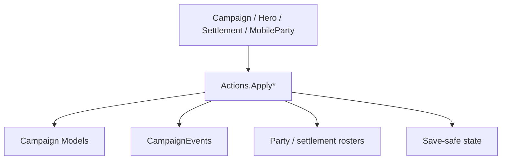

# Actions Family Handbook

**One-sentence role:** `*Action` types are the transaction boundary for campaign state: they validate a cause, mutate the owning model, and publish events consumed by downstream systems. They are not field setters or value-only models.

## Mental Model

Classify the change first: diplomacy, hero, party, settlement, economy, or battle. Then choose the public `Apply` or `ApplyBy*` entry point. An Action may split validation and mutation through a private `ApplyInternal` and a detail enum, but a mod should call only the public boundary. That boundary owns events, caches, map visuals, and save-safe invariants; direct writes to `Hero`, `Settlement`, or `MobileParty` skip them. Read the [Actions quick reference](../actions-index), then [DeclareWarAction](../DeclareWarAction), [GiveGoldAction](../GiveGoldAction), and the campaign-to-encounter boundary in [StartBattleAction](../StartBattleAction).

## When to use

- Use an Action when campaign state must change and the SDK exposes a matching command.
- Choose the timing boundary first: campaign tick, decision resolution, encounter transition, or UI confirmation.
- Do not repeat a campaign Action from a per-frame Mission callback, write fields directly, publish duplicate events, or call a private helper.

## Dependencies



- Upstream: [Campaign](../../campaign/Campaign), [Hero](../../campaign/Hero), [Settlement](../../campaign/Settlement), and [MobileParty](../../campaign/MobileParty) provide state and cause.
- Downstream: [CampaignEvents](../CampaignEvents), behaviors, models, roster caches, and save serialization consume the transition.
- Neighboring families: [Models](../models), [Behaviors](../behaviors), [MapEvents](../mapevents), and [Settlements](../settlements).

## Action types and typical timing

| Type | Purpose | Timing |
| --- | --- | --- |
| `AddCompanionAction` | Add a decided companion to the player or target party | After recruitment resolves |
| `AddHeroToPartyAction` | Remove old roster state and add a hero to a mobile party | Hero joins a party |
| `AdoptHeroAction` | Establish adoption and synchronize family state | Family decision resolves |
| `ApplyHeirSelectionAction` | Apply the selected heir and advance succession | Leader-death resolution |
| `BeHostileAction` | Move a faction or party into hostile contact state | Failed negotiation or hostile act |
| `BreakInOutBesiegedSettlementAction` | Resolve breaking into or out of a besieged settlement | Siege encounter boundary |
| `BribeGuardsAction` | Resolve the guard bribe and alter entry outcome | Before settlement entry |
| `ChangeClanInfluenceAction` | Change clan influence through the campaign rule | Decision or reward resolution |
| `ChangeClanLeaderAction` | Replace the clan leader and maintain member relations | Leadership transition |
| `ChangeCrimeRatingAction` | Record a hero's crime change toward a faction | Crime or pardon resolution |
| `ChangeGovernorAction` | Set or remove a settlement governor | Appointment confirmation |
| `ChangeKingdomActionDetail` | Identify join, leave, rebellion, or mercenary causes | Selected inside kingdom change |
| `ChangeOwnerOfSettlementAction` | Transfer ownership with reason-specific map cleanup | Siege, gift, or decision |
| `ChangeOwnerOfSettlementDetail` | Distinguish siege, rebellion, barter, and other causes | Selected inside ownership change |
| `ChangeOwnerOfWorkshopAction` | Transfer workshop ownership and operating state | Trade or family transition |
| `ChangePlayerCharacterAction` | Switch the player-controlled hero | Player-character transition |
| `ChangeProductionTypeOfWorkshopAction` | Change workshop production and trigger its update | Workshop confirmation |
| `ChangeRelationAction` | Record a hero relation change through the relation manager | Dialogue, quest, or aftermath |
| `ChangeRelationDetail` | Identify the source of a relation change for events and logs | Selected inside relation change |
| `ChangeRomanticStateAction` | Advance romance state and synchronize romance systems | Courtship or marriage resolution |
| `ChangeRulingClanAction` | Update the ruling clan of a kingdom or faction | Political succession |
| `ChangeShipOwnerAction` | Transfer ship ownership between heroes or parties | Naval asset transition |
| `ChangeVillageStateAction` | Update village state and notify dependent systems | Village resolution |
| `ClaimSettlementAction` | Place an open settlement into the claim flow | After siege or clan destruction |
| `DeclareWarAction` | Establish a formal war stance between factions | Decision or hostile-action confirmation |
| `DeclareWarDetail` | Record the political source of a declaration | Selected inside war declaration |
| `DestroyClanAction` | End a clan and clean up members and assets | Clan elimination |
| `DestroyKingdomAction` | End a kingdom and clean faction relations | Kingdom elimination |
| `DestroyPartyAction` | Remove a mobile party and publish destruction events | Defeat or planned disbanding |
| `DestroyShipAction` | Remove a ship from naval state and publish cleanup | Ship loss or capture |
| `DisableHeroAction` | Temporarily remove a hero from the usable character set | Disable or story lock |
| `DisbandArmyAction` | Disband an army and clear its member relationships | Army objective ends |
| `DisbandPartyAction` | End a lord party and arrange member recovery | Lord leaves or migrates |
| `EndCaptivityAction` | End hero captivity and restore an actionable state | Ransom, exchange, or escape |
| `EndCaptivityDetail` | Distinguish release and ransom causes | Selected inside captivity end |
| `EndMercenaryServiceAction` | End a mercenary contract and clear faction state | Contract ends or exits |
| `EndMercenaryServiceActionDetails` | Record the source of contract termination | Selected inside mercenary end |
| `EnterSettlementAction` | Record a party, hero, or prisoner entering a settlement | Map boundary confirmation |
| `GainKingdomInfluenceAction` | Add kingdom influence through the campaign rule | War or political reward |
| `GainRenownAction` | Resolve clan renown and publish its log effects | Quest or battle reward |
| `GatherArmyAction` | Create or reinforce an army and schedule its members | Army order execution |
| `GiveGoldAction` | Transfer gold between heroes, clans, or factions | Trade, reward, or compensation |
| `GiveItemAction` | Transfer an item while maintaining source and roster state | Gift or quest reward |
| `IncreaseSettlementHealthAction` | Increase settlement health and trigger recovery | Settlement repair resolution |
| `InitializeWorkshopAction` | Create the initial runtime state for a workshop | Workshop creation |
| `KillCharacterAction` | End a hero's life and process inheritance, parties, and events | Death or execution resolution |
| `KillCharacterActionDetail` | Identify the source of a hero death | Selected inside character death |
| `LeaveSettlementAction` | Clear party or hero settlement residence | Map exit boundary |
| `LiftSiegeAction` | End a siege and restore related army objectives | Siege cancellation or failure |
| `MakeHeroFugitiveAction` | Move a hero into fugitive state and out of a party | Defection or post-marriage move |
| `MakePeaceAction` | End faction war and apply tribute or duration | Decision or diplomacy resolution |
| `MakePeaceDetail` | Record the source of a peace agreement | Selected inside peace action |
| `MakePregnantAction` | Apply pregnancy through the campaign fertility model | Marriage or fertility tick |
| `MarriageAction` | Validate a couple and synchronize spouses, clans, and romance | Marriage confirmation |
| `PayForCrimeAction` | Resolve a fine and reduce crime rating | Fine or pardon resolution |
| `RaftStateChangeAction` | Change raft and sea-movement state | Naval state transition |
| `RemoveCompanionAction` | Remove a companion and arrange its next state | Dismissal or story departure |
| `RemoveCompanionDetail` | Record the reason a companion leaves | Selected inside companion removal |
| `RepairShipAction` | Spend resources to restore ship durability | Port repair resolution |
| `SellGoodsForTradeAction` | Sell goods and settle caravan gold | Trade menu confirmation |
| `SellItemsAction` | Sell items and synchronize both inventories | Shop or inventory trade |
| `SellPrisonersAction` | Sell prisoners and end their captivity | Tavern or trade resolution |
| `SetPartyAiAction` | Set a party AI behavior and target | Map AI scheduling |
| `ShipDestroyDetail` | Identify the source of ship destruction | Selected inside ship cleanup |
| `ShipOwnerChangeDetail` | Distinguish political and trade ship transfers | Selected inside ship ownership |
| `SiegeAftermath` | Represent a siege result branch | Siege resolution internals |
| `SiegeAftermathAction` | Apply siege outcome, garrison, and ownership changes | Siege winner resolution |
| `StartBattleAction` | Create or join a map MapEvent and publish battle start | Encounter, raid, or assault |
| `StartMercenaryServiceAction` | Establish a mercenary contract and service state | Contract signing |
| `StartMercenaryServiceActionDetails` | Record the source of a contract start | Selected inside mercenary start |
| `TakePrisonerAction` | Move a hero from the old party into a capturer roster | Battle capture resolution |
| `TeleportHeroAction` | Move a hero when campaign rules allow teleportation | Story or travel transition |
| `TeleportationDetail` | Record teleport source and destination semantics | Selected inside hero teleport |
| `TransferPrisonerAction` | Move a hero between prisoner containers | Exchange or party management |

## Minimal real entry point

```csharp
using TaleWorlds.CampaignSystem;
using TaleWorlds.CampaignSystem.Actions;

public static void ApplyReward(Hero target, Hero giver)
{
    if (Campaign.Current == null || target == null || giver == null)
        return;

    GiveGoldAction.ApplyBetweenCharacters(giver, target, 1000);
}
```

## Risk boundaries

Actions normally publish events synchronously; calling the same Action again from its observer can duplicate logs or recurse. Battle, settlement ownership, hero death, save state, and per-frame Mission logic each have distinct boundaries. Follow the focused page for that transition and never treat `ApplyInternal` as a mod API.

## Navigation

- Parent: [campaign-ext API](..)
- Siblings: [Actions quick reference](../actions-index) · [Models family](../models) · [Behaviors family](../behaviors)
- Priority pages: [DeclareWarAction](../DeclareWarAction) · [StartBattleAction](../StartBattleAction) · [ChangeOwnerOfSettlementAction](../ChangeOwnerOfSettlementAction)
