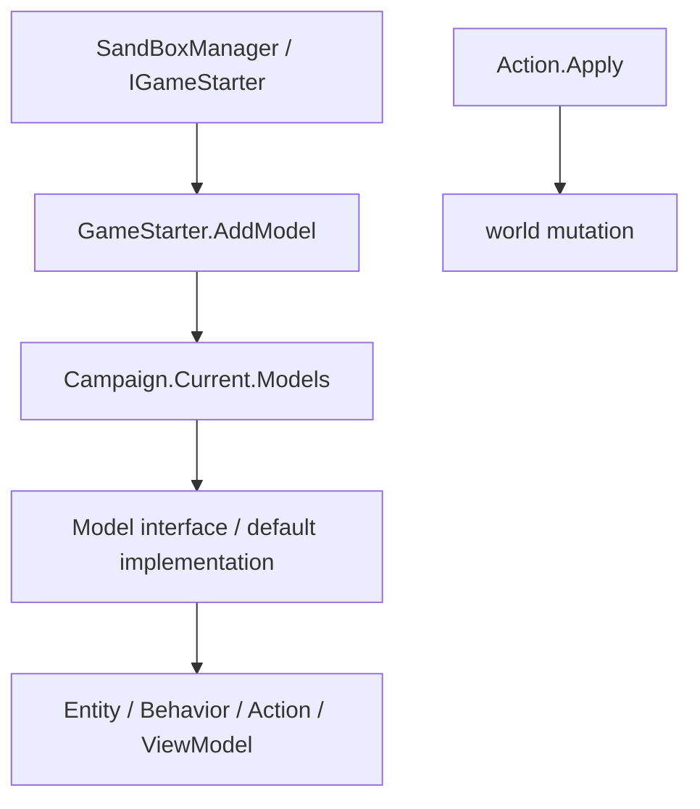

# Models Family Handbook

**One-sentence role:** `*Model` types are replaceable campaign policy providers. They answer how much, which option, or whether something is allowed, then leave world mutation to actions and behaviors.

## Mental Model

### Reading order

Read [GameModels](../GameModels) first. It receives the default implementations from `SandBoxManager` and exposes them through `Campaign.Current.Models`. Interface declarations are under `Bannerlord.Source/bin/TaleWorlds.CampaignSystem/TaleWorlds.CampaignSystem.ComponentInterfaces`; defaults are under `TaleWorlds.CampaignSystem.GameComponents`. Start with [PartySpeedModel](../PartySpeedModel) -> [DefaultPartySpeedCalculatingModel](../DefaultPartySpeedCalculatingModel), or [SettlementLoyaltyModel](../SettlementLoyaltyModel) -> [DefaultSettlementLoyaltyModel](../DefaultSettlementLoyaltyModel), then follow their real consumers.

A model may read campaign entities and caches, but it must not write `Hero`, `Settlement`, or `MobileParty` state. Use [Actions](../actions) for mutations and behaviors for scheduled progression or persistence. Register replacements during startup through `IGameStarter.AddModel`; do not construct an ad-hoc model during a running tick.

## When to use, and when not to

- Use a model for a calculation, permission, score, or choice such as speed, loyalty change, building effects, damage, or barter success.
- Use an action when the requirement is “make the change happen,” such as declaring war, changing settlement ownership, giving gold, or adding a hero to a party.
- Do not read `Campaign.Current.Models` before a campaign exists, and do not run model registration from UI or mission ticks.
- Custom implementations must preserve vanilla fallbacks, bounded deterministic results, and the interface's `ExplainedNumber` or enum contract. Invalid values may corrupt later economy, movement, or save-derived caches.

## Dependency map and real entry point



```csharp
PartySpeedModel speedModel = Campaign.Current.Models.PartySpeedCalculatingModel;
ExplainedNumber baseSpeed = speedModel.CalculateBaseSpeed(party, includeDescriptions: true);
ExplainedNumber finalSpeed = speedModel.CalculateFinalSpeed(party, baseSpeed);

SettlementLoyaltyModel loyaltyModel = Campaign.Current.Models.SettlementLoyaltyModel;
ExplainedNumber loyaltyChange = loyaltyModel.CalculateLoyaltyChange(town, includeDescriptions: true);
```

These are the access paths used by `MobileParty.CalculateSpeed`, `Town.LoyaltyChange`, and town-management UI code. They read a result; ownership, relation, and roster changes still go through [Actions](../actions).

## Priority models: purpose and typical timing

The table covers the highest-risk interface/default pairs in this family. `Purpose` states the business responsibility and `Timing` names the normal engine or campaign phase; these are not signature summaries. Remaining targets are added in later H5/H9 family waves under the same contract.

| Namespace | Type | Purpose | Timing |
| --- | --- | --- | --- |
| TaleWorlds.CampaignSystem.ComponentInterfaces | [PartySpeedModel](../PartySpeedModel) | Combines roster, encumbrance, terrain, and state into an explainable map speed. | Map ticks and speed-cache refresh |
| TaleWorlds.CampaignSystem.GameComponents | [DefaultPartySpeedCalculatingModel](../DefaultPartySpeedCalculatingModel) | Implements vanilla base and final speed rules for weight, formation, and terrain. | Registered by SandBox and read by MobileParty |
| TaleWorlds.CampaignSystem.ComponentInterfaces | [PartySizeLimitModel](../PartySizeLimitModel) | Computes party capacity for recruitment and formation consumers. | Party assembly, hero joins, daily refresh |
| TaleWorlds.CampaignSystem.GameComponents | [DefaultPartySizeLimitModel](../DefaultPartySizeLimitModel) | Combines clan tier, perks, and leader abilities into the vanilla limit. | Model registration and Party/Recruitment queries |
| TaleWorlds.CampaignSystem.ComponentInterfaces | [PartyWageModel](../PartyWageModel) | Converts roster state and wage rules into a party's daily wage. | Daily settlement and wage previews |
| TaleWorlds.CampaignSystem.GameComponents | [DefaultPartyWageModel](../DefaultPartyWageModel) | Applies vanilla troop-tier, perk, and party-state wage factors. | Campaign daily economy tick |
| TaleWorlds.CampaignSystem.ComponentInterfaces | [PartyHealingModel](../PartyHealingModel) | Computes wounded-party recovery without editing the wounded roster. | Map ticks and medical recovery |
| TaleWorlds.CampaignSystem.GameComponents | [DefaultPartyHealingModel](../DefaultPartyHealingModel) | Provides vanilla healing factors for medicine, settlement, and party state. | MobileParty daily/map updates |
| TaleWorlds.CampaignSystem.ComponentInterfaces | [PartyMoraleModel](../PartyMoraleModel) | Explains how food, battles, and composition contribute to morale. | Daily updates, battle edges, UI previews |
| TaleWorlds.CampaignSystem.GameComponents | [DefaultPartyMoraleModel](../DefaultPartyMoraleModel) | Implements default morale factors and bounded change. | Campaign tick and party refresh |
| TaleWorlds.CampaignSystem.ComponentInterfaces | [PartyNavigationModel](../PartyNavigationModel) | Chooses map targets, routes, and navigation restrictions for parties. | Target selection and pathfinding |
| TaleWorlds.CampaignSystem.GameComponents | [DefaultPartyNavigationModel](../DefaultPartyNavigationModel) | Supplies vanilla target priority and map-navigation policy. | Map AI tick |
| TaleWorlds.CampaignSystem.ComponentInterfaces | [PartyFoodBuyingModel](../PartyFoodBuyingModel) | Decides what and how much a hungry party should buy. | Settlement trade and supply checks |
| TaleWorlds.CampaignSystem.GameComponents | [DefaultPartyFoodBuyingModel](../DefaultPartyFoodBuyingModel) | Calculates vanilla restocking from size, consumption, and inventory. | Before a supply behavior executes |
| TaleWorlds.CampaignSystem.ComponentInterfaces | [PartyDesertionModel](../PartyDesertionModel) | Calculates deserter count and causes for food or morale failure. | Daily party settlement |
| TaleWorlds.CampaignSystem.GameComponents | [DefaultPartyDesertionModel](../DefaultPartyDesertionModel) | Implements vanilla desertion thresholds and limits for its behavior. | Campaign daily tick |
| TaleWorlds.CampaignSystem.ComponentInterfaces | [DiplomacyModel](../DiplomacyModel) | Evaluates war, peace, relation, and diplomatic-option eligibility. | Kingdom decisions and diplomacy menus |
| TaleWorlds.CampaignSystem.GameComponents | [DefaultDiplomacyModel](../DefaultDiplomacyModel) | Supplies vanilla diplomatic costs, relation gates, and AI scores. | Campaign decision resolution |
| TaleWorlds.CampaignSystem.ComponentInterfaces | [ClanFinanceModel](../DefaultClanFinanceModel) | Aggregates clan income, expenses, and assets for economy consumers. | Daily finance and clan UI |
| TaleWorlds.CampaignSystem.GameComponents | [DefaultClanFinanceModel](../DefaultClanFinanceModel) | Calculates vanilla workshop, vassal, and party finance entries. | Campaign daily tick |
| TaleWorlds.CampaignSystem.ComponentInterfaces | [ClanPoliticsModel](../ClanPoliticsModel) | Computes influence, policy support, and political-choice outcomes. | Kingdom policy and clan decisions |
| TaleWorlds.CampaignSystem.GameComponents | [DefaultClanPoliticsModel](../DefaultClanPoliticsModel) | Implements default political scores from tier, fiefs, and relations. | Vote evaluation and political UI |
| TaleWorlds.CampaignSystem.ComponentInterfaces | [SettlementLoyaltyModel](../SettlementLoyaltyModel) | Explains loyalty change and rebellion thresholds for settlements and UI. | Daily settlement update and rebellion checks |
| TaleWorlds.CampaignSystem.GameComponents | [DefaultSettlementLoyaltyModel](../DefaultSettlementLoyaltyModel) | Applies culture, governor, policy, and event factors to vanilla loyalty. | Settlement daily tick |
| TaleWorlds.CampaignSystem.ComponentInterfaces | [SettlementSecurityModel](../SettlementSecurityModel) | Computes security change and its crime, rebellion, and prosperity inputs. | Daily settlement settlement |
| TaleWorlds.CampaignSystem.GameComponents | [DefaultSettlementSecurityModel](../DefaultSettlementSecurityModel) | Provides the default garrison, gang, and crime security formula. | Campaign daily tick |
| TaleWorlds.CampaignSystem.ComponentInterfaces | [SettlementMilitiaModel](../SettlementMilitiaModel) | Calculates militia growth, cap, and battle-ready count. | Daily update and siege assessment |
| TaleWorlds.CampaignSystem.GameComponents | [DefaultSettlementMilitiaModel](../DefaultSettlementMilitiaModel) | Combines loyalty, buildings, and village contribution into militia change. | Settlement daily tick |
| TaleWorlds.CampaignSystem.ComponentInterfaces | [SettlementProsperityModel](../SettlementProsperityModel) | Calculates prosperity change with food, loyalty, and trade explanations. | Daily settlement economy |
| TaleWorlds.CampaignSystem.GameComponents | [DefaultSettlementProsperityModel](../DefaultSettlementProsperityModel) | Implements vanilla prosperity growth, decay, and loyalty effects. | Campaign daily tick |
| TaleWorlds.CampaignSystem.ComponentInterfaces | [SettlementEconomyModel](../SettlementEconomyModel) | Evaluates settlement production, demand, and market outcomes. | Daily economy and trade UI |
| TaleWorlds.CampaignSystem.GameComponents | [DefaultSettlementEconomyModel](../DefaultSettlementEconomyModel) | Implements vanilla production-chain and demand calculations. | Settlement daily tick |
| TaleWorlds.CampaignSystem.ComponentInterfaces | [BuildingModel](../BuildingModel) | Determines building availability and settlement effects. | Building queues, town management, load |
| TaleWorlds.CampaignSystem.GameComponents | [DefaultBuildingModel](../DefaultBuildingModel) | Provides default building categories, prerequisites, and effect queries. | Read by `BuildingsCampaignBehavior` |
| TaleWorlds.CampaignSystem.ComponentInterfaces | [BuildingConstructionModel](../BuildingConstructionModel) | Calculates construction speed, cost, and completion time. | Daily building progression |
| TaleWorlds.CampaignSystem.GameComponents | [DefaultBuildingConstructionModel](../DefaultBuildingConstructionModel) | Implements vanilla construction progress and queue rules. | Settlement daily tick |
| TaleWorlds.CampaignSystem.ComponentInterfaces | [BuildingEffectModel](../BuildingEffectModel) | Maps building state to garrison, prosperity, food, and related effects. | State refresh and UI explanations |
| TaleWorlds.CampaignSystem.GameComponents | [DefaultBuildingEffectModel](../DefaultBuildingEffectModel) | Supplies default effect strengths and application conditions. | Building completion and daily calculation |
| TaleWorlds.CampaignSystem.ComponentInterfaces | [CombatSimulationModel](../CombatSimulationModel) | Estimates casualties, winner, and reward inputs for map battles. | MapEvent simulation resolution |
| TaleWorlds.CampaignSystem.GameComponents | [DefaultCombatSimulationModel](../DefaultCombatSimulationModel) | Uses troops, equipment, and terrain for vanilla simulated outcomes. | Non-Mission battle completion |
| TaleWorlds.CampaignSystem.ComponentInterfaces | [CombatXpModel](../CombatXpModel) | Calculates combat experience categories and amounts. | Battle reward stage |
| TaleWorlds.CampaignSystem.GameComponents | [DefaultCombatXpModel](../DefaultCombatXpModel) | Distributes vanilla experience from troops, damage, and outcome. | MapEvent/Mission settlement |
| TaleWorlds.CampaignSystem.ComponentInterfaces | [CharacterDevelopmentModel](../CharacterDevelopmentModel) | Calculates hero/troop growth, skill progression, and limits. | Experience application and growth |
| TaleWorlds.CampaignSystem.GameComponents | [DefaultCharacterDevelopmentModel](../DefaultCharacterDevelopmentModel) | Supplies vanilla skill experience, attribute gates, and upgrade rules. | Battle and quest rewards |
| TaleWorlds.CampaignSystem.ComponentInterfaces | [MarriageModel](../MarriageModel) | Evaluates candidates, relation gates, and costs for marriage. | Proposal and marriage decisions |
| TaleWorlds.CampaignSystem.GameComponents | [DefaultMarriageModel](../DefaultMarriageModel) | Implements default marriage eligibility, price, and relation rules. | Campaign decision stage |
| TaleWorlds.CampaignSystem.ComponentInterfaces | [PregnancyModel](../DefaultPregnancyModel) | Calculates eligibility, cycle, and outcome for hero pregnancy. | Hero daily lifecycle tick |
| TaleWorlds.CampaignSystem.GameComponents | [DefaultPregnancyModel](../DefaultPregnancyModel) | Provides vanilla probability, cooldown, and age boundaries. | Campaign daily tick |
| TaleWorlds.CampaignSystem.ComponentInterfaces | [VolunteerModel](../VolunteerModel) | Calculates volunteer pools and refresh probability for recruitment. | Recruitment menus and daily refresh |
| TaleWorlds.CampaignSystem.GameComponents | [DefaultVolunteerModel](../DefaultVolunteerModel) | Implements the default culture, village, and relation volunteer pool. | Recruitment resolution |
| TaleWorlds.CampaignSystem.ComponentInterfaces | [SmithingModel](../SmithingModel) | Calculates recipes, materials, stamina, and item value for smithing. | Smithing previews and completion |
| TaleWorlds.CampaignSystem.GameComponents | [DefaultSmithingModel](../DefaultSmithingModel) | Supplies vanilla smithing difficulty, experience, and price rules. | Smithing UI and craft completion |
| TaleWorlds.CampaignSystem.ComponentInterfaces | [SiegeEventModel](../SiegeEventModel) | Calculates siege progression, preparation, and attack eligibility. | Siege map ticks and menus |
| TaleWorlds.CampaignSystem.GameComponents | [DefaultSiegeEventModel](../DefaultSiegeEventModel) | Implements default siege phases, force assessment, and time rules. | SiegeEvent updates |
| TaleWorlds.CampaignSystem.ComponentInterfaces | [SiegeAftermathModel](../SiegeAftermathModel) | Evaluates loot, population, and settlement consequences after a siege. | Siege outcome resolution |
| TaleWorlds.CampaignSystem.GameComponents | [DefaultSiegeAftermathModel](../DefaultSiegeAftermathModel) | Calculates vanilla post-siege consequences and rewards. | SiegeEvent completion |
| TaleWorlds.CampaignSystem.ComponentInterfaces | [SiegeStrategyActionModel](../SiegeStrategyActionModel) | Calculates feasibility and cost for siege strategy choices. | Strategy submission and menu preview |
| TaleWorlds.CampaignSystem.GameComponents | [DefaultSiegeStrategyActionModel](../DefaultSiegeStrategyActionModel) | Scores vanilla engines, breaches, and defensive siege strategies. | Siege strategy tick/menu |
| TaleWorlds.MountAndBlade.ComponentInterfaces | [AgentApplyDamageModel](../../mission-ext/AgentApplyDamageModel) | Converts hit, armor, and damage type into an Agent damage result. | Mission hit processing |
| TaleWorlds.MountAndBlade.ComponentInterfaces | [BattleMoraleModel](../../mission-ext/BattleMoraleModel) | Calculates battlefield morale changes and rout thresholds. | Mission battle events and morale ticks |

## Model versus mutation boundary

A model can answer `SettlementLoyaltyModel.CalculateLoyaltyChange`, but settlement ownership must go through [ChangeOwnerOfSettlementAction](../ChangeOwnerOfSettlementAction), and relation changes through [ChangeRelationAction](../ChangeRelationAction). Putting an action inside a model makes previews and AI evaluation mutate the world; treating a model as a setter bypasses events, caches, and save boundaries.

## Risks and debugging order

1. Confirm that `Campaign.Current`, `Campaign.Current.Models`, and the target model were registered by `GameModels`; the title screen and early load hooks have no active campaign.
2. Preserve default ranges, `ExplainedNumber` explanations, and enum branches. Never return `null`, an uninitialized collection, or an unbounded value dependent on global randomness.
3. After replacement, inspect every consumer for duplicate evaluation in one tick. Persistent state still belongs to a behavior/save contract, not to the model.

## Long-tail model contracts

The remaining model identities are grouped only with closely related contracts. Each row keeps the exact namespace so a duplicate type name cannot silently alias another subsystem. Interface rows answer one policy question; GameComponents rows supply the vanilla implementation registered by SandBox.

| Namespace | Type | Purpose | Timing |
| --- | --- | --- | --- |
| TaleWorlds.CampaignSystem.ComponentInterfaces | [AccessDetails](../AccessDetails); [AccessLevel](../AccessLevel); [AccessLimitationReason](../AccessLimitationReason); [AccessMethod](../AccessMethod); [AgeModel](../AgeModel) | Defines the replaceable related campaign subsystems policy contract; consumers read bounded results while Actions own world mutation. | Model registration and consumer query |
| TaleWorlds.CampaignSystem.ComponentInterfaces | [AlleyModel](../AlleyModel); [AllianceModel](../AllianceModel); [ArmyManagementCalculationModel](../ArmyManagementCalculationModel); [BanditDensityModel](../BanditDensityModel); [BannerItemModel](../BannerItemModel) | Defines the replaceable related campaign subsystems policy contract; consumers read bounded results while Actions own world mutation. | Daily campaign economy and settlement refresh |
| TaleWorlds.CampaignSystem.ComponentInterfaces | [BarterModel](../BarterModel); [BattleCaptainModel](../BattleCaptainModel); [BattleRewardModel](../BattleRewardModel); [BodyPropertiesModel](../BodyPropertiesModel); [BribeCalculationModel](../BribeCalculationModel) | Defines the replaceable related campaign subsystems policy contract; consumers read bounded results while Actions own world mutation. | Daily campaign economy and settlement refresh |
| TaleWorlds.CampaignSystem.ComponentInterfaces | [BuildingScoreCalculationModel](../BuildingScoreCalculationModel); [CampaignShipDamageModel](../CampaignShipDamageModel); [CampaignShipParametersModel](../CampaignShipParametersModel); [CampaignTimeModel](../CampaignTimeModel); [CaravanModel](../CaravanModel) | Defines the replaceable related campaign subsystems policy contract; consumers read bounded results while Actions own world mutation. | Model registration and consumer query |
| TaleWorlds.CampaignSystem.ComponentInterfaces | [CharacterStatsModel](../CharacterStatsModel); [ClanTierModel](../ClanTierModel); [CompanionHiringPriceCalculationModel](../CompanionHiringPriceCalculationModel); [CrimeModel](../CrimeModel); [CutsceneSelectionModel](../CutsceneSelectionModel) | Defines the replaceable related campaign subsystems policy contract; consumers read bounded results while Actions own world mutation. | Hero lifecycle, progression, or decision resolution |
| TaleWorlds.CampaignSystem.ComponentInterfaces | [DailyTroopXpBonusModel](../DailyTroopXpBonusModel); [DefectionModel](../DefectionModel); [DelayedTeleportationModel](../DelayedTeleportationModel); [DifficultyModel](../DifficultyModel); [DiplomacyStance](../DiplomacyStance) | Defines the replaceable related campaign subsystems policy contract; consumers read bounded results while Actions own world mutation. | Model registration and consumer query |
| TaleWorlds.CampaignSystem.ComponentInterfaces | [DisguiseDetectionModel](../DisguiseDetectionModel); [EmissaryModel](../EmissaryModel); [EncounterModel](../EncounterModel); [EquipmentSelectionModel](../EquipmentSelectionModel); [ExecutionRelationModel](../ExecutionRelationModel) | Defines the replaceable related campaign subsystems policy contract; consumers read bounded results while Actions own world mutation. | Model registration and consumer query |
| TaleWorlds.CampaignSystem.ComponentInterfaces | [FleetManagementModel](../FleetManagementModel); [GenericXpModel](../GenericXpModel); [HeirSelectionCalculationModel](../HeirSelectionCalculationModel); [HeroAgentLocationModel](../HeroAgentLocationModel); [HeroCreationModel](../HeroCreationModel) | Defines the replaceable related campaign subsystems policy contract; consumers read bounded results while Actions own world mutation. | Model registration and consumer query |
| TaleWorlds.CampaignSystem.ComponentInterfaces | [HeroDeathProbabilityCalculationModel](../HeroDeathProbabilityCalculationModel); [HeroLocationDetail](../HeroLocationDetail); [HideoutModel](../HideoutModel); [INavigationCache](../INavigationCache); [IncidentModel](../IncidentModel) | Defines the replaceable related campaign subsystems policy contract; consumers read bounded results while Actions own world mutation. | Hero lifecycle, progression, or decision resolution |
| TaleWorlds.CampaignSystem.ComponentInterfaces | [InformationRestrictionModel](../InformationRestrictionModel); [InventoryCapacityModel](../InventoryCapacityModel); [ItemDiscardModel](../ItemDiscardModel); [KingdomCreationModel](../KingdomCreationModel); [KingdomDecisionPermissionModel](../KingdomDecisionPermissionModel) | Defines the replaceable related campaign subsystems policy contract; consumers read bounded results while Actions own world mutation. | Model registration and consumer query |
| TaleWorlds.CampaignSystem.ComponentInterfaces | [LimitedAccessSolution](../LimitedAccessSolution); [LocationModel](../LocationModel); [MapDistanceModel](../MapDistanceModel); [MapTrackModel](../MapTrackModel); [MapVisibilityModel](../MapVisibilityModel) | Defines the replaceable related campaign subsystems policy contract; consumers read bounded results while Actions own world mutation. | Model registration and consumer query |
| TaleWorlds.CampaignSystem.ComponentInterfaces | [MapWeatherModel](../MapWeatherModel); [MilitaryPowerModel](../MilitaryPowerModel); [MinorFactionsModel](../MinorFactionsModel); [MissionTypeEnum](../MissionTypeEnum); [MobilePartyAIModel](../MobilePartyAIModel) | Defines the replaceable related campaign subsystems policy contract; consumers read bounded results while Actions own world mutation. | Map tick, encounter setup, or route evaluation |
| TaleWorlds.CampaignSystem.ComponentInterfaces | [MobilePartyFoodConsumptionModel](../MobilePartyFoodConsumptionModel); [MobilePartyMoraleModel](../MobilePartyMoraleModel); [NotablePowerModel](../NotablePowerModel); [NotableSpawnModel](../NotableSpawnModel); [PartyImpairmentModel](../PartyImpairmentModel) | Defines the replaceable related campaign subsystems policy contract; consumers read bounded results while Actions own world mutation. | Daily campaign economy and settlement refresh |
| TaleWorlds.CampaignSystem.ComponentInterfaces | [PartyShipLimitModel](../PartyShipLimitModel); [PartyTradeModel](../PartyTradeModel); [PartyTrainingModel](../PartyTrainingModel); [PartyTransitionModel](../PartyTransitionModel); [PartyTroopUpgradeModel](../PartyTroopUpgradeModel) | Defines the replaceable party policy contract; consumers read bounded results while Actions own world mutation. | Model registration and consumer query |
| TaleWorlds.CampaignSystem.ComponentInterfaces | [PaymentMethod](../PaymentMethod); [PersuasionModel](../PersuasionModel); [PlayerProgressionModel](../PlayerProgressionModel); [PreliminaryActionObligation](../PreliminaryActionObligation); [PreliminaryActionType](../PreliminaryActionType) | Defines the replaceable related campaign subsystems policy contract; consumers read bounded results while Actions own world mutation. | Model registration and consumer query |
| TaleWorlds.CampaignSystem.ComponentInterfaces | [PrisonBreakModel](../PrisonBreakModel); [PrisonerDonationModel](../PrisonerDonationModel); [PrisonerRecruitmentCalculationModel](../PrisonerRecruitmentCalculationModel); [RaidModel](../RaidModel); [RansomValueCalculationModel](../RansomValueCalculationModel) | Defines the replaceable related campaign subsystems policy contract; consumers read bounded results while Actions own world mutation. | Model registration and consumer query |
| TaleWorlds.CampaignSystem.ComponentInterfaces | [RomanceModel](../RomanceModel); [SceneModel](../SceneModel); [SettlementAccessModel](../SettlementAccessModel); [SettlementAction](../SettlementAction); [SettlementFoodModel](../SettlementFoodModel) | Defines the replaceable related campaign subsystems policy contract; consumers read bounded results while Actions own world mutation. | Hero lifecycle, progression, or decision resolution |
| TaleWorlds.CampaignSystem.ComponentInterfaces | [SettlementGarrisonModel](../SettlementGarrisonModel); [SettlementMenuOverlayModel](../SettlementMenuOverlayModel); [SettlementPatrolModel](../SettlementPatrolModel); [SettlementTaxModel](../SettlementTaxModel); [SettlementValueModel](../SettlementValueModel) | Defines the replaceable settlement policy contract; consumers read bounded results while Actions own world mutation. | Daily campaign economy and settlement refresh |
| TaleWorlds.CampaignSystem.ComponentInterfaces | [ShipCostModel](../ShipCostModel); [ShipStatModel](../ShipStatModel); [SiegeAction](../SiegeAction); [SiegeLordsHallFightModel](../SiegeLordsHallFightModel); [TargetScoreCalculatingModel](../TargetScoreCalculatingModel) | Defines the replaceable related campaign subsystems policy contract; consumers read bounded results while Actions own world mutation. | Model registration and consumer query |
| TaleWorlds.CampaignSystem.ComponentInterfaces | [TavernMercenaryTroopsModel](../TavernMercenaryTroopsModel); [TournamentModel](../TournamentModel); [TradeAgreementModel](../TradeAgreementModel); [TradeItemPriceFactorModel](../TradeItemPriceFactorModel); [TroopSacrificeModel](../TroopSacrificeModel) | Defines the replaceable related campaign subsystems policy contract; consumers read bounded results while Actions own world mutation. | Model registration and consumer query |
| TaleWorlds.CampaignSystem.ComponentInterfaces | [TroopSupplierProbabilityModel](../TroopSupplierProbabilityModel); [ValuationModel](../ValuationModel); [VassalRewardsModel](../VassalRewardsModel); [VillageProductionCalculatorModel](../VillageProductionCalculatorModel); [VillageTradeModel](../VillageTradeModel) | Defines the replaceable related campaign subsystems policy contract; consumers read bounded results while Actions own world mutation. | Model registration and consumer query |
| TaleWorlds.CampaignSystem.ComponentInterfaces | [VoiceOverModel](../VoiceOverModel); [WallHitPointCalculationModel](../WallHitPointCalculationModel); [WeatherEvent](../WeatherEvent); [WeatherEventEffectOnTerrain](../WeatherEventEffectOnTerrain); [WorkshopModel](../WorkshopModel) | Defines the replaceable related campaign subsystems policy contract; consumers read bounded results while Actions own world mutation. | Campaign startup and feature-specific queries |
| TaleWorlds.CampaignSystem.GameComponents | [AlleyMemberAvailabilityDetail](../AlleyMemberAvailabilityDetail); [AssetIncomeType](../AssetIncomeType); [DefaultAgeModel](../DefaultAgeModel); [DefaultAlleyModel](../DefaultAlleyModel); [DefaultAllianceModel](../DefaultAllianceModel) | Supplies the vanilla related campaign subsystems calculation; SandBox registers it and GameModels exposes it to consumers. | Daily campaign economy and settlement refresh |
| TaleWorlds.CampaignSystem.GameComponents | [DefaultArmyManagementCalculationModel](../DefaultArmyManagementCalculationModel); [DefaultBanditDensityModel](../DefaultBanditDensityModel); [DefaultBannerItemModel](../DefaultBannerItemModel); [DefaultBarterModel](../DefaultBarterModel); [DefaultBattleCaptainModel](../DefaultBattleCaptainModel) | Supplies the vanilla related campaign subsystems calculation; SandBox registers it and GameModels exposes it to consumers. | Model registration and consumer query |
| TaleWorlds.CampaignSystem.GameComponents | [DefaultBattleRewardModel](../DefaultBattleRewardModel); [DefaultBodyPropertiesModel](../DefaultBodyPropertiesModel); [DefaultBribeCalculationModel](../DefaultBribeCalculationModel); [DefaultBuildingScoreCalculationModel](../DefaultBuildingScoreCalculationModel); [DefaultCampaignShipDamageModel](../DefaultCampaignShipDamageModel) | Supplies the vanilla related campaign subsystems calculation; SandBox registers it and GameModels exposes it to consumers. | Mission, battle, or siege resolution |
| TaleWorlds.CampaignSystem.GameComponents | [DefaultCampaignShipParametersModel](../DefaultCampaignShipParametersModel); [DefaultCampaignTimeModel](../DefaultCampaignTimeModel); [DefaultCaravanModel](../DefaultCaravanModel); [DefaultCharacterStatsModel](../DefaultCharacterStatsModel); [DefaultClanTierModel](../DefaultClanTierModel) | Supplies the vanilla related campaign subsystems calculation; SandBox registers it and GameModels exposes it to consumers. | Campaign startup and feature-specific queries |
| TaleWorlds.CampaignSystem.GameComponents | [DefaultCompanionHiringPriceCalculationModel](../DefaultCompanionHiringPriceCalculationModel); [DefaultCrimeModel](../DefaultCrimeModel); [DefaultCutsceneSelectionModel](../DefaultCutsceneSelectionModel); [DefaultDailyTroopXpBonusModel](../DefaultDailyTroopXpBonusModel); [DefaultDefectionModel](../DefaultDefectionModel) | Supplies the vanilla related campaign subsystems calculation; SandBox registers it and GameModels exposes it to consumers. | Hero lifecycle, progression, or decision resolution |
| TaleWorlds.CampaignSystem.GameComponents | [DefaultDelayedTeleportationModel](../DefaultDelayedTeleportationModel); [DefaultDifficultyModel](../DefaultDifficultyModel); [DefaultDisguiseDetectionModel](../DefaultDisguiseDetectionModel); [DefaultEmissaryModel](../DefaultEmissaryModel); [DefaultEncounterGameMenuModel](../DefaultEncounterGameMenuModel) | Supplies the vanilla related campaign subsystems calculation; SandBox registers it and GameModels exposes it to consumers. | Model registration and consumer query |
| TaleWorlds.CampaignSystem.GameComponents | [DefaultEncounterModel](../DefaultEncounterModel); [DefaultEquipmentSelectionModel](../DefaultEquipmentSelectionModel); [DefaultExecutionRelationModel](../DefaultExecutionRelationModel); [DefaultFleetManagementModel](../DefaultFleetManagementModel); [DefaultGenericXpModel](../DefaultGenericXpModel) | Supplies the vanilla related campaign subsystems calculation; SandBox registers it and GameModels exposes it to consumers. | Map tick, encounter setup, or route evaluation |
| TaleWorlds.CampaignSystem.GameComponents | [DefaultHeirSelectionCalculationModel](../DefaultHeirSelectionCalculationModel); [DefaultHeroAgentLocationModel](../DefaultHeroAgentLocationModel); [DefaultHeroCreationModel](../DefaultHeroCreationModel); [DefaultHeroDeathProbabilityCalculationModel](../DefaultHeroDeathProbabilityCalculationModel); [DefaultHideoutModel](../DefaultHideoutModel) | Supplies the vanilla related campaign subsystems calculation; SandBox registers it and GameModels exposes it to consumers. | Hero lifecycle, progression, or decision resolution |
| TaleWorlds.CampaignSystem.GameComponents | [DefaultIncidentModel](../DefaultIncidentModel); [DefaultInformationRestrictionModel](../DefaultInformationRestrictionModel); [DefaultInventoryCapacityModel](../DefaultInventoryCapacityModel); [DefaultItemDiscardModel](../DefaultItemDiscardModel); [DefaultKingdomCreationModel](../DefaultKingdomCreationModel) | Supplies the vanilla related campaign subsystems calculation; SandBox registers it and GameModels exposes it to consumers. | Campaign startup and feature-specific queries |
| TaleWorlds.CampaignSystem.GameComponents | [DefaultKingdomDecisionPermissionModel](../DefaultKingdomDecisionPermissionModel); [DefaultLocationModel](../DefaultLocationModel); [DefaultMapDistanceModel](../DefaultMapDistanceModel); [DefaultMapTrackModel](../DefaultMapTrackModel); [DefaultMapVisibilityModel](../DefaultMapVisibilityModel) | Supplies the vanilla related campaign subsystems calculation; SandBox registers it and GameModels exposes it to consumers. | Model registration and consumer query |
| TaleWorlds.CampaignSystem.GameComponents | [DefaultMapWeatherModel](../DefaultMapWeatherModel); [DefaultMilitaryPowerModel](../DefaultMilitaryPowerModel); [DefaultMinorFactionsModel](../DefaultMinorFactionsModel); [DefaultMobilePartyAIModel](../DefaultMobilePartyAIModel); [DefaultMobilePartyFoodConsumptionModel](../DefaultMobilePartyFoodConsumptionModel) | Supplies the vanilla related campaign subsystems calculation; SandBox registers it and GameModels exposes it to consumers. | Map tick, encounter setup, or route evaluation |
| TaleWorlds.CampaignSystem.GameComponents | [DefaultNotablePowerModel](../DefaultNotablePowerModel); [DefaultNotableSpawnModel](../DefaultNotableSpawnModel); [DefaultPartyImpairmentModel](../DefaultPartyImpairmentModel); [DefaultPartyShipLimitModel](../DefaultPartyShipLimitModel); [DefaultPartyTradeModel](../DefaultPartyTradeModel) | Supplies the vanilla related campaign subsystems calculation; SandBox registers it and GameModels exposes it to consumers. | Model registration and consumer query |
| TaleWorlds.CampaignSystem.GameComponents | [DefaultPartyTrainingModel](../DefaultPartyTrainingModel); [DefaultPartyTransitionModel](../DefaultPartyTransitionModel); [DefaultPartyTroopUpgradeModel](../DefaultPartyTroopUpgradeModel); [DefaultPersuasionModel](../DefaultPersuasionModel); [DefaultPlayerProgressionModel](../DefaultPlayerProgressionModel) | Supplies the vanilla related campaign subsystems calculation; SandBox registers it and GameModels exposes it to consumers. | Model registration and consumer query |
| TaleWorlds.CampaignSystem.GameComponents | [DefaultPrisonBreakModel](../DefaultPrisonBreakModel); [DefaultPrisonerDonationModel](../DefaultPrisonerDonationModel); [DefaultPrisonerRecruitmentCalculationModel](../DefaultPrisonerRecruitmentCalculationModel); [DefaultRaidModel](../DefaultRaidModel); [DefaultRansomValueCalculationModel](../DefaultRansomValueCalculationModel) | Supplies the vanilla related campaign subsystems calculation; SandBox registers it and GameModels exposes it to consumers. | Model registration and consumer query |
| TaleWorlds.CampaignSystem.GameComponents | [DefaultRomanceModel](../DefaultRomanceModel); [DefaultSceneModel](../DefaultSceneModel); [DefaultSettlementAccessModel](../DefaultSettlementAccessModel); [DefaultSettlementFoodModel](../DefaultSettlementFoodModel); [DefaultSettlementGarrisonModel](../DefaultSettlementGarrisonModel) | Supplies the vanilla related campaign subsystems calculation; SandBox registers it and GameModels exposes it to consumers. | Hero lifecycle, progression, or decision resolution |
| TaleWorlds.CampaignSystem.GameComponents | [DefaultSettlementPatrolModel](../DefaultSettlementPatrolModel); [DefaultSettlementTaxModel](../DefaultSettlementTaxModel); [DefaultSettlementValueModel](../DefaultSettlementValueModel); [DefaultShipCostModel](../DefaultShipCostModel); [DefaultShipStatModel](../DefaultShipStatModel) | Supplies the vanilla related campaign subsystems calculation; SandBox registers it and GameModels exposes it to consumers. | Daily campaign economy and settlement refresh |
| TaleWorlds.CampaignSystem.GameComponents | [DefaultSiegeLordsHallFightModel](../DefaultSiegeLordsHallFightModel); [DefaultTargetScoreCalculatingModel](../DefaultTargetScoreCalculatingModel); [DefaultTavernMercenaryTroopsModel](../DefaultTavernMercenaryTroopsModel); [DefaultTournamentModel](../DefaultTournamentModel); [DefaultTradeAgreementModel](../DefaultTradeAgreementModel) | Supplies the vanilla related campaign subsystems calculation; SandBox registers it and GameModels exposes it to consumers. | Mission, battle, or siege resolution |
| TaleWorlds.CampaignSystem.GameComponents | [DefaultTradeItemPriceFactorModel](../DefaultTradeItemPriceFactorModel); [DefaultTroopSacrificeModel](../DefaultTroopSacrificeModel); [DefaultTroopSupplierProbabilityModel](../DefaultTroopSupplierProbabilityModel); [DefaultValuationModel](../DefaultValuationModel); [DefaultVassalRewardsModel](../DefaultVassalRewardsModel) | Supplies the vanilla related campaign subsystems calculation; SandBox registers it and GameModels exposes it to consumers. | Daily campaign economy and settlement refresh |
| TaleWorlds.CampaignSystem.GameComponents | [DefaultVillageProductionCalculatorModel](../DefaultVillageProductionCalculatorModel); [DefaultVillageTradeModel](../DefaultVillageTradeModel); [DefaultVoiceOverModel](../DefaultVoiceOverModel); [DefaultWallHitPointCalculationModel](../DefaultWallHitPointCalculationModel); [DefaultWorkshopModel](../DefaultWorkshopModel) | Supplies the vanilla related campaign subsystems calculation; SandBox registers it and GameModels exposes it to consumers. | Daily campaign economy and settlement refresh |
## Navigation

- [Parent: Campaign-Ext](..)
- [Siblings: Actions](../actions) · [Behaviors](../behaviors) · [Party](../party) · [Settlements](../settlements)
- [Registration: GameModels](../GameModels)
- [Related: Campaign](../../campaign/Campaign) · [CampaignEvents](../CampaignEvents)
