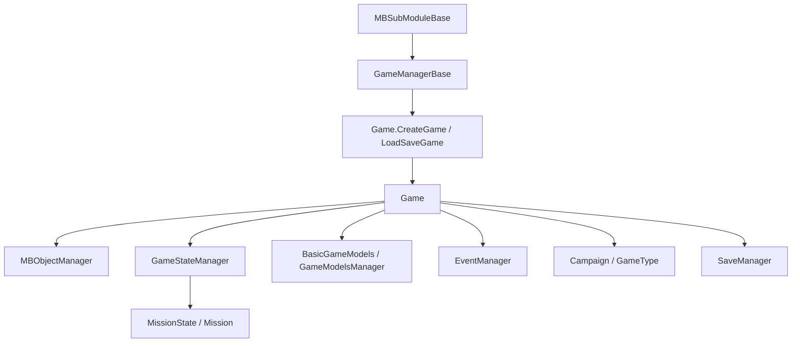

# Game

**Namespace:** `TaleWorlds.Core`  
**Module:** `TaleWorlds.Core`  
**Type:** `public sealed class Game : IGameStateManagerOwner` (`[SaveableRootClass(5000)]`)  
**Base:** `IGameStateManagerOwner`  
**Source:** `TaleWorlds.Core/Game.cs`

## Responsibility

`Game` is the root container for one session from creation through destruction. It owns the current mode, object registry, state machine, text/model services, event manager, and player troop, and exposes the active session through `Game.Current`.

## Mental model

`Game` is not the `Campaign` and not a battle `Mission`. A campaign is a `GameType` implementation; a Mission is reached through the `GameStateManager` state stack. Treat `Game` as the session boundary: put cross-screen services here, campaign rules in [Campaign](../../campaign/Campaign), and battle behavior in [Mission](../../mission/Mission).

### Lifetime

1. `Game.CreateGame(GameType, GameManagerBase)` initializes [MBObjectManager](../../campaign-ext/MBObjectManager), registers types, and sets `Game.Current` in the constructor.
2. `Game.LoadSaveGame(LoadResult, GameManagerBase)` restores the save root, registers types again, calls `ReInitialize`, and enters the loading flow.
3. `Initialize()` creates text and model services; `CreateGameManager()` creates the `GameStateManager`.
4. The internal `OnTick(float)` drives the state manager, `GameHandler` components, and `AfterTick`. Mods should attach through behaviors/events instead of trying to own this loop.
5. `Destroy()` notifies handlers, managers, and the game type, destroys object/event services, and finally clears `Game.Current`.

## When to use it

- **Use it** from lifecycle callbacks that receive `Game game` to read `GameType`, `ObjectManager`, `GameStateManager`, `PlayerTroop`, or model services; to attach a `GameHandler`; or to use `Game.Current.EventManager` for a session-wide event.
- **Do not use it** from static module construction, after `Destroy()`, or before the session exists. Do not substitute it for `Campaign.Current` world entities or mutate `Hero`/`Settlement` state directly.

## Dependencies



- **Upstream:** [MBSubModuleBase](../../core/MBSubModuleBase) callbacks receive a `Game`; `MBGameManager` calls the two static factories.
- **Object layer:** [MBObjectManager](../../campaign-ext/MBObjectManager) is initialized by `Game.CreateGame`; `Game` does not make an unregistered object valid.
- **Downstream:** [Campaign](../../campaign/Campaign) runs as a `GameType`; [Mission](../../mission/Mission) is entered through the state manager; behaviors and models consume those contexts.
- **Save:** `[SaveableRootClass(5000)]` makes `Game` a save root; `Game.Save(...)` delegates the write to `SaveManager`.

## Key members

### Session and mode

- `static Game Current { get; internal set; }`: the active session singleton, valid only between creation and destruction.
- `GameType GameType`: the current mode (campaign, multiplayer, or another `GameType`).
- `State CurrentState`: `Running`, `Destroying`, or `Destroyed`.
- `GameManagerBase GameManager`: runtime configuration, development mode, and application time.

### Objects, state, and models

- `MBObjectManager ObjectManager`: module object registration and lookup, such as `GetObjectTypeList<ItemObject>()`.
- `GameStateManager GameStateManager`: owns the GameState stack for Missions, menus, and lobbies.
- `BasicGameModels BasicModels` and `AddGameModelsManager<T>(IEnumerable<GameModel>)`: the rule-model collections used by the session.
- `GameTextManager GameTextManager` and `EventManager EventManager`: text and session event services.
- `BasicCharacterObject PlayerTroop` and `Monster DefaultMonster`: basic unit data used by the current mode.

### Handlers and save

- `AddGameHandler<T>()`, `GetGameHandler<T>()`, and `RemoveGameHandler<T>()`: attach components driven by `Game.OnTick`.
- `Save(MetaData, string, ISaveDriver, Action<SaveResult>)`: writes the save root through `SaveManager`, notifying handlers before and after the operation.
- `Destroy()`: irreversibly ends the session and clears `Game.Current`.

## Crash and boundary risks

1. **Null `Game.Current`:** factories have not run, the module is still loading, or `Destroy()` has completed. Prefer the callback parameter `Game game`.
2. **Wrong state layer:** directly manipulating `GameStateManager` from campaign rules can bypass Campaign/Mission cleanup; use the appropriate state or Mission API.
3. **Unregistered objects:** `ObjectManager.GetObject<T>(id)` returns null for types not registered from module XML. Do not replace registration with `new ItemObject`; see [MBObjectBase](../../campaign-ext/MBObjectBase).
4. **Model misuse:** `BasicModels` exposes the current model set. Model replacement belongs in the game-starter registration window, not in a per-frame update.
5. **Save lifetime:** `Save` invokes `GameHandler.OnBeforeSave`; its completion callback may run later, so do not release referenced objects prematurely.
6. **Stale caches:** references to `ObjectManager`, `EventManager`, or `GameStateManager` become invalid across `Destroy()`.

## Real acquisition paths

### Use the Game supplied by a module hook

```csharp
public sealed class MySubModule : MBSubModuleBase
{
    protected internal override void OnGameInitializationFinished(Game game)
    {
        var objectManager = game.ObjectManager;
        foreach (ItemObject item in objectManager.GetObjectTypeList<ItemObject>())
        {
            Debug.Print(item.StringId);
        }
    }
}
```

### Read the active state only inside a live session

```csharp
Game game = Game.Current;
if (game != null && game.CurrentState == Game.State.Running)
{
    GameState activeState = game.GameStateManager?.ActiveState;
    bool inMission = activeState is MissionState;
    Debug.Print($"Running state: {activeState?.GetType().Name}, mission={inMission}");
}
```

The real `CustomGameManager` and `MultiplayerGameManager` flow is `Game.CreateGame(...).DoLoading()`, followed by state pushes through `Game.Current.GameStateManager`. The order matters: create the session first, then read `Current`.

## Navigation

- Parent: [core-extra index](./)
- Siblings: [GameStateManager](../GameStateManager) · [GameManagerBase](../GameManagerBase)
- Upstream: [MBSubModuleBase](../../core/MBSubModuleBase) · [MBObjectManager](../../campaign-ext/MBObjectManager)
- Downstream: [Campaign](../../campaign/Campaign) · [Mission](../../mission/Mission)
- Related: [SaveManager](../../save-system/SaveManager) · [MBObjectBase](../../campaign-ext/MBObjectBase) · [documentation contract](../../../architecture/doc-contract)
