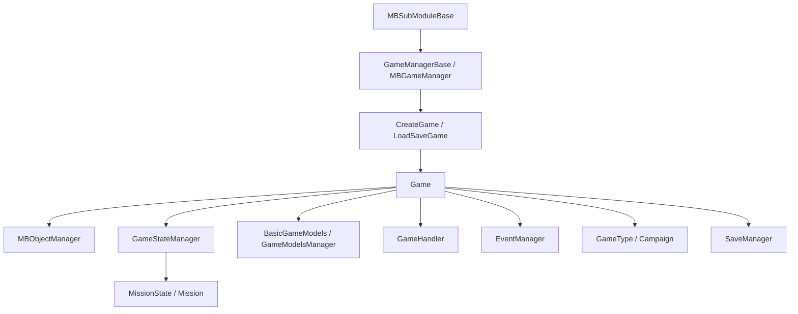

# Game

**Namespace:** `TaleWorlds.Core`  
**Module:** `TaleWorlds.Core`  
**Type:** `public sealed class Game : IGameStateManagerOwner` (`[SaveableRootClass(5000)]`)  
**Base:** `IGameStateManagerOwner`  
**Source:** `TaleWorlds.Core/Game.cs`

## Responsibility

`Game` is the root container for one Bannerlord session from creation through initialization, runtime, and destruction. It keeps the current `GameType`, `MBObjectManager`, `GameStateManager`, rule models, game-level handlers, text and event services inside one lifetime boundary, and exposes the active session through `Game.Current`.

## Mental model

Treat `Game` as the runtime session boundary, not as the campaign world or a battle object. [Campaign](../../campaign/Campaign) runs as one kind of `GameType`; battles are carried by [Mission](../../mission/Mission) and the state stack. Obtain a registry or service from `Game` when it must live across screens and states. Put campaign rules, world entities, and battle behavior back in their owning layers.

### Lifetime, owners, and layer

1. `Game.CreateGame(GameType, GameManagerBase)` initializes [MBObjectManager](../../campaign-ext/MBObjectManager), calls `RegisterTypes`, then sets `Game.Current`, `GameType.CurrentGame`, and `GameManager.Game` in the constructor.
2. `Game.LoadSaveGame(LoadResult, GameManagerBase)` restores the save root, registers types again, initializes save objects, replaces the object manager, and rebuilds `Current`, `GameManager`, and the event manager in `BeginLoading`.
3. `Initialize()` creates the `GameHandler` entity system, `GameTextManager`, and model-manager dictionary, then calls `GameType.OnInitialize()`. `CreateGameManager()` separately creates this session's `GameStateManager`.
4. During startup, `MBGameManager` uses [GameManagerBase](../GameManagerBase/) and passes the same `Game` to module callbacks on [MBSubModuleBase](../../core/MBSubModuleBase). `OnGameStart`, `OnGameInitializationFinished`, and `OnGameLoaded` are the mod-facing timing points.
5. Internal `OnTick(float)` drives the state stack and every `GameHandler` while the current state manager belongs to this session, then invokes `AfterTick` and checks for asynchronous save completion. A mod should not try to own this internal loop.
6. `OnFinalize()` marks the state as destroying and cleans the state stack. Once the stack is empty, `IGameStateManagerOwner.OnStateStackEmpty()` reaches `Destroy()`. `Destroy()` ends handlers, the manager, and the game type, destroys the object manager, clears events and state managers, and finally clears `Game.Current`.

## When to use it, and when not to

- **Use it** from module lifecycle callbacks that receive `Game game` to read `GameType`, `ObjectManager`, `GameStateManager`, `BasicModels`, or `PlayerTroop`; to register a session-level `GameHandler`; or to use `Game.Current.EventManager` while the session is live.
- **Do not use it** without a lifetime guard from static constructors, before game creation, after `OnGameEnd`, or after `Destroy()`. Do not substitute it for `Campaign.Current` world objects or bypass [Campaign](../../campaign/Campaign) Actions and Behaviors by changing campaign state directly.
- **State changes**: do not use `GameStateManager` to imitate campaign or mission logic. Let [Mission](../../mission/Mission) own the mission-state creation flow and let the campaign layer own campaign rules through its models, events, and Actions.

## Dependencies



- **Upstream creator:** `MBGameManager` uses [GameManagerBase](../GameManagerBase/) to call the factories and pass `Game` to [MBSubModuleBase](../../core/MBSubModuleBase) during startup, loading, and shutdown. A module normally should not call `CreateGame` itself.
- **Object layer:** [MBObjectManager](../../campaign-ext/MBObjectManager) is initialized by the factories and receives its type table from `RegisterTypes`. `Game` holds it; it does not make an unregistered object valid.
- **State and downstream:** [GameStateManager](../GameStateManager/) owns the state stack. The real `MissionState.OpenNew` path first calls `Game.Current.OnMissionIsStarting(...)`, then creates and pushes `MissionState`. The campaign layer consumes the `GameType`, object registry, and model collections.
- **Events and saves:** `EventManager` is the session event bus. `[SaveableRootClass(5000)]` makes `Game` a save root, while `Game.Save(...)` delegates the write to [SaveManager](../../save-system/SaveManager).

## Key members: session and services

- `static Game Current`: its internal setter is changed only by `Game`; it points at the active session during creation/loading and becomes `null` during destruction. Guard every read by lifetime.
- `State CurrentState`: the enum contains `Running`, `Destroying`, and `Destroyed`. The source does not explicitly assign `Running`; the enum's zero value is `Running` after construction, while `OnFinalize` and `Destroy` advance the later states.
- `GameType GameType` and `GameManagerBase GameManager`: the former selects campaign, multiplayer, or another mode; the latter supplies development mode, cheat mode, application time, and submodule initialization. `CheatMode`, `IsDevelopmentMode`, `IsEditModeOn`, `UnitSpawnPrioritization`, and `ApplicationTime` are read-only views forwarded from `GameManager`.
- `MBObjectManager ObjectManager`: looks up registered module objects such as `ItemObject` and `CharacterObject`. It is meaningful for this session only after `CreateGame`/`LoadSaveGame`, and is invalid after destruction.
- `GameStateManager GameStateManager`: the state-stack entry point for this session. `CreateGameManager()` creates it; it is not interchangeable with global `GameStateManager.Current`, and both are cleared during teardown.
- `GameTextManager GameTextManager`: created by `Initialize()` and used to load game text. Do not rely on static `GameTexts` before this initialization has happened.
- `EventManager EventManager`: the session event bus. Every subscriber should unregister during teardown so it does not retain a destroyed UI or handler.

## Key members: models, defaults, and events

- `BasicGameModels BasicModels`: installed by `SetBasicModels` and represents the active base rule-model collection. Read it after `OnGameStart`; model replacement belongs in the game-starter registration window, not in a per-frame update.
- `AddGameModelsManager<T>(IEnumerable<GameModel>)`: constructs a `GameModelsManager` for `T` and stores it by type. Adding the same `T` twice fails on the dictionary key; `MBGameManager`, through [GameManagerBase](../GameManagerBase/), adds `MissionGameModels` during startup.
- `DefaultCharacterAttributes`, `DefaultSkills`, `DefaultBannerEffects`, `DefaultItemCategories`, and `DefaultSiegeEngineTypes`: created once by `InitializeDefaultGameObjects()`, which then calls `GameManager.InitializeSubModuleGameObjects`. They may be `null` before that phase.
- `DefaultMonster`: lazily obtains and caches `ObjectManager.GetFirstObject<Monster>()` on first read. It may be `null` before the base XML is loaded or when no monster is registered.
- `PlayerTroop`: the basic character used by the current mode. A game mode may assign it; it is not a general-purpose entry point for changing the campaign protagonist.
- `MonsterMissionDataCreator` and `BannerVisualCreator`: extension points injected by the outer startup flow. `CreateBannerVisual(Banner)` returns `null` when the creator is missing; it does not create a renderer on its own.
- `NextUniqueTroopSeed`: increments and returns a new integer on every read. Read it only when a per-session unique troop seed is needed; do not cache and reuse one value as if it were unique.
- `static event OnGameCreated`: the internal `Current` setter fires it every time it runs, including creation, load rebinding, and clearing during destruction. A callback must not assume all services are initialized.
- `event OnItemDeserializedEvent` and `ItemObjectDeserialized(ItemObject)`: the load path raises this after an `ItemObject` has been deserialized, which is a suitable point for item-resource work; unsubscribe before the session ends.
- `public Action<float> AfterTick`: invoked after state and handler processing by internal `OnTick`. It is a public delegate, not a separate thread or timer; expensive work or an exception affects the main loop.

## Key members: creation, startup, and teardown

- `CreateGame(GameType, GameManagerBase)` and its `seed` overload: create a new session and register core XML types; the seeded overload replaces `RandomGenerator` after the base creation. The game manager calls these; mods normally receive the resulting instance through callbacks.
- `LoadSaveGame(LoadResult, GameManagerBase)`: restores the `[SaveableRootClass(5000)]` root and rebuilds the object and event environment. Do not treat a cached pre-load `ObjectManager` as the current manager before object initialization is complete.
- `RegisterTypes(GameType, MBObjectManager, GameManagerBase)`: registers the core XML types with fixed IDs, then lets the `GameType` and modules register their own types. It must precede `LoadBasicFiles()`.
- `Initialize()`, `CreateGameManager()`, `LoadBasicFiles()`, and `InitializeDefaultGameObjects()`: these form a staged startup chain owned by the loader, not a reset API for repeated mod calls. Repeating them replaces text/model containers or reloads objects against other owners' timing assumptions.
- `SetBasicModels(IEnumerable<GameModel>)`: creates a new `BasicGameModels` manager and replaces `BasicModels`; pass the models already collected by the game starter.
- `OnGameStart()`, `DoLoading()`, `OnMissionIsStarting(...)`, and `OnStateChanged(...)`: forward phase notifications to handlers or `GameType`. `OnMissionIsStarting` is called from `MissionState.OpenNew`; it is not a replacement for the mission state API.
- `Save(MetaData, string, ISaveDriver, Action<SaveResult>)`: calls every `GameHandler.OnBeforeSave`, then writes through `SaveManager`. If the save continues asynchronously, the completion callback runs on a later tick, with `OnAfterSave` around completion.
- `OnFinalize()` and `Destroy()`: the former requests state-stack cleanup; the latter performs irreversible resource teardown. Do not register new events, read destroyed objects, or start another save from `OnGameEnd`.

## Risks and boundaries

1. **Null or partially initialized `Game.Current`:** it can be absent before factories, during early loading, and after destruction. The constructor sets `Current` before creating `EventManager` and assigning `ObjectManager`, so `OnGameCreated` callbacks cannot assume every property is ready. Prefer the `Game game` parameter in `OnGameLoaded` and `OnGameInitializationFinished`.
2. **Wrong state layer:** directly pushing or cleaning states, or retaining an old `GameStateManager.Current`, can bypass Mission/Campaign cleanup and produce a broken stack or null reference. Let the layer that owns the state perform the transition.
3. **Unregistered or unloaded objects:** `ObjectManager.GetObject<T>(id)` returns `null` when the XML or module registration has not happened. Do not use `new ItemObject` as a substitute for a registered object; see [MBObjectBase](../../campaign-ext/MBObjectBase) for identity boundaries.
4. **Duplicate model installation:** `AddGameModelsManager<T>` uses a type-keyed dictionary, so a duplicate `T` throws; `SetBasicModels` also replaces the entire base model manager and should not run during ticks.
5. **Save lifetime:** `Save` may take multiple ticks. Returning from the call is not completion; do not release handler dependencies before the callback, and check that the session is still live in delayed work.
6. **Event and handler leaks:** `EventManager.Clear()`, handler end callbacks, and `Game.Current = null` are part of teardown. UI, static events, or custom handlers that stay subscribed can retain destroyed-session references.
7. **Reading defaults too early:** `DefaultMonster`, default collections, and `BasicModels` depend on startup phases. Reading them from an early callback such as `OnSubModuleLoad` can produce `null` or incomplete data.

## Real acquisition paths

### Obtain the object registry from the initialization callback

`MBGameManager` passes a created and initialized `Game` to each `MBSubModuleBase`. This `OnGameInitializationFinished` override and object-list traversal match the real 1.3.15 callback chain:

```csharp
public sealed class MySubModule : MBSubModuleBase
{
    public override void OnGameInitializationFinished(Game game)
    {
        foreach (ItemObject item in game.ObjectManager.GetObjectTypeList<ItemObject>())
        {
            Debug.Print(item.StringId);
        }
    }
}
```

The example uses the supplied `game` instead of guessing whether `Game.Current` is ready during module loading.

### Read state from the load callback and unsubscribe with the lifetime

```csharp
public sealed class MySubModule : MBSubModuleBase
{
    public override void OnGameLoaded(Game game, object initializerObject)
    {
        GameState activeState = game.GameStateManager?.ActiveState;
        Debug.Print(activeState?.GetType().Name ?? "no active state");
    }

    public override void OnGameEnd(Game game)
    {
        game.OnItemDeserializedEvent -= OnItemDeserialized;
    }

    private void OnItemDeserialized(ItemObject itemObject)
    {
        if (itemObject != null)
        {
            Debug.Print(itemObject.StringId);
        }
    }
}
```

Production code should add `OnItemDeserialized` to the current `Game`'s `OnItemDeserializedEvent` during its registration phase and remove the same method group in `OnGameEnd`. The real `MissionState.OpenNew` path first calls `OnMissionIsStarting` through `Game.Current`, then creates and pushes `MissionState` through `Game.Current.GameStateManager`; a mod should not duplicate that internal orchestration.

## Navigation

- Parent: [core-extra index](./)
- Siblings: [GameStateManager](../GameStateManager/) · [GameManagerBase](../GameManagerBase/)
- Upstream: [MBSubModuleBase](../../core/MBSubModuleBase) · [MBObjectManager](../../campaign-ext/MBObjectManager)
- Downstream: [Campaign](../../campaign/Campaign) · [Mission](../../mission/Mission)
- Related: [SaveManager](../../save-system/SaveManager) · [MBObjectBase](../../campaign-ext/MBObjectBase) · [documentation contract](../../../architecture/doc-contract)
