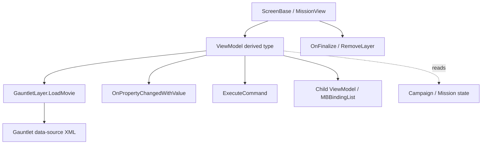

# ViewModel

**Namespace:** `TaleWorlds.Library`  
**Module:** `TaleWorlds.Library`  
**Type:** `public abstract class ViewModel : IViewModel, INotifyPropertyChanged`  
**Base:** `IViewModel`, `INotifyPropertyChanged`  
**Source:** `TaleWorlds.Library/ViewModel.cs`

## Responsibility

`ViewModel` is the Gauntlet UI data source base class. It reflects and caches public properties/methods at construction, publishes property changes to the binding layer, dispatches UI commands, and releases nested data sources when the view is finalized.

## Mental model

Treat it as a UI state adapter, not a campaign rule model. A `ScreenBase` or `MissionView` creates a concrete VM and passes it to `GauntletLayer.LoadMovie`. XML data sources read properties by `[DataSourceProperty]` name, receive new values through `OnPropertyChangedWithValue`, and invoke UI commands through `ExecuteCommand(string, object[])`. The VM does not own `Campaign.Current` state and should not perform expensive world queries in getters.

### Lifetime

1. **Create:** the screen or MissionView constructs a derived VM; the base constructor caches reflected properties and methods for that concrete type.
2. **Bind:** `GauntletLayer.LoadMovie("...", dataSource)` exposes it to XML. Names must match exactly.
3. **Update:** setters use `SetField` or `OnPropertyChangedWithValue`; a parent VM may refresh nested lists.
4. **Commands:** the UI passes a command name to `ExecuteCommand`, which reflects an `ExecuteXxx` method. The parameter array must match.
5. **Finish:** the screen/view calls `OnFinalize`, removes its layer, and clears references.

## When to use it

- **Use it** to expose screen or Mission display state, input commands, and child lists to Gauntlet; use `SetField` to avoid redundant notifications and `RefreshValues` after localization/data changes.
- **Do not use it** for persisted campaign state or direct world mutation. Put persistence in a behavior, use the relevant [Action](../../campaign-ext/actions) for state changes, and let the VM read the result.

## Dependencies



- **Creator/owner:** [ScreenBase](../../campaign-ext/ScreenBase), a `MissionView`, or a game-state screen owns the VM; there is no global `ViewModel.Current`.
- **Downstream:** [GauntletLayer](../../engine/GauntletLayer) and XML data sources bind properties and commands by name; [IViewModel](../IViewModel) is the low-level binding contract.
- **Upstream data:** a VM may read [Game](../Game) or [Campaign](../../campaign/Campaign) state, but should not own those systems.
- **Lifetime:** `OnFinalize` must pair with layer removal to release handlers, child VMs, and UI references.

## Key members

### Notifications and fields

- `SetField<T>(ref T field, T value, string propertyName)` writes and raises `OnPropertyChanged` only when the value changes.
- `OnPropertyChanged(string propertyName = null)` sends a name-only notification.
- `OnPropertyChangedWithValue<T>(T value, string propertyName = null)` plus `bool`, `int`, `float`, `uint`, `Color`, `double`, and `Vec2` overloads send the new value with the notification.
- `PropertyChanged`, `PropertyChangedWithValue`, and the typed events are consumed by the binding adapter; mods normally call the notification methods.

### Reflection binding and commands

- `GetViewModelAtPath(BindingPath path, bool isList)` / `GetViewModelAtPath(BindingPath path)` walk nested binding paths.
- `GetPropertyValue(string name)`, `GetPropertyType(string name)`, and `SetPropertyValue(string name, object value)` support name-based binding.
- `ExecuteCommand(string commandName, object[] parameters)` invokes a reflected `ExecuteXxx` UI command; names and parameter types must agree.
- `RefreshPropertyAndMethodInfos()` refreshes the global reflection cache after a new assembly is loaded; the engine calls it from `ViewSubModule.OnNewModuleLoad`.

### Refresh and finalization

- `RefreshValues()` refreshes localized text and derived display values, commonly cascading into child VMs.
- `OnFinalize()` releases child VMs, handlers, and cached references; overrides must call `base.OnFinalize()`.

## UI crash and lifetime risks

1. **Binding-name drift:** an `[DataSourceProperty("TitleText")]`, XML binding, or `OnPropertyChangedWithValue(..., "TitleText")` typo leaves stale or empty UI state.
2. **Reflection command failure:** `ExecuteCommand` is name- and array-based, so a command mismatch fails at click time rather than compile time.
3. **Wrong thread:** Gauntlet property updates and layer operations belong on the UI/game thread; do not raise notifications or tear down layers from a background task.
4. **Leaked lifetime:** removing a layer without calling VM `OnFinalize` retains child lists, event handlers, and nested VM references.
5. **Wrong domain layer:** changing diplomacy, gold, or death directly in a VM command bypasses Action/Behavior events and save boundaries. Call a domain Action/service, then refresh the display.
6. **Heavy refresh:** `RefreshValues` can recurse through many children during localization or rebuild; do not use it for world-wide scans or pathfinding.

## Real UI example

In 1.3.15, `CustomBattleVM` derives from `ViewModel`, uses `OnPropertyChangedWithValue` in property setters, and exposes `ExecuteBack`, `ExecuteStart`, and `ExecuteRandomize`. `CustomBattleScreen` constructs the VM, creates a `GauntletLayer`, loads the movie, and finalizes the VM with the screen.

```csharp
using TaleWorlds.Library;

public sealed class CounterVM : ViewModel
{
    private int _count;

    [DataSourceProperty]
    public int Count
    {
        get => _count;
        set => SetField(ref _count, value, nameof(Count));
    }

    public void ExecuteIncrement()
    {
        Count++;
    }

    public override void RefreshValues()
    {
        base.RefreshValues();
        OnPropertyChanged(nameof(Count));
    }

    public override void OnFinalize()
    {
        // Release child VMs/listeners before the base cache is finalized.
        base.OnFinalize();
    }
}
```

The acquisition path is `Screen.OnInitialize` → `new CounterVM()` → `GauntletLayer.LoadMovie("Counter", vm)`. The teardown path is `Screen.OnFinalize` → `vm.OnFinalize()` → `RemoveLayer`, matching the native Custom Battle screen and training-field MissionView.

## Navigation

- Parent: [core-extra index](./)
- Siblings: [Game](../Game) · [IViewModel](../IViewModel)
- Upstream: [ScreenBase](../../campaign-ext/ScreenBase) · [Mission](../../mission/Mission)
- Downstream: [GauntletLayer](../../engine/GauntletLayer)
- Related: [Campaign](../../campaign/Campaign) · [Action index](../../campaign-ext/actions) · [crash boundaries](../../../architecture/crash-boundaries)
