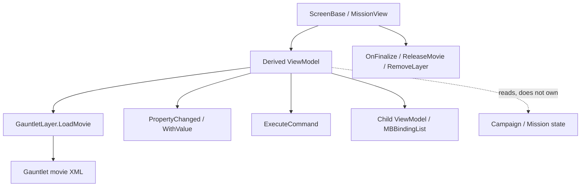

# ViewModel

**Namespace:** `TaleWorlds.Library`  
**Module:** `TaleWorlds.Library`  
**Type:** `public abstract class ViewModel : IViewModel, INotifyPropertyChanged`  
**Base:** `IViewModel`, `INotifyPropertyChanged`  
**Source:** `TaleWorlds.Library/ViewModel.cs`

## Responsibility

It exposes a screen's display state and commands to Gauntlet, while providing value-aware notifications, binding-path lookup, reflective command dispatch, and overridable refresh/finalization hooks.

## Mental model

`ViewModel` is a **UI state adapter**, not a `Campaign`, `Mission`, or save-data model. A screen or `MissionView` constructs a derived VM and passes it as the `dataSource` of [GauntletLayer](../../engine/GauntletLayer)'s `LoadMovie`; movie XML reads properties by name and invokes commands. Campaign and mission systems still own world state. The VM projects that state into the current interface.

### Lifetime

1. When a derived class is constructed, the base records its runtime type and caches public property/method binding information.
2. `LoadMovie(movieName, vm)` gives the VM to Gauntlet as its DataContext; XML names, property types, and command parameters must agree.
3. Setters use `SetField` or an explicit `OnPropertyChangedWithValue`, allowing the binding layer to update widgets.
4. UI commands arrive through the binding layer; `ExecuteCommand` finds a method by name and checks parameter count and assignability.
5. When the screen/view ends, the **owner** explicitly calls the derived VM's `OnFinalize`, unsubscribes events, and releases child VMs; it then calls `ReleaseMovie(movie)` before the GauntletLayer is finalized or removed. The base `OnFinalize` is empty, is not called automatically, and does not recursively clean children.

## When to use it

**Use it to:**

- Expose panel, HUD, or popup fields, `MBBindingList<T>` children, and button/input commands.
- Use `SetField` for ordinary setters; use `OnPropertyChangedWithValue` when the binding adapter should receive the new value directly.
- Rebuild localized text or refresh child VMs in `RefreshValues`, rather than doing world-wide work in a getter.

**Do not use it to:**

- Store long-lived persisted state. Put that state in `CampaignBehaviorBase`/the save system.
- Mutate Hero, war, or inventory fields directly from a command. Call the relevant Action/Behavior, then refresh the VM.
- Raise binding changes, manipulate a `GauntletLayer`, or call `OnFinalize` from a background thread. Return to the game/UI thread first.

## Dependencies



- Owning upstream: [ScreenBase](../../campaign-ext/ScreenBase), `MissionView`, or the relevant game state.
- Binding downstream: [GauntletLayer](../../engine/GauntletLayer) establishes the DataContext; [IViewModel](../IViewModel) is the binding contract.
- Data upstream: [Campaign](../../campaign/Campaign), [Game](../Game), or mission-domain objects. The VM should not own them.
- Domain writes: commands should normally enter the [Action index](../../campaign-ext/actions) or a Behavior, then update the display through notifications.

## Key members and timing

### Property notifications

- `SetField<T>(ref T field, T value, string propertyName)`: returns `false` for an equal value; otherwise writes the field and calls `OnPropertyChanged`. Use it in ordinary property setters.
- `OnPropertyChanged(string propertyName = null)`: sends a name-only notification.
- `OnPropertyChangedWithValue<T>` plus `bool`, `int`, `float`, `uint`, `Color`, `double`, and `Vec2` overloads: send the new value with the notification when the binding adapter needs it immediately.
- `PropertyChanged` and the typed `PropertyChangedWith*` events are consumed by the binding layer. Mods normally call the notification methods instead of maintaining those lists themselves.

### Binding and commands

- `GetViewModelAtPath(BindingPath path)`: walks nested VMs or `IMBBindingList` items; an invalid list index returns `null`.
- `GetPropertyValue`, `GetPropertyType`, and `SetPropertyValue`: support name-driven binding. A read-only property has no setter and is ignored on write.
- `ExecuteCommand(string commandName, object[] parameters)`: finds a method by name and checks its parameter count/types. It is reflective dispatch, not compile-time type safety.
- `RefreshPropertyAndMethodInfos()`: rebuilds the global reflection cache after assemblies load. The engine calls it for new modules; a mod should not call it on every UI refresh.

### Refresh and finalization

- `RefreshValues()`: empty in the base class. Derived classes use it for `TextObject`, localization, and child-VM refreshes, and let setters raise notifications.
- `OnFinalize()`: empty and not automatically called. The owner explicitly calls the derived implementation to release child VMs, event subscriptions, input keys, and timers, then calls `ReleaseMovie(movie)` before GauntletLayer finalization.

## Risks and crash boundaries

1. A mismatch between the XML binding name, public property name, and notification name leaves stale or empty UI state.
2. `ExecuteCommand` is reflective: a wrong command name, parameter count, or converted type may fail at click time or surface an exception inside the target method.
3. While a `GauntletMovie` retains its DataSource, event subscriptions can keep the VM alive after the screen disappears. Derived `OnFinalize` must unsubscribe and clean child VMs.
4. `RefreshValues` can be called recursively during resource/layout refresh. Do not put pathfinding, full-world scans, or world mutation there.
5. Mutating campaign fields directly from a binding command bypasses Actions, events, and save boundaries, leaving UI and simulation state inconsistent.
6. `ViewModel.OnFinalize` does not release child VMs automatically. Calling the base method is not a complete cleanup strategy.

## Real examples

### 1.3.15: scoreboard refresh and cleanup

`TaleWorlds.MountAndBlade.ViewModelCollection/Scoreboard/ScoreboardBaseVM.cs` overrides `RefreshValues`, refreshing hint text, `Attackers`, `Defenders`, input keys, and child VMs. Its `OnFinalize` explicitly finalizes input-key children. This is the intended contract: the base provides hooks, while each concrete VM owns its children.

`SPScoreboardSortControllerVM` exposes commands such as `ExecuteSortByRemaining` and `ExecuteSortByKill`. The commands change sorting state and raise property notifications, so XML buttons can bind to real command names without the VM becoming the owner of campaign state.

### 1.4.5: the actual Custom Battle acquisition path

`Modules.CustomBattle/.../CustomBattleVM.cs` contains the real `CustomBattleVM`. Its `[DataSourceProperty]` members such as `TitleText` and `PlayerSide` call `OnPropertyChangedWithValue` when changed, and it exposes `ExecuteBack`, `ExecuteStart`, and `ExecuteRandomize`.

Its host, `CustomBattleScreen.cs`, follows this path:

```csharp
_dataSource = new CustomBattleVM(_customBattleState);
_gauntletLayer = new GauntletLayer("CustomBattle", 1, true);
_gauntletMovie = _gauntletLayer.LoadMovie("CustomBattleScreen", _dataSource);
AddLayer(_gauntletLayer);

// In OnFinalize:
_dataSource.OnFinalize();
_gauntletLayer.ReleaseMovie(_gauntletMovie);
RemoveLayer(_gauntletLayer);
```

The important lesson is ownership: the screen creates and owns the VM, `OnFinalize` is not called automatically, and `ReleaseMovie` only unbinds the movie. Teardown must explicitly call `vm.OnFinalize()`, then `ReleaseMovie(movie)`, and only then finalize or remove the layer.

## Version note

The 1.3.15 `ViewModel.cs` and the 1.4.5 `Bannerlord.Source/bin/TaleWorlds.Library/TaleWorlds.Library/ViewModel.cs` share this core model. The Custom Battle example is from the complete 1.4.5 module source; when that module is absent from a target version, preserve the `ViewModel → LoadMovie → ScreenBase` relationship rather than assuming the module's internal types exist.

## Navigation

- Parent: [core-extra index](./)
- Siblings: [IViewModel](../IViewModel) · [Game](../Game)
- Upstream: [ScreenBase](../../campaign-ext/ScreenBase) · [Campaign](../../campaign/Campaign)
- Downstream: [GauntletLayer](../../engine/GauntletLayer)
- Related: [crash and save boundaries](../../../architecture/crash-boundaries) · [Action index](../../campaign-ext/actions)
