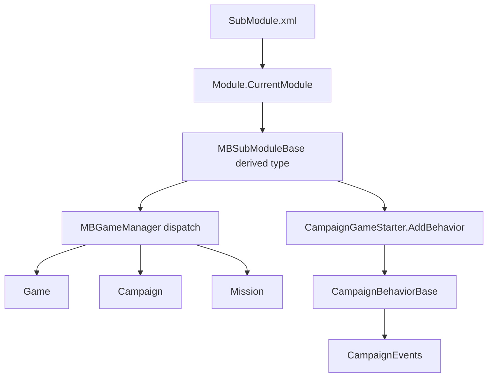

# MBSubModuleBase

**Namespace:** `TaleWorlds.MountAndBlade`  
**Module:** `TaleWorlds.MountAndBlade`  
**Type:** `public abstract class MBSubModuleBase`  
**Base:** none (top-level abstract base)  
**Source:** `TaleWorlds.MountAndBlade/MBSubModuleBase.cs`

## Responsibility

`MBSubModuleBase` is the lifecycle adapter for a SubModule: the engine creates a derived instance from the module manifest, stores it in `Module.CurrentModule`, and lets `MBGameManager` dispatch callbacks at each game phase.

## Mental model

Think of this type as a timeline of hooks, not as a container for `Hero`, `Campaign`, or `Mission` state. The instance exists while the module is loaded, but `Game.Current` and `Campaign.Current` can still be null. Use runtime objects only after the game-start/load callbacks that provide them.

In 1.3.15, `MBGameManager` enumerates `Module.CurrentModule.CollectSubModules()` from `BeginGameStart`, `OnGameStart`, `OnGameLoaded`, `OnGameEnd`, and related methods. Each derived module is therefore asked to do one phase-specific job. Long-lived state belongs in `CampaignBehaviorBase`, `GameHandler`, or another explicit owner.

### Lifecycle layers

| Phase | Good use | Do not assume |
| --- | --- | --- |
| `OnSubModuleLoad` / `OnNewModuleLoad` | Static registration, configuration, input, one-time resources | `Game.Current` or `Campaign.Current` exists |
| `InitializeGameStarter` / `OnGameStart` | Add `CampaignBehaviorBase` to `CampaignGameStarter` | Save data has already loaded |
| `OnGameLoaded` / `OnAfterGameLoaded` | Build caches from restored campaign state | New and loaded campaigns have identical state |
| `OnBeforeMissionBehaviorInitialize` / `OnMissionBehaviorInitialize` | Add a `MissionBehavior` | All Agents, Teams, and Formations exist yet |
| `OnApplicationTick` / `OnNetworkTick` | Small guarded frame/network work | A valid Mission exists every frame |
| `OnGameEnd` / `OnSubModuleUnloaded` | Release resources and unsubscribe | Destroyed objects remain usable |

## When to use it

- **Use it** to register a behavior in `OnGameStart`, rebuild non-save caches after a load, add a Mission behavior, or pair global event subscription with unsubscription.
- **Do not use it** for daily campaign rules in `OnApplicationTick`, direct writes to `Hero` or `Settlement`, or orphan behavior instances. Use [CampaignBehaviorBase](../../campaign-ext/CampaignBehaviorBase) for event-driven campaign logic and the relevant [Action](../../campaign-ext/actions) for world mutations.

## Dependencies



- **Upstream:** [Module](../Module) reads `SubModuleClassType` from `SubModule.xml`; `MBGameManager` forwards lifecycle calls.
- **Downstream:** [Game](../../core-extra/Game) provides the runtime root, [Campaign](../../campaign/Campaign) owns campaign behaviors and save state, and [Mission](../../mission/Mission) owns battle behaviors.
- **Events and save:** a behavior registered through `CampaignGameStarter.AddBehavior` reaches `RegisterEvents()` and `SyncData(IDataStore)` through `CampaignBehaviorManager`.

## Crash and save risks

1. **Early null access:** `OnSubModuleLoad` and `OnBeforeInitialModuleScreenSetAsRoot` run before game creation. Dereferencing `Campaign.Current` or `Game.Current` there can crash the main menu.
2. **Unregistered behavior:** constructing `MyBehavior` without `CampaignGameStarter.AddBehavior` means it receives neither events nor save callbacks.
3. **Load ordering:** `OnGameLoaded` is the restored-state window. Adding a save-bearing behavior only after initialization can miss the old file's behavior data.
4. **Tick work:** `OnApplicationTick(float dt)` also runs in menus. Guard `Game.Current`, avoid heavy work, and prefer events.
5. **Leaked subscriptions:** unsubscribe module-wide events in `OnSubModuleUnloaded`, otherwise hot reload can duplicate callbacks.
6. **Mission timing:** Mission initialization does not guarantee that Agents, Teams, or Formations are ready; defer those reads to the derived `MissionBehavior` callbacks.

## Key members by phase

### Module loading

- `OnSubModuleLoad()` / `OnSubModuleUnloaded()` for paired setup and cleanup.
- `RegisterSubModuleTypes()` for save/object-system type registration.
- `OnConfigChanged()` for refreshing configuration-dependent caches.
- `OnSubModuleActivated()` / `OnSubModuleDeactivated()` for enable-state changes.

### Game start and load

- `InitializeGameStarter(Game, IGameStarter)` and `OnGameStart(Game, IGameStarter)` for behavior registration. In 1.3.15 `OnGameStart` is `protected internal virtual`.
- `RegisterSubModuleObjects(bool)` / `AfterRegisterSubModuleObjects(bool)` for new-save versus loaded-save object setup.
- `BeginGameStart`, `OnCampaignStart`, `OnGameLoaded`, `OnAfterGameLoaded`, and `OnNewGameCreated` for phase-specific bridges.

### Runtime and Mission

- `OnApplicationTick(float)`, `AfterAsyncTickTick(float)`, and `OnNetworkTick(float)` for guarded frame work.
- `OnBeforeMissionBehaviorInitialize(Mission)` / `OnMissionBehaviorInitialize(Mission)` for Mission behavior injection.
- `OnGameEnd(Game)` for game-level cleanup; `DoLoading(Game)` returns whether this module continues a loading step.

## Real mod entry point

The following API names and call order are taken from the 1.3.15 `MBGameManager.cs`, `SandboxSubModule.cs`, and `CampaignGameStarter` call sites:

```csharp
using TaleWorlds.CampaignSystem;
using TaleWorlds.CampaignSystem.Actions;
using TaleWorlds.CampaignSystem.CampaignBehaviors;
using TaleWorlds.Core;
using TaleWorlds.MountAndBlade;

namespace MyMod;

public sealed class MySubModule : MBSubModuleBase
{
    protected internal override void OnGameStart(Game game, IGameStarter gameStarterObject)
    {
        if (game.GameType is Campaign && gameStarterObject is CampaignGameStarter starter)
        {
            starter.AddBehavior(new DailyGoldBehavior());
        }
    }
}

public sealed class DailyGoldBehavior : CampaignBehaviorBase
{
    private int _days;

    public override void RegisterEvents()
    {
        CampaignEvents.DailyTickEvent.AddNonSerializedListener(this, OnDailyTick);
    }

    public override void SyncData(IDataStore dataStore)
    {
        dataStore.SyncData("Days", ref _days);
    }

    private void OnDailyTick()
    {
        _days++;
        if (_days >= 7 && Hero.MainHero != null)
        {
            _days = 0;
            GiveGoldAction.ApplyBetweenCharacters(null, Hero.MainHero, 1000, true);
        }
    }
}
```

The acquisition path is `SubModule.xml` → `MBSubModuleBase.OnGameStart` → `CampaignGameStarter.AddBehavior` → `CampaignEvents`; it is not a constructor-time lookup of `Campaign.Current`. The state mutation contract for `GiveGoldAction` is documented in the [Action index](../../campaign-ext/actions).

## Navigation

- Parent: [core index](./)
- Siblings: [Game](../../core-extra/Game) · [MBObjectBase](../../campaign-ext/MBObjectBase)
- Children/downstream: [Campaign](../../campaign/Campaign) · [CampaignBehaviorBase](../../campaign-ext/CampaignBehaviorBase) · [Mission](../../mission/Mission)
- Related: [SaveManager](../../save-system/SaveManager) · [documentation contract](../../../architecture/doc-contract) · [crash boundaries](../../../architecture/crash-boundaries)
