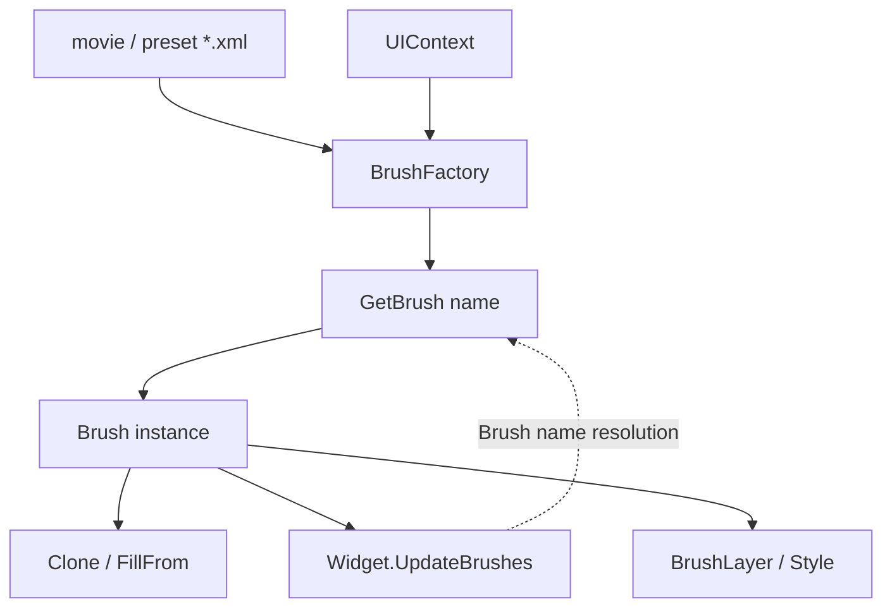

# Brush

**Namespace:** `TaleWorlds.GauntletUI`  
**Module:** `TaleWorlds.GauntletUI`  
**Type:** `public class Brush`  
**Base:** none (directly extends `System.Object`)  
**Source:** `TaleWorlds.GauntletUI/Brush.cs`

## Responsibilities in one line

A `Brush` is a **named visual recipe**: it packages sprites, colors, fonts, alignment, layers (`BrushLayer`) and styles (`Style`) into a single appearance definition that any widget can reference by name; when a mod wants a different look it must `Clone` or `FillFrom` a copy before editing, rather than mutating the shared instance.

## Mental Model

Think of a `Brush` as the **material / skin** of the UI, not as a control itself. It appears in the movie XML by name (`<Widget Brush="Frame9">`); at runtime the hosting `UIContext` resolves it through its `BrushFactory` into a `Brush` instance by name; the widget reads its sprites and colors during layout/refresh (`UpdateBrushes`) to draw itself. A single `Brush` can be shared by many widgets, so it should itself be a **read-only template** — any "per-instance customization" has to start with a `Clone`.

### Composition and structure

- A `Brush` holds several `Style` entries, indexed by state name such as `"Default"`, `"Pressed"`, `"Disabled"`; each `Style` describes font/color/alignment and so on.
- It also holds several `BrushLayer` entries (stacked layers, each optionally carrying a sprite, color, offset and animation), managed through `AddLayer` / `GetLayer`.
- `DefaultStyle` / `DefaultStyleLayer` are the conventional "base appearance" entry points; convenience properties such as `Sprite`, `Color`, `FontSize` mostly forward to the default layer.

### Lifecycle

1. At engine startup the `BrushFactory` scans the `*.xml` preset files and resolves every named brush into a `Brush`; the `BaseBrush` / `OverrideBrush` relationship is merged during load.
2. A widget declares `Brush="Name"`; at runtime `UIContext.BrushFactory.GetBrush("Name")` retrieves the instance (served from a cache).
3. When customization is needed: `GetBrush` → `Clone()` (`ClonedFrom` points back to the original brush) → mutate the copy's fields → hand the copy to the widget.
4. Transitions (`TransitionDuration`, default `0.05`s) are interpolated by the runtime when values change; you do not drive them by hand.

## When to use

- Reference a shared look uniformly in movie XML with `Brush="..."`.
- Produce a runtime variant from an existing brush: `Brush v = ctx.BrushFactory.GetBrush("Frame9").Clone(); v.Color = ...;`.
- Use `FillFrom(other)` to overlay the non-null fields of another brush — handy for a "theme overlay".

## When NOT to use

- Do not grab a shared brush and mutate its `Color` / `Sprite` directly: every widget that references it changes, and the next `GetBrush` still returns the mutated instance (it is cached).
- Do not try to establish a `BaseBrush` / `OverrideBrush` link by any means other than `Clone`: those two roles are mutually exclusive during load (the engine raises a `FailedAssert`), so do not attempt to recreate that relationship at runtime.
- Do not mutate brush fields from a background thread; drawing and transitions happen on the UI thread.

## Dependencies



- Upstream factory: the `UIContext` (provided by the host layer, see [GauntletLayer](../../engine/GauntletLayer)) owns the `BrushFactory`; the XML presets are the source of every brush.
- Downstream consumer: widgets in the [gui](..) bucket consume a brush through `UpdateBrushes` to draw; the screen/layer stack managed by [ScreenManager](../ScreenManager) supplies the `UIContext`.
- Sibling visual resource: brushes and [Material](../Material) are the two texture/paint level resources Gauntlet draws with; a brush references sprites that a material underlies.
- Data-binding view: a brush is pure appearance and holds no campaign/mission state. To switch a look based on world state, compute it in your [ViewModel](../../core-extra/ViewModel) and then edit a brush copy — never attach logic to the brush itself.
- Crash surface: see the "UI thread / lifecycle" section of [Crash & Save Boundaries](../../../architecture/crash-boundaries).

## Key members and when they are called

### Acquiring and copying

- `BrushFactory.GetBrush(string name)` — fetch a brush by name (cached). A misspelled name yields `null` or a placeholder brush and the UI silently loses its image.
- `Brush Clone()` — returns a fresh instance whose `ClonedFrom` points at the original brush; **the correct starting point for any customization**.
- `void FillFrom(Brush brush)` — overlays the non-null fields of `brush` into this one (used for theme stacking).
- `bool IsCloneRelated(Brush other)` — tells whether both brushes sit on the same clone chain.

### Layers and styles

- `Style GetStyle(string name)` / `Style GetStyleOrDefault(string name)` — fetch a named style; the default style is usually `"Default"`.
- `void AddStyle(Style style)` / `void RemoveStyle(string name)` — add/remove a style at runtime (rare; prefer XML declaration).
- `void AddLayer(BrushLayer layer)` / `void RemoveLayer(string name)` — add/remove a stacked layer.
- `void AddAnimation(BrushAnimation animation)` — attach a brush-level animation (`GetAnimation(name)` / `GetAnimations()` read them back).

### Convenience appearance properties (forwarded to the default layer)

- `Sprite Sprite`, `Color Color`, `Font Font`, `int FontSize`, `FontStyle FontStyle`, `TextHorizontalAlignment` / `TextVerticalAlignment`.
- `GlobalColorFactor` / `GlobalAlphaFactor` / `GlobalColor`: whole-brush multiply color and alpha, commonly used for greying-out or highlighting.
- `float TransitionDuration` — transition length (seconds) when values change, default `0.05`.

## Risk and crash boundaries

1. **Shared instance mutated**: editing the brush returned by `GetBrush` changes every widget that references it, and the cache makes it "permanent". Always `Clone` first.
2. **Misspelled name**: `GetBrush` fails or returns a placeholder brush; the UI loses its image with no exception, which is hard to diagnose.
3. **`BaseBrush` / `OverrideBrush` conflict**: those two roles are mutually exclusive at load time; do not recreate the relationship at runtime, or you trigger a `FailedAssert` and may corrupt that brush's resolution.
4. **Transitions and threads**: `TransitionDuration` is interpolated on the UI thread; changing color/sprite from a background thread will not reflect immediately and can race.
5. **`FillFrom` semantics**: it only overlays "non-null fields". If the source brush happens to have a default/empty value, the target field is not cleared — it is not a deep copy.

## Real examples

### Referencing a brush by name in movie XML (most common)

```xml
<Widget Brush="Frame9" WidthSizePolicy="CoverChildren" HeightSizePolicy="CoverChildren">
  <Children>
    <TextWidget Brush="Frame9.Text" Text="@YourVM.SomeText" />
  </Children>
</Widget>
```

### Producing a runtime variant from an existing brush (real API)

```csharp
// Grab the brush factory from the hosting UIContext (a widget carries its own Context)
UIContext ctx = someWidget.Context;
Brush baseBrush = ctx.BrushFactory.GetBrush("Frame9");   // shared template, do NOT mutate directly
Brush danger = baseBrush.Clone();                        // copy whose ClonedFrom -> baseBrush
danger.Color = new Color(1f, 0.2f, 0.2f, 1f);
danger.FontSize = 22;
danger.GlobalAlphaFactor = 0.9f;

// Hand the variant to the widget that needs it; never mutate baseBrush itself
someWidget.ApplyBrushVariant(danger);   // each module exposes its own entry point; the core rule is: use the copy, not the original instance
```

`BrushFactory.GetBrush`, `Brush.Clone` and `Brush.FillFrom` all come from `TaleWorlds.GauntletUI/Brush.cs` and `BrushFactory.cs`; the widget consumes the brush during its `UpdateBrushes` phase.

## Version notes

The `Brush` core model is the same across 1.3.15 and 1.4.5 (`Clone` / `FillFrom` / `GetStyle` / `AddLayer` all exist). The 1.4.5 source is the complete module; if the target version lacks a particular module, still wire in through the `UIContext.BrushFactory.GetBrush → Clone → mutate the copy` relationship rather than assuming some module's custom brush entry point exists.

## See Also

- ↑ Parent: [gui directory](../)
- ↔ Siblings: [ScreenManager](../ScreenManager) · [Material](../Material)
- Upstream: [GauntletLayer](../../engine/GauntletLayer)
- Related: [ViewModel](../../core-extra/ViewModel) · [Crash & Save Boundaries](../../../architecture/crash-boundaries)
