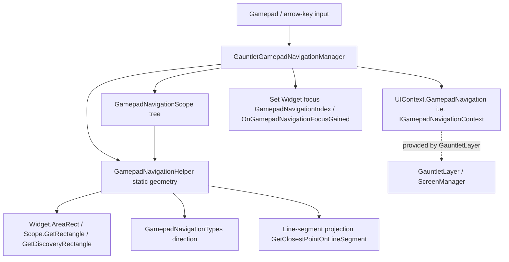

# GamepadNavigationHelper

**Namespace:** `TaleWorlds.GauntletUI.GamepadNavigation`  
**Module:** `TaleWorlds.GauntletUI`  
**Type:** `internal static class GamepadNavigationHelper`  
**Base:** None (inherits directly from `System.Object`; a `static` class cannot be inherited or instantiated)  
**Source:** `TaleWorlds.GauntletUI/TaleWorlds.GauntletUI.GamepadNavigation/GamepadNavigationHelper.cs`

## One-line responsibility

`GamepadNavigationHelper` is the **pure geometry engine behind gamepad / arrow-key focus navigation**: it knows nothing about UI state and only computes, from a coordinate, a `GamepadNavigationTypes` direction, and the rectangles of some `Widget`s / `GamepadNavigationScope`s, *"in which direction is the nearest focusable target"* — directional line segments, closest-edge distances, nearest scope, and so on. The real navigation state machine (who owns focus, the current active scope) lives in `GauntletGamepadNavigationManager` and `GamepadNavigationScope`; this class only supplies the math those call repeatedly.

## Overview

`GamepadNavigationHelper` is a stateless, side-effect-free collection of `internal static` helpers that turns rectangles into navigation decisions. It does not track focus, does not hold an active scope, and does not trigger any widget callbacks. Given a set of rectangles — a widget's `AreaRect` and a scope's `GetRectangle()` / `GetDiscoveryRectangle()` — together with a movement direction (`Up` / `Down` / `Left` / `Right`), it answers "which edge, widget, or scope is closest in that direction, and at what distance." Because it is `internal static`, mod assemblies cannot (and should not) call it: it is invoked only inside the `TaleWorlds.GauntletUI` assembly by the navigation manager and the scope logic. When a mod wants to add gamepad support to custom UI, it works against the higher-level `Widget` navigation properties and `GamepadNavigationScope`, never against this class.

## Mental Model

Think of `GamepadNavigationHelper` as the navigation system's **ruler and protractor**: the inputs are rectangles (the widget `AreaRect`, the scope `GetRectangle()` / `GetDiscoveryRectangle()`) and a direction (`Up` / `Down` / `Left` / `Right`); the output is "the nearest edge / widget / scope in that direction, and the distance." It **has no state and no side effects** (the only exception being that an illegal direction triggers `Debug.FailedAssert`), and every conclusion is determined entirely by the arguments. Because it is `internal static`, **mod code cannot and should not call it directly** — it is only invoked from inside the game assembly by `GauntletGamepadNavigationManager` and the `GamepadNavigationScope`-related logic. When a mod adds gamepad support to custom UI, it touches the higher-level `Widget` navigation properties and `GamepadNavigationScope`, not this class.

### A coordinate-system detail (prerequisite for understanding the algorithm)

In Gauntlet's 2D coordinate system the **Y axis points down**: `TopLeft` has the smaller Y, `BottomLeft` has the larger Y; for a `SimpleRectangle`, `Y` is the top edge and `Y2` is the bottom edge. Therefore:

- `GetMovementVectorForNavigation` maps `Up` to `Y = -1`, `Down` to `Y = +1`, `Left` to `X = -1`, `Right` to `X = +1`.
- The "related line segment" takes the matching edge of the rectangle by direction: `Up` uses the bottom edge (`BottomLeft` → `BottomRight`), `Down` the top edge (`TopLeft` → `TopRight`), `Left` the right edge, `Right` the left edge.

### Lifecycle

1. This class is `static`, so there is **no instantiation / initialization flow**; it becomes available as the `TaleWorlds.GauntletUI` assembly loads.
2. When the player pushes the left stick or presses a directional key, `GauntletGamepadNavigationManager` (held by `UIContext.GamepadNavigation`, typed as `IGamepadNavigationContext`) receives the directional input and determines the current active `GamepadNavigationScope` and the "departure coordinate" (usually the center of the focused widget, or the edge of a scope).
3. When the manager searches the scope tree (`ChildScopes` / `ParentScope`) for a target in a neighboring direction, it calls this class's `GetClosestScopeAtDirectionFromList` / `GetClosestChildScopeAtDirection`, handing it the candidate scope list, the departure coordinate, and the direction.
4. When picking a concrete widget *inside* a single scope, the manager uses `GetRelatedLineOfWidget` / `GetDistanceToClosestWidgetEdge` / `GetClosestPointOnLineSegment` to compare the `AreaRect` of each `NavigatableWidget`, selecting the one whose projection is nearest and direction-aligned (dot product > 0.2).
5. Once a result is chosen, focus is handed back to the higher-level state machine to set the widget's `GamepadNavigationIndex` / raise `OnGamepadNavigationFocusGained`; this class does not participate in that step and holds no selection result.

## When to use

**Use (here "use" means understanding where it sits in the system):**

- When debugging "focus jumps to the wrong control" in custom UI gamepad navigation, understand that the selection is made by rectangle projection + direction alignment, so you can lay out scopes and widgets correctly.
- When reading the source of `GauntletGamepadNavigationManager` or `GamepadNavigationScope`, treat this class as a known pure function and do not dig into its internals.

**Do NOT use it like this:**

- **Do not** call `GamepadNavigationHelper.*` from your mod assembly: it is `internal static` and invisible across assemblies, and even if visible it bypasses the navigation state machine (focus, active scope, auto-gain); calling it directly yields only geometry, not navigation behavior.
- **Do not** copy its algorithm to "roll your own navigation" and move focus manually; the correct approach is to use `Widget` navigation properties and `GamepadNavigationScope` (including explicit links like `Up` / `Down` / `Left` / `Right` navigation scopes) and let the engine manage it.
- **Do not** assume it performs visibility / availability filtering; visibility is decided upstream by `GamepadNavigationScope.IsAvailable()`, `DoNotAutoGainNavigationOnInit`, etc. This class only does geometry and never decides "can this scope be entered."

## Dependencies



- Upstream state machine: the "owner / active scope / focus" of navigation lives in `GauntletGamepadNavigationManager` and `GamepadNavigationScope`; it is held by `UIContext.GamepadNavigation` (provided by [GauntletLayer](../../engine/GauntletLayer)), within the screen/layer lifecycle described on [ScreenManager](../ScreenManager).
- Geometry raw material: this class only consumes `Widget.AreaRect` (the widget's visible rectangle) and the `GetRectangle()` / `GetDiscoveryRectangle()` of `GamepadNavigationScope` — see [Widget](../Widget) and the sibling [GamepadNavigationScopeCollection](../GamepadNavigationScopeCollection).
- Direction type: `GamepadNavigationTypes` is a `System.Flags` enum (`Up` / `Down` / `Left` / `Right` / `Horizontal` / `Vertical` / `None`) that decides how line segments and direction vectors are taken.
- Data side: focus ultimately lands on a widget, but navigation holds no campaign / mission state; when focusable items must change with world state, control visibility / add-remove in the [ViewModel](../../core-extra/ViewModel) rather than interfering with geometry.
- Crash surface: see the "UI thread / lifecycle" section of [Crash & Save Boundaries](../../architecture/crash-boundaries) — navigation happens on the UI thread, and mutating rectangles or scopes from another thread races.

## Risk

1. **`internal static` is not callable**: a mod assembly cannot see this class; any attempt to "compute navigation directly" should go through the `Widget` / `GamepadNavigationScope` API instead, otherwise it fails to compile or (via reflection) bypasses the focus state machine and causes erratic behavior.
2. **Geometry only, no semantic filtering**: this class does not check whether a scope is visible / available, nor whether a widget is inside `NavigatableWidgets`; those semantic filters happen upstream. Treating it as "the source of navigation truth" ignores visibility / availability boundaries.
3. **Illegal `movement` triggers an assert**: `GetDirectionalDistanceBetweenTwoPoints` receiving a non-single horizontal / vertical direction (e.g. `None` or a combined `Flags` value) calls `Debug.FailedAssert` and returns 0, which can silently zero out a distance and select the wrong target.
4. **Coordinate-system direction**: the Y axis points down, and the vectors `Up = -1` / `Down = +1` are the reverse of common math intuition; reusing the algorithm with the wrong sign reverses direction selection entirely.
5. **`out` parameters and rectangle dependency**: most methods rely on `scope.GetRectangle()` / `GetDiscoveryRectangle()` and `widget.AreaRect` already being ready. Calling them before a widget has been measured (size 0 or position unset) yields meaningless segments / distances — though this never happens in a normal mod flow, because this class is only called internally, on the UI thread, after layout completes during the navigation phase.
6. **UI thread constraint**: navigation (including these geometry methods) happens on the UI thread; any attempt to read / change widget rectangles or the scope tree from a background thread to influence navigation will race or silently do nothing.

## Key Members & When Called

### Directional line segments (used to project a "point" onto a scope / widget's relevant edge)

- `void GetRelatedLineOfScope(GamepadNavigationScope scope, Vector2 fromPosition, GamepadNavigationTypes movement, out Vector2 lineBegin, out Vector2 lineEnd, out bool isFromWidget)`: if `fromPosition` falls inside `scope.GetDiscoveryRectangle()` and there is a closest widget, then `lineBegin` / `lineEnd` take that widget's relevant edge and `isFromWidget = true`; otherwise it takes the discovery rectangle's relevant edge by direction (e.g. `Up` → bottom edge). Feeds the later `GetClosestPointOnLineSegment` projection.
- `void GetRelatedLineOfWidget(Widget widget, GamepadNavigationTypes movement, out Vector2 lineBegin, out Vector2 lineEnd)`: takes the edge of a single widget's `AreaRect` in the given direction (`Up` → bottom edge, `Down` → top edge, `Left` → right edge, `Right` → left edge).

### Distance measurement (picking "nearest and directionally correct" target)

- `float GetDistanceToClosestWidgetEdge(Widget widget, Vector2 point, GamepadNavigationTypes movement, out Vector2 closestPointOnEdge)` and its overload without `out`: returns the distance from `point` to the widget's nearest edge in the movement direction, and supplies the closest projected point on that edge via `out`. This is the core metric for selecting a widget inside a scope.
- `Vector2 GetClosestPointOnLineSegment(Vector2 lineBegin, Vector2 lineEnd, Vector2 point)`: projects a point onto a line segment, clamped between `[lineBegin, lineEnd]` (returns the nearest endpoint if outside). Pure math, no side effects.
- `GamepadNavigationTypes GetMovementsToReachRectangle(Vector2 fromPosition, SimpleRectangle rect)`: compares the point with the rectangle bounds and returns the `Flags` combination of "which directions are needed to reach this rectangle" (`X` left of it → `Left`, right → `Right`; `Y` above → `Up`, below → `Down`).
- `Vector2 GetMovementVectorForNavigation(GamepadNavigationTypes navigationMovement)`: converts a single direction to a unit vector (`Left = (-1, 0)`, `Right = (1, 0)`, `Up = (0, -1)`, `Down = (0, 1)`), used for direction-alignment (dot product) comparison.
- `float GetDirectionalDistanceBetweenTwoPoints(GamepadNavigationTypes movement, Vector2 p1, Vector2 p2)`: horizontal directions take `|p1.X - p2.X|`, vertical directions take `|p1.Y - p2.Y|`; **an illegal direction (non-single horizontal / vertical) triggers `Debug.FailedAssert` and returns 0**.

### Scope selection (finding the next target in the scope tree)

- `GamepadNavigationScope GetClosestChildScopeAtDirection(GamepadNavigationScope parentScope, Vector2 fromPosition, GamepadNavigationTypes movement, bool checkForAutoGain, out float distanceToScope)`: finds the nearest child scope in the given direction among `parentScope.ChildScopes`.
- `GamepadNavigationScope GetClosestScopeAtDirectionFromList(List<GamepadNavigationScope> scopesList, GamepadNavigationScope fromScope, Vector2 fromPosition, GamepadNavigationTypes movement, bool checkForAutoGain, out float distanceToScope)`: using `fromScope` as the departure (pulling `fromPosition` to the scope edge or the previous focused widget's center when needed), selects a scope by direction in the candidate list; skips items that are `DoNotAutoGainNavigationOnInit` or `!IsAvailable()`.
- `GamepadNavigationScope GetClosestScopeAtDirectionFromList(List<GamepadNavigationScope> scopesList, Vector2 fromPosition, GamepadNavigationTypes movement, bool checkForAutoGain, bool checkOnlyOneDirection, out float distanceToScope, params GamepadNavigationScope[] scopesToIgnore)`: the `fromScope`-less form above, supporting scopes to ignore (and their `ParentScope`). When `checkOnlyOneDirection` is true it uses `GetDirectionalDistanceBetweenTwoPoints` instead of projected distance, and caps the search radius at `0.85 * Input.Resolution`.
- `GamepadNavigationScope GetClosestScopeFromList(List<GamepadNavigationScope> scopeList, Vector2 fromPosition, bool checkForAutoGain)`: with no direction constraint, picks from all candidates the scope that "contains the point" or the "nearest projection with alignment > 0.2"; returns `null` when the list is empty or nothing matches.

## Real Examples

### 1.4.5: understanding "why focus jumped to that control" — reading the real geometry

The following excerpt from `GamepadNavigationHelper.GetClosestScopeFromList` (source lines 228–277) shows the real criterion for choosing the nearest scope: for each candidate scope it first takes its related segment via `GetRelatedLineOfScope(...)`, then `GetClosestPointOnLineSegment` to find the projection, and uses the direction vector from `GetMovementVectorForNavigation` dotted with the projection direction as `num3`; only when `num3 > 0.2f` (roughly aligned) does it count toward "nearest" by `distance / num3`:

```csharp
// Real source fragment (excerpt, not a placeholder)
GamepadNavigationTypes movementsToReachMyPosition = scopeList[i].GetMovementsToReachMyPosition(fromPosition);
foreach (GamepadNavigationTypes gamepadNavigationTypes in array)
{
    if (movementsToReachMyPosition.HasAnyFlag(gamepadNavigationTypes))
    {
        Vector2 movementVectorForNavigation = GetMovementVectorForNavigation(gamepadNavigationTypes);
        GetRelatedLineOfScope(scopeList[i], fromPosition, gamepadNavigationTypes, out var lineBegin, out var lineEnd, out var isFromWidget);
        Vector2 closestPointOnLineSegment = GetClosestPointOnLineSegment(lineBegin, lineEnd, fromPosition);
        Vector2 value = Vector2.Normalize(closestPointOnLineSegment - fromPosition);
        float num3 = (isFromWidget ? 1f : Vector2.Dot(movementVectorForNavigation, value));
        float num4 = Vector2.Distance(closestPointOnLineSegment, fromPosition) / num3;
        if (num3 > 0.2f && num4 < num) { num = num4; num2 = i; }
    }
}
return (num2 != -1) ? scopeList[num2] : null;
```

A mod does not need to re-implement it; but when a custom UI's scope rectangles overlap, or widget layout is ambiguous, it is exactly this "nearest projection + direction alignment > 0.2" criterion that decides where focus lands.

### 1.4.5: the path a mod should actually take to "add gamepad support to custom UI"

`GamepadNavigationHelper` is not callable; a mod should plug in through the widget's navigation properties and `GamepadNavigationScope`. A real reachable acquisition chain is:

```csharp
// After obtaining the UIContext from a Gauntlet screen / view
UIContext ctx = gauntletLayer.GetUIContext();          // or widget.Context
IGamepadNavigationContext nav = ctx.GamepadNavigation; // UIContext.GamepadNavigation, typed IGamepadNavigationContext

// Get the navigation context of a widget (Widget.GamepadNavigationContext is Context.GamepadNavigation)
Widget item = rootWidget.FindChild("ListItem_0");
IGamepadNavigationContext itemNav = item.GamepadNavigationContext;

// When this widget gains gamepad focus, the engine callbacks;
// to listen for focus, subscribe to the widget's event rather than calling Helper:
item.OnGamepadNavigationFocusGained += (w) => { /* highlight, sfx, etc. — real callback */ };
```

`Context.GamepadNavigation`, `Widget.GamepadNavigationContext`, `OnGamepadNavigationFocusGained`, and `GamepadNavigationIndex` all come from `UIContext.cs` and `Widget.cs` in `TaleWorlds.GauntletUI`; the real geometry lives entirely inside `GamepadNavigationHelper` (internal) and is called by the manager — mods neither need nor should touch it.

## Version Notes

In both 1.3.15 and 1.4.5, `GamepadNavigationHelper` is `internal static`, located in `TaleWorlds.GauntletUI.GamepadNavigation`, and its member set (`GetRelatedLineOfScope` / `GetClosestScopeAtDirectionFromList` / `GetDistanceToClosestWidgetEdge` / `GetMovementVectorForNavigation`, etc.) is consistent. Its dependencies — `GamepadNavigationScope` (`public class`), `GamepadNavigationTypes` (`Flags` enum), and `IGamepadNavigationContext` — are equally stable. The public entry points a mod uses to plug into gamepad navigation (`Widget.GamepadNavigationContext`, `UIContext.GamepadNavigation`, `OnGamepadNavigationFocusGained`) are identical across both versions; even if a target version lacks some specific module source, plug in via the `UIContext.GamepadNavigation → GamepadNavigationScope → Widget focus` relationship rather than assuming `GamepadNavigationHelper` is directly callable.

## See Also

- ↑ Parent: [gui index](../)
- ↔ Siblings: [Brush](../Brush) · [Widget](../Widget) · [ScreenManager](../ScreenManager) · [Material](../Material) · [GamepadNavigationScopeCollection](../GamepadNavigationScopeCollection)
- Upstream: [GauntletLayer](../../engine/GauntletLayer)
- Downstream: navigation ultimately acts on [Widget](../Widget) focus (`GamepadNavigationIndex` / `OnGamepadNavigationFocusGained`)
- Related: [ViewModel](../../core-extra/ViewModel) · [Crash & Save Boundaries](../../architecture/crash-boundaries)
