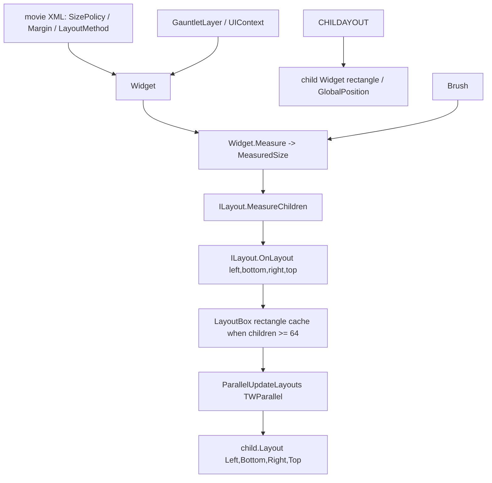

# LayoutBox

**Namespace:** `TaleWorlds.GauntletUI.Layout`  
**Module:** `TaleWorlds.GauntletUI`  
**Type:** `internal struct LayoutBox`  
**Base:** none (implicitly `System.ValueType`)  
**Source:** `TaleWorlds.GauntletUI/TaleWorlds.GauntletUI.Layout/LayoutBox.cs`

## Responsibility

`LayoutBox` is an **internal coordinate ticket** that marks where a given child control is allotted to sit in the current layout pass: it holds only four `float` values (left, right, top, bottom), is written by the layout implementation (`StackLayout`, etc.) during the `OnLayout` phase, and is then handed back to the child through `Widget.Layout(left, bottom, right, top)`. It performs no measurement, holds no state, and is not a public type a mod can `new` directly.

## Overview

`LayoutBox` is a passive, short-lived value type used by the Gauntlet layout engine to carry a single child widget's final rectangle through the arrange phase. It is not itself a "layout element" — the real layout elements are `Widget` and the `ILayout` implementations such as `StackLayout`, `DefaultLayout`, and `GridLayout`. During a layout pass, `Widget.Measure` walks the tree bottom-up to compute each control's desired size (`MeasuredSize`); then `ILayout.OnLayout` walks top-down and, for every child, computes the rectangle that child should occupy. That rectangle is what `LayoutBox` stores. Finally the layout implementation calls `child.Layout(box.Left, box.Bottom, box.Right, box.Top)` to commit the rectangle to the child. Because `LayoutBox` is `internal`, mod assemblies cannot reference it by name, and because it is a mutable `struct` the engine copies it by value rather than sharing a single instance.

## Mental Model

Think of `LayoutBox` as a **layout pass (a rectangular ticket)**, not as "the layout element" itself. The actual layout element is `Widget` plus the `ILayout` implementations (`StackLayout`, `DefaultLayout`, `GridLayout`): `Widget.Measure` computes `MeasuredSize` bottom-up, `ILayout.OnLayout` computes each child's allotted rectangle top-down as a `LayoutBox`, and finally `child.Layout(box.Left, box.Bottom, box.Right, box.Top)` lands the rectangle. When a container has many children (≥ 64), `StackLayout` does not call `child.Layout` one by one inside the loop; instead it wraps each rectangle into a `LayoutBox { Left, Right, Bottom, Top }` and stores it in the `Dictionary<int, LayoutBox> _layoutBoxes`, then commits them all together in a parallel pass via `TWParallel.ForWithoutRenderThread`. `LayoutBox` is exactly that **deferred-commit scratch carrier**.

It relates to [`Widget`](../campaign-ext/Widget) as "the tree node" relates to "the rectangle allotted to that node"; it relates to [`Brush`](../campaign-ext/Brush) as "how big the control draws" relates to "where its rectangle is placed": the brush decides how large a control paints and how much the sprite occupies, while margin and alignment decide which corner of the rectangle it lands in, and `LayoutBox` is merely the computed landing point. `LayoutBox` is entirely passive: it has no methods, no logic, and cannot be referenced directly by a mod (`internal`); its job ends the moment the `Layout` call returns.

### Lifecycle

1. When a container at some level of the tree needs to arrange its children, the layout system calls `ILayout.MeasureChildren(widget, measureSpec, spriteData, renderScale)`, which first makes each visible child `Measure` produce its `MeasuredSize` (including margin).
2. It then calls `ILayout.OnLayout(widget, left, bottom, right, top)` to enter the allotment phase. `StackLayout` accumulates child sizes along the main axis according to `LayoutMethod` (horizontal/vertical, centered/spaced, …) and computes each child's landing point.
3. If `widget.ChildCount < 64`: `StackLayout` calls `child.Layout(num, bottom2, num2, top2)` directly and never constructs a `LayoutBox`.
4. If `widget.ChildCount >= 64`: to avoid repeated calls inside the parallel loop, it wraps each rectangle as `LayoutBox { Left, Right, Bottom, Top }` and stores it in the `_layoutBoxes` dictionary, then calls `child.Layout(layoutBox.Left, layoutBox.Bottom, layoutBox.Right, layoutBox.Top)` in parallel inside `ParallelUpdateLayouts`.
5. Every `OnLayout` begins by `_layoutBoxes.Clear()`; once a rectangle is consumed by `child.Layout` it is no longer referenced, and the next frame recomputes it. `LayoutBox` is therefore a **per-frame, rebuilt short-lived value type**, not cross-frame state.

## When to use

- **Diagnosing why a control is not where you expect:** inspect its `WidthSizePolicy` / `HeightSizePolicy`, `Margin*`, the container's `LayoutMethod`, and its alignment — those are the real source of each `LayoutBox` rectangle.
- **Optimizing layout cost for very long lists (hundreds or thousands of children):** understanding that ≥ 64 children take the parallel `LayoutBox` batching path helps explain why "layout behavior differs slightly when there are many children".
- **Retriggering layout** by changing child visibility / count through a [`ViewModel`](../core-extra/ViewModel), so that fresh `LayoutBox` rectangles are computed naturally.

## When NOT to use

- Do **not** try to `new LayoutBox { ... }` and expect it to drive the UI: it is an `internal struct` invisible to mod assemblies, and the layout system only honors rectangles it computed itself — externally written values are ignored.
- Do **not** cache a `LayoutBox` across frames as a "position truth" in mod code: it is recomputed every frame and only valid within the same frame on the parallel path. For a control's position, read the public runtime properties `Widget.GlobalPosition` / `Widget.Size` instead of re-implementing the internal rectangle.
- Do **not** treat `LayoutBox` as the "layout algorithm": the algorithm lives in the `ILayout` implementations (`StackLayout` / `GridLayout` / `DefaultLayout`); `LayoutBox` is only the data they emit.

## Dependencies



- Upstream host: [`GauntletLayer`](../engine/GauntletLayer) provides the `UIContext` and triggers per-frame layout; [`ScreenManager`](ScreenManager) manages the screens hosting the layer.
- Rectangle source: [`Widget`](../campaign-ext/Widget)'s `Measure` / `MeasuredSize` / `Margin*` / `WidthSizePolicy` / `HeightSizePolicy` directly decide every `LayoutBox` coordinate.
- Appearance influence: [`Brush`](../campaign-ext/Brush) decides how large a control draws and how much its sprite occupies, feeding indirectly into the `Measure` result.
- Material layer: [`Material`](Material) backs the rendered appearance that measurement and layout ultimately place on screen.
- Data side: [`ViewModel`](../core-extra/ViewModel) changes child visibility / count, which changes how many `LayoutBox` rectangles this layout produces.
- Crash surface: with ≥ 64 children the layout commits off the render thread in parallel — see the "UI thread / parallel layout" section of [Crash & Save Boundaries](../../architecture/crash-boundaries).

## Key members and call timing

`LayoutBox` is a pure-data value type with no methods — only four public fields. Its "members and call timing" should be read as **who writes it and who reads it**:

### The four rectangle fields (written by `StackLayout` and other `ILayout` implementations)

- `public float Left` / `public float Right`: the horizontal left/right boundaries of the child's rectangle (pixel values in world/parent coordinates; the `Context.CustomScale` scaling semantics are handled by the caller).
- `public float Top` / `public float Bottom`: the vertical top/bottom boundaries. Note the field declaration order is `Left, Right, Top, Bottom`, but they are consumed in the order `Layout(left, bottom, right, top)` — i.e. `Bottom` is passed before `Right`, so the engine code is typically `child.Layout(layoutBox.Left, layoutBox.Bottom, layoutBox.Right, layoutBox.Top)`.
- All four fields are `public` mutable fields (not properties); the layout implementation assigns them directly. Being a `struct`, every assignment is a value copy, so there is no cross-instance aliasing.

### Producer: the two paths inside `StackLayout`

- `Dictionary<int, LayoutBox> _layoutBoxes` (capacity 64): when `widget.ChildCount >= 64`, `LayoutLinearHorizontal` / `LayoutLinearVertical` store each child's rectangle as `new LayoutBox { Left, Right, Bottom, Top }` in this dictionary; invisible children are stored as `default(LayoutBox)`.
- `void ParallelUpdateLayouts(Widget widget)`: inside `TWParallel.ForWithoutRenderThread` it iterates `_layoutBoxes` and, for each visible child, calls `child.Layout(layoutBox.Left, layoutBox.Bottom, layoutBox.Right, layoutBox.Top)`. This is the only moment a `LayoutBox` is "read".
- Only after `child.Layout(...)` does the child own its final rectangle, and `Widget.GlobalPosition` / `Widget.Size` update accordingly — mods should read position in a post-layout stage (such as `UpdateBrushes` or an event callback), not assume position is fixed during `Measure`.

### When it is called

- Every frame, whenever a control tree is re-laid-out due to size policy / visibility / data changes, the system re-runs `MeasureChildren → OnLayout → (possibly via LayoutBox) child.Layout`.
- Crossing the 64-child threshold switches the layout between "direct `Layout`" and the "`LayoutBox` dictionary + parallel commit" implementation — the behavior is identical, but the call stack and thread differ, which matters when debugging multithreaded layout issues.

## Risk and crash boundaries

1. **`internal` and invisible:** a mod cannot `new` or reference `LayoutBox`; any attempt to "manually position" a control should instead set the `Widget`'s `SizePolicy` / `Margin` / alignment, or read `Widget.GlobalPosition` / `Widget.Size`, rather than re-implementing the internal rectangle.
2. **Parallel layout thread:** with ≥ 64 children the `LayoutBox` commit happens in `TWParallel.ForWithoutRenderThread` (off the render thread). If a child is removed from the tree or made invisible mid-layout, the `child` fetched in the parallel loop may be null — the engine guards with `Debug.FailedAssert("Trying to measure a null child ...")`, but a mod mutating the control tree in its own `UpdateChildLayoutMT`-style logic will trigger a race or assertion failure.
3. **Coordinate-order trap:** `Layout`'s parameters are `(left, bottom, right, top)`, which does not match `LayoutBox`'s field declaration order (`Left, Right, Top, Bottom`). If you hand-build a rectangle and call `Layout` in a Harmony patch or reflection code, swapping `Top`/`Bottom` flips the control upside-down silently.
4. **Short-lived value, not cross-frame:** `LayoutBox` is `Clear`ed and rebuilt every frame, and on the parallel path it is only valid within that frame. Storing it in a field as "control position" yields stale coordinates; for positional needs use `Widget.GlobalPosition`.
5. **Measure/layout separation mismatch:** `MeasuredSize` is computed in the `Measure` phase, `LayoutBox` in the `OnLayout` phase. Reading position in an early stage before `Measure` completes (e.g. construction, just after XML load) returns zero or the old rectangle — you must wait until layout finishes.
6. **Layout thrash:** frequently changing `SizePolicy` / `Margin` / visibility inside `UpdateBrushes` or event handlers triggers a full `Measure` + `OnLayout` + possible parallel `LayoutBox` commit every frame; with many children this causes noticeable stutter. Batch the changes, or refresh once at the data layer via a [`ViewModel`](../core-extra/ViewModel).

## Real examples

### What a mod actually controls: the Widget properties that decide each LayoutBox rectangle

`LayoutBox` itself is invisible to a mod, but the snippet below is how a mod **genuinely influences** which `LayoutBox` rectangle each child is allotted at runtime — it directly sets the child's size policy and margin, and the layout system then computes the rectangle internally:

```csharp
// In the movie XML, give the container a layout method (chooses the ILayout implementation, e.g. StackLayout)
// <ListPanel Id="ItemList" LayoutMethod="VerticalTopToBottom" MarginTop="8" MarginBottom="8">

// At runtime: what the mod controls directly is the child's size policy and margin;
// the LayoutBox rectangle is computed internally by the layout system during OnLayout and handed to child.Layout
Container panel = (Container)rootWidget.FindChild("ItemList");
for (int i = 0; i < panel.ChildCount; i++)
{
    Widget child = panel.GetChild(i);
    child.WidthSizePolicy = SizePolicy.CoverChildren;
    child.HeightSizePolicy = SizePolicy.CoverChildren;
    child.MarginTop = 4f;
    child.Measure(panel.MeasuredSize);   // first measure desired size; the rectangle is allotted in the layout phase
}
```

`Container`, `FindChild`, `GetChild`, `ChildCount`, `WidthSizePolicy`, `HeightSizePolicy`, `MarginTop`, `Measure`, and `MeasuredSize` all come from `TaleWorlds.GauntletUI.BaseTypes/Widget.cs` and `Container.cs`; `LayoutMethod` is the container's entry point in XML for selecting the `ILayout` implementation.

### How the engine builds and consumes LayoutBox internally (excerpt from `StackLayout.cs`)

This is **not mod code** — it is the real site where `LayoutBox` is written and read. When children ≥ 64, `StackLayout` caches the rectangles first, then commits them in parallel:

```csharp
// Inside StackLayout.LayoutLinearHorizontal: cache rectangles when there are many children
if (widget.ChildCount < 64)
{
    child2.Layout(num, bottom2, num2, top2);          // direct allotment
}
else
{
    LayoutBox value = new LayoutBox                  // stage into the dictionary, commit in parallel later
    {
        Left = num,
        Right = num2,
        Bottom = bottom2,
        Top = top2
    };
    _layoutBoxes.Add(j, value);
}

// Inside StackLayout.ParallelUpdateLayouts: hand the rectangle back to the child in parallel
Widget child = widget.GetChild(i);
if (child != null && child.IsVisible)
{
    LayoutBox layoutBox = _layoutBoxes[i];
    child.Layout(layoutBox.Left, layoutBox.Bottom, layoutBox.Right, layoutBox.Top);
}
```

Note that `LayoutBox`'s fields (`Left/Right/Bottom/Top`) and the argument order of `Widget.Layout(left, bottom, right, top)` are **offset** — `Bottom` comes before `Top`. That is exactly the coordinate order a mod must be careful about when writing a Harmony patch or reflection call (see Risk point 3 above).

## Version notes

`LayoutBox` is identical between 1.3.15 and 1.4.5: an `internal struct` under `TaleWorlds.GauntletUI.Layout` with four `public float` fields `Left/Right/Top/Bottom`, appearing only as the scratch carrier of a `Dictionary<int, LayoutBox>` on the ≥ 64-child parallel layout path of `StackLayout`. The contracts of `ILayout` (`MeasureChildren` / `OnLayout`) and `Widget.Measure` / `MeasuredSize` / `Layout` are also unchanged. The 1.4.5 sources are the full modules (`TaleWorlds.GauntletUI/TaleWorlds.GauntletUI.Layout/LayoutBox.cs`, `StackLayout.cs`); if a target version is missing a specific control module, still reason about `LayoutBox` via the `Widget measure → ILayout.OnLayout → child.Layout` relationship, and do not assume there is a public "layout box" API a mod can call directly.

## See Also

- ↑ Parent: [gui index](../)
- ↔ Siblings: [Material](Material) · [ScreenManager](ScreenManager)
- Upstream: [GauntletLayer](../engine/GauntletLayer)
- Related layout elements: [Widget](../campaign-ext/Widget) · [Brush](../campaign-ext/Brush)
- Data side: [ViewModel](../core-extra/ViewModel)
- Downstream: the rectangle lands through [`Widget`](../campaign-ext/Widget)'s `Layout`; position is exposed via `GlobalPosition` / `Size`
- Architecture: [Crash & Save Boundaries](../../architecture/crash-boundaries)
