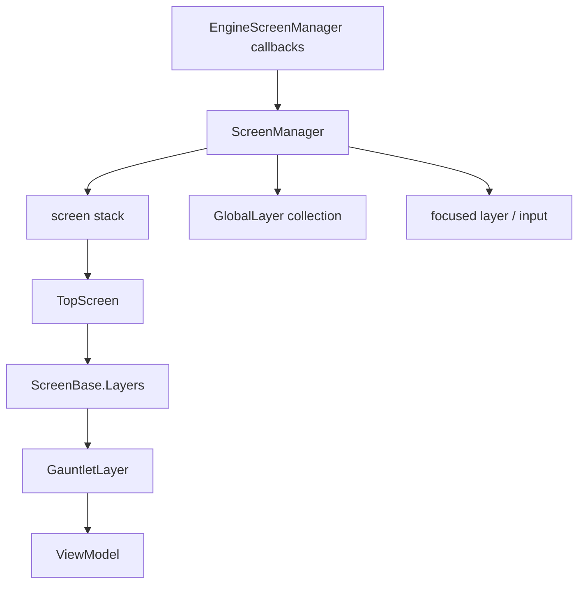

# ScreenManager

**Namespace:** `TaleWorlds.ScreenSystem`  
**Module:** `TaleWorlds.ScreenSystem`  
**Type:** `public static class ScreenManager`  
**Base:** none (static class)  
**Source:** `TaleWorlds.ScreenSystem/ScreenManager.cs`

## Responsibility

It coordinates the UI screen stack and global layers: selecting `TopScreen`, applying push/pop lifecycles, and dispatching engine callbacks to screens, layers, and input focus.

## Mental model

Treat it as a **screen stack plus layer scheduler**, not as a service you instantiate. `PushScreen` puts a new `ScreenBase` on top and pauses the old one; `PopScreen` finalizes the current screen and resumes the predecessor. `TopScreen` is the real modder entry point for mounting a Gauntlet overlay. `GlobalLayer` lives outside the stack for UI that must persist across screens.

### Per-frame path

The engine calls `Tick`, `LateTick`, `Update`, and `EarlyUpdate` through `EngineScreenManager`. `ScreenManager.Tick` updates global layers and input, ticks `TopScreen`, the predecessor's idle tick, active `ScreenLayer` instances, and global layers; `LateTick` drives rendering. A mod should not call these methods manually.

## When to use it

- **Overlay an existing screen:** read `ScreenManager.TopScreen`, create a [GauntletLayer](../../engine/GauntletLayer), and call `AddLayer`.
- **Enter a standalone interface:** let the game-state or view factory create a `ScreenBase`, with the state system calling `PushScreen`; call it directly only when you truly own the screen-stack transition.
- **Observe transitions:** subscribe to `OnPushScreen`/`OnPopScreen` and unsubscribe during module teardown.
- Do not call `EngineScreenManager`, assign `TopScreen`, or manually drive `Tick`/`LateTick`.
- Do not call push/pop from a background thread; these methods mutate shared stack and layer state.

## Dependencies



- Screen host: [ScreenBase](../../campaign-ext/ScreenBase).
- Overlay downstream: [GauntletLayer](../../engine/GauntletLayer) and [ViewModel](../../core-extra/ViewModel).
- Engine bridge: [ScreenManagerEngineConnection](../../engine/ScreenManagerEngineConnection); a mod does not implement it for ordinary UI.
- Game-state upstream: in 1.4.5, `GameStateScreenManager` chooses `PushScreen`, `CleanAndPushScreen`, or `PopScreen` for `IGameStateListener` screens.

## Key members and timing

- `Initialize(IScreenManagerEngineConnection engineInterface)`: injects the engine connection during startup; normally the game calls it once.
- `TopScreen`: the stack's top screen, possibly `null`; read-only and not assignable by mods.
- `PushScreen(ScreenBase screen)`: pauses/deactivates the old top, initializes and activates the new screen, then raises `OnPushScreen`.
- `PopScreen()`: pauses, deactivates, and finalizes the top screen, removes it, then activates/resumes the predecessor; it is a no-op for an empty stack.
- `ReplaceTopScreen(ScreenBase screen)`: finalizes the current top and replaces it without keeping the old instance.
- `CleanAndPushScreen(ScreenBase screen)` / `CleanScreens()`: clear the stack before pushing, or clear every screen. These are not ordinary “go back” operations.
- `AddGlobalLayer` / `RemoveGlobalLayer`: manage layers outside the stack that still participate in ordering, input, and ticks.
- In the 1.3.15 implementation, `AddGlobalLayer(GlobalLayer layer, bool isFocusable)` does not read `isFocusable`; a caller must configure the layer and explicitly call `TrySetFocus` when focus is required.
- `SortedLayers`: the scheduler's ordered view of current-screen and global layers.
- `OnPushScreen` / `OnPopScreen`: post-transition events; do not unconditionally mutate the stack again from these callbacks.

## Risks and crash boundaries

1. `TopScreen` can be `null` during startup or shutdown; guard it before calling `AddLayer`.
2. `PopScreen` always removes the current top. Popping twice can finalize an original map/menu screen; pair the screen you push with the pop that owns it.
3. Stack changes mutate collections, focus, and layer lifetimes. 1.4.5 adds main-thread `FailedAssert` guards; 1.3.15 is still not thread-safe even without those guards.
4. A popped screen and its layers are finalized. Do not keep updating a destroyed `GauntletLayer`, VM, or movie identifier.
5. `GlobalLayer` bypasses the normal screen stack; a bad input order can swallow mouse/keyboard input for every screen.
6. Stack changes inside `OnPushScreen`/`OnPopScreen` need an explicit transition policy, or they can cause re-entrancy and confusing focus changes.

## Real examples

### Closing the current options screen from a VM

In 1.3.15, `TaleWorlds.MountAndBlade.ViewModelCollection/GameOptions/OptionsVM.cs` performs option cleanup in `CloseScreen` and then calls `ScreenManager.PopScreen()`. This is the safe “leave the current screen” path; the VM does not touch `_screenList` directly.

### Mounting a Gauntlet overlay on the current screen

```csharp
GauntletLayer layer = new GauntletLayer("MyOverlay", 10, false);
MyOverlayVM vm = new MyOverlayVM();
GauntletMovieIdentifier movie = layer.LoadMovie("MyOverlay", vm);

ScreenBase current = ScreenManager.TopScreen;
if (current != null)
{
    current.AddLayer(layer);
}
```

On teardown, the owner calls `vm.OnFinalize()` and `layer.ReleaseMovie(movie)` before `current.RemoveLayer(layer)`. Do not leave an overlay in a screen's layer collection while that screen is being popped.

## Version note

The 1.3.15 and 1.4.5 screen-stack APIs have the same shape; 1.4.5 adds main-thread checks to `PushScreen`, `PopScreen`, `CleanScreens`, and `CleanAndPushScreen`. In 1.3.15 the current-screen entry point is `TopScreen`, not `CurrentScreen`.

## Navigation

- Parent: [gui index](./)
- Siblings: [EngineScreenManager](../../engine/EngineScreenManager) · [ScreenManagerEngineConnection](../../engine/ScreenManagerEngineConnection)
- Upstream: [ScreenBase](../../campaign-ext/ScreenBase)
- Downstream: [GauntletLayer](../../engine/GauntletLayer) · [ViewModel](../../core-extra/ViewModel)
- Related: [crash and save boundaries](../../../architecture/crash-boundaries) · [developer task roadmap](../../../architecture/developer-roadmap)
