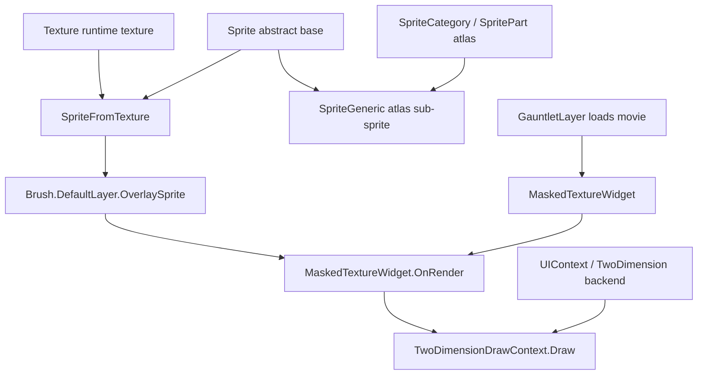

# SpriteFromTexture

**Namespace:** `TaleWorlds.GauntletUI.BaseTypes`  
**Module:** `TaleWorlds.GauntletUI`  
**Type:** `internal class SpriteFromTexture : Sprite`  
**Base:** `Sprite`  
**Source:** `TaleWorlds.GauntletUI/TaleWorlds/GauntletUI/BaseTypes/SpriteFromTexture.cs`

## Overview

`SpriteFromTexture` is a lightweight adapter that treats a single `Texture` as one entire sprite. Unlike an atlas sub-sprite, which samples a small rectangular region of a larger atlas texture, this type wraps a whole standalone texture and exposes it to the Gauntlet drawing system with UVs pinned to the full-image rectangle `(0,0)`→`(1,1)`, a hard-coded name of `"Sprite"`, and no nine-patch parameters. It exists to bridge the gap between "I have a texture that only became available at runtime (a banner image pulled through a `TextureProvider`, for example) and is not an entry in any prebuilt sprite atlas" and "the drawing pipeline only understands `Sprite`". The engine constructs it on the fly while `MaskedTextureWidget` renders a runtime texture as an overlay layer, then hands the resulting sprite to the widget's `Brush.DefaultLayer.OverlaySprite`. Because the class is `internal`, mod code never creates it directly — modders only ever encounter it indirectly through the public `MaskedTextureWidget` control and the overlay sprite it writes into the brush.

## Mental Model

Think of `SpriteFromTexture` as the "whole-texture passthrough" special case in Bannerlord's UI sprite hierarchy. The `Sprite` abstraction (`TaleWorlds.TwoDimension.Sprite`) normally has two real implementations. The common one is `SpriteGeneric`, which points at a `SpritePart` inside an atlas (`SpriteCategory`) — a small slice of a larger texture — so its `GetMinUvs`/`GetMaxUvs` return the UV rectangle of that sub-image. `SpriteFromTexture` is the other implementation: instead of coming from an atlas, it directly wraps one standalone `Texture`, so its UVs are the full image `(0,0)`→`(1,1)`, its name is hard-coded to `"Sprite"`, and its nine-patch parameters are `SpriteNinePatchParameters.Empty`. It answers the question "I have a runtime texture in hand (not an atlas entry), but the draw pipeline only accepts `Sprite`."

Pay attention to accessibility: `SpriteFromTexture` is an `internal class`, unlike `SpriteGeneric` (which is `public`). Mod scripts cannot `new` it across assembly boundaries. It is only constructed by `MaskedTextureWidget` inside the same assembly during the render phase, so a modder is an *indirect* consumer — you "meet" it through the public `MaskedTextureWidget` control and the overlay sprite it ultimately writes into `Brush.DefaultLayer.OverlaySprite`, rather than by creating it yourself.

### Lifecycle

1. When the engine loads atlases at startup, normal sprites exist as `SpriteGeneric` + `SpritePart` (from `SpriteData`/`SpriteCategory`); their names come from atlas entries, and `Width`/`Height`/`NinePatchParameters` come from atlas metadata.
2. When `MaskedTextureWidget` (a public Gauntlet control) needs to draw a non-atlas runtime texture (typically a banner image obtained through a `TextureProvider`) as an overlay, it first calls `TextureProvider.GetTextureForRender(twoDimensionContext)` in `OnRender` to obtain the `Texture`.
3. If the texture or the overlay size changed, it constructs `_overlaySpriteCache = new SpriteFromTexture(_textureCache, size, size)`. The constructor calls the base `protected Sprite("Sprite", width, height, SpriteNinePatchParameters.Empty)`, so `Name` is always `"Sprite"` and `NinePatchParameters` is always `Empty`.
4. It then attaches the sprite to `Brush.DefaultLayer.OverlaySprite` and sets `Brush.DefaultLayer.OverlayMethod` to `BrushOverlayMethod.CoverWithTexture`; the widget's `BrushRenderer.Render` passes this sprite together with `AreaRect`, `ContextAlpha`, and offsets to `TwoDimensionDrawContext` for drawing.
5. When the texture is invalidated (`OnClearTextureProvider`) or the context is deactivated (`OnContextDeactivated`), `_textureCache` is cleared and the provider is marked for release. The sprite object itself only holds a `Texture` reference and does not manage GPU resources — it is reclaimed together with the widget, but the `Texture` it references must outlive its period of use.

## When to use

- You want a `MaskedTextureWidget` to display a runtime texture coming from a `TextureProvider` (banners, portraits, custom decals): declare `<MaskedTextureWidget ImageId="..." />` and the engine automatically uses its internal `SpriteFromTexture` as the overlay sprite.
- You are reading some `MaskedTextureWidget`'s `Brush.DefaultLayer.OverlaySprite` in code and want to confirm the overlay's size or texture source — it is fundamentally a `Sprite` whose `Texture` comes from the provider.
- You need the "the whole texture is one sprite" semantics and want to understand why its UVs are `(0,0)`→`(1,1)`, its name is `"Sprite"`, and it cannot stretch (`NinePatchParameters.Empty`).

## When NOT to use

- Do not write `new SpriteFromTexture(...)` in your mod code: it is `internal` and cannot be constructed across assemblies. For "texture → sprite", go through the public `MaskedTextureWidget`/`TextureProvider` path, or load a `SpriteGeneric` from an atlas.
- Do not treat `SpriteFromTexture` as a stretchable-border sprite: its `NinePatchParameters` is always `Empty`. For nine-patch stretching, use a `SpriteGeneric` from the atlas that carries nine-patch metadata.
- Do not assume its `Name` has business meaning: `ToString()`/the name is always `"Sprite"` and cannot be used to look it up by name in `BrushFactory` — it never goes through `BrushFactory`'s name resolution.
- Do not construct or mutate it on a background thread and immediately hand it to drawing: `OnRender` and drawing happen on the UI thread; mutating the `Texture` reference or size across threads races and may silently fail to draw.

## Dependencies



- Upstream host: [GauntletLayer](../../engine/GauntletLayer) loads the movie XML and provides the TwoDimension drawing backend; [ScreenManager](../ScreenManager) manages the screen that hosts the layer.
- Appearance recipe: the public [Widget](../Widget) `MaskedTextureWidget` is the real constructor. The resulting object is consumed by the [Brush](../Brush) overlay layer's `DefaultLayer.OverlaySprite`.
- Texture source: [Texture](../Texture) is the body of the `_texture` field; for the lower-level 2D material see [Material](../Material).
- Data side: the overlay content is driven by bindings from [ViewModel](../../core-extra/ViewModel) via `ImageId`/`AdditionalArgs`.
- Crash surface: see the "UI thread / lifecycle" section of [Crash & Save Boundaries](../../../architecture/crash-boundaries).

## Risk

1. **`internal` — cannot be constructed directly.** Writing `new SpriteFromTexture(...)` in mod scripts fails to compile (not visible across assemblies). For "texture → sprite" use the public `MaskedTextureWidget`/`TextureProvider` path or an atlas `SpriteGeneric`; do not try to force-create it via reflection.
2. **Name is always `"Sprite"`.** It does not participate in `BrushFactory` name resolution; any "look up / replace by sprite name" logic will never match it and may return `null` or a placeholder sprite, leaving the UI silently missing its image.
3. **No nine-patch.** `NinePatchParameters == Empty`, so border stretching scales the whole image instead of nine-patch slices and the edges distort. For stretchable borders use a `SpriteGeneric` with nine-patch metadata from the atlas.
4. **Texture lifecycle.** `SpriteFromTexture` only holds a `Texture` reference and does not manage GPU resources. If you release or swap the underlying `Texture` while it is still referenced by `OverlaySprite` and drawing has not finished, you draw an empty image or trigger a draw exception. Ensure the `Texture` outlives the widget's usage; on texture invalidation, go through `OnClearTextureProvider` to clear `_textureCache`.
5. **Cross-thread drawing.** Its construction and `OverlaySprite` assignment happen in `OnRender` (UI thread). Mutating the `Texture` reference, size, or `OverlayMethod` on a background thread races, and the result may not refresh or may produce layout glitches.
6. **Cache-reuse trap.** `MaskedTextureWidget` reuses `_overlaySpriteCache` and only rebuilds it when size/texture change. If you bypass `ImageId`/`AdditionalArgs` and swap the provider texture directly without triggering the change check, the overlay may still point at the old `SpriteFromTexture`.

## Key Members & Call Timing

### Construction and base parameters

- `SpriteFromTexture(Texture texture, int width, int height)`: the only construction entry point (`internal`). It calls `base("Sprite", width, height, SpriteNinePatchParameters.Empty)`, so after construction `Name == "Sprite"`, `NinePatchParameters == Empty`, and `Width`/`Height` come from the arguments. Width and height usually come from the widget's current size or the overlay size given by the provider.
- `protected Sprite(string name, int width, int height, SpriteNinePatchParameters ninePatchParameters)`: the base constructor, which sets `Name`/`Width`/`Height`/`NinePatchParameters`; all four properties are `private set` and immutable after construction.

### Members overridden (from `SpriteFromTexture.cs`)

- `public override Texture Texture { get; }`: returns the `_texture` passed and cached at construction; this is the texture actually sampled during drawing.
- `public override Vec2 GetMinUvs()`: fixed return `Vec2.Zero`, i.e. the UV bottom-left `(0,0)`.
- `public override Vec2 GetMaxUvs()`: fixed return `Vec2.One`, i.e. the UV top-right `(1,1)`. Together they mean the entire texture is used, with no sub-image cropping.

### Members inherited from `Sprite` that can be read

- `string Name { get; }`: always `"Sprite"` for `SpriteFromTexture`.
- `int Width { get; }` / `int Height { get; }`: the whole-image pixel size given at construction.
- `SpriteNinePatchParameters NinePatchParameters { get; }`: always `Empty` for `SpriteFromTexture` — cannot be nine-patch stretched.
- `string ToString()`: the base implementation returns `Name` (i.e. `"Sprite"`); it falls back to `base.ToString()` only when the name is empty.

### Call timing

- These members are read by the 2D drawing backend along the `MaskedTextureWidget.OnRender` draw chain: `Texture` supplies the texture, `GetMinUvs`/`GetMaxUvs` decide the sampled UV range, and `Width`/`Height`/`NinePatchParameters` feed the rectangle and stretch calculations. Mods generally only read them, never override them.
- Because construction happens in `OnRender` with size/texture change checks, `SpriteFromTexture` instances are cached and reused by `MaskedTextureWidget` (`_overlaySpriteCache`) and only rebuilt when the texture or overlay size changes.

## Real Examples

### Engine-internal construction (from `MaskedTextureWidget.cs`, around line 154)

This is the only real construction point of `SpriteFromTexture` in the engine — after `MaskedTextureWidget` obtains a runtime texture in `OnRender`, it wraps it as a whole-image sprite used as a Brush overlay layer:

```csharp
// Inside MaskedTextureWidget.OnRender: wrap a runtime texture as a whole-image sprite used as an overlay layer
Texture textureForRender = base.TextureProvider.GetTextureForRender(twoDimensionContext);
if (textureForRender != _textureCache || _overlaySpriteSizeCache != size)
{
    _textureCache = textureForRender;
    _overlaySpriteSizeCache = size;
    _overlaySpriteCache = new SpriteFromTexture(_textureCache, size, size);
}
base.Brush.DefaultLayer.OverlayMethod = BrushOverlayMethod.CoverWithTexture;
base.Brush.DefaultLayer.OverlaySprite = _overlaySpriteCache;
```

`new SpriteFromTexture(_textureCache, size, size)` hits the `internal` constructor; `base("Sprite", size, size, SpriteNinePatchParameters.Empty)` fixes `Name`/`NinePatchParameters`. The `OverlaySprite` is then read by the 2D backend, and `GetMinUvs`/`GetMaxUvs` return the full-image UVs.

### Modder-facing usage (read the overlay sprite, do not construct it)

A mod cannot `new` it directly, but it can meet it indirectly through the public `MaskedTextureWidget` and read, in code, the sprite that ends up in `Brush.DefaultLayer.OverlaySprite` (whose runtime concrete type is `SpriteFromTexture`):

```csharp
// Declared in movie XML (the public control available to mods):
// <MaskedTextureWidget Id="Banner" ImageId="@SomeVM.BannerId" Brush="BannerOverlay" ... />
// At runtime the widget automatically fills Brush.DefaultLayer.OverlaySprite with a SpriteFromTexture during draw;
// to confirm the overlay sprite's size / texture source in code:
MaskedTextureWidget banner = (MaskedTextureWidget)rootWidget.FindChild("Banner");
Sprite overlay = banner.Brush.DefaultLayer.OverlaySprite;   // runtime instance is SpriteFromTexture
if (overlay != null)
{
    Texture src = overlay.Texture;   // runtime texture from the TextureProvider
    int w = overlay.Width;           // whole-image size given at construction
    int h = overlay.Height;
}
```

`SpriteFromTexture`/`Sprite`/`MaskedTextureWidget`/`TextureProvider.GetTextureForRender`/`Brush.DefaultLayer.OverlaySprite` come from `TaleWorlds.GauntletUI.BaseTypes/SpriteFromTexture.cs`, `Sprite.cs`, `MaskedTextureWidget.cs`, and `TaleWorlds.TwoDimension/Sprite.cs`; `BrushOverlayMethod.CoverWithTexture` comes from `TaleWorlds.GauntletUI`.

## Version Notes

`SpriteFromTexture` is identical between 1.3.15 (`TaleWorlds.GauntletUI/TaleWorlds/GauntletUI/BaseTypes/SpriteFromTexture.cs`) and 1.4.5 (`TaleWorlds.GauntletUI/TaleWorlds.GauntletUI.BaseTypes/SpriteFromTexture.cs`): `internal class SpriteFromTexture : Sprite`, the same constructor signature, and the same set of `override`s (`Texture` / `GetMinUvs`→`Vec2.Zero` / `GetMaxUvs`→`Vec2.One`), with the only construction point being `MaskedTextureWidget.OnRender` in both. The base `Sprite` (`TaleWorlds.TwoDimension.Sprite`, `abstract`, with `Name`/`Width`/`Height`/`NinePatchParameters` + abstract `Texture`/`GetMinUvs`/`GetMaxUvs`) is likewise stable across the two versions. If a target version is missing the concrete module source, wire it in through the relationship `TextureProvider.GetTextureForRender → new SpriteFromTexture → Brush.DefaultLayer.OverlaySprite` rather than assuming a public `SpriteFromTexture` construction entry point exists.

## See Also

- ↑ Parent: [gui API bucket](../)
- ↔ Siblings: [Brush](../Brush) · [Widget](../Widget) · [Material](../Material) · [Texture](../Texture) · [ScreenManager](../ScreenManager)
- Upstream: [GauntletLayer](../../engine/GauntletLayer)
- Data side: [ViewModel](../../core-extra/ViewModel)
- Boundaries: [Crash & Save Boundaries](../../../architecture/crash-boundaries)
