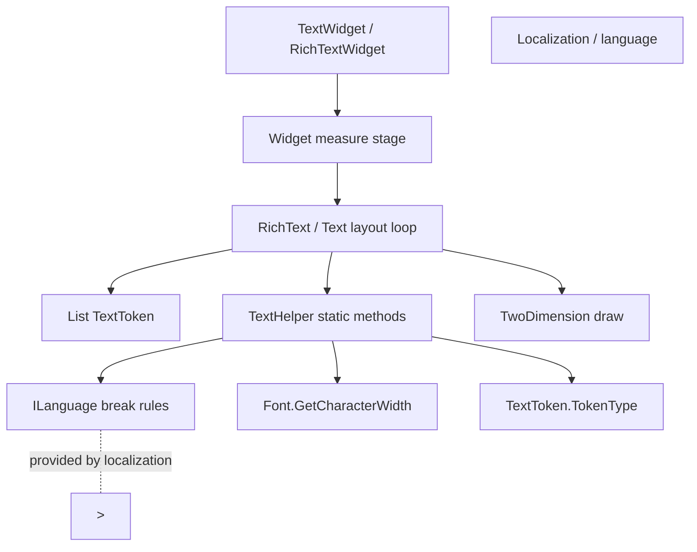

# TextHelper

**Namespace:** `TaleWorlds.TwoDimension.BitmapFont`  
**Module:** `TaleWorlds.TwoDimension`  
**Type:** `internal static class TextHelper`  
**Base:** none (`static` class, implicitly derives from `System.Object`)  
**Source:** `TaleWorlds.TwoDimension/TaleWorlds.TwoDimension.BitmapFont/TextHelper.cs`

## One-line responsibility

`TextHelper` is a **pure-algorithm helper inside the bitmap-font text layout chain**: it holds no state and only answers two low-level questions — "given the current language rules, at which index should this run of `TextToken`s break to the next line?" and "how wide is this run at the current font size?" — while the actual line-breaking decision is driven by the layout loop of `Text`/`RichText`.

## Overview

`TextHelper` is the ruler-and-tokenizer that sits at the bottom of the Gauntlet UI text stack, between "the raw string / rich-text tags" and "the pixel rectangle each glyph is drawn into". Widgets that display text — `RichTextWidget`, `TextWidget` and friends — first parse their text into a `List<TextToken>` (plain characters, zero-width spaces, forced newlines, tags, …) during the measure stage, then hand that list to the `Text`/`RichText` layout loop. When a line no longer fits, that loop asks `TextHelper` for a *legal* break point and uses `TextHelper` to accumulate the line's width to decide whether it overflows the available area. Every input is passed by parameter (`List<TextToken>`, `ILanguage`, `Func<TextToken, Font>`) — there are no instance fields, which is exactly why the type is `internal static`: it is a bag of utility functions called repeatedly by the layout code inside `TaleWorlds.TwoDimension`, not an object you create, inject, or subclass. In practice a mod will almost never reference `TextHelper` directly: it is `internal` and therefore invisible to your assembly at compile time. You encounter it only indirectly — place a `TextWidget`/`RichTextWidget` in a movie XML, give it a fixed `WidthSizePolicy` and some text, and the "auto-wrap / Chinese doesn't break words / CJK breaks per-character / English breaks per-space" behavior you observe is `TextHelper` choosing break points according to `ILanguage`. Understanding it lets you explain why some languages wrap cleanly while others overflow or split a word in half.

## Mental Model

Think of `TextHelper` as the **ruler + word-tokenizer of the UI text layout engine**: it lives one layer below Gauntlet UI, in between "a string / rich-text tag" and "the pixel rectangle each character is painted into". A text-displaying control like `RichTextWidget` or `TextWidget` parses its text into a `List<TextToken>` during the measure/wrap stage (built via `TextToken.CreateCharacter` / `CreateZeroWidthSpaceCharacter` / `CreateNewLine` / `CreateTag`, each token carrying a `Type` and a `Token` character), then runs the layout loop in `Text`/`RichText`; that loop calls `TextHelper` to find a legal break point when a line doesn't fit, and calls `TextHelper` to accumulate the line width to test against the available space.

All of its inputs arrive as parameters (`List<TextToken>`, `ILanguage`, `Func<TextToken, Font>`) — there is not a single instance field. That is precisely why it is written as `internal static`: it is a set of utility functions repeatedly invoked by the layout code inside `TaleWorlds.TwoDimension`, not something that must be created, injected, or inherited.

In the overwhelming majority of cases a mod will **never reference `TextHelper` directly**: it is `internal`, visible only to its own assembly. The only way you meet it is indirectly — you put a `TextWidget`/`RichTextWidget` in a movie XML, set its `WidthSizePolicy` to a fixed width and fill it with text; when the text is wider than the control, the "auto-wrap / Chinese doesn't break words / CJK breaks per-character / English breaks per-space" behavior you see is `TextHelper` picking break points per `ILanguage`. Understanding it helps explain why some languages wrap fine and others overflow or get a word split in two.

### Lifecycle

1. Before layout begins, `RichText` or `Text` parses the raw string and rich-text tags into a `List<TextToken>` (constructed via the `TextToken.Create*` factory methods; each token carries a `Type` and a `Token` character).
2. The layout loop tries to fit tokens into each line against the available width; when a line doesn't fit, it calls `TextHelper.GetIndexOfFirstAppropriateCharacterToMoveToNextLineForwardsFromIndex` to scan forward for a legal break point, or `GetIndexOfFirstAppropriateCharacterToMoveToNextLineBackwardsFromIndex` to walk back from an index.
3. For each candidate span it calls `TextHelper.GetTotalWordWidthBetweenIndices` to accumulate width (each `TextToken` resolves to a `Font` via `getFontForToken`, then `Font.GetCharacterWidth(char, extraPadding)` is scaled by `requiredFontSize / font.Size`). When the width exceeds the available area, the line breaks.
4. Whether a break point is legal is decided by `ILanguage`: space-required vs per-character breaking, line-start/line-end kinsoku (forbidden) characters, whether a zero-width space may serve as a break, and the line-separator character — `TextHelper` consults `ILanguage` for all of these while choosing the break.
5. `TextHelper.IsTokenEqualToSeparatorChar` is used by the layout loop to detect whether two adjacent tokens straddle a line separator (e.g. `\n`), forcing a new line.
6. The layout result (`TextTokenOutput` stream + per-line sizes) is handed back to the `Widget`'s measure/layout stage for drawing; `TextHelper` itself does not draw and holds no lifecycle state — every call is a pure function.

## When to use

**Use it (at the understanding level):**

- When debugging "why does text in language X overflow the control / split a word / refuse to wrap a CJK whole word", recognize that the break rule is driven by `ILanguage` and `TextHelper` is merely the executor.
- When writing a custom `ILanguage` implementation (e.g. wiring a minority language to an `ILanguage`), understand that `DoesLanguageRequireSpaceForNewline`, the line-start/line-end kinsoku sets, and the separator char all steer `TextHelper`'s break choices.
- When you want to fully take over text wrapping/measurement, consider replacing your own `Text`/`RichText` layout logic — but that is TwoDimension-layer work, not editing `TextHelper` itself.

**Do NOT use it like this:**

- Do not try to `new TextHelper()` or treat it as an injectable service: it is an `internal static` class, invisible to external assemblies (including your mod assembly) at compile time and impossible to instantiate at runtime.
- Do not call `TextHelper.GetTotalWordWidthBetweenIndices` directly from mod code to measure text width: you cannot reach the `internal` entry point, and width measurement is already done by the `Text`/`RichText` layout loop — re-implementing it just desynchronizes from the control's measurement.
- Do not reflection-invoke `TextHelper` to change wrapping behavior: it is a pure function; the real behavior switches live in `ILanguage` and the `Text`/`RichText` layout loop, so bypassing them only yields measurements inconsistent with the control.
- Do not treat `TextHelper` as a "text parsing / rich-text tag parsing" tool: it only handles break points and width accumulation; tag parsing happens earlier, in the `RichText`/`TextToken` stage.

## Dependencies



- Upstream text source: the text-displaying control is [Widget](../Widget) (concretely `TextWidget`/`RichTextWidget`); its measure stage triggers layout; the font and size are decided by [Brush](../Brush).
- Layout executor: `RichText`/`Text` (in `TaleWorlds.TwoDimension`) is the code that actually owns the layout loop and calls `TextHelper`; it hands the result to the text material from [Material](../Material) for drawing.
- Runtime host: text is ultimately drawn on the `UIContext`/TwoDimension backend provided by [GauntletLayer](../../engine/GauntletLayer); the text state should come from a bound property of [ViewModel](../../core-extra/ViewModel).
- Crash surface: text layout happens on the UI thread; mutating text from another thread races — see the "UI thread / lifecycle" section of [Crash & Save Boundaries](../../../architecture/crash-boundaries).

## Key members and call timing

`TextHelper` is `internal static`; all four methods are called by the `Text`/`RichText` layout loop during breaking/measuring. Their semantics (all real signatures) are:

### Break-point selection

- `int GetIndexOfFirstAppropriateCharacterToMoveToNextLineForwardsFromIndex(List<TextToken> tokens, int startIndex, ILanguage currentLanguage, bool canBreakInZeroWidthSpace = true)`: scans forward from `startIndex` and returns the token index that should become the start of the next line; returns `-1` if none found. For a language that does **not** require space for a newline (e.g. Chinese), it may break as long as the previous character is not line-end-forbidden and the current character is not line-start-forbidden. For a language that **does** require space, it only breaks at an `EmptyCharacter` (space) or, when allowed, a `ZeroWidthSpace`.
- `int GetIndexOfFirstAppropriateCharacterToMoveToNextLineBackwardsFromIndex(List<TextToken> tokens, int startIndex, ILanguage currentLanguage, bool canBreakInZeroWidthSpace = true)`: the reverse direction — walks back from `startIndex` to find a legal break point, used when "already too wide, need to step back to a breakable position". Also returns `-1` if none found.

### Width accumulation

- `float GetTotalWordWidthBetweenIndices(int startIndex, int endIndex, List<TextToken> tokens, Func<TextToken, Font> getFontForToken, float extraPadding, float requiredFontSize)`: for every token in `[startIndex, endIndex)`, resolves a `Font` via `getFontForToken`, obtains the base glyph width with `Font.GetCharacterWidth(token.Token, extraPadding)`, scales it by `requiredFontSize / font.Size` to the target size, and accumulates the total line width. Tokens whose font is `null` are skipped.

### Separator detection

- `bool IsTokenEqualToSeparatorChar(TextToken token, ILanguage currentLanguage)`: returns `true` when `token` is of `TokenType.Character` and its character equals `currentLanguage.GetLineSeperatorChar()` (e.g. `\n`); the layout loop uses it to detect that an explicit newline has been crossed, forcing a new line.

## Risk and crash boundaries

1. **`internal static` is invisible.** A mod assembly cannot `new` `TextHelper` nor call any of its methods directly; any "measure the width myself" attempt should fall back to the control's own measurement, or re-implement the same algorithm yourself — never reflect into `TaleWorlds.TwoDimension`.
2. **Break behavior is decided by `ILanguage`.** `TextHelper` is only the executor — if a language wraps oddly (a word split, breaking where it shouldn't), the root cause is usually `ILanguage`'s `DoesLanguageRequireSpaceForNewline`, its line-start/line-end kinsoku sets, and `GetLineSeperatorChar`, not `TextHelper`.
3. **`TextToken.TokenType` semantics.** Both `GetTotalWordWidthBetweenIndices` and the break scan depend on the token's `Type` (`EmptyCharacter`/`ZeroWidthSpace`/`Character`/`NewLine`/`Tag`…); if your custom parser emits a wrong token type, width accumulation or break points become wrong. `Tag` tokens carry no drawable character and must be skipped during width accumulation.
4. **`getFontForToken` returning `null`.** `TextHelper` silently skips tokens whose font is `null` (not counted in width); if the callback returns `null` for some tokens, the measured result is too small and the layout overflows the control.
5. **UI-thread constraint.** The whole call chain (`Text`/`RichText` layout → `TextHelper` → `Font.GetCharacterWidth`) runs inside the control's measure/draw stage on the UI thread; mutating text or fonts from a background thread and expecting the layout to update will race or silently fail to re-layout.
6. **Zero-width-space switch.** `canBreakInZeroWidthSpace` defaults to `true`; setting it to `false` stops `ZeroWidthSpace` from being a break point, so long runs of space-less text may fail to break and overflow.

## Real examples

### 1.4.5 — how the layout loop calls TextHelper internally (illustrative)

`TextHelper` is `internal static`; mod code cannot call it directly. The fragment below reconstructs the real call relationship inside `TaleWorlds.TwoDimension/Text.cs` and `RichText.cs`, showing where each of the four methods is used:

```csharp
// Engine-internal call illustration (TextHelper is internal static — mod code cannot use it directly)
// Real source: the line-width measurement loops in TaleWorlds.TwoDimension/Text.cs and RichText.cs
List<TextToken> tokens = word.Select(TextToken.CreateCharacter).ToList();
float measured = TextHelper.GetTotalWordWidthBetweenIndices(0, tokens.Count, tokens, GetFontForTextToken, 0.5f, 24f);
int breakAt = TextHelper.GetIndexOfFirstAppropriateCharacterToMoveToNextLineForwardsFromIndex(tokens, 0, currentLanguage, true);
bool isNewline = TextHelper.IsTokenEqualToSeparatorChar(tokens[breakAt], currentLanguage);
```

Note that `GetFontForTextToken` is a `Func<TextToken, Font>` the layout loop uses to pick the font per token (a single rich-text run may switch fonts), and `currentLanguage` is the `ILanguage` — all break rules are delegated to it.

### 1.4.5 — how a mod indirectly "meets" TextHelper

A mod actually touches text layout by declaring a fixed-width text control in movie XML and binding it to a `ViewModel` text property; when the text exceeds the width, the wrapping behavior is exactly what `TextHelper` computed per `ILanguage`:

```csharp
// A mod hands text to TextWidget via data binding; wrapping/measurement is done by the
// underlying TextHelper according to the language rules.
TextWidget label = (TextWidget)rootWidget.FindChild("InfoLabel");
label.Brush = ctx.BrushFactory.GetBrush("Information.Text");
label.Text = myVM.ExplanationText;          // wraps by language rules when wider than the control
```

If you find a Chinese UI splitting an English word in half, or a language overflowing, check the corresponding `ILanguage` wrap rules and the control's `WidthSizePolicy` — do not try to replace `TextHelper`.

## Version notes

`TextHelper` lives in `TaleWorlds.TwoDimension.BitmapFont` and is a static helper internal to the `TaleWorlds.TwoDimension` assembly in the full 1.4.5 module source. The 1.3.15 line belongs to the same TwoDimension bitmap-font layout family, and the semantics of the four methods (two break-point selectors, one width accumulator, one separator detector) are consistent. It is `internal` to mods in every version: it should never be called directly by a mod, and understanding it only helps explain the root cause of control text wrapping/overflow.

## See Also

- ↑ Parent: [gui index](../)
- ↔ Siblings: [Material](../Material) · [ScreenManager](../ScreenManager) · [Brush](../Brush) · [Widget](../Widget)
- Upstream: [GauntletLayer](../../engine/GauntletLayer)
- Downstream: result drawn via [Material](../Material)
- Related: [ViewModel](../../core-extra/ViewModel) · [Crash & Save Boundaries](../../../architecture/crash-boundaries)
