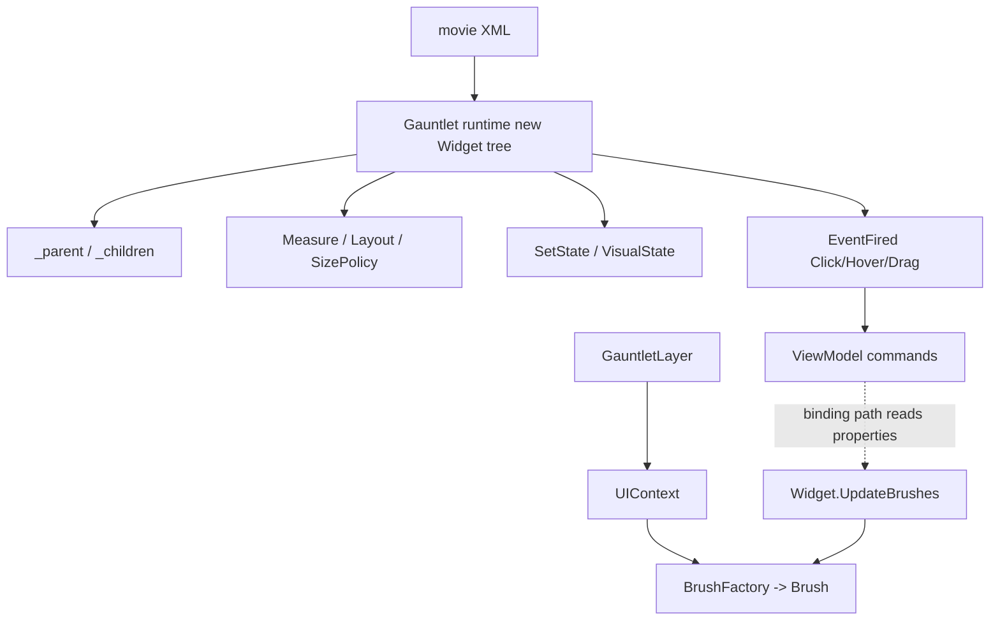

# Widget

**Namespace:** `TaleWorlds.GauntletUI.BaseTypes`  
**Module:** `TaleWorlds.GauntletUI`  
**Type:** `public class Widget : PropertyOwnerObject`  
**Base:** `PropertyOwnerObject`  
**Source:** `TaleWorlds.GauntletUI.BaseTypes/Widget.cs`

## Responsibility

`Widget` is **the runtime object behind every visible element on screen**: it holds the parent/child control tree, the layout parameters (size policy / alignment / margin), the visual states (`Hover` / `Pressed` / `Disabled` …), its components and event channels, and it is responsible for measure / layout / draw. Mods almost never create it with `new`; instead they declare it in a movie XML and then reach it by `Id` or binding path.

## Overview

`Widget` is the runtime base class for **every visible Gauntlet control** — buttons, panels, text blocks, images, lists and the custom widgets mods build on top of it. It is the single type that ties together four concerns that every UI page depends on:

- **The control tree** — each `Widget` knows its `_parent` and `_children`, which determines hit-testing, traversal and what gets added or removed at runtime.
- **The layout system** — `SizePolicy` plus alignment and `Margin*` values feed `Measure` (bottom-up, desired size) and `Layout` (top-down, final rectangle), so the same XML produces correct placement at any resolution.
- **The visual state machine** — `AddState` / `SetState` switch the active `VisualState`, which drives which `Brush` appearance is shown.
- **The event channel** — interaction (`Click` / `Hover` / `Drag` …) is surfaced through one unified `EventFired` channel that the bound `ViewModel` consumes as commands and that code subscribers can also hook directly.

Mods therefore treat `Widget` as the "view" half of the UI: XML describes the tree, the runtime materializes concrete types (`ButtonWidget`, `ListPanel`, `TextWidget` …) from that XML, and code reaches those instances by `Id` or binding path to change state or subscribe to interaction. `Widget` itself never owns game/world state — that lives in the `ViewModel` or the campaign/mission systems.

## Mental Model

Think of `Widget` as the **"DOM node" of the UI layer**. The control tree (`_parent` / `_children`) defines structure and hit-testing; the layout system turns `SizePolicy` + alignment + margin into a rectangle; the visual state machine (`SetState`) swaps the active `Brush`; and `EventFired` streams clicks / hovers / drags toward the binding layer or to code subscribers. It and the [ViewModel](../../core-extra/ViewModel) are the two halves of "view" vs "data": the widget reads VM properties through a binding path and triggers VM commands through an event name.

### Lifecycle

1. A movie XML is loaded by a [GauntletLayer](../../engine/GauntletLayer); the runtime `new`s the matching concrete type (`ButtonWidget`, `ListPanel`, `TextWidget` …) for each XML element and attaches them recursively into a tree.
2. **Measure phase** — `Measure(measureSpec)` walks bottom-up to compute each widget's desired size.
3. **Layout phase** — `Layout(left, bottom, right, top)` walks top-down to distribute the final rectangles.
4. `UpdateBrushes(dt)` advances brush transitions and state appearance; `Render` paints the result into the 2D context.
5. Interaction raises `EventFired("Click" | "Hover" | "Drag" | …)`; an XML `<Event>` is dispatched to a VM command, and code subscribers can also receive it directly.
6. When the screen / layer is removed, the tree is released together with the layer. Controls added dynamically via `AddChild` must be `RemoveChild` / `RemoveAllChildren`'d at the right moment, or they leak references.

## When to use

- Declare control structure and `Brush` / `SizePolicy` / `Margin` in XML; locate instances by `Id` or binding path.
- Grab a reference at runtime to change state: after `root.FindChild("ConfirmButton")`, call `SetState("Pressed")`, `Show()` / `Hide()`.
- Subscribe to interaction in code: `widget.EventFired += (w, name, args) => { if (name == "Click") … };`.
- Only when you genuinely need dynamic UI, add/remove controls with `AddChild` / `RemoveChild` (prefer XML + visibility toggles; avoid runtime tree surgery).

## When NOT to use

- Do **not** `new Widget()` as a generic control — use the concrete type (`TextWidget`, `ListPanel` …) and only when you actually have a dynamic-UI need.
- Do **not** mutate layout / state / events from a background thread; measure and draw run on the UI thread, so cross-thread writes race or silently fail to refresh.
- Do **not** assume cleanup is finished just because you called a base method — dynamically added children, event subscriptions and gamepad-navigation indices must all be reclaimed explicitly.
- Do **not** put world-state logic on a widget; state belongs to the [ViewModel](../../core-extra/ViewModel) / campaign system, and the widget only presents it.

## Dependencies



- **Host (upstream):** [GauntletLayer](../../engine/GauntletLayer) provides the `UIContext` and loads the XML; [ScreenManager](../ScreenManager) manages the screen that hosts the layer.
- **Appearance source:** a `Brush` is resolved by `UIContext.BrushFactory` and consumed by `Widget.UpdateBrushes`. Brush pages live in the [gui bucket](../); the actual painting goes through the engine [Material](../Material) layer. The measured/arranged result is a [LayoutBox](../LayoutBox).
- **Data side:** the [ViewModel](../../core-extra/ViewModel) reads and writes widget properties through the binding path, and its commands are triggered by the `EventFired` name.
- **Crash surface:** see the "UI thread / lifecycle" section of [Crash and save boundaries](../../../architecture/crash-boundaries).

## Key members and when they are called

### Control tree

- `void AddChild(Widget widget)` / `AddChildAtIndex(Widget, int)` / `RemoveChild(Widget)` / `RemoveAllChildren()` — add or remove a child at runtime. Called when you build dynamic UI; pair every `AddChild` with a `RemoveChild` before the layer/screen goes away.
- `Widget FindChild(string id, bool includeAllChildren = false)` / `FindChild(BindingPath)` / `FindChild(WidgetSearchDelegate)` — reach a subtree by `Id` or binding path. Returns `null` when the `id` is absent, so always null-check.
- `bool HasChild(Widget)` / `Widget GetChild(int i)` / `ApplyActionToAllChildrenRecursive(Action<Widget>)` — test, index and walk children.

### Layout and visual state

- `SizePolicy WidthSizePolicy` / `HeightSizePolicy`, `HorizontalAlignment` / `VerticalAlignment`, `Margin*` — drive measure and rectangle distribution; the layout system recomputes on the next frame after you change them.
- `void AddState(string stateName)` / `bool ContainsState(string)` / `virtual void SetState(string stateName)` — switch the visual state (e.g. `"Pressed"`, `"Disabled"`); the state name lines up with the XML `<VisualState>`.
- `virtual void UpdateBrushes(float dt)` — advances brush transitions and state appearance; the framework calls it during the refresh pass.

### Events and visibility

- `event Action<Widget, string, object[]> EventFired` — the single unified outlet for all interaction; subscribe and branch on `eventName` (`"Click"` / `"Hover"` / `"Drag"` …). This is the correct code-side entry point for clicks; it is not a compile-time type-safe delegate.
- `void Show()` / `void Hide()` / `bool IsRecursivelyVisible()` — control visibility; hiding does **not** auto-unsubscribe events or reclaim children.
- `UIContext Context { get; private set; }` — the context this widget belongs to; use it to reach `BrushFactory` and friends.

## Risks and crash boundaries

1. **`FindChild` returns `null`** — a mistyped `id`, or access before the XML finished loading, dereferences into a null-reference crash. Always null-check or ensure load timing.
2. **Event leaks** — if you subscribe to `EventFired` but never unsubscribe when the widget / screen is destroyed, the callback keeps firing after the object is "gone" and touches released state.
3. **Unreclaimed dynamic tree** — a control added with `AddChild` that lives only outside XML must be `RemoveChild` / `RemoveAllChildren`'d before the layer/screen is dropped, or the dangling reference lingers and can bleed into other screens.
4. **Cross-thread UI writes** — mutating layout / state / events from a background thread is not reflected by measure/draw and can race into a broken layout.
5. **State vs `VisualDefinition` confusion** — runtime `SetState` only switches a state *name*; the actual look is defined by the XML `VisualState` / `VisualDefinition`. A misspelled state name fails silently.
6. **Gamepad navigation index** — widgets with gamepad navigation enabled carry a `_gamepadNavigationIndex`; after dynamic add/remove the index can shift and send focus to the wrong place.

## Real examples

### XML declaration + reach by id and wire a click

```xml
<ListPanel Id="ItemList" WidthSizePolicy="CoverChildren" HeightSizePolicy="CoverChildren">
  <Children>
    <ButtonWidget Id="ConfirmButton" Brush="ButtonBrush" State="Default">
      <Events>
        <Event Click="ExecuteConfirm" />
      </Events>
    </ButtonWidget>
  </Children>
</ListPanel>
```

```csharp
// Reach the reference by id at runtime (only after the XML has loaded)
Widget confirm = rootWidget.FindChild("ConfirmButton");
if (confirm != null)
{
    confirm.SetState("Pressed");                 // switch visual state
    confirm.EventFired += (w, name, args) =>     // hook interaction from code
    {
        if (name == "Click") { /* real callback, normally forwarded to a ViewModel command */ }
    };
}
```

### Rare case: attach a child widget dynamically (real API)

```csharp
UIContext ctx = rootWidget.Context;            // Widget.Context is a UIContext
TextWidget entry = new TextWidget(ctx);         // the concrete type takes a UIContext
entry.Text = "Dynamic entry";
ListPanel list = (ListPanel)rootWidget.FindChild("ItemList");
list.AddChild(entry);                           // later, RemoveChild / RemoveAllChildren at the right time
```

`Widget` constructor, `FindChild`, `SetState`, `EventFired`, `AddChild` all come from `TaleWorlds.GauntletUI.BaseTypes/Widget.cs`; `TextWidget(UIContext)` comes from `TextWidget.cs`.

## Version notes

The core `Widget` model is the same across 1.3.15 and 1.4.5 (`FindChild` / `SetState` / `EventFired` / `AddChild` all exist). The 1.4.5 source comes from the full module set; if a target version lacks a given concrete-widget module, still integrate through the `GauntletLayer loads XML → FindChild by id → EventFired` relationship rather than assuming a custom widget entry point from that module exists.

## See Also

- ↑ Parent: [gui index](../)
- ↔ Siblings: [ScreenManager](../ScreenManager) · [Material](../Material) · [LayoutBox](../LayoutBox)
- Upstream: [GauntletLayer](../../engine/GauntletLayer)
- Downstream: [ViewModel](../../core-extra/ViewModel)
- Related: [Crash and save boundaries](../../../architecture/crash-boundaries) · [ScreenManager](../ScreenManager)
