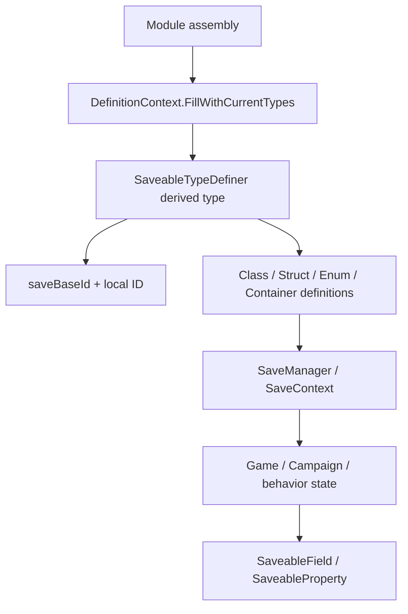

# SaveableTypeDefiner

**Namespace:** `TaleWorlds.SaveSystem`  
**Module:** `TaleWorlds.SaveSystem`  
**Type:** `public abstract class SaveableTypeDefiner`  
**Base:** none (abstract base)  
**Source:** `TaleWorlds.SaveSystem/SaveableTypeDefiner.cs`

## Responsibility

`SaveableTypeDefiner` reserves a stable save-ID range for an assembly and declares the serializable types, members, and containers that SaveSystem needs when it builds its definition context.

## Mental model

This is not normally a service a mod calls. `DefinitionContext.FillWithCurrentTypes()` scans visible assemblies, finds each non-abstract derived type, creates it with a parameterless constructor, calls `Initialize(context)`, and then runs the definition phases in order: basic, class, struct, interface, enum, root, generic, container, and conflict-resolver definitions.

Treat a derived definer as a declaration file. Its constructor supplies a stable `saveBaseId`, and its phase methods call `AddClassDefinition` or related helpers. Do not instantiate it from `OnGameStart`, a behavior constructor, or every save operation, and never derive IDs from runtime counts.

## IDs and phases

The final `TypeSaveId` is `saveBaseId + localSaveId`. A base range must be reserved by one module/feature and never overlap another; a local ID must not be repurposed after release. Phases describe types, they do not create instances. Instances are still owned by [Game](../../core-extra/Game), [Campaign](../../campaign/Campaign), or a behavior.

| Phase | Typical call | Purpose |
| --- | --- | --- |
| `DefineClassTypes` | `AddClassDefinition(typeof(MyState), 1)` | Reference types |
| `DefineStructTypes` | `AddStructDefinition(typeof(CampaignTime), 1001)` | Value types |
| `DefineEnumTypes` | `AddEnumDefinition(typeof(MyMode), 2001)` | Enumerations |
| `DefineRootClassTypes` | `AddRootClassDefinition(...)` | Save roots |
| `DefineGenericClassDefinitions` / `DefineGenericStructDefinitions` | `ConstructGenericClassDefinition(typeof(List<>))` | Generic definitions |
| `DefineContainerDefinitions` | `ConstructContainerDefinition(typeof(List<MyState>))` | Closed containers |
| `DefineConflictResolvers` | `AddConflictResolver(...)` | Legacy type conflicts |

`AddClassDefinitionWithCustomFields` and `AddStructDefinitionWithCustomFields` are for explicitly maintained custom-field IDs. They are not a shortcut around `[SaveableField]` or `[SaveableProperty]`.

## Dependencies



- **Upstream:** `DefinitionContext` discovers and instantiates non-abstract derived types with `Activator.CreateInstance`; the derived type needs a public parameterless constructor.
- **Definition inputs:** [SaveableFieldAttribute](../SaveableFieldAttribute) and [SaveablePropertyAttribute](../SaveablePropertyAttribute) describe members; the definer owns type and container IDs.
- **Downstream:** [SaveManager](../SaveManager), `SaveContext`, and `IDataStore` use the definition table to read/write [Game](../../core-extra/Game), [Campaign](../../campaign/Campaign), and behavior state.
- **Related contract:** `CampaignBehaviorBase.SyncData(IDataStore)` persists instance fields; `SaveableTypeDefiner` defines types. One does not replace the other.

## When to use it

- **Use it** when a mod adds a persisted class, struct, enum, or nested container that needs a stable type ID and explicit compatibility policy.
- **Do not use it** for a few behavior fields: use `IDataStore.SyncData` first. Do not copy an entire native definer just to add a field; follow [SaveableField](../SaveableFieldAttribute) and [SaveableProperty](../SaveablePropertyAttribute) rules.

## Save-corruption risks

1. **ID collisions:** reusing a `saveBaseId` or a local ID can make an old file decode one type as another.
2. **ID drift:** deleting and reusing an ID breaks historical saves; add new types at new unused IDs.
3. **No parameterless constructor:** discovery uses `Activator.CreateInstance`, so a required constructor argument fails definition building.
4. **Missing container shape:** closed `List<T>` and `Dictionary<TKey,TValue>` shapes must be constructed in `DefineContainerDefinitions` before nested objects can be saved.
5. **Duplicate container definition:** `ConstructContainerDefinition` asserts when the context already owns the type; keep one authoritative definer for each container shape.
6. **Wrong ownership layer:** a definer creates static definitions, not registered objects or meaningful state; [MBObjectManager](../../campaign-ext/MBObjectManager), Campaign, or a behavior still owns the instance lifecycle.
7. **Removed save members:** removing a `[SaveableField]` without a compatibility strategy can break older saves. Inspect existing campaign compatibility code first.

## Native patterns

1.3.15's `SaveableCampaignTypeDefiner` uses `base(330000)`, defines `Campaign`, `Hero`, and `MobileParty` classes, `CampaignTime` as a struct, and many closed containers. StoryMode's `SaveableStoryModeTypeDefiner` uses a separate `base(320000)` range. The separation is the compatibility rule: module ranges must not overlap.

## Real mod definition

```csharp
using System.Collections.Generic;
using TaleWorlds.SaveSystem;

namespace MyMod;

// DefinitionContext must be able to call Activator.CreateInstance with no arguments.
public sealed class MySaveableTypes : SaveableTypeDefiner
{
    public MySaveableTypes() : base(350000)
    {
    }

    protected override void DefineClassTypes()
    {
        AddClassDefinition(typeof(CampaignState), 1);
    }

    protected override void DefineStructTypes()
    {
        AddStructDefinition(typeof(MyCounter), 1001);
    }

    protected override void DefineContainerDefinitions()
    {
        ConstructContainerDefinition(typeof(List<CampaignState>));
    }
}
```

After definitions are built, consumers still acquire runtime state from the real roots rather than from `MySaveableTypes`:

```csharp
Game game = Game.Current;
Campaign campaign = Campaign.Current;
Debug.Print(game.GameType.GetType().Name);
Debug.Print(campaign.SaveHandler.GetType().Name);
```

`CampaignState` must still obey SaveSystem member attributes and compatibility rules. The definer does not create or attach the state to Campaign; it only makes the type encodable after discovery.

## Navigation

- Parent: [save-system index](./)
- Siblings: [SaveableBasicTypeDefiner](../SaveableBasicTypeDefiner) · [SaveableFieldAttribute](../SaveableFieldAttribute) · [SaveablePropertyAttribute](../SaveablePropertyAttribute)
- Downstream: [SaveManager](../SaveManager) · [ISaveDriver](../ISaveDriver)
- Related: [Game](../../core-extra/Game) · [Campaign](../../campaign/Campaign) · [CampaignBehaviorBase](../../campaign-ext/CampaignBehaviorBase)
