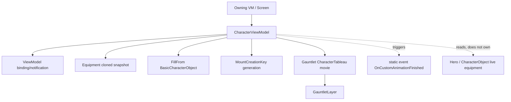

# CharacterViewModel

**Namespace:** `TaleWorlds.Core.ViewModelCollection`  
**Module:** `TaleWorlds.Core`  
**Type:** `public class CharacterViewModel : ViewModel`  
**Base:** `ViewModel`  
**Source:** `TaleWorlds.Core.ViewModelCollection/CharacterViewModel.cs`

## Responsibility

It projects a `BasicCharacterObject` (or a piece of equipment)'s appearance — body properties, equipment code, faction colors, mount, stance, and custom animations — into a set of Gauntlet-bindable read/write fields so a character-preview screen (character development, codex, clan party) can render a rotating 3D figure.

## Overview

`CharacterViewModel` is the appearance-snapshot projection layer for a character, not the character data itself. It wraps a `BasicCharacterObject` or an `Equipment` so that a Gauntlet movie such as `CharacterTableau` / `CharacterFilmstrip` can render a spinnable 3D preview from pure binding properties. Inside, it only holds a **clone** of an `_equipment` (see `SetEquipment` / `FillFrom`, which call `Clone`) plus a set of `string` / `int` / `bool` / `uint` appearance fields. It does not reference a `Hero`, does not reference a `CharacterObject`'s live equipment, and is not responsible for writing changes back into the save. The UI layer (typically an owning ViewModel or Screen) creates it, feeds it data, and then hands the `CharacterViewModel` instance to Gauntlet as a child ViewModel for the tableau movie to render.

## Mental Model

`CharacterViewModel` is a **snapshot projection of character appearance**, not the character. It is owned and created by an upper-layer ViewModel or Screen, which fills it with a clone of equipment and then passes it to a Gauntlet tableau movie as the child DataContext. Its job is narrow: translate "what this character looks like" into bindable properties. When you need to change the real character's equipment, faction, or body properties, you must **not** mutate this ViewModel's fields directly — the VM mutates only its local clone, which is discarded immediately and has no world side effect, and will instead silently desync the UI from the simulation state. The correct path is to go through `Inventory` logic, the corresponding Action, or a `CampaignBehaviorBase`.

### Lifecycle

1. Created by an upper-layer VM or Screen during construction via `new CharacterViewModel(StanceTypes)`. The parameterized constructor immediately does `new Equipment(Equipment.EquipmentType.Battle)`, `CalculateEquipmentCode()`, and writes `StanceIndex`.
2. The creator calls `FillFrom(BasicCharacterObject, seed, bannerCode)` or `SetEquipment(...)` to populate the snapshot; these calls write the `_equipment` clone and refresh `EquipmentCode` / `HasMount` / `MountCreationKey`.
3. The instance is handed to a Gauntlet movie (e.g. `CharacterTableau`) as the DataContext; the movie reads `[DataSourceProperty]`-named fields such as `BannerCodeText`, `BodyProperties`, `Race`, and plays `CustomAnimation` as needed.
4. To swap equipment or pose, the UI commands usually call `ExecuteEquipWeaponAtIndex` / `ExecuteStartCustomAnimation` / `ExecuteStopCustomAnimation`.
5. When the owning VM closes, the owner must explicitly `OnFinalize` this VM, **unsubscribe the static event `OnCustomAnimationFinished`**, and then let the host `GauntletLayer` call `ReleaseMovie`; the base class does not auto-clean, and child VMs are not recursively released (see the release contract in [ViewModel](../../core-extra/ViewModel)).

## When to use

- Display a rotatable character preview in character development, codex, clan/party, or recruitment screens.
- Project a `BasicCharacterObject` or an `Equipment` into bindable fields for a `CharacterTableau` to render.
- Use `FillFrom` to pour appearance in one shot, and `ExecuteStartCustomAnimation` / `ExecuteStopCustomAnimation` to drive idle/celebration animations inside the movie.

## When NOT to use

- Do not expect changing `EquipmentCode` / `SetEquipment` to re-equip a hero. It mutates a local clone; to actually re-equip, go through the `Inventory` logic's `EquipEquipmentToSlot` or the relevant `InventoryLogic`, then refresh the owning VM's display values.
- Do not use `FillFrom` to sync persistent state. `CharacterViewModel` is not a save model; its fields are not part of the `Campaign` / `Save` system.
- Do not set binding properties or call `OnCustomAnimationFinished`-related logic off the UI thread; binding refresh must return to the game/UI thread.
- Do not assume the base-class `OnFinalize` is sufficient cleanup: this class exposes no direct managed resources, but the static event `OnCustomAnimationFinished` must be unsubscribed by the subscriber, or it leaks and is shared across instances.

## Dependencies



- Base class and binding: [ViewModel](../../core-extra/ViewModel) provides `OnPropertyChangedWithValue`, property caching, and the `OnFinalize` hook.
- Render host: [GauntletLayer](../../engine/GauntletLayer) hands this VM to the `CharacterTableau` movie via `LoadMovie`.
- Equipment snapshot: [Equipment](../../core-extra/Equipment) is the object that is cloned and cached; `SetEquipment` / `FillFrom` read and write its clone.
- Mount key: [MountCreationKey](../../core-extra/MountCreationKey)'s `GetRandomMountKeyString` generates the riding-preview string inside `FillFrom` / `SetEquipment(Equipment)`.
- Data source: [BasicCharacterObject](../../core-extra/BasicCharacterObject) and [BodyProperties](../../core-extra/BodyProperties) supply the race, gender, body properties, and faction colors that `FillFrom` needs.
- Companion preview: [CharacterImageIdentifierVM](../../core-extra/CharacterImageIdentifierVM) is often created alongside `CharacterViewModel` by the owning VM for a static portrait identifier.

## Key Members and When They Are Called

### Construction and equipment snapshot

- `CharacterViewModel()`: empty constructor; does not initialize `_equipment`.
- `CharacterViewModel(StanceTypes stance = StanceTypes.None)`: on construction does `new Equipment(Equipment.EquipmentType.Battle)`, `EquipmentCode = _equipment.CalculateEquipmentCode()`, and sets `StanceIndex = (int)stance`. **This is the only entry point that can set the stance**, because `StanceIndex`'s setter is `private`.
- `SetEquipment(EquipmentIndex index, EquipmentElement item)`: writes a single-slot equipment into `_equipment[index]`, recomputes `EquipmentCode`, and sets `HasMount = _equipment[10].Item != null` (slot 10 is `EquipmentIndex.Horse`). Only mutates the local clone.
- `SetEquipment(Equipment equipment)` (`virtual`): clones the whole equipment (`Clone()`) to overwrite `_equipment`, refreshes `HasMount` / `EquipmentCode`; if `CharStringId` is non-empty it also generates the mount key via `MountCreationKey.GetRandomMountKeyString(equipment[10].Item, Common.GetDJB2(CharStringId))`. Derived classes may override to add behavior.
- Side-effect note: `HasMount`, `EquipmentCode`, `MountCreationKey` are rewritten and raise binding notifications by these methods; the hero equipment in the simulation world is unaffected.

### Filling from a character

- `FillFrom(BasicCharacterObject character, int seed = -1, string bannerCode = null)`: only fills when `FaceGen.GetMaturityTypeWithAge(character.Age) > BodyMeshMaturityType.Child` — that is, **child characters are silently skipped**. Filled content: faction `ArmorColor1/2`, `CharStringId`, `IsFemale`, `Race`, `BodyProperties = character.GetBodyProperties(character.Equipment, seed).ToString()`, `MountCreationKey`, `_equipment = character.Equipment?.Clone()`, `HasMount`, `EquipmentCode`, `BannerCodeText`. Call timing: the owning VM fills immediately after it obtains the character to preview.
- `FillFrom(CharacterViewModel other, int seed = -1)`: copies another VM's fields one by one and `Clone()`s its `_equipment`. Used to duplicate an existing preview (note: this copies a clone of a clone, detached from any real character).

### Custom animations and stance

- Nested `enum StanceTypes { None, EmphasizeFace, SideView, CelebrateVictory, OnMount }`: decides the preview's initial stance, fixed by the constructor argument.
- `ExecuteStartCustomAnimation(string animation, bool loop = false, float loopInterval = 0f)`: first calls `ExecuteStopCustomAnimation()`, then sets `CustomAnimation = animation`, `ShouldLoopCustomAnimation = loop`, `CustomAnimationWaitDuration = loopInterval`, `IsPlayingCustomAnimations = true`. Triggered by a UI button or movie.
- `ExecuteStopCustomAnimation()`: sets `_isManuallyStoppingAnimation = true` to prevent duplicate callbacks, clears `CustomAnimation`, turns loop off, and if currently playing invokes `OnCustomAnimationFinished?.Invoke(this)`, finally `IsPlayingCustomAnimations = false`.
- `OnCustomAnimationFinished` (`public static Action<CharacterViewModel>`): a **static** event. It also fires when `IsPlayingCustomAnimations` transitions from `true` to `false` and is not manually stopped and not looping. Subscribers must unsubscribe on release.
- `ExecuteEquipWeaponAtIndex(EquipmentIndex index, bool isLeftHand)`: only when `_equipment[index].Item.WeaponComponent != null`, sets `LeftHandWieldedEquipmentIndex` or `RightHandWieldedEquipmentIndex` to `(int)index`. Used by the UI to highlight the currently wielded weapon slot.

### Binding-property side effects

All public fields are marked `[DataSourceProperty]`; the setter notifies the binding layer with `OnPropertyChangedWithValue(value, "fieldName")` when the value changes. Notably: `StanceIndex` is `private set` (only fixed at construction), and `IsTableauEnabled` (only visible in the 1.4.5 source — see version notes) controls whether the preview is enabled.

## Risk and Crash Boundaries

1. **Mutating the VM ≠ re-equipping the hero.** `SetEquipment` / `FillFrom` only touch the `_equipment` clone and never write back to `Hero.Equipment` or the save. Using it as a re-equip interface permanently desyncs UI from simulation state.
2. **Static-event leak.** `OnCustomAnimationFinished` is a static delegate shared by all `CharacterViewModel` instances; if a subscriber does not `-=` unsubscribe on `OnFinalize` / screen close, it leaks the subscriber (and the VM it captured), and the animation-finished callback can hit a dead instance.
3. **Stance cannot be hot-swapped.** `StanceIndex`'s setter is private; after construction you cannot change the stance via the property. To change stance you must `new CharacterViewModel(StanceTypes.X)` and rebuild.
4. **Child characters are silently skipped.** `FillFrom(BasicCharacterObject)` does nothing when `FaceGen.GetMaturityTypeWithAge(Age) <= Child`; if the caller does no null/appearance check, the preview stays at its previous state.
5. **Hard-coded slot 10.** `HasMount` relies on `_equipment[10].Item` (`EquipmentIndex.Horse`). If the equipment array is too short or a non-battle `Equipment` is passed in, it may index out of range or fail to detect the expected mount.
6. **Release ordering.** Like all VMs: the owner must explicitly `OnFinalize` → `GauntletLayer.ReleaseMovie` → remove the layer; the static event must be unsubscribed separately. Omission lets the movie keep referencing this VM after the screen is gone, causing null-reference callbacks or memory leaks (see [crash & save boundaries](../../../architecture/crash-boundaries)).
7. **Threading.** Binding properties and the `OnCustomAnimationFinished` trigger should run on the UI/game thread; mutating these fields from a background thread crashes the Gauntlet binding.

## Real Examples

### 1: Leader preview in a clan party item (`ClanPartyItemVM`)

From `TaleWorlds.CampaignSystem.ViewModelCollection/.../ClanManagement/ClanPartyItemVM.cs` — the typical path where an owning VM creates and fills a `CharacterViewModel` when constructing a party item:

```csharp
// Inside ClanPartyItemVM
if (_leader != null)
{
    CharacterCode characterCode = GetCharacterCode(_leader);
    LeaderVisual = new CharacterImageIdentifierVM(characterCode);
    CharacterModel = new CharacterViewModel(CharacterViewModel.StanceTypes.None);
    CharacterModel.FillFrom(_leader, -1, Party.Banner?.BannerCode);   // fill appearance from the CharacterObject
    CharacterModel.ArmorColor1 = Party.MapFaction?.Color ?? 0;          // then override with faction color
    CharacterModel.ArmorColor2 = Party.MapFaction?.Color2 ?? 0;
}
else
{
    LeaderVisual = new CharacterImageIdentifierVM(null);
    CharacterModel = new CharacterViewModel();   // no leader: empty VM
}
```

Note that after `FillFrom`, `ArmorColor1/2` are manually overridden — showing the VM is merely a writable projection that the caller is free to layer appearance onto.

### 2: Mounted preview on a codex unit page (`EncyclopediaUnitPageVM`)

From `TaleWorlds.CampaignSystem.ViewModelCollection/.../Encyclopedia.Pages/EncyclopediaUnitPageVM.cs`, constructed with the `OnMount` stance to show a mounted unit:

```csharp
// EncyclopediaUnitPageVM constructor
_character = base.Obj as CharacterObject;
UnitCharacter = new CharacterViewModel(CharacterViewModel.StanceTypes.OnMount);
UnitCharacter.FillFrom(_character);   // project the static character; stance already fixed to OnMount at construction
HasErrors = DoesCharacterHaveCircularUpgradePaths(_character);
```

This illustrates two points: the stance can only be set via the constructor argument; `FillFrom` projects the `BasicCharacterObject` into bindable fields in one shot, after which the `CharacterTableau` movie renders it.

## Version Notes

- The public API of `CharacterViewModel` in 1.3.15 and 1.4.5 is essentially identical: namespace, base class, constructors, and the `SetEquipment` / `FillFrom` / `Execute*` signatures all match.
- **Clone-semantics difference**: in 1.3.15 source, `SetEquipment(Equipment)` and `FillFrom` use `equipment.Clone(false)`; in 1.4.5 source this changed to `equipment.Clone()` (parameterless). Both still "clone then cache" and do not change the conclusion that mutating the VM never affects real equipment.
- **`IsTableauEnabled` property**: appears as a `[DataSourceProperty]` in 1.4.5 source but is absent in 1.3.15 source; if your target version is 1.3.15, do not depend on it and do not bind it in XML.
- The nested `StanceTypes` enum members are consistent across both versions: `None / EmphasizeFace / SideView / CelebrateVictory / OnMount`.

## See Also

- ↑ Parent: [viewmodel index](../)
- ↔ Siblings: [HintViewModel](../HintViewModel) · [BattleResultType](../BattleResultType) · [ClanCardSelectionInfo](../ClanCardSelectionInfo)
- Upstream (base class): [ViewModel](../../core-extra/ViewModel)
- Downstream (render host): [GauntletLayer](../../engine/GauntletLayer)
- Related: [crash & save boundaries](../../../architecture/crash-boundaries) · [CharacterWithActionViewModel](../../core-extra/CharacterWithActionViewModel) · [Equipment](../../core-extra/Equipment)
