# HintViewModel

**Namespace:** `TaleWorlds.Core.ViewModelCollection.Information`  
**Module:** `TaleWorlds.Core.ViewModelCollection`  
**Type:** `public class HintViewModel : ViewModel`  
**Base:** `ViewModel`  
**Source:** `TaleWorlds.Core.ViewModelCollection/Information/HintViewModel.cs`

## One-line responsibility

Wraps a piece of `TextObject` hint text into a data source you can bind directly to a Gauntlet control, and drives the global tooltip to show or hide through the two parameterless commands `ExecuteBeginHint` / `ExecuteEndHint` when the control is hovered and left.

## Overview

`HintViewModel` is the standard "hover to explain" primitive used across the Gauntlet UI layer: it packages a single localized string into a ViewModel-shaped object so that any XML widget can bind it and pop a global tooltip on hover. Unlike a full screen ViewModel that owns game state, this class is a thin, read-only projection — it holds one already-localized hint string (`HintText`) and exposes two command entry points that the Gauntlet binding layer invokes by reflection. The actual display work is delegated to `MBInformationManager`, which forwards the string to the global `InformationManager` tooltip system. Because it carries no logic and no game state of its own, `HintViewModel` is cheap to construct and is normally owned as a child property of a larger screen ViewModel (e.g. a character panel, clan management, or caravan trade screen) rather than driven as a top-level `LoadMovie` data source.

## Mental Model

`HintViewModel` is a **one-shot, read-only projection** type of ViewModel: it does not hold game state, it only holds one already-localized hint string (`HintText`), and it exposes two commands for XML to call when `BeginHintEvent` / `EndHintEvent` fire. It is almost always a **child property** of a bigger screen ViewModel (for example a skill panel, clan management, or caravan trade), constructed by the parent ViewModel during a refresh and assigned to a `[DataSourceProperty]`.

To understand it, hold three points:

1. It is a `ViewModel` subclass, so it participates in the same `LoadMovie` DataContext binding system — but it almost never serves as the top-level `dataSource` of a `GauntletLayer.LoadMovie`. Instead it hangs off a property of the parent ViewModel, and the parent's `RefreshValues` is responsible for building and replacing it.
2. The displayed content comes from `HintText`, and `HintText` is a **public field** (not a property). This differs from other ViewModel properties: assigning `HintText` directly does **not** raise `OnPropertyChanged`; only "replacing the whole `HintViewModel` property" notifies the binding layer.
3. `ExecuteBeginHint` / `ExecuteEndHint` are not ordinary business methods — they are command entry points that the Gauntlet binding layer dispatches via `ViewModel.ExecuteCommand` reflection. In the XML you must map the control's event to the command name `BeginHint` / `EndHint` (with the `Execute` prefix stripped).

### Lifecycle

1. The parent ViewModel (e.g. `SkillVM`) calls `new HintViewModel(TextObject, uniqueName)` during construction or refresh, injecting the already-localized hint text into `HintText`.
2. The parent assigns this instance to a `[DataSourceProperty] public HintViewModel XxxHint` property and notifies the binding layer via `OnPropertyChangedWithValue` — only then does the control receive the data source.
3. When the user hovers the control bound to that `HintViewModel`, Gauntlet triggers the `BeginHint` command → the binding layer reflects into `ExecuteBeginHint` → `MBInformationManager.ShowHint(HintText.ToString())` → `InformationManager.ShowTooltip(typeof(string), hint)` shows the global tooltip.
4. When the user moves away, the `EndHint` command fires → `ExecuteEndHint` → `MBInformationManager.HideInformations()` → `InformationManager.HideTooltip()` hides the tooltip.
5. When the parent ViewModel is finalized or refreshed again, it discards the old `HintViewModel` instance and swaps in a new one. `HintViewModel` itself has **no** `OnFinalize` logic and holds no resources that need releasing, so its lifetime is entirely managed by the parent. The tooltip box itself is global singleton state owned by `InformationManager` and must be explicitly torn down — that is what `ExecuteEndHint` does.

## When to use

- Add a "hover to show" explanatory tooltip to any button, numeric value, or list item in a Gauntlet panel (skill-point explanations, price notes, clan-role descriptions).
- The hint text comes from a `TextObject` (needs localization) or is already a ready-made string, and needs no interaction and no persistence.
- It lives as an ordinary child property of the parent ViewModel, refreshed and replaced by the parent.

## When NOT to use

- Do **not** use it for complex pop-ups that need click interaction, buttons, or branching logic — that is the job of [BasicTooltipViewModel](../../core-extra/BasicTooltipViewModel) or a custom ViewModel; this class only shows and hides two snippets of text.
- Do **not** treat it as a save-game or game-state container: `HintText` is only a display-side snapshot; the game data still belongs to `Campaign` / `Hero` / the relevant Behavior.
- Do **not** call `ExecuteBeginHint` / `ExecuteEndHint` from a background thread — they ultimately reach `InformationManager.ShowTooltip`, which must run on the game/UI thread.
- Do **not** expect the `uniqueName` parameter to distinguish or stack multiple hints: `ShowHint` currently only takes the string and never uses that parameter (see Risk).

## Dependencies

```mermaid
graph TD
    PARENT[Parent ViewModel e.g. SkillVM / ClanManagementVM] -->|new + assign| HV[HintViewModel]
    HV -->|HintText field| TO[TextObject localized text]
    HV -->|BeginHint command| EXEC[ViewModel.ExecuteCommand reflection dispatch]
    EXEC --> SHOW[HintViewModel.ExecuteBeginHint]
    SHOW --> MGR[MBInformationManager.ShowHint]
    MGR --> INFO[InformationManager.ShowTooltip global tooltip]
    HV -->|EndHint command| END[HintViewModel.ExecuteEndHint]
    END --> HIDE[MBInformationManager.HideInformations]
    HIDE --> HIDET[InformationManager.HideTooltip]
    PARENT -->|OnPropertyChangedWithValue| BIND[GauntletLayer / binding layer]
```



- Base class and binding contract: [ViewModel](../../core-extra/ViewModel) — `HintViewModel` plugs into the binding layer through `OnPropertyChangedWithValue` and the command-dispatch mechanism.
- Binding-layer host: [GauntletLayer](../../engine/GauntletLayer) — the parent ViewModel enters the screen through its `LoadMovie`; `HintViewModel` is referenced by the control as a child property.
- Global tooltip backend: [Crash and save boundaries](../../../architecture/crash-boundaries) — the tooltip box is global singleton state owned by `InformationManager` and must be explicitly torn down.

## Key members and when they are called

### Data and construction

- `public TextObject HintText`: the hint text field (**note: field, not property**). The default constructor sets it to `TextObject.GetEmpty()`; the parameterized constructor injects it from the caller. What is displayed on hover is the result of `HintText.ToString()`. Assigning to it directly does **not** raise a property-changed notification.
- `private readonly string _uniqueName`: stored only at construction and **not used by `ExecuteBeginHint` in the current implementation** (see Risk).
- `HintViewModel()`: parameterless constructor; `HintText` is set to an empty `TextObject`. Such an instance is a no-op inside `ExecuteBeginHint`.
- `HintViewModel(TextObject hintText, string uniqueName = null)`: injects the hint text and optionally records `uniqueName` (currently only stored, never passed to `ShowHint`).

### Commands (invoked by Gauntlet reflection)

- `public void ExecuteBeginHint()`: when `!TextObject.IsNullOrEmpty(HintText)` it calls `MBInformationManager.ShowHint(HintText.ToString())`; otherwise it does nothing. Fired by the control's `BeginHintEvent` through `ExecuteCommand`; the mapped command name is `BeginHint`.
- `public void ExecuteEndHint()`: calls `MBInformationManager.HideInformations()` (internally `InformationManager.HideTooltip()`) to hide the tooltip. Fired by the control's `EndHintEvent`; the mapped command name is `EndHint`.

### When-called summary

- Construction and assignment happen in the **parent ViewModel's refresh/construction phase**, not on every game tick.
- `ExecuteBeginHint` / `ExecuteEndHint` are driven only by **user hover/leave UI events**; do not poll them manually from game logic.

## Risk and crash boundaries

1. **`HintText` is a field with no notification:** if you build the instance and then do `vm.HintText = new TextObject(...)` on the field, the binding layer will not refresh. You must replace the parent ViewModel's whole `HintViewModel` property (via `OnPropertyChangedWithValue`) to make the new text take effect, or trigger `ExecuteBeginHint` again.
2. **Empty text is a silent no-op:** `new HintViewModel()` or an empty `HintText` makes `ExecuteBeginHint` return immediately — no error, no display. When debugging "hover shows no hint", first confirm `HintText` is non-empty.
3. **`uniqueName` is effectively ignored:** the constructor's `uniqueName` argument is only stored in a readonly field, while `MBInformationManager.ShowHint(string)` takes only the text, so the supplied `uniqueName` has no effect on display or stacking. Do not rely on it for de-duplication or stack-style management.
4. **Command names must match:** Gauntlet derives the command name by stripping the `Execute` prefix (`BeginHint` / `EndHint`). A wrong command name in the XML event binding makes the reflection dispatch fail — `ExecuteCommand` finds no method and fails **silently** (no exception, no display), just an ineffective no-op.
5. **The global tooltip needs explicit teardown:** the tooltip box is a global singleton owned by `InformationManager`. If the parent screen is torn down while the user is still hovering, without first firing `EndHint`, the tooltip may linger until the next `ShowTooltip` / `HideTooltip` overwrites it.
6. **Thread and phase:** `ExecuteBeginHint/EndHint` ultimately call `InformationManager.ShowTooltip/HideTooltip`, which must execute on the game/UI thread. During early phases such as save load or module initialization, `InformationManager` may not be ready yet, so showing too early can silently fail or error.
7. **Do not put it into save state:** `HintViewModel` should not be serialized and should not hold saveable objects such as `Hero`; only put plain display text in it.

## Real examples

### Example 1: build and bind a hint inside a parent ViewModel (from SkillVM)

In `TaleWorlds.CampaignSystem.ViewModelCollection.CharacterDeveloper/SkillVM.cs`, `AddFocusHint` is a `[DataSourceProperty] public HintViewModel` property; the parent ViewModel `new`s up an instance during refresh and fills in the localized text. This is the standard acquisition path for `HintViewModel` — it is always constructed and hosted by some larger screen ViewModel, never loaded independently via `LoadMovie`.

```csharp
// Real pattern from SkillVM (abridged)
[DataSourceProperty]
public HintViewModel AddFocusHint
{
    get => _addFocusHint;
    set
    {
        if (value != _addFocusHint)
        {
            _addFocusHint = value;
            OnPropertyChangedWithValue(value, "AddFocusHint");
        }
    }
}

// Build and fill the hint text during refresh logic
AddFocusHint = new HintViewModel();
AddFocusHint.HintText = new TextObject("{=!}" + addFocusHintString);
```

The corresponding Gauntlet control binds via `DataSource="{AddFocusHint}"`, and maps `BeginHintEvent` / `EndHintEvent` to the `BeginHint` / `EndHint` commands, so the hint shows on hover and hides on leave.

### Example 2: the real landing path of the commands

`ExecuteBeginHint` is not an ordinary business method — it is a reflection command entry point; its implementation hands the text to the global tooltip backend. Note that when `HintText` is empty the whole call is skipped:

```csharp
// Real implementation path of HintViewModel.ExecuteBeginHint
public void ExecuteBeginHint()
{
    if (!TextObject.IsNullOrEmpty(HintText))
    {
        MBInformationManager.ShowHint(HintText.ToString()); // internally -> InformationManager.ShowTooltip(typeof(string), hint)
    }
}

// On leave
public void ExecuteEndHint()
{
    MBInformationManager.HideInformations(); // internally -> InformationManager.HideTooltip()
}
```

`MBInformationManager` lives in namespace `TaleWorlds.Core` and is the only engine entry point `HintViewModel` depends on; it delegates the string hint to the `InformationManager` global tooltip system.

## Version notes

- `HintViewModel` has lived in `TaleWorlds.Core.ViewModelCollection.Information` since 1.3.x, inheriting `TaleWorlds.Library.ViewModel`; its core members (`HintText` field, `ExecuteBeginHint` / `ExecuteEndHint` commands) are stable across 1.3.x / 1.4.x releases.
- The 1.4.5 source confirms: `MBInformationManager.ShowHint(string)` takes only the string (`uniqueName` is not involved) and delegates to `InformationManager.ShowTooltip`; this implementation detail drives the "`uniqueName` is ignored" risk point above.
- If a target version is missing a specific parent ViewModel (such as `SkillVM`), still wire it in following the relationship "parent ViewModel constructs `new HintViewModel(TextObject)` → assigns to `[DataSourceProperty]` → control binds `BeginHint`/`EndHint` commands", without assuming any particular module's parent type exists.

## See Also

- ↑ Parent: [viewmodel index](../)
- ↔ Siblings: [CharacterViewModel](../CharacterViewModel) · [InputKeyItemVM](../InputKeyItemVM) · [MissionHintInteractionItemVM](../MissionHintInteractionItemVM)
- Upstream: [ViewModel](../../core-extra/ViewModel) (base class and binding contract)
- Downstream: [GauntletLayer](../../engine/GauntletLayer) (binding-layer host)
- Related: [Crash and save boundaries](../../../architecture/crash-boundaries) (global tooltip teardown)
