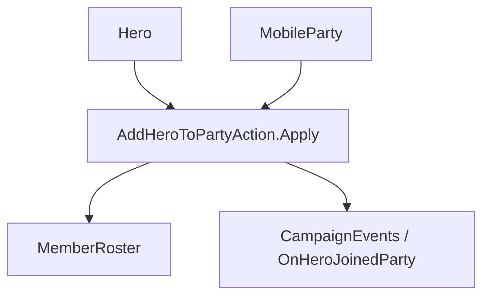

# AddHeroToPartyAction

**Namespace:** `TaleWorlds.CampaignSystem.Actions`  
**Module:** `TaleWorlds.CampaignSystem`  
**Type:** `public static class AddHeroToPartyAction`  
**源文件：** `TaleWorlds.CampaignSystem/Actions/AddHeroToPartyAction.cs`

## 概述

`AddHeroToPartyAction` 是英雄加入 `MobileParty` 的唯一战役转移入口。它会清理旧部队名册、清除据点驻留、移除总督职责、加入新名册，并发布 `OnHeroJoinedParty`，因此不是简单的名册加一。

## 心智模型

把它看成一次名册和生命周期迁移，而不是 `party.MemberRoster.AddToCounts`。内部实现先从旧部队移除英雄，清掉 `StayingInSettlement`，必要时移除总督，再加入目标名册并发布事件。通知参数只控制英雄作为玩家同伴加入主部队时的提示。

## 何时用 / 不用

- 战役规则已经决定英雄加入哪支移动部队时使用。
- 不用它转移普通兵、修改家族归属或仅改变英雄位置。
- 不要在 `OnHeroJoinedParty` 监听器中再次调用同一 Action。

## 依赖关系



- 上游：[Hero](../../campaign/Hero) 和 [MobileParty](../../campaign/MobileParty) 提供来源与目标。
- 下游：名册、总督状态、部队归属以及 [CampaignEvents](../CampaignEvents) 监听器都会看到变更。

## 风险

1. 直接改目标名册会遗留旧部队、驻留和总督状态。
2. 目标部队为空或已失效时迁移无效，调用前要检查战役阶段和对象。
3. 事件监听器可能立刻修改任务或界面，不能把返回当成无副作用的写操作。

## 关键入口

| 方法 | 用途 |
| --- | --- |
| `Apply(Hero hero, MobileParty party, bool showNotification = true)` | 转移英雄并可显示同伴提示 |

## 真实示例

```csharp
using TaleWorlds.CampaignSystem;
using TaleWorlds.CampaignSystem.Actions;

public static void RecruitCompanion(Hero hero, MobileParty party)
{
    if (Campaign.Current == null || hero == null || party == null || !hero.IsAlive)
        return;

    AddHeroToPartyAction.Apply(hero, party, showNotification: party == MobileParty.MainParty);
}
```

调用者只选择目标和提示策略；旧名册清理及加入事件由 Action 统一负责。

## 导航

- 父级：[Campaign Action 目录](./)
- 同级：[GiveGoldAction](../GiveGoldAction) · [TakePrisonerAction](../TakePrisonerAction) · [DestroyPartyAction](../DestroyPartyAction)
- 相关：[Hero](../../campaign/Hero) · [MobileParty](../../campaign/MobileParty) · [CampaignEvents](../CampaignEvents)
