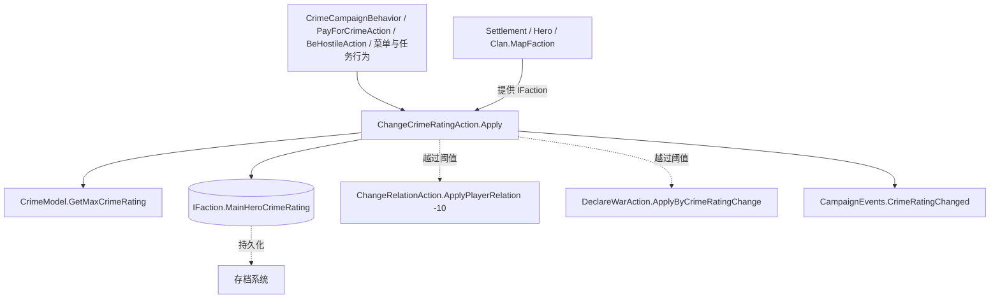

# ChangeCrimeRatingAction（改变主角犯罪值）

**Namespace:** `TaleWorlds.CampaignSystem.Actions`  
**Module:** `TaleWorlds.CampaignSystem`  
**Type:** `public static class ChangeCrimeRatingAction`  
**Base:** `System.Object`（静态类，无基类、无实例状态）  
**源文件路径：** `TaleWorlds.CampaignSystem/Actions/ChangeCrimeRatingAction.cs`

## 概述

`ChangeCrimeRatingAction` 是战役层（`TaleWorlds.CampaignSystem.Actions`）的一个静态 Action 类，唯一公开入口是 `Apply(IFaction, float, bool)`。它负责把「主角在某个派系的犯罪值（`IFaction.MainHeroCrimeRating`）」推进一个变化量，并让截断、通知、越阈值宣战与事件一起发生。原生的每日衰减、缴费、攻击行为以及各类菜单 / 任务行为都通过它来修改犯罪值；模块开发者应当只调用 `Apply`，绝不直接写字段。

## 一句话职责

把「主角相对于某个派系（`IFaction`）的犯罪值」推进一个变化量，并让截断、通知、外交副作用和事件**一起**发生——你永远不应该直接写 `IFaction.MainHeroCrimeRating`。

## 心智模型

把它想成战役世界里「玩家在某王国留下案底」的**唯一合法盖章处**：

- **是什么**：一个静态 Action 类，没有实例、没有自己的状态，入口只有一个公开方法 `Apply`。所有真实逻辑都躲在私有 `ApplyInternal` 里，模块外部不应也不应去调用它。
- **生命周期 / 谁在调用**：通常在战役阶段由原生系统调用，而不是你随手写字段。最典型的调用方：
  - `CrimeCampaignBehavior` 的每日衰减（`Apply(faction, dailyChange, showNotification: false)`）以及和平后把犯罪值清零（`Apply(faction, 0f - faction.MainHeroCrimeRating)`）；
  - `PayForCrimeAction` 缴费把犯罪值压到目标值；
  - `BeHostileAction` 攻击防守方时抬升犯罪值；
  - `EncounterGameMenuBehavior` 的村庄/遭遇菜单（每次 +10，目标为 `Settlement.CurrentSettlement.MapFaction`）；
  - 一堆 Issue/Quest 行为（如 TheSpyParty、RevenueFarming、GangLeaderNeedsWeapons 等），通过 `QuestGiver.MapFaction` 或 `QuestGiver.CurrentSettlement.MapFaction` 拿到派系。
- **所在层**：Campaign Action 层（`TaleWorlds.CampaignSystem.Actions`）。它只改战役世界状态，绝不涉及 Mission / 战场实体。
- **请求 delta ≠ 生效 delta（最关键）**：`ApplyInternal` 先把 `current + delta` 用 `MBMath.ClampFloat(..., 0f, CrimeModel.GetMaxCrimeRating())` 截断成新值 `num`，再反算 `effectiveDelta = num - current`。**通知快讯和 `OnCrimeRatingChanged` 事件都用 `effectiveDelta`**。所以一次 `Apply(faction, 9999f)` 在已满时 `effectiveDelta` 可能为 0，监听器什么也收不到。
- **何时用**：当你的玩法需要让玩家对某个派系的犯罪值发生「合法、可被其它系统感知」的变化时——例如你做了一个会洗劫村庄 / 袭击车队的机制，想让玩家因此在该王国积累案底，进而触发原生犯罪惩罚、警卫敌意乃至宣战。
- **何时不要用**：
  - **不要** `faction.MainHeroCrimeRating = x`：会跳过截断、通知、宣战副作用和事件分发，使犯罪 Behavior 与外交状态漂移、坏档风险上升。
  - **不要**把它当关系 / 外交 API：改关系用 [`ChangeRelationAction`](../ChangeRelationAction)，宣战用 [`DeclareWarAction`](../DeclareWarAction)，媾和用 [`MakePeaceAction`](../MakePeaceAction)。
  - **不要**在 Mission 内、读档 / `SyncData` 期间、或你自己订阅的 `CrimeRatingChanged` 回调里再次调用它（见下方风险段）。
  - **不要**假设传入的 delta 会完整生效——上限由 `CrimeModel.GetMaxCrimeRating()` 决定，负向会被截断到 0。

## 依赖图



- **上游（调用方）**：原生 [`CrimeCampaignBehavior`](../CrimeCampaignBehavior)（每日衰减 / 和平清零）、[`PayForCrimeAction`](../PayForCrimeAction)（缴费降低）、[`BeHostileAction`](../BeHostileAction)（攻击抬升），以及各类菜单与任务行为通过 `Settlement.CurrentSettlement.MapFaction`、`QuestGiver.MapFaction` 等拿到 `IFaction`。
- **被改的实体**：`IFaction.MainHeroCrimeRating`——即「主角相对该派系的犯罪值」→ [`IFaction`](../IFaction)。
- **模型**：[`CrimeModel`](../CrimeModel) 提供 `GetMaxCrimeRating()`（上限）与 `DeclareWarCrimeRatingThreshold`（宣战阈值）。
- **下游副作用 Action**：越过阈值时同步调用 [`ChangeRelationAction`](../ChangeRelationAction)（`ApplyPlayerRelation(faction.Leader, -10)`）与 [`DeclareWarAction`](../DeclareWarAction)（`ApplyByCrimeRatingChange`）。
- **事件**：[`CampaignEvents`](../CampaignEvents) 的 `CrimeRatingChanged`（`IMbEvent<IFaction, float>`，第二个参数是 `effectiveDelta`）在最后派发。
- **真实获取路径**：派系通常来自 [`Settlement`](../../campaign/Settlement)（`.MapFaction`）、[`Hero`](../../campaign/Hero)（`.MapFaction`）、[`Clan`](../../campaign/Clan)（`.MapFaction`）。
- **相关玩法**：[`BribeGuardsAction`](../BribeGuardsAction)（贿赂守卫以避免积累犯罪值，是「不调用本 Action」的现实替代手段）。
- **存档点**：派系犯罪值属于战役状态，经存档系统持久化 → [`SaveManager`](../../save-system/SaveManager)；运行时事件不会在读档后重放。

## ⚠ 风险与崩溃 / 坏档边界

1. **阶段错误**：必须在战役阶段（Campaign tick / `CampaignBehavior` / 游戏菜单回调）调用。禁止在 Mission 内、`SyncData` / 读档期间调用——此时 `Campaign.Current.Models` 可能尚未就绪或与反序列化竞争；引用尚未注册到 Campaign 的 `Settlement` / 派系会导致写入无效引用或坏档。
2. **阈值副作用在事件之前同步发生**：当 `num > CrimeModel.DeclareWarCrimeRatingThreshold` 且玩家是自家派系领袖（`Hero.MainHero.MapFaction.Leader == Hero.MainHero`）、目标派系尚未交战且非自家派系时，Apply 会在 `OnCrimeRatingChanged` **之前**同步调用 `ChangeRelationAction.ApplyPlayerRelation(faction.Leader, -10)` 与 `DeclareWarAction.ApplyByCrimeRatingChange`。即一次小幅正向变更可能直接宣战并降低关系。在自己的 `CrimeRatingChanged` 监听器里做不可逆操作前，必须重新检查当前派系战争状态。
3. **事件 delta 可能小于请求值**：监听器应读取事件参数（`effectiveDelta`），不要用你传入的原始请求重算。
4. **通知在字段写入「之前」基于 `num` 计算**：不要误以为通知弹出时所有外交副作用已经完成。
5. **直接改字段的危害**：`faction.MainHeroCrimeRating = x` 跳过截断 / 通知 / 宣战 / 事件，犯罪 Behavior 与外交状态会漂移，且不会被任何监听器感知。
6. **反馈循环**：不要从 `CrimeRatingChanged` 回调或 `SyncData` 中再次调用 Apply，否则可能形成同步递归。
7. **空 / 未注册目标**：`faction` 为 `null` 或尚未注册到 Campaign 的对象时，写 `MainHeroCrimeRating` 或读 `MapFaction` 会抛错。调用前确认 `faction != null` 且来自真实战役对象（如 `Settlement.CurrentSettlement.MapFaction`）。

## 成员说明

### 变更入口

#### `public static void Apply(IFaction faction, float deltaCrimeRating, bool showNotification = true)`

对 `faction` 的犯罪值施加 `deltaCrimeRating`（可正可负）。

- **用途**：让主角对某个派系的犯罪值发生「合法、可被全游戏感知」的变化。
- **副作用（按顺序）**：
  1. `MBMath.ClampFloat(current + delta, 0f, CrimeModel.GetMaxCrimeRating())` 得到新值 `num`；
  2. 反算 `effectiveDelta = num - current`；
  3. 若 `showNotification == true` 且 `effectiveDelta` 不为近似 0，弹出快讯 `Your criminal rating with {FACTION_NAME} has increased/decreased by {CHANGE} to {NEW_RATING}`；
  4. 写入 `faction.MainHeroCrimeRating = num`；
  5. 若越过 `DeclareWarCrimeRatingThreshold` 且满足条件，降低关系 -10 并宣战（见风险段）；
  6. 通过 `CampaignEventDispatcher.Instance.OnCrimeRatingChanged(faction, effectiveDelta)` 派发事件。
- **何时调用**：任何想让玩家罪值变化被截断、通知、外交与事件管线共同处理的时刻。静默场景（如每日衰减、内部结算）务必传 `showNotification: false`，否则玩家每个 tick 都会收到通知。
- **不要**：在 Mission / `SyncData` 内调用；期望请求 delta 完整生效；把 `faction` 传成 `null` 或未注册对象。

#### `private static void ApplyInternal(IFaction faction, float deltaCrimeRating, bool showNotification)`

唯一实现载体，**不是 mod 入口**。仅供 `Apply` 调用，不要通过反射去调它——它随时可能随游戏版本改动。

## 真实使用示例

### 示例 1：订阅有效变化（真实获取路径 + 真实事件订阅）

在一个 `CampaignBehavior` 里监听玩家在「当前据点所属派系」的犯罪变化。注意事件第二个参数是 `effectiveDelta`，不是你传入的请求值：

```csharp
using TaleWorlds.CampaignSystem;
using TaleWorlds.CampaignSystem.Actions;
using TaleWorlds.CampaignSystem.Settlements;

public sealed class CrimeObserverBehavior : CampaignBehaviorBase
{
    public override void RegisterEvents()
    {
        // 真实订阅路径：CampaignEvents 是静态事件容器
        CampaignEvents.CrimeRatingChanged.AddNonSerializedListener(this, OnCrimeRatingChanged);
    }

    private void OnCrimeRatingChanged(IFaction faction, float effectiveDelta)
    {
        // 只关心玩家自家派系之外、且有真实变化的派系
        if (faction == null || faction == Hero.MainHero.MapFaction || effectiveDelta == 0f)
            return;

        // effectiveDelta 是截断后的有效变化量，可能远小于你请求的值
        RecordCrimeChange(faction, effectiveDelta, faction.MainHeroCrimeRating);
    }

    public override void SyncData(IDataStore dataStore)
    {
        // 不要在 SyncData 里调用 ChangeCrimeRatingAction.Apply —— 见风险段
    }
}
```

### 示例 2：玩家袭击某地车队后，对当前据点所属派系 +10 犯罪值

真实获取路径来自 `Settlement.CurrentSettlement`（原生 `EncounterGameMenuBehavior` 正是这么做的）：

```csharp
using TaleWorlds.CampaignSystem;
using TaleWorlds.CampaignSystem.Actions;
using TaleWorlds.CampaignSystem.Settlements;

public static class CrimeReward
{
    public static void OnPlayerRaidedCaravan()
    {
        Settlement here = Settlement.CurrentSettlement;
        if (here == null || here.MapFaction == null)
            return; // 不要在 Mission / 无据点上下文里调用

        // 正确：走 Action，截断 / 通知 / 阈值宣战 / 事件一起发生
        ChangeCrimeRatingAction.Apply(here.MapFaction, 10f);

        // 错误写法（绝对禁止）：跳过截断、通知、宣战副作用与事件分发，
        // 会让犯罪 Behavior 与外交状态漂移，监听器永远收不到这次变化。
        // here.MapFaction.MainHeroCrimeRating += 10f;
    }
}
```

> 想「不积累犯罪值」的玩法（例如潜行完成抢劫）应改用 [`BribeGuardsAction`](../BribeGuardsAction) 直接贿赂守卫，而不是绕过本 Action 改字段。

## 跨版本提示

- `Apply(IFaction, float, bool showNotification = true)` 的签名与内部逻辑在 1.3.15 与 1.4.5 中**一致**：同样的截断边界、阈值检查、`CrimeRatingChanged(float = effectiveDelta)` 事件形状。
- 两版本唯一差异在实现细节：`MBInformationManager.AddQuickInformation` 的入参、`ApproximatelyEqualsTo` 的容差（1.3.15 用 `1E-05f`，1.4.5 用默认值），对 mod 行为无影响。
- 每日衰减 / 和平清零 / 缴费等调用路径以 1.4.5 原生行为为准。

## 导航

- **↑ 父级：** [campaign-ext API 目录](../)
- **↔ 同级（同桶 Action / 模型）：** [ChangeRelationAction](../ChangeRelationAction) · [DeclareWarAction](../DeclareWarAction) · [MakePeaceAction](../MakePeaceAction) · [PayForCrimeAction](../PayForCrimeAction) · [BeHostileAction](../BeHostileAction) · [BribeGuardsAction](../BribeGuardsAction) · [CrimeModel](../CrimeModel) · [IFaction](../IFaction) · [CrimeCampaignBehavior](../CrimeCampaignBehavior)
- **相关 / 上游枢纽：** [Campaign](../../campaign/Campaign) · [Settlement](../../campaign/Settlement) · [Hero](../../campaign/Hero) · [Clan](../../campaign/Clan) · [Kingdom](../../campaign/Kingdom) · [CampaignEvents](../CampaignEvents) · [CampaignBehaviorBase](../CampaignBehaviorBase) · [SaveManager](../../save-system/SaveManager)
- **架构边界：** [崩溃与存档边界](../../../architecture/crash-boundaries) · [SDK 总览](../../../architecture/sdk-overview)
