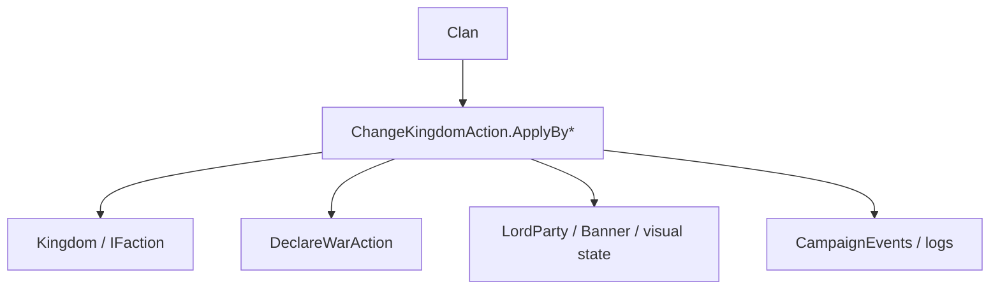

# ChangeKingdomAction

**Namespace:** `TaleWorlds.CampaignSystem.Actions`  
**Module:** `TaleWorlds.CampaignSystem`  
**Type:** `public static class ChangeKingdomAction`  
**Base:** 无  
**源文件：** `TaleWorlds.CampaignSystem/Actions/ChangeKingdomAction.cs`

## 概述

`ChangeKingdomAction` 负责把 `Clan` 从当前派系转入、离开或叛乱到另一个 `Kingdom`。公开方法用 `ChangeKingdomActionDetail` 表达原因，私有 `ApplyInternal` 处理战争、封地/佣兵状态、图标和事件；调用者只选择准确分支，不直接拼接这些状态变化。

## 心智模型

“改王国”不是 `clan.Kingdom = newKingdom`。先选原因：普通加入、叛变加入、创建王国、佣兵加入/离开、王国毁灭离开或针对旧王国的叛乱；Action 才会选择正确的外交和清理分支。`ApplyByLeaveWithRebellionAgainstKingdom` 会继续进入 [DeclareWarAction](../DeclareWarAction)，不要在外层再手动宣战。

## 何时用 / 不用

- 用于 Kingdom 决策、叛乱、佣兵合同和王国毁灭的正式执行点。
- 不用来修改单个 Hero 的关系或据点所有权；分别使用 [ChangeRelationAction](../ChangeRelationAction) 和 [ChangeOwnerOfSettlementAction](../ChangeOwnerOfSettlementAction)。
- 不要在 `CampaignEvents` 的观察回调里再次调用改变同一 Clan 的方法。

## 依赖关系



- 上游：[Clan](../../campaign/Clan)、[Kingdom](../../campaign/Kingdom) 和 KingdomDecision 提供原因与目标。
- 下游：派系战争、佣兵状态、领主队伍图标、事件与日志会随分支更新。
- 相关：[Campaign](../../campaign/Campaign)、[DeclareWarAction](../DeclareWarAction)、[MakePeaceAction](../MakePeaceAction)。

## 风险

1. 新王国或叛乱路径可能自动宣战；外层再调用 `DeclareWarAction` 会重复事件和日志。
2. `Clan` 有正在 MapEvent 的 WarParty 时，源码会延迟/拒绝部分转换；不要在战斗中强制迁移。
3. 离开王国会重算封地、佣兵合同和队伍旗帜；直接清空字段会让存档引用断裂。
4. `shouldStayInKingdomUntil` 与佣兵奖励影响后续 AI；不要用默认值掩盖已有合同。

## 关键入口

| 方法 | 原因 |
| --- | --- |
| `ApplyByJoinToKingdom(Clan, Kingdom, CampaignTime, bool)` | 普通加入 |
| `ApplyByJoinToKingdomByDefection(Clan, Kingdom, Kingdom, CampaignTime, bool)` | 从旧王国叛变加入 |
| `ApplyByCreateKingdom(Clan, Kingdom, bool)` | 新王国成立 |
| `ApplyByLeaveKingdom(Clan, bool)` | 正常离开 |
| `ApplyByLeaveWithRebellionAgainstKingdom(Clan, bool)` | 离开并对旧王国叛乱 |
| `ApplyByJoinFactionAsMercenary` / `ApplyByLeaveKingdomAsMercenary` | 佣兵合同 |
| `ApplyByLeaveByKingdomDestruction` / `ApplyByLeaveKingdomByClanDestruction` | 破坏性清理 |

## 真实示例

```csharp
using TaleWorlds.CampaignSystem;
using TaleWorlds.CampaignSystem.Actions;

public static class RebellionScript
{
    public static bool StartRebellion(Clan clan)
    {
        if (Campaign.Current == null || clan == null || clan.Kingdom == null)
            return false;
        if (clan.IsEliminated || clan.IsUnderMercenaryService)
            return false;

        ChangeKingdomAction.ApplyByLeaveWithRebellionAgainstKingdom(clan, showNotification: true);
        return clan.Kingdom == null;
    }
}
```

叛乱会把外交后果交给 Action 内部；调用者只负责在安全的 KingdomDecision/地图阶段选择正确入口。

## 导航

- ↑ 父级：[Actions 目录](../actions/)
- ↔ 同级：[DeclareWarAction](../DeclareWarAction) · [MakePeaceAction](../MakePeaceAction) · [ChangeRelationAction](../ChangeRelationAction)
- 相关：[Clan](../../campaign/Clan) · [Kingdom](../../campaign/Kingdom) · [Campaign](../../campaign/Campaign) · [ChangeKingdomActionDetail](../ChangeKingdomActionDetail)
