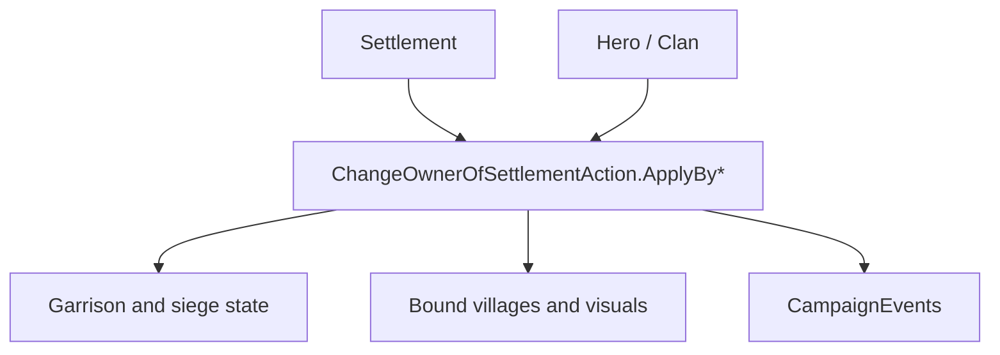

# ChangeOwnerOfSettlementAction

**Namespace:** `TaleWorlds.CampaignSystem.Actions`  
**Module:** `TaleWorlds.CampaignSystem`  
**Type:** `public static class ChangeOwnerOfSettlementAction`  
**源文件：** `TaleWorlds.CampaignSystem/Actions/ChangeOwnerOfSettlementAction.cs`

## 概述

`ChangeOwnerOfSettlementAction` 在保留转移原因的前提下把据点交给新英雄。内部细节枚举决定驻军、可宣称状态、地图事件收尾、绑定村庄视觉更新以及 `OnSettlementOwnerChanged` 事件，不能只改 `OwnerClan` 字段。

## 心智模型

先按战役原因选择 `ApplyBy*`，再由 `ApplyInternal` 执行对应的 `ChangeOwnerOfSettlementDetail`。围城转移会记录俘获者并可能摧毁旧驻军；叛乱、家族销毁、离开派系、交易、赠礼和王国决策各有不同的宣称与清理语义。Action 还会刷新据点和村庄视觉，停止不兼容的围城或劫掠目标。

## 何时用 / 不用

- 按围城、叛乱、交易、赠礼、决策、离开或销毁原因选择相应重载。
- 不要直接写 `Town.OwnerClan` 或据点所有者字段。
- 不要用它改变英雄家族归属；那应走 [ChangeKingdomAction](../ChangeKingdomAction) 或相应家族 Action。

## 依赖关系



- 上游：[Settlement](../../campaign/Settlement)、[Hero](../../campaign/Hero) 和战役原因选择新所有者与细节。
- 下游：城镇驻军、村庄部队、地图事件、宣称状态和 [CampaignEvents](../CampaignEvents) 消费转移结果。

## 风险

1. 传错重载会改变宣称资格，使围城或叛乱流程语义错误。
2. `ApplyBySiege` 在需要摧毁旧驻军时要求俘获英雄带有部队。
3. 所有权会同时更新大量地图对象，调用前后都不要缓存旧所有者或驻军状态。

## 关键入口

| 方法 | 原因 |
| --- | --- |
| `ApplyByDefault(Hero, Settlement)` | 普通转移 |
| `ApplyByKingDecision(Hero, Settlement)` | 王国决策 |
| `ApplyBySiege(Hero, Hero, Settlement)` | 围城夺取并带俘获者 |
| `ApplyByLeaveFaction` / `ApplyByBarter` / `ApplyByRebellion` | 离开派系、交易或叛乱 |
| `ApplyByDestroyClan` / `ApplyByGift` | 家族销毁或赠礼 |

## 真实示例

```csharp
using TaleWorlds.CampaignSystem;
using TaleWorlds.CampaignSystem.Actions;

public static void GrantSettlement(Hero newOwner, Settlement settlement)
{
    if (Campaign.Current == null || newOwner == null || settlement == null || newOwner.Clan == null)
        return;

    ChangeOwnerOfSettlementAction.ApplyByGift(settlement, newOwner);
}
```

只有在战役规则确实表示赠礼时才使用赠礼入口；原因会决定后续系统行为。

## 导航

- 父级：[Campaign Action 目录](../actions/)
- 同级：[ChangeKingdomAction](../ChangeKingdomAction) · [StartBattleAction](../StartBattleAction) · [ChangeRelationAction](../ChangeRelationAction)
- 相关：[Settlement](../../campaign/Settlement) · [Hero](../../campaign/Hero) · [CampaignEvents](../CampaignEvents)
