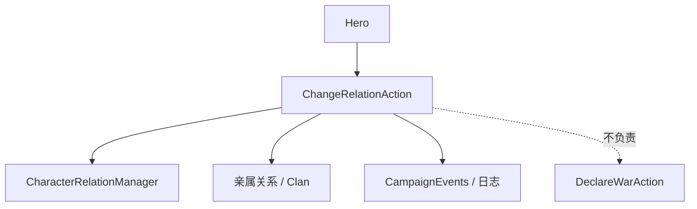

# ChangeRelationAction

**Namespace:** `TaleWorlds.CampaignSystem.Actions`  
**Module:** `TaleWorlds.CampaignSystem`  
**Type:** `public static class ChangeRelationAction`  
**Base:** 无  
**源文件：** `TaleWorlds.CampaignSystem/Actions/ChangeRelationAction.cs`

## 概述

`ChangeRelationAction` 把关系变化写入 Campaign 的关系管理器，并根据来源选择 `ChangeRelationDetail`、通知和亲属影响。它不是单纯给 `Hero` 属性加整数；调用点应先确定关系来源，再让 Action 统一发布副作用。

## 心智模型

先区分关系的两端和原因：玩家对某英雄用 `ApplyPlayerRelation`，两个英雄之间用 `ApplyRelationChangeBetweenHeroes`，使节谈判用 `ApplyEmissaryRelation`。公开入口把原因交给私有 `ApplyInternal`，后者负责记录、亲属传播和事件。关系数值查询应读取 Hero/关系管理器，改变必须走 Action。

## 何时用 / 不用

- 用于对话、任务、战斗结果或外交流程已经决定“关系改变多少”的时刻。
- 不用来宣战/媾和；分别使用 [DeclareWarAction](../DeclareWarAction) 或 [MakePeaceAction](../MakePeaceAction)。
- 不要直接写关系缓存或在每个 tick 反复累加；重复事件会污染 AI 和存档。

## 依赖关系



- 上游：[Hero](../../campaign/Hero) 和任务/对话提供关系两端；[Campaign](../../campaign/Campaign) 持有关系管理器。
- 下游：亲属关系、派系态度、日志和事件监听器消费变化。
- 相关：[CampaignEvents](../CampaignEvents)、[DeclareWarAction](../DeclareWarAction)、[ChangeKingdomAction](../ChangeKingdomAction)。

## 风险

1. 把关系变化当成宣战条件并在同一回调里重复调用，可能产生双重关系事件；外交状态请交给外交 Action。
2. `Hero` 为空、已死亡或不在当前 Campaign 时，内部关系管理器可能抛错或写入无效引用。
3. `affectRelatives` 会传播到亲属；任务只想改变两人时明确传 `false`。
4. 在读档或 Campaign 初始化前调用会绕过关系管理器的重建顺序。

## 关键入口

| 方法 | 用途 |
| --- | --- |
| `ApplyPlayerRelation(Hero, int, bool, bool)` | 玩家与目标英雄的关系 |
| `ApplyRelationChangeBetweenHeroes(Hero, Hero, int, bool)` | 两名英雄之间 |
| `ApplyEmissaryRelation(Hero, Hero, int, bool)` | 使节/谈判来源 |

## 真实示例

```csharp
using TaleWorlds.CampaignSystem;
using TaleWorlds.CampaignSystem.Actions;

public static class RelationReward
{
    public static void RewardConversation(Hero target)
    {
        if (Campaign.Current == null || Hero.MainHero == null || target == null || !target.IsAlive)
            return;

        ChangeRelationAction.ApplyPlayerRelation(target, 5, affectRelatives: true);
    }
}
```

如果奖励来自两个 NPC 的谈判，改用 `ApplyEmissaryRelation`，不要伪造玩家关系来源。

## 导航

- ↑ 父级：[Actions 目录](../actions/)
- ↔ 同级：[DeclareWarAction](../DeclareWarAction) · [MakePeaceAction](../MakePeaceAction) · [KillCharacterAction](../KillCharacterAction)
- 相关：[Hero](../../campaign/Hero) · [Campaign](../../campaign/Campaign) · [CampaignEvents](../CampaignEvents) · [ChangeRelationDetail](../ChangeRelationDetail)
