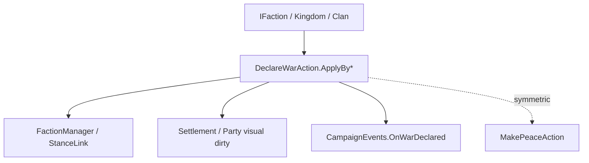

# DeclareWarAction

**Namespace:** `TaleWorlds.CampaignSystem.Actions`  
**Module:** `TaleWorlds.CampaignSystem`  
**Type:** `public static class DeclareWarAction`  
**Base:** 无  
**源文件：** `TaleWorlds.CampaignSystem/Actions/DeclareWarAction.cs`

## 概述

`DeclareWarAction` 让两个 `IFaction` 正式进入战争状态。不同 `ApplyBy*` 将 Kingdom 决策、玩家敌对、叛乱、罪行、建国、王位主张或召集参战写入 `DeclareWarDetail`，私有内部路径再调用 `FactionManager.DeclareWar`、更新视觉并发布 `OnWarDeclared`。

## 心智模型

“关系下降”不等于“战争”。行为或 KingdomDecision 决定原因，`DeclareWarAction.ApplyBy*` 执行外交状态跳转；`MakePeaceAction` 是对称的结束入口。不要直接修改 `StanceLink` 或只调用 `FactionManager.DeclareWar`，否则会缺少政治停滞、地图图标和事件副作用。

## 何时用 / 不用

- 用 `ApplyByKingdomDecision`、`ApplyByRebellion`、`ApplyByPlayerHostility` 等与真实原因匹配的方法。
- 不用来处理个人关系（[ChangeRelationAction](../ChangeRelationAction)）或 Mission 内的近战；后者不是地图外交。
- 调用前确认双方非空、尚未交战且 Campaign 已完成加载。

## 依赖关系



- 上游：[Kingdom](../../campaign/Kingdom)、[Clan](../../campaign/Clan) 或决定系统提供派系和原因。
- 下游：Campaign 的战争关系、AI、任务、地图视觉和 `CampaignEvents` 监听器。
- 相关：[MakePeaceAction](../MakePeaceAction)、[ChangeKingdomAction](../ChangeKingdomAction)、[CampaignEvents](../CampaignEvents)。

## 风险

1. 直接改派系关系会漏掉 `OnWarDeclared`、政治停滞和图标刷新。
2. 选择错误的 `ApplyBy*` 会让日志/AI 误判战争原因，即使战争状态已经成立。
3. 在读档、主角尚未加入派系或 MapEvent 正在结算时宣战，可能让 AI/存档处于半完成状态。
4. 已经交战的双方重复调用没有收益，却可能触发重复监听器。

## 关键入口

`ApplyByKingdomDecision`、`ApplyByDefault`、`ApplyByPlayerHostility`、`ApplyByRebellion`、`ApplyByCrimeRatingChange`、`ApplyByKingdomCreation`、`ApplyByClaimOnThrone`、`ApplyByCallToWarAgreement` 均为 `ApplyBy*(IFaction faction1, IFaction faction2)`；mod 只调用公开层，不能反射调用 `ApplyInternal`。

## 真实示例

```csharp
using TaleWorlds.CampaignSystem;
using TaleWorlds.CampaignSystem.Actions;

public static class WarScript
{
    public static bool DeclareFromDecision(Kingdom target)
    {
        if (Campaign.Current == null || Hero.MainHero?.MapFaction == null || target == null)
            return false;
        IFaction player = Hero.MainHero.MapFaction;
        if (player == target || player.IsAtWarWith(target))
            return false;

        DeclareWarAction.ApplyByKingdomDecision(player, target);
        return player.IsAtWarWith(target);
    }
}
```

玩家主动攻击达到敌对阈值时应使用 `ApplyByPlayerHostility`，叛乱由 `ChangeKingdomAction` 选择 `ApplyByRebellion`，不要把所有来源都标为 Default。

## 导航

- ↑ 父级：[Actions 目录](../actions/)
- ↔ 同级：[MakePeaceAction](../MakePeaceAction) · [ChangeKingdomAction](../ChangeKingdomAction) · [ChangeRelationAction](../ChangeRelationAction)
- 相关：[Kingdom](../../campaign/Kingdom) · [Clan](../../campaign/Clan) · [CampaignEvents](../CampaignEvents)
