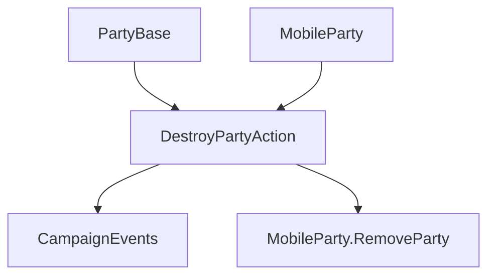

# DestroyPartyAction

**Namespace:** `TaleWorlds.CampaignSystem.Actions`  
**Module:** `TaleWorlds.CampaignSystem`  
**Type:** `public static class DestroyPartyAction`  
**源文件：** `TaleWorlds.CampaignSystem/Actions/DestroyPartyAction.cs`

## 概述

`DestroyPartyAction` 负责移动部队的终止迁移：通知部队和地图交互物被摧毁，然后调用 `RemoveParty`。它还提供主动解散入口，先离开据点并发布 `OnPartyDisbanded`，再执行同一套移除逻辑。

## 心智模型

这是终态 Action，不是清空名册的工具。普通 `Apply` 检查主部队保护、发布 `OnMobilePartyDestroyed` 与 `OnMapInteractableDestroyed`，最后移除部队；`ApplyForDisbanding` 适合有意解散的部队，会先离开当前据点并发布解散事件。调用后不要继续持有该部队引用。

## 何时用 / 不用

- 战斗或战役规则已经确定部队应被摧毁时使用 `Apply`。
- 主动解散且部队可能仍在据点中时使用 `ApplyForDisbanding`。
- 不能用于 `MobileParty.MainParty`，也不要在普通代码直接调用 `RemoveParty`。

## 依赖关系



- 上游：[MobileParty](../../campaign/MobileParty) 与可选的 [PartyBase](../../campaign/PartyBase) 描述目标和摧毁者。
- 下游：`OnMobilePartyDestroyed`、`OnMapInteractableDestroyed`、解散事件以及 [CampaignEvents](../CampaignEvents) 监听器会清理相关系统。

## 风险

1. 对非活动部队调用会触发断言，说明上游生命周期已经错误。
2. 部队仍在据点时直接 `Apply` 会跳过显式离开和解散事件顺序。
3. 监听器可能立刻移除任务、地图标记或商队，返回后不要再读取旧状态。

## 关键入口

| 方法 | 用途 |
| --- | --- |
| `Apply(PartyBase destroyerParty, MobileParty destroyedParty)` | 遭遇后的终止摧毁 |
| `ApplyForDisbanding(MobileParty disbandedParty, Settlement relatedSettlement)` | 带据点清理的主动解散 |

## 真实示例

```csharp
using TaleWorlds.CampaignSystem;
using TaleWorlds.CampaignSystem.Actions;

public static void RemoveCaravan(MobileParty caravan)
{
    if (Campaign.Current == null || caravan == null || caravan == MobileParty.MainParty || !caravan.IsActive)
        return;

    DestroyPartyAction.Apply(null, caravan);
}
```

计划性解散应传入相关据点并调用 `ApplyForDisbanding`，以保持离开据点和事件边界一致。

## 导航

- 父级：[Campaign Action 目录](./)
- 同级：[AddHeroToPartyAction](../AddHeroToPartyAction) · [EnterSettlementAction](../EnterSettlementAction) · [KillCharacterAction](../KillCharacterAction)
- 相关：[MobileParty](../../campaign/MobileParty) · [PartyBase](../../campaign/PartyBase) · [CampaignEvents](../CampaignEvents)
