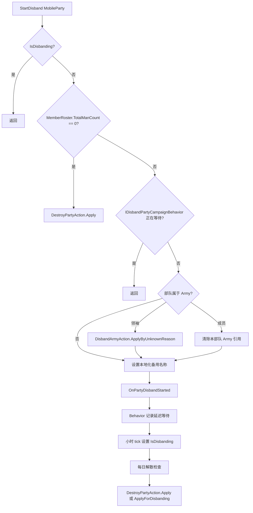

# DisbandPartyAction

**命名空间：** `TaleWorlds.CampaignSystem.Actions`  
**模块：** `TaleWorlds.CampaignSystem`  
**类型：** `public static class DisbandPartyAction`  
**源码：** `TaleWorlds.CampaignSystem/Actions/DisbandPartyAction.cs`

## 一句话定位

请求战役系统按官方流程移除一个 `MobileParty`：普通部队进入由 Behavior 持有的等待流程，而空部队立即被摧毁。它把同步 Action、延迟 Behavior、事件链和终态移除连成可追踪的生命周期。

## 心智模型

这是一个**状态迁移请求**，不是兵员名册工具，也不是最终删除操作。`StartDisband` 同步完成少量清理，然后发布 `OnPartyDisbandStarted`。内置的 [`DisbandPartyCampaignBehavior`](../DisbandPartyCampaignBehavior/) 接收事件，把部队写入自己的、会参与存档同步的等待字典，之后才将请求推进到 `IsDisbanding` 与每日摧毁检查。

当部队仍是有效战役对象、但应该通过正常解散生命周期离开地图时使用它。不要用它来移除单个英雄、清空兵员、按军团原因解散整个 `Army`，或摧毁已经失活的部队；这些分别应走兵员/英雄 Action、[`DisbandArmyAction`](../DisbandArmyAction/) 或 [`DestroyPartyAction`](../DestroyPartyAction/)。

必须区分三件事：

- **Start：** 请求并标记解散流程，可能先让部队脱离军团；通常不会在本次调用中移除 `MobileParty`。
- **Destroy：** 通常由 `DisbandPartyCampaignBehavior` 稍后执行；它发布摧毁/解散事件并调用 `MobileParty.RemoveParty`。
- **Cancel：** 只恢复本地解散显示与移动状态，不是事务回滚。

## 源码控制流

`StartDisband` 严格按以下顺序检查：

1. 如果 `disbandParty.IsDisbanding` 已为 `true`，直接返回，避免 Behavior 已推进到终态后再次启动。
2. 如果 `disbandParty.MemberRoster.TotalManCount == 0`，调用 `DestroyPartyAction.Apply(null, disbandParty)` 后返回。这个分支不会进入等待 Behavior，不处理军团，不设置自定义名称，也不会通过本方法发布 `OnPartyDisbandStarted`。
3. 从 `Campaign.Current` 获取 [`IDisbandPartyCampaignBehavior`](../IDisbandPartyCampaignBehavior/)。若实现存在且 `IsPartyWaitingForDisband(disbandParty)` 为 `true`，直接返回，不重复排队。
4. 如果部队属于军团：军团领袖部队调用 `DisbandArmyAction.ApplyByUnknownReason`；普通成员则直接执行 `disbandParty.Army = null`，不会解散整个军团。
5. 将部队自定义名称设置为本地化的 `"{CLAN_NAME} Party"`，其中 `CLAN_NAME` 取 `ActualClan.Name`，没有氏族时使用 `CampaignData.NeutralFactionName`。
6. 发布 `CampaignEventDispatcher.Instance.OnPartyDisbandStarted(disbandParty)`。

Action 本身**不会**设置 `IsDisbanding = true`。内置 Behavior 会在监听事件后把部队写入 `_partiesThatWaitingToDisband`，通常等待一个战役日；小时 tick 再设置 `IsDisbanding`。在海上时可能使用 `CampaignTime.Never`，直到部队离海或到达据点后再继续。



## 公开方法与副作用

### `StartDisband(MobileParty disbandParty)`

在你的战役规则已经确定部队应正常离场时调用。它只对上述状态提供有限的幂等保护：已进入 `IsDisbanding` 的部队，以及已在注册 Behavior 中等待的部队，会被忽略。它不会替调用者验证所有生命周期条件，也不会把已经摧毁或失活的部队变回有效对象。

军团处理是有意不对称的：对领袖部队启动会通过 `DisbandArmyAction` 解散整个军团；对附属成员启动只清除该成员的军团引用。不要假定在事件回调结束前军团关系仍保持不变。

### `CancelDisband(MobileParty disbandParty)`

实现按以下顺序执行四件事：

1. 发布 `OnPartyDisbandCanceled`。
2. 设置 `disbandParty.IsDisbanding = false`。
3. 用 `TextObject.GetEmpty()` 清除自定义名称。
4. 调用 `SetMoveModeHold()` 让部队停住。

该事件允许 [`DisbandPartyCampaignBehavior`](../DisbandPartyCampaignBehavior/) 删除等待字典中的条目。但它不会恢复兵员、领袖、据点位置、军团归属或之前的 AI 指令；也不能撤销已经由领袖分支触发的军团解散，更不能复活已经交给 `DestroyPartyAction` 的部队。

## Behavior、事件与最终移除

接口 [`IDisbandPartyCampaignBehavior`](../IDisbandPartyCampaignBehavior/) 只暴露 `IsPartyWaitingForDisband`。内置实现才是延迟状态的所有者，并通过存档数据同步 `_partiesThatWaitingToDisband`。AI Behavior 也查询这个接口，避免给正在等待解散的部队安排普通决策。

内置 `OnPartyDisbandStarted` 有几个重要分支：

- 非玩家氏族且名册 `Count >= 10` 的部队，会尝试寻找一个在据点、活跃、未归属其他部队的氏族英雄，并为其安排延迟传送、让其担任新领袖；找不到时等待一天。
- 玩家商队会禁止新的 AI 决策，并被导向合适的据点。
- 玩家氏族部队若仍有领袖，会移除该领袖并触发断言，因为官方流程预期进入该状态的玩家部队已经无领袖。
- 其他部队会进入一天的等待；海上部队使用 `Never`，待离海后再开始计时。

当 `IsDisbanding` 变为 `true` 后，`DailyTickParty` 会调用 Behavior 的每日检查。若兵员名册为空，调用 `DestroyPartyAction.Apply`；若部队静止时间足够，或已经位于目标据点，则调用 `DestroyPartyAction.ApplyForDisbanding`，它先离开据点、发布 `OnPartyDisbanded`，再移除部队。因此空部队快速分支可能只产生 `OnMobilePartyDestroyed`，而没有通常的 `OnPartyDisbandStarted`/`OnPartyDisbanded` 序列。

`DestroyPartyAction.Apply` 还会发布 `OnMapInteractableDestroyed` 并移除部队。监听器应把 `OnMobilePartyDestroyed` 与 `OnPartyDisbanded` 都视为终态边界，回调后重新获取当前战役对象。

## 何时调用，何时不要调用

| 情况 | 正确选择 |
| --- | --- |
| 有效部队失去领袖，或明确要按正常流程退场 | `DisbandPartyAction.StartDisband(party)` |
| 移除 companion 后仍有非空 companion 部队 | 源码中的 `RemoveCompanionAction` 在改名册后调用 `StartDisband`。 |
| 名册已经为空，部队应立即消失 | 源码快速分支使用 `DestroyPartyAction.Apply(null, party)`；不要期待解散开始事件。 |
| 因凝聚力、食物、不活跃、目标或其他军团原因结束整个军团 | 使用匹配的 `DisbandArmyAction.ApplyBy*`。 |
| 战斗或战役规则已确定部队被摧毁 | 使用 `DestroyPartyAction.Apply(destroyerParty, party)`。 |
| 主动解散要在据点完成 | 让 Behavior 调用 `DestroyPartyAction.ApplyForDisbanding`。 |
| 替代英雄已成为领袖，需要在终态前恢复部队 | 真实的立即传送为领袖流程会在 `ChangePartyLeader` 后调用 `CancelDisband`。 |
| 部队正在地图事件中、已经失活或是主部队 | 不要强制调用，让所属战役 Action 管理生命周期。 |

## 真实调用点示例

`RemoveCompanionAction` 是 1.4.5 的直接调用者。它在修改部队名册后，若 `Count == 0` 就摧毁部队，否则启动正常解散生命周期：

```csharp
if (partyBase.MemberRoster.Count == 0)
{
    DestroyPartyAction.Apply(null, partyBase.MobileParty);
}
else
{
    DisbandPartyAction.StartDisband(partyBase.MobileParty);
}
```

恢复边界同样有直接调用点：`TeleportHeroAction.ApplyImmediateTeleportToPartyAsPartyLeader` 先加入英雄、改变部队领袖；如果目标已处于最终解散状态，再调用 `CancelDisband(targetParty)`。新领袖和名册由调用者负责，因为它们不属于本 Action 的恢复范围。

模组响应替代领袖决定时，应使用所属 Action 保持获取路径和顺序正确：

```csharp
TeleportHeroAction.ApplyImmediateTeleportToPartyAsPartyLeader(
    replacementHero,
    targetParty);
```

不要只写 `IsDisbanding = false` 或只清空 `Party.SetCustomName`；那会跳过取消事件，使 Behavior 的等待状态不一致。

## 依赖图

| 依赖 | 在迁移中的作用 |
| --- | --- |
| [`MobileParty`](../../campaign/MobileParty/) | 提供 `MemberRoster`、`Army`、`IsDisbanding`、移动、所有权与最终部队身份。 |
| [`IDisbandPartyCampaignBehavior`](../IDisbandPartyCampaignBehavior/) | 通过 `IsPartyWaitingForDisband` 防止重复启动。 |
| [`DisbandPartyCampaignBehavior`](../DisbandPartyCampaignBehavior/) | 持有延迟等待、存档同步、领袖替换、据点寻路与每日摧毁流程。 |
| [`DisbandArmyAction`](../DisbandArmyAction/) | 目标是军团领袖部队时解散整个军团。 |
| [`DestroyPartyAction`](../DestroyPartyAction/) | 负责空部队的立即移除，以及后续主动解散的终态移除。 |
| [`CampaignEvents`](../CampaignEvents/) | 接收开始、取消、完成解散及移动部队摧毁通知。 |
| [`CampaignBehaviorBase`](../CampaignBehaviorBase/) | 监听这些事件的常见 Behavior 生命周期基类。 |

## 风险边界

- 不要把重复调用 `StartDisband` 当作自己的业务去重方案。内置守卫会压掉重复请求，但不会修复模组自己的重复记账。
- 不要依赖空名册部队的 `OnPartyDisbandStarted`；`TotalManCount == 0` 会在事件前直接走 `DestroyPartyAction.Apply`。
- 不要把 `CancelDisband` 当作回滚。军团解散、名册改动、领袖移除、英雄传送与终态摧毁都超出它的恢复边界。
- 不要在摧毁事件后继续把部队引用当作稳定对象。监听器可能在分发期间移除地图物、任务、商队状态或其他关联。
- 不要对领袖部队手动写 `party.Army = null`，也不要在只处理单部队时调用 `DisbandArmyAction`；源码明确区分领袖与普通成员。
- 不要在构造函数、模块加载早期或非战役线程调用战役 Action。`Campaign.Current`、Behavior 注册表、事件分发器、名册与地图状态必须已经可用。

## 版本注记

1.3.15 源码中的 `DisbandPartyAction` 控制流与 `IDisbandPartyCampaignBehavior` 契约和本页依据的 1.4.5 源码一致：两者都只有 `StartDisband` 与 `CancelDisband`，使用相同的空名册快速分支、相同的 Behavior 查询、相同的军团领袖/成员区分、相同的本地化备用名称，以及相同的开始/取消事件。1.4.5 的 Behavior 源码同时包含更完整的海上场景：海上部队可用 `CampaignTime.Never` 等待，直到到达可继续延迟流程的位置。对 1.4.5 战役代码，应把 Behavior 持有的时间安排视为兼容边界，不要硬编码“一天后一定摧毁”。

## 导航

- ↑ [Campaign Action 目录](../actions/) · [API 目录](../../)
- ↔ [DisbandArmyAction](../DisbandArmyAction/) · [DestroyPartyAction](../DestroyPartyAction/) · [IDisbandPartyCampaignBehavior](../IDisbandPartyCampaignBehavior/)
- 相关：[DisbandPartyCampaignBehavior](../DisbandPartyCampaignBehavior/) · [CampaignEvents](../CampaignEvents/) · [MobileParty](../../campaign/MobileParty/) · [CampaignBehaviorBase](../CampaignBehaviorBase/)
- 语言：[English page](../../../../en/api/campaign-ext/DisbandPartyAction/)
