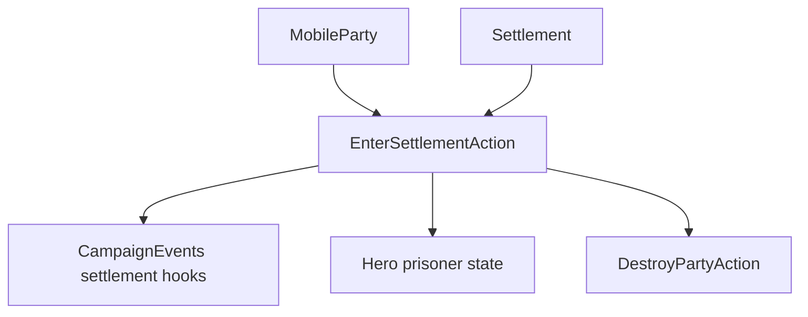

# EnterSettlementAction

**Namespace:** `TaleWorlds.CampaignSystem.Actions`  
**Module:** `TaleWorlds.CampaignSystem`  
**Type:** `public static class EnterSettlementAction`  
**源文件：** `TaleWorlds.CampaignSystem/Actions/EnterSettlementAction.cs`

## 概述

`EnterSettlementAction` 是进入 `Settlement` 的战役边界。不同入口区分普通部队、巷道访问、无部队英雄和囚犯；内部按固定顺序发布进入事件，并更新部队位置、囚犯状态、领主访问时间、解散和逃跑行为。

## 心智模型

先根据进入主体选择重载。`ApplyForParty` 处理 `CurrentSettlement`、港口、军团合并后进入事件链；`ApplyForCharacterOnly` 设置 `StayingInSettlement`；`ApplyForPrisoner` 先把英雄切成囚犯。若部队正在解散且目标就是该据点，内部会转到 `DestroyPartyAction.ApplyForDisbanding`。所有路径最终发布 Before、Entered、After 三个事件。

## 何时用 / 不用

- 地图或遭遇流程已经确认主体跨过据点边界时使用。
- 不要把它当作瞬移工具，也不要用它绕过进入据点的规则。
- 调用后不要在外层重复发布三个进入事件。

## 依赖关系



- 上游：[MobileParty](../../campaign/MobileParty)、[Hero](../../campaign/Hero) 和 [Settlement](../../campaign/Settlement) 提供进入对象。
- 下游：[CampaignEvents](../CampaignEvents)、囚犯名册、领主访问时间和据点组件消费这次迁移。

## 风险

1. 选错重载会丢失部队位置、囚犯或无部队英雄的语义。
2. 解散部队会在据点入口中被销毁，返回后不能继续使用该对象。
3. 事件监听器可能打开菜单或改变战役状态，不要从监听器递归进入据点。

## 关键入口

| 方法 | 用途 |
| --- | --- |
| `ApplyForParty(MobileParty, Settlement)` | 普通部队进入 |
| `ApplyForPartyEntersAlley(MobileParty, Settlement, Alley, bool)` | 巷道进入 |
| `ApplyForCharacterOnly(Hero, Settlement)` | 无部队英雄进入 |
| `ApplyForPrisoner(Hero, Settlement)` | 囚犯进入 |

## 真实示例

```csharp
using TaleWorlds.CampaignSystem;
using TaleWorlds.CampaignSystem.Actions;

public static void RecordArrival(MobileParty party, Settlement settlement)
{
    if (Campaign.Current == null || party == null || settlement == null || !party.IsActive)
        return;

    EnterSettlementAction.ApplyForParty(party, settlement);
}
```

Action 会同时更新地图和事件顺序，调用者不应复制这些写入。

## 导航

- 父级：[Campaign Action 目录](./)
- 同级：[StartBattleAction](../StartBattleAction) · [DestroyPartyAction](../DestroyPartyAction) · [TakePrisonerAction](../TakePrisonerAction)
- 相关：[Settlement](../../campaign/Settlement) · [MobileParty](../../campaign/MobileParty) · [CampaignEvents](../CampaignEvents)
