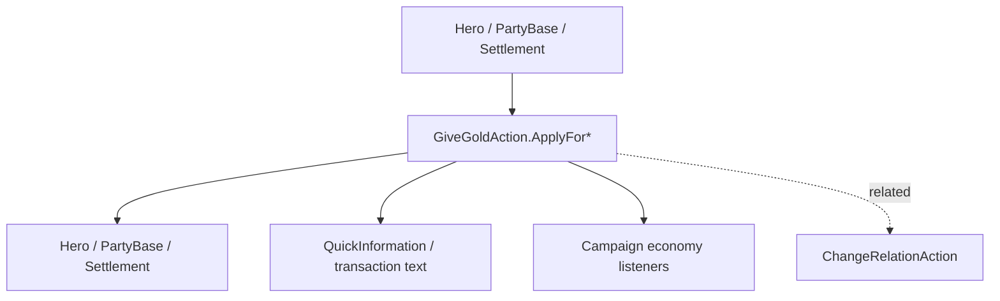

# GiveGoldAction

**Namespace:** `TaleWorlds.CampaignSystem.Actions`  
**Module:** `TaleWorlds.CampaignSystem`  
**Type:** `public static class GiveGoldAction`  
**Base:** 无  
**源文件：** `TaleWorlds.CampaignSystem/Actions/GiveGoldAction.cs`

## 概述

`GiveGoldAction` 统一处理 Hero、PartyBase、Settlement 之间的金币流转。它的私有内部路径根据付款方/收款方类型写余额并决定是否显示 QuickInformation；调用者不应直接给 `Gold` 属性赋值。

## 心智模型

先确定资金两端，再选择对应的 `ApplyFor...`：角色到角色、角色到据点、据点到 Party、Party 到角色等。`amount` 是转移量，不是“设置余额”；负数和付款方余额不足会把经济逻辑带入未定义分支。通知开关只控制 UI，不会跳过经济副作用。

## 何时用 / 不用

- 用于奖励、税收、交易结算、据点拨款和 Party 维护费等正式资金流。
- 不用来模拟关系或影响力；那是关系/模型系统的职责。
- 不要直接写 Hero/Party/Settlement 的金币字段，也不要在每帧重复发放。

## 依赖关系



- 上游：[Hero](../../campaign/Hero)、[PartyBase](../../campaign/PartyBase)、[Settlement](../../campaign/Settlement) 提供真实账户。
- 下游：交易 UI、经济行为、日志和存档余额。
- 相关：[Campaign](../../campaign/Campaign)、[ChangeRelationAction](../ChangeRelationAction)、[ItemRoster](../ItemRoster)。

## 风险

1. 从余额不足的 Party/Settlement 扣款会让奖励和维护逻辑失真；调用前验证支付方余额。
2. 在读档或 Campaign 初始化之前操作账户，会绕过经济对象的建立顺序。
3. 把 `disableNotification` 当作“无副作用”开关是误解；它只隐藏快速提示。
4. 同一 tick 重复调用会产生真实金币，不会自动去重。

## 关键入口

`ApplyBetweenCharacters(Hero, Hero, int, bool)`、`ApplyForCharacterToSettlement`、`ApplyForSettlementToCharacter`、`ApplyForSettlementToParty`、`ApplyForPartyToSettlement`、`ApplyForPartyToCharacter`、`ApplyForCharacterToParty`、`ApplyForPartyToParty` 覆盖八种资金方向。

## 真实示例

```csharp
using TaleWorlds.CampaignSystem;
using TaleWorlds.CampaignSystem.Actions;

public static class QuestReward
{
    public static bool PayHero(Hero receiver, int amount)
    {
        if (Campaign.Current == null || Hero.MainHero == null || receiver == null || amount <= 0)
            return false;
        if (Hero.MainHero.Gold < amount)
            return false;

        GiveGoldAction.ApplyBetweenCharacters(Hero.MainHero, receiver, amount);
        return receiver.Gold >= amount;
    }
}
```

据点税收应选 `ApplyForSettlementToParty` 等明确方向；不要用交换两次的方式伪造“设置余额”。

## 导航

- ↑ 父级：[Actions 目录](../actions/)
- ↔ 同级：[ChangeRelationAction](../ChangeRelationAction) · [AddHeroToPartyAction](../AddHeroToPartyAction) · [MakePeaceAction](../MakePeaceAction)
- 相关：[Hero](../../campaign/Hero) · [PartyBase](../../campaign/PartyBase) · [Settlement](../../campaign/Settlement) · [Campaign](../../campaign/Campaign)
