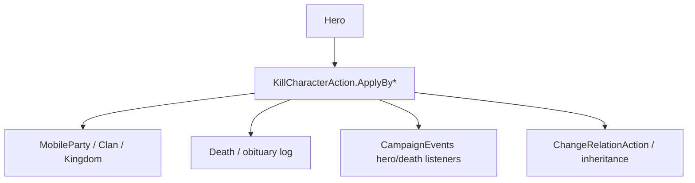

# KillCharacterAction

**Namespace:** `TaleWorlds.CampaignSystem.Actions`  
**Module:** `TaleWorlds.CampaignSystem`  
**Type:** `public static class KillCharacterAction`  
**Base:** 无  
**源文件：** `TaleWorlds.CampaignSystem/Actions/KillCharacterAction.cs`

## 职责一句话

它把一名 `Hero` 通过“老死、战死、谋杀、处决、生产中死亡或系统移除”等原因推进到终止状态，并处理 Party、Clan、继承、日志和 `CampaignEvents` 的连锁副作用。

## 心智模型

不要把“死亡”理解成 `hero.IsAlive = false`。每个 `ApplyBy*` 先把原因映射到 `KillCharacterActionDetail`，再进入私有 `ApplyInternal`；内部会决定死亡标记、是否解散英雄所属队伍、继承人、关系和事件。`ApplyByRemove` 是清理不应留下死亡叙事的对象，不能拿来伪造战死。

## 何时用

- 老龄行为用 `ApplyByOldAge`，战斗结算用 `ApplyByBattle`，处决流程用 `ApplyByExecution` 或 `ApplyByExecutionAfterMapEvent`。
- 仅移除剧情临时英雄时用 `ApplyByRemove`；外部脚本要保留正确的原因和日志语义。
- 不要直接写 Hero 的死亡/Party 字段，也不要在 `HeroKilled` 事件回调里再次杀同一英雄。

## 依赖关系



- 上游：[Hero](../../campaign/Hero) 由 Campaign/行为决定死亡原因；[Campaign](../../campaign/Campaign) 提供世界上下文。
- 下游：Party 和 Clan 可能重算领导者/继承人；事件监听器和日志消费最终原因。
- 相关：[DestroyPartyAction](../DestroyPartyAction)、[ChangeRelationAction](../ChangeRelationAction)、[CampaignEvents](../CampaignEvents)。

## 风险

1. 在 Mission/MapEvent 尚未结算时杀英雄，可能让战斗双方、囚犯名册和死亡日志处于半完成状态；应在官方结算回调后调用。
2. 重复调用不同 `ApplyBy*` 会重复触发继承、关系和事件；先检查 `IsAlive`/死亡标记。
3. 直接移除 Party 或修改 `Hero.PartyBelongedTo` 会绕过囚禁、家族领导权和存档引用更新。
4. `Hero.MainHero` 是玩家角色，除非走游戏允许的剧情路径，不要从 mod tick 无条件调用死亡动作。
5. `ApplyByExecutionAfterMapEvent` 只适合 MapEvent 结束后的处决场景；普通处决应使用 `ApplyByExecution`。

## 关键入口

| 方法 | 典型原因 |
| --- | --- |
| `ApplyByOldAge(Hero, bool)` | Aging 行为达到寿命 |
| `ApplyByWounds(Hero, bool)` / `ApplyByBattle(Hero, Hero, bool)` | 伤势或战斗死亡 |
| `ApplyByMurder(Hero, Hero, bool)` | 谋杀，killer 可为空 |
| `ApplyByExecution(Hero, Hero, bool, bool)` | 囚犯处决 |
| `ApplyByExecutionAfterMapEvent(Hero, Hero, bool, bool)` | MapEvent 后处决 |
| `ApplyInLabor(Hero, bool)` | 生产中失去母亲 |
| `ApplyByRemove(Hero, bool, bool)` | 无死亡叙事的系统清理 |
| `ApplyByDeathMark(Hero, bool)` / `ApplyByDeathMarkForced` | 已设置的死亡标记 |

## 真实示例

```csharp
using TaleWorlds.CampaignSystem;
using TaleWorlds.CampaignSystem.Actions;

public static class ModExecution
{
    public static bool ExecuteCapturedHero(Hero victim, Hero executer)
    {
        if (Campaign.Current == null || victim == null || executer == null)
            return false;
        if (!victim.IsAlive || victim == Hero.MainHero)
            return false;

        KillCharacterAction.ApplyByExecution(victim, executer, showNotification: true);
        return !victim.IsAlive;
    }
}
```

该路径对应原生 `PartyScreenLogic` 的处决调用；若来源是战斗，改用 `ApplyByBattle`，不要事后再补关系或 Party 字段。

## 导航

- ↑ 父级：[Actions 目录](../actions/)
- ↔ 同级：[TakePrisonerAction](../TakePrisonerAction) · [DestroyPartyAction](../DestroyPartyAction) · [MarriageAction](../MarriageAction)
- 相关：[Hero](../../campaign/Hero) · [Campaign](../../campaign/Campaign) · [CampaignEvents](../CampaignEvents) · [ChangeRelationAction](../ChangeRelationAction)
