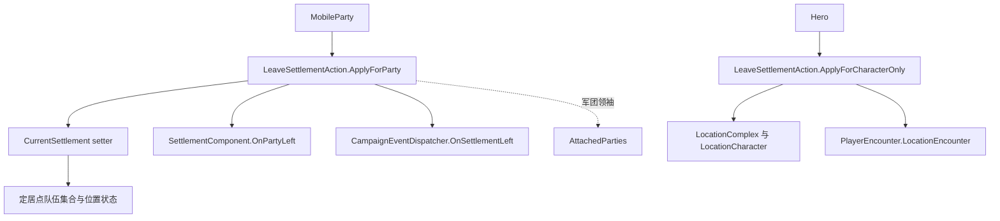

# LeaveSettlementAction

**命名空间：** `TaleWorlds.CampaignSystem.Actions`  
**模块：** `TaleWorlds.CampaignSystem`  
**类型：** `public static class LeaveSettlementAction`  
**基类：** 无  
**源码：** `TaleWorlds.CampaignSystem/Actions/LeaveSettlementAction.cs`

## 职责

这个动作关闭已经建立的定居点归属：要么让 `MobileParty` 离开定居点边界，要么清理不属于移动队伍离场的 `Hero` 定居、地点状态。它是带同步回调的状态迁移，不是移动、传送或销毁队伍的 API。

## 心智模型

两个公开入口作用于不同的拥有者：

- `ApplyForParty` 改变队伍的战役定居点归属。`MobileParty.CurrentSettlement = null` 会更新定居点队伍列表、位置相关状态、视觉状态和附属队伍；随后动作按需重置海上锚点，调用定居点组件，并派发 `OnSettlementLeft`。
- `ApplyForCharacterOnly` 用于不通过移动队伍离场来表达定居点存在的 Hero。它清除 `StayingInSettlement`；当地点记录和角色记录都存在时，还会移除 Hero 的 `LocationCharacter` 以及 `PlayerEncounter.LocationEncounter` 中的陪同角色记录。

只在战役流程已经决定主体确实离开时使用这些入口。不要直接写 `CurrentSettlement` 或 `StayingInSettlement` 来模拟动作，也不要用本动作把队伍移动到另一个定居点。目的地迁移使用 [EnterSettlementAction](../EnterSettlementAction)，有意改变 Hero 归属使用 [TeleportHeroAction](../TeleportHeroAction)，需要移除队伍本身则使用 [DestroyPartyAction](../DestroyPartyAction)。

两个方法都要求对象确实有当前定居点。源码会先保存 `mobileParty.CurrentSettlement` 或 `hero.CurrentSettlement`，随后解引用该定居点；对没有当前定居点的队伍或 Hero 调用，可能在清理完成前失败。

## 依赖与顺序



`ApplyForParty` 在清除领袖前执行军团领袖分支。对每个处于同一被捕获定居点的附属队伍，它递归执行队伍清理。如果附属队伍是 `MobileParty.MainParty` 且 `PlayerEncounter.Current` 存在，特殊分支会调用 `PlayerEncounter.Finish()`，而不是递归调用 `ApplyForParty`。`Finish()` 可能在遭遇结束时让玩家离开定居点，但这不表示本方法会为每个附属队伍都派发 `OnSettlementLeft`。

递归完成后，领袖的 `CurrentSettlement` setter 会从旧定居点移除领袖，并把 `null` 传播给附属队伍。之后本动作才会在 `IsCurrentlyAtSea` 时重置 `Anchor`，调用 `currentSettlement.SettlementComponent.OnPartyLeft(mobileParty)`，再通过 `CampaignEventDispatcher.OnSettlementLeft` 同步派发 `CampaignEvents` 监听器。因此事件处理器看到的队伍已经没有 `CurrentSettlement`，但回调参数仍是之前保存的定居点。

仅角色路径独立运行：`hero.CurrentSettlement` 由队伍、俘虏关系或 `StayingInSettlement` 推导。方法先清除 `StayingInSettlement`，再让 `LocationComplex` 查找 Hero 所在地点；只有找到对应 `LocationCharacter` 时，才移除角色并调用 `PlayerEncounter.LocationEncounter.RemoveAccompanyingCharacter(hero)`。它不会派发 `OnSettlementLeft`。

## 公开入口

以下是 1.4.5 源文件中的全部公开方法。

### `ApplyForParty`

```csharp
public static void ApplyForParty(MobileParty mobileParty)
```

用于队伍离开当前定居点。除了队伍的 `CurrentSettlement` 迁移，还可能影响同一定居点的军团附属队伍、玩家遭遇状态、海上锚点、定居点组件回调、战役监听器以及已序列化的队伍状态。它不会销毁 `MobileParty`。

在 v1.3.15 源码中，当 `MobileParty.MainParty` 不属于军团附属队伍时，本方法还会在清除定居点前调用 `SetMoveModeHold()`。指定的 1.4.5 权威源码没有这一步；不要假设新版源码仍有这个 v1.3.15 移动模式副作用。

### `ApplyForCharacterOnly`

```csharp
public static void ApplyForCharacterOnly(Hero hero)
```

用于仅角色离场，例如 Hero 结束定居点停留或地点遭遇。它会清除停留标记并按条件移除地点记录；不会从队伍编制移除 Hero，不会改变 Hero 的 `CharacterStates`，不会派发 `OnSettlementLeft`，也不会传送 Hero。

## 调用时机与真实获取路径

战役源码中的真实调用路径是 `Campaign.OnPlayerCharacterChanged`。它从 `Hero.MainHero` 获取当前 Hero，检查 `CurrentSettlement` 和俘虏状态，再根据 `Hero.MainHero.PartyBelongedTo` 选择队伍入口；没有队伍时选择仅角色入口：

```csharp
public void OnPlayerCharacterChanged(out bool isMainPartyChanged)
{
    isMainPartyChanged = false;
    MainParty = Hero.MainHero.PartyBelongedTo;

    if (Hero.MainHero.CurrentSettlement != null && !Hero.MainHero.IsPrisoner)
    {
        if (MainParty == null)
            LeaveSettlementAction.ApplyForCharacterOnly(Hero.MainHero);
        else
            LeaveSettlementAction.ApplyForParty(MainParty);
    }
}
```

这是源码中的获取路径，不是建议每次角色切换都调用该动作。模组应从自己的战役迁移流程进入这个边界，并保持相同前置条件。另一个真实调用者是 `DestroyPartyAction.ApplyForDisbanding`：它会在派发解散事件和移除队伍前调用 `ApplyForParty`。

## 风险与生命周期边界

1. **`CurrentSettlement` 是硬前置条件。** 两个公开方法都不是“已经离开则无事发生”的幂等空操作。`ApplyForParty` 后续使用 `currentSettlement.SettlementComponent`；`ApplyForCharacterOnly` 会访问 `currentSettlement.LocationComplex`。调用前检查当前定居点，不要在另一个动作已经清除它的回调中再次调用。
2. **军团与主队语义不对称。** 只有军团领袖遍历 `AttachedParties`。同一定居点的普通附属队伍会递归通知；存在遭遇时，附属的 `MobileParty.MainParty` 走 `PlayerEncounter.Finish()` 分支。不要从一次领袖调用推断每个队伍都会得到一次 `OnSettlementLeft`。
3. **定居点回调同步且可重入。** `OnPartyLeft` 与 `OnSettlementLeft` 在队伍定居点引用清空后、同一次调用中运行。监听器可能改变战役状态、打开菜单或调用另一个动作；应重新读取 `CurrentSettlement`，不要在回调中对同一队伍递归离场。
4. **海上状态不等于下船状态。** `IsCurrentlyAtSea` 为真时，动作调用 `mobileParty.Anchor.ResetPosition()`。它不会把 `IsCurrentlyAtSea` 设为 `false`，也不会用陆地移动替代海上迁移。锚点属于战役状态，应让正常海上动作负责下船。
5. **地点清理是有条件的。** 仅角色离场总会清除 `StayingInSettlement`，但只有找到 Hero 的地点记录时才会移除 `LocationCharacter` 和陪同记录。地点记录缺失不代表整个遭遇已经结束；结束遭遇时应与 `PlayerEncounter` 的流程协调。
6. **对象生命周期与存档。** 本动作不会创建或销毁 `MobileParty`、`Hero`、`Settlement` 或地点对象，而是修改战役引用和序列化字段，例如 `MobileParty._currentSettlement`、`LastVisitedSettlement`、`Anchor` 以及 Hero 的停留/归属状态。不要在 `DestroyPartyAction`、存档加载或事件回调之后继续持有过期的队伍、定居点或地点角色引用；应按当前战役状态重新获取对象，并把模组的持久标记放入 `CampaignBehaviorBase` 的存档契约，而不是静态待处理引用列表。
7. **与 TeleportHeroAction 的顺序有关。** Hero 立即传送到定居点时，会先调用本动作清理旧定居点角色状态，再从旧队伍编制移除 Hero，最后进入目标定居点。延迟传送也可能先清理旧定居点，再在后续前置检查中返回。因此 `ApplyForCharacterOnly` 是更大迁移流程中的清理步骤，不是完整传送操作；需要完整迁移时使用 [TeleportHeroAction](../TeleportHeroAction)。

## 版本说明

本 v1.3.15 页面保留 v1.3.15 路径和准确的公开入口；主要行为说明按用户指定的 `bannerlord-1.4.5/Bannerlord.Source` `LeaveSettlementAction.cs` 权威源码核对。v1.3.15 源码具有相同的两个公开签名，并额外在非军团主队离场时执行 `MobileParty.MainParty` 的保持移动模式；它还向 `PlayerEncounter.Finish` 显式传入 `true`，而 1.4.5 源码使用相同方法的默认参数。面向其他游戏版本发布模组前，应重新检查这些版本相关副作用。

## 导航

- 父级：[campaign-ext 目录](./)
- 同级：[EnterSettlementAction](../EnterSettlementAction) · [TeleportHeroAction](../TeleportHeroAction) · [DestroyPartyAction](../DestroyPartyAction)
- 相关：[MobileParty](../../campaign/MobileParty) · [Hero](../../campaign/Hero) · [Settlement](../../campaign/Settlement) · [CampaignEvents](../CampaignEvents) · [CampaignBehaviorBase](../CampaignBehaviorBase) · [IDataStore](../IDataStore)
