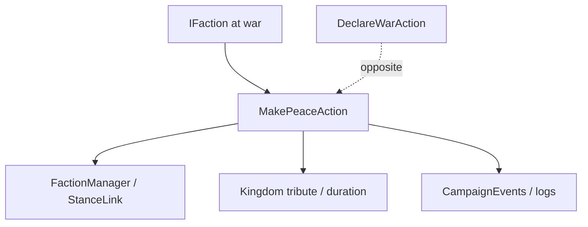

# MakePeaceAction

**Namespace:** `TaleWorlds.CampaignSystem.Actions`  
**Module:** `TaleWorlds.CampaignSystem`  
**Type:** `public static class MakePeaceAction`  
**Base:** 无  
**源文件：** `TaleWorlds.CampaignSystem/Actions/MakePeaceAction.cs`

## 概述

`MakePeaceAction` 把两个 `IFaction` 从战争状态切回和平；Kingdom 决策版本同时接收每日贡金和持续时间，内部负责更新 `FactionManager`、战争日志、事件和相关 AI 状态。

## 心智模型

和平不是把 `IsAtWarWith` 变成 false。`Apply` 适合没有额外贡金语义的通用结束，`ApplyByKingdomDecision` 表达议会/决策谈判并写入贡金。该 Action 是 [DeclareWarAction](../DeclareWarAction) 的对称面，调用后让事件和存档都看到同一外交变更。

## 何时用 / 不用

- KingdomDecision、Barter 或剧情正式结束战争时调用。
- 不用来结束单次 MapEvent；战斗收尾由 MapEvent/Mission 流程处理。
- 不要直接清理 StanceLink 或手写贡金字段；先确认双方仍在当前 Campaign 且确实交战。

## 依赖关系



- 上游：[Kingdom](../../campaign/Kingdom)、决策/Barter 提供双方与贡金条件。
- 下游：外交 AI、贡金状态、日志和事件监听器。
- 相关：[DeclareWarAction](../DeclareWarAction)、[ChangeKingdomAction](../ChangeKingdomAction)、[Campaign](../../campaign/Campaign)。

## 风险

1. 双方未交战时调用没有游戏价值，却可能让监听器重复执行。
2. 贡金数值和持续时间单位是每日战役时间；传入负数或随意的长周期会污染经济与存档。
3. 在战争决策尚未结算或读档中途调用，可能和 KingdomDecision 的结果互相覆盖。
4. 和平不会自动结束当前 Mission；需要让地图/战斗层走自己的结束路径。

## 关键入口

- `Apply(IFaction faction1, IFaction faction2)`：通用和平。
- `ApplyByKingdomDecision(IFaction faction1, IFaction faction2, int dailyTributeFrom1To2, int dailyTributeDuration)`：决策和平并写入贡金。

## 真实示例

```csharp
using TaleWorlds.CampaignSystem;
using TaleWorlds.CampaignSystem.Actions;

public static class PeaceScript
{
    public static bool EndWar(Kingdom ally, Kingdom opponent)
    {
        if (Campaign.Current == null || ally == null || opponent == null)
            return false;
        if (!ally.IsAtWarWith(opponent))
            return false;

        MakePeaceAction.Apply(ally, opponent);
        return !ally.IsAtWarWith(opponent);
    }
}
```

若结果来自议会协议，改用 `ApplyByKingdomDecision` 并使用已计算的每日贡金与持续时间。

## 导航

- ↑ 父级：[Actions 目录](../actions/)
- ↔ 同级：[DeclareWarAction](../DeclareWarAction) · [ChangeKingdomAction](../ChangeKingdomAction) · [ChangeRelationAction](../ChangeRelationAction)
- 相关：[Kingdom](../../campaign/Kingdom) · [Campaign](../../campaign/Campaign) · [CampaignEvents](../CampaignEvents) · [MakePeaceDetail](../MakePeaceDetail)
