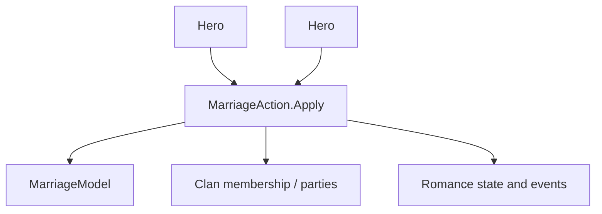

# MarriageAction

**Namespace:** `TaleWorlds.CampaignSystem.Actions`  
**Module:** `TaleWorlds.CampaignSystem`  
**Type:** `public static class MarriageAction`  
**源文件：** `TaleWorlds.CampaignSystem/Actions/MarriageAction.cs`

## 概述

`MarriageAction` 在当前 `MarriageModel` 接受伴侣后执行完整婚姻迁移：互相设置配偶，应用模型计算的关系增量，按规则移动英雄家族，结束求爱、切换恋爱状态，并发布结婚前事件。

## 心智模型

婚姻不是给两个 `Hero.Spouse` 赋值。内部先检查适配性，再让模型决定关系增加和婚后家族。跨家族或王国时还可能移除总督、脱离军团或领主部队、结束敌对行动、更新家园据点；最后才结束求爱并切换 Romance 状态。

## 何时用 / 不用

- 战役决策或交易流程已经选定两名英雄时使用。
- 不要绕过 `MarriageModel.IsCoupleSuitableForMarriage`，也不要直接编辑配偶字段。
- 不要在 `OnBeforeHeroesMarried` 回调里再次触发婚姻或关系写入。

## 依赖关系



- 上游：[Hero](../../campaign/Hero) 与战役 `MarriageModel` 决定是否可结婚及目标家族。
- 下游：[Clan](../../campaign/Clan)、部队、[ChangeRelationAction](../ChangeRelationAction)、恋爱系统和 [CampaignEvents](../CampaignEvents) 消费结果。

## 风险

1. 不合适的伴侣会被拒绝，调用者不能假设配偶字段已经改变。
2. 跨王国迁移可能解散军团、使英雄逃亡或结束敌对行动。
3. 事件发生在多次写入之后，监听器不要重复修改关系、恋爱或配偶。

## 关键入口

| 方法 | 用途 |
| --- | --- |
| `Apply(Hero firstHero, Hero secondHero, bool showNotification = true)` | 执行模型认可的婚姻 |

## 真实示例

```csharp
using TaleWorlds.CampaignSystem;
using TaleWorlds.CampaignSystem.Actions;

public static void Marry(Hero first, Hero second)
{
    if (Campaign.Current == null || first == null || second == null || first == second)
        return;

    MarriageAction.Apply(first, second, showNotification: true);
}
```

模型仍是适配性和家族归属的权威；调用者只选择两名英雄和提示策略。

## 导航

- 父级：[Campaign Action 目录](./)
- 同级：[ChangeRelationAction](../ChangeRelationAction) · [ChangeKingdomAction](../ChangeKingdomAction) · [KillCharacterAction](../KillCharacterAction)
- 相关：[Hero](../../campaign/Hero) · [Clan](../../campaign/Clan) · [CampaignEvents](../CampaignEvents)
