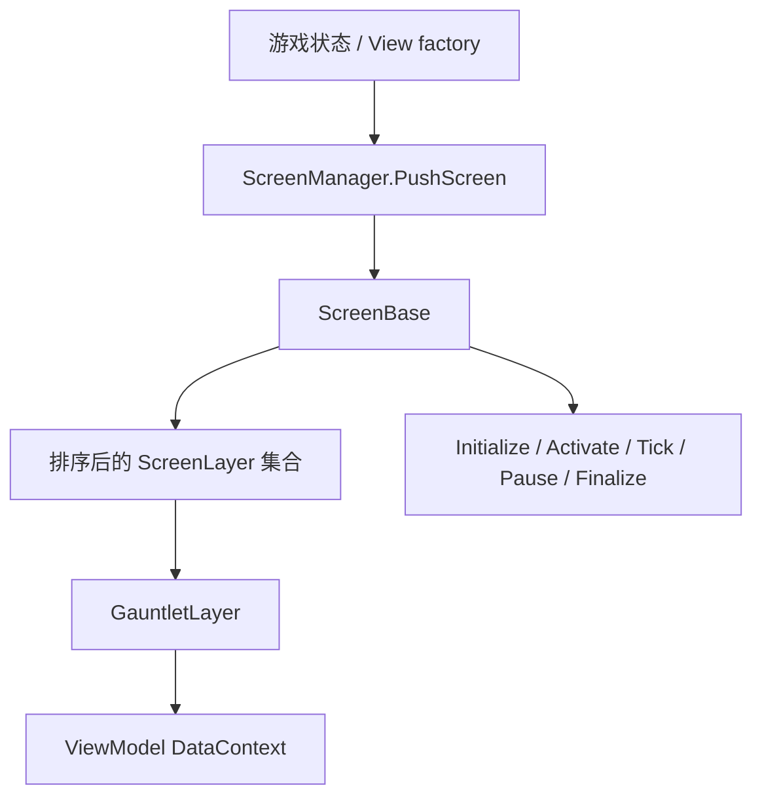

# ScreenBase

**Namespace:** `TaleWorlds.ScreenSystem`  
**Module:** `TaleWorlds.ScreenSystem`  
**Type:** `public abstract class ScreenBase`  
**Base:** `System.Object`  
**源文件：** `TaleWorlds.ScreenSystem/ScreenBase.cs`

## 职责一句话

它是一个完整界面状态的生命周期容器：持有排序后的 `ScreenLayer`，在成为当前屏幕时激活这些层，并把输入、帧更新和结束信号传给它们；失活或终结时还负责按屏幕生命周期停用并释放仍归它所有的层。

## 心智模型

把 `ScreenBase` 看成 **屏幕状态 + 图层宿主**，不是一个控件。屏幕由游戏状态或视图工厂创建，由 [ScreenManager](../../gui/ScreenManager) 压入栈；屏幕中的 Gauntlet UI 是 [GauntletLayer](../../engine/GauntletLayer)，其 DataContext 来自 [ViewModel](../../core-extra/ViewModel)。

### 生命周期

```text
HandleInitialize -> OnInitialize
HandleActivate  -> 各 layer 激活 -> OnActivate
FrameTick(dt)   -> OnFrameTick(dt)（仅 IsActive）
PostFrameTick   -> OnPostFrameTick(dt)
HandlePause     -> 各 layer 停用 -> OnPause
HandleDeactivate-> 各 layer 停用 -> OnDeactivate
HandleFinalize  -> OnFinalize -> 反向 finalize 仍在集合中的 layers
```

`Handle*` 是引擎内部包装；mod 通常只覆写 protected 钩子。`OnInitialize` 每个实例只调用一次，`OnFrameTick` 只有 `IsActive` 时才运行。

## 何时用 / 何时不要用

- **需要独占全屏状态**（独立调试工具、编辑器）时，继承 `ScreenBase`，让游戏状态/`ScreenManager` 管理它。
- **只想给地图、任务或菜单叠加面板/HUD** 时，不要另建屏幕；取得 `ScreenManager.TopScreen`，创建 `GauntletLayer`，调用 `AddLayer`。
- **只想改变领域状态** 时，不要把战役规则放进屏幕钩子；将行为交给 Campaign/Action，屏幕只显示结果。
- 屏幕切换、加层和移层应在游戏/UI 主线程完成；不要从后台回调直接操作屏幕栈。

## 依赖关系



- 栈拥有者：[ScreenManager](../../gui/ScreenManager)，当前实例通过 `TopScreen` 获取。
- 图层下游：[GauntletLayer](../../engine/GauntletLayer)；它是层，不是独立屏幕。
- 数据下游：[ViewModel](../../core-extra/ViewModel) 与 movie XML。
- 状态上游：游戏状态管理器和视图工厂；1.4.5 的 `GameStateScreenManager` 会根据 `IGameStateListener` 选择 push/clean/pop 路径。

## 关键成员与调用时机

- `OnInitialize()`：一次性构造层、VM 和屏幕资源；此时屏幕尚未激活，不要假设能接收输入。
- `OnActivate()` / `OnDeactivate()`：进入或离开栈顶时使用，适合启停订阅、焦点和临时层。
- `OnPause()` / `OnResume()`：上方屏幕覆盖/恢复时使用；暂停不等于对象已销毁。
- `OnFrameTick(float dt)` / `OnPostFrameTick(float dt)`：当前屏幕需要的轻量逐帧逻辑。
- `OnFinalize()`：释放自己的 VM、事件订阅和 movie。派生类完成清理后调用 `base.OnFinalize()`。
- `Layers`：只读的 `MBReadOnlyList<ScreenLayer>`；外部不要直接修改，用 `AddLayer`/`RemoveLayer`。
- `AddLayer(ScreenLayer layer)`：拒绝 `null`、已 finalize 或重复层；屏幕已激活时立即激活新层并触发 `OnAddLayer`。
- `RemoveLayer(ScreenLayer layer)`：若屏幕激活先停用，然后立即调用 layer 的 `HandleFinalize`，再从集合移除并触发 `OnRemoveLayer`。

## 风险与崩溃边界

1. `RemoveLayer` 是终结操作，不是暂时隐藏；移除后不要复用 layer、VM 或 movie identifier。
2. `HandleFinalize` 会先调用屏幕的 `OnFinalize`，再 finalize 仍在集合中的 layers。自定义屏幕应在自己的 `OnFinalize` 中先释放 movie，再移除/置空引用。
3. `OnDeactivate` 忘记退订事件会让失活屏继续收到回调；重进屏幕时还可能重复订阅。
4. `OnFrameTick` 只对激活屏运行；不要把战役推进、存档或必须持续执行的逻辑放在这里。
5. `ScreenManager.TopScreen` 可以为 `null`；启动/关闭阶段直接 `TopScreen.AddLayer` 会空引用。
6. 把 Gauntlet 面板当作独立屏幕会夺走输入和焦点；非模态 HUD 应正确设置 layer 的输入限制。

## 真实示例：Custom Battle 屏幕

1.4.5 `Modules.CustomBattle/.../CustomBattleScreen.cs` 的 `OnInitialize` 创建 `CustomBattleVM` 与 `GauntletLayer`，调用 `LoadMovie("CustomBattleScreen", _dataSource)` 后 `AddLayer`；`OnActivate` 恢复 movie 和焦点；`OnDeactivate` 卸载 movie；`OnFinalize` 释放 movie、移除 layer 并清空字段。

```csharp
protected override void OnInitialize()
{
    base.OnInitialize();
    _dataSource = new CustomBattleVM(_customBattleState);
    _gauntletLayer = new GauntletLayer("CustomBattle", 1, true);
    _gauntletMovie = _gauntletLayer.LoadMovie("CustomBattleScreen", _dataSource);
    AddLayer(_gauntletLayer);
}

protected override void OnFinalize()
{
    _dataSource.OnFinalize();
    _gauntletLayer.ReleaseMovie(_gauntletMovie);
    RemoveLayer(_gauntletLayer);
    _dataSource = null;
    _gauntletLayer = null;
    base.OnFinalize();
}
```

1.4.5 的 `ViewSubModule` 还通过 `ScreenManager.PushScreen(ViewCreator.CreateOptionsScreen(...))` 打开选项屏；应让状态/工厂决定何时创建屏幕，不要缓存并重用已 finalize 的实例。

## 版本注记

1.3.15 与 1.4.5 的 `ScreenBase` 核心生命周期一致；1.4.5 的屏幕切换增加了主线程断言。本页保留在现有 `campaign-ext/ScreenBase` URL，因为当前 bucket 已存在该页，不将它搬到 `gui`。

## 导航

- ↑ 父级：[campaign-ext 目录](./)
- ↔ 同级：[CampaignBehaviorBase](../CampaignBehaviorBase/) · [CampaignGameStarter](../CampaignGameStarter/)
- 上游：[ScreenManager](../../gui/ScreenManager)
- 下游：[GauntletLayer](../../engine/GauntletLayer) · [ViewModel](../../core-extra/ViewModel)
- 相关：[崩溃与存档边界](../../../architecture/crash-boundaries) · [API 任务路线图](../../../architecture/developer-roadmap)
