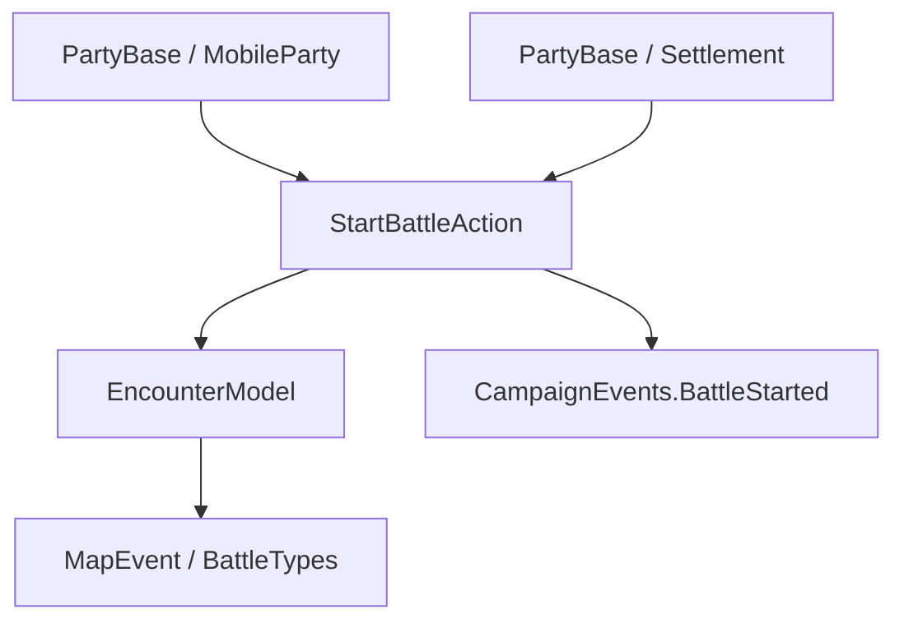

# StartBattleAction

**Namespace:** `TaleWorlds.CampaignSystem.Actions`  
**Module:** `TaleWorlds.CampaignSystem`  
**Type:** `public static class StartBattleAction`  
**源文件：** `TaleWorlds.CampaignSystem/Actions/StartBattleAction.cs`

## 概述

`StartBattleAction` 把两支 `PartyBase` 放入或接入地图 `MapEvent`。它通过 `EncounterModel.CreateMapEventComponentForEncounter` 创建正确战斗类型，必要时中断玩家遭遇，并发布 `OnStartBattle`；不要手动 `new MapEvent` 或只写 `MapEventSide`。这是大地图战斗的生命周期入口，Mission 内的 Agent 战斗不属于这里。

## 心智模型

先按意图选择专用入口：`ApplyStartBattle` 是野战，`ApplyStartRaid` 是劫掠，`ApplyStartSallyOut` 让驻军出城，`ApplyStartAssaultAgainstWalls` 是攻城。通用 `Apply` 会根据驻军、当前据点、围城状态和既有 MapEvent 推断或继承战斗类型。内部随后创建组件或把攻击方接到防守方的另一侧，最后发布战斗开始事件。

## 何时用 / 不用

- 两支地图部队相遇、劫掠村庄、驻军出击、攻城或脚本强制遭遇时使用。
- Mission 内的 Agent 战斗不使用它；那是 Mission 生命周期。
- 外交只用 [DeclareWarAction](../DeclareWarAction)，进入据点只用 [EnterSettlementAction](../EnterSettlementAction)。
- 不要直接构造 `MapEvent`、设置 `MapEventSide`，或在已经存在的战斗中重复创建。

## 依赖关系



- 上游：[PartyBase](../../campaign/PartyBase)、[MobileParty](../../campaign/MobileParty) 和 [Settlement](../../campaign/Settlement) 提供战斗双方与据点线索。
- 模型：`Campaign.Current.Models.EncounterModel` 决定地图事件组件。
- 下游：[MapEvent](../MapEvent)、[CampaignEvents](../CampaignEvents) 和玩家遭遇系统消费创建结果。

## 战斗类型与入口

| 方法 | 类型与语义 |
| --- | --- |
| `ApplyStartBattle(MobileParty, MobileParty)` | 两支移动部队的 FieldBattle |
| `ApplyStartRaid(MobileParty, Settlement)` | 针对据点的 Raid |
| `ApplyStartSallyOut(Settlement, MobileParty)` | 据点驻军作为攻击方出击 |
| `ApplyStartAssaultAgainstWalls(MobileParty, Settlement)` | 针对城墙的 Siege |
| `Apply(PartyBase, PartyBase)` | 推断类型或加入已有 MapEvent |

通用 `Apply` 会从当前据点、围城和驻军状态推断类型；已有 MapEvent 时继承 FieldBattle、Raid、Siege、SallyOut、SiegeOutside 或 Blockade 等类型。创建失败可能只留下空的 `MapEvent`，调用者应检查结果。

## 风险

1. 绕过 EncounterModel 会缺少 AI、地图界面和存档组件。
2. `ApplyStartSallyOut` 要求 `settlement.Town.GarrisonParty` 已存在，否则会出现空引用。
3. 创建失败不一定抛异常；调用后检查双方 `MapEvent`，并确认敌对关系、距离和围城条件。
4. 玩家在据点内时可能收到 `InterruptEncounter("encounter_interrupted")`，UI 要容忍遭遇中断。
5. 战后俘虏、死亡、摧毁部队和夺取据点应分别交给 [TakePrisonerAction](../TakePrisonerAction)、[KillCharacterAction](../KillCharacterAction)、[DestroyPartyAction](../DestroyPartyAction) 和 [ChangeOwnerOfSettlementAction](../ChangeOwnerOfSettlementAction)。

## 真实示例

```csharp
using TaleWorlds.CampaignSystem;
using TaleWorlds.CampaignSystem.Actions;

public static bool StartFieldFight(MobileParty attacker, MobileParty defender)
{
    if (Campaign.Current == null || attacker == null || defender == null)
        return false;
    if (attacker.MapEvent != null || defender.MapEvent != null)
        return false;

    StartBattleAction.ApplyStartBattle(attacker, defender);
    return attacker.MapEvent != null || defender.MapEvent != null;
}
```

村庄劫掠调用 `ApplyStartRaid`，城墙攻击调用 `ApplyStartAssaultAgainstWalls`；只有需要复杂推断或加入已有战斗时才使用通用 `Apply`。

## 导航

- 父级：[Campaign Action 目录](../actions/)
- 同级：[EnterSettlementAction](../EnterSettlementAction) · [TakePrisonerAction](../TakePrisonerAction) · [DestroyPartyAction](../DestroyPartyAction)
- 相关：[MapEvent](../MapEvent) · [PartyBase](../../campaign/PartyBase) · [MobileParty](../../campaign/MobileParty) · [Settlement](../../campaign/Settlement) · [CampaignEvents](../CampaignEvents)
